# Section 1: Project Walkthrough

This section explains Nodeflowz, also named Nodebase in the repository, as an
interview-ready system walkthrough.

## 01. What problem does Nodeflowz solve, and what is its core architecture?

Nodeflowz is a visual workflow automation platform. It allows users to connect
triggers, AI providers, HTTP requests, and third-party integrations without
writing a custom script for every automation.

A user can build workflows such as:

```text
Manual Trigger
  -> TinyFish extracts Hacker News stories
  -> Google Sheets appends the results
```

or:

```text
Google Form Trigger
  -> OpenAI processes the submission
  -> Slack sends a notification
```

The core problem it solves is:

> How can users automate multi-step business and AI processes without manually
> building and operating integration code for every workflow?

Nodeflowz solves this with:

- A drag-and-drop workflow editor.
- Reusable trigger and execution nodes.
- Secure credential storage.
- Asynchronous workflow execution through Inngest.
- Execution history and realtime node status.
- Authentication, tenant isolation, and subscription gating.

### High-Level Architecture

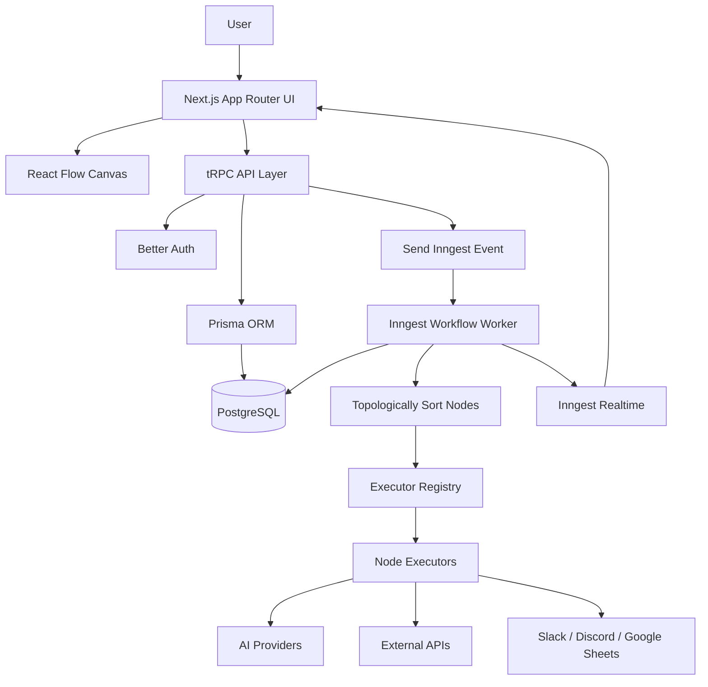

### Core Technology Choices

| Area | Technology |
|---|---|
| Full-stack application | Next.js App Router |
| Visual workflow canvas | React Flow |
| Internal application API | tRPC |
| Database access | Prisma |
| Database | PostgreSQL |
| Authentication | Better Auth |
| Background execution | Inngest |
| Realtime execution status | Inngest Realtime |
| Validation | Zod |
| Subscription gating | Polar |

### Interview Answer

> Nodeflowz is a full-stack visual workflow automation platform. Users design
> workflows as connected nodes instead of writing integration scripts. The
> Next.js frontend provides a React Flow canvas, tRPC handles type-safe
> application operations, Prisma persists workflows in PostgreSQL, and Inngest
> executes workflows asynchronously. During execution, the engine loads the
> graph, topologically sorts its nodes, dispatches every node through an
> executor registry, and publishes realtime status updates back to the canvas.

## 02. What is a workflow node, and how does a node-based architecture differ from a scripted pipeline?

A workflow node represents one configured operation in a workflow graph.

Examples include:

- `MANUAL_TRIGGER`
- `GOOGLE_FORM_TRIGGER`
- `HTTP_REQUEST`
- `OPENAI`
- `GEMINI`
- `ANTHROPIC`
- `TINYFISH`
- `GOOGLE_SHEETS`
- `SLACK`
- `DISCORD`

The Prisma model stores the node's identity, type, canvas position,
configuration, credential reference, and connections:

```prisma
model Node {
  id         String   @id @default(cuid())
  workflowId String
  workflow   Workflow @relation(fields: [workflowId], references: [id], onDelete: Cascade)

  name     String
  type     NodeType
  position Json
  data     Json @default("{}")

  credentialId String?
  credential   Credential? @relation(fields: [credentialId], references: [id])

  outputConnections Connection[] @relation("FromNode")
  inputConnections  Connection[] @relation("ToNode")

  createdAt DateTime @default(now())
  updatedAt DateTime @updatedAt
}
```

A node has two main representations:

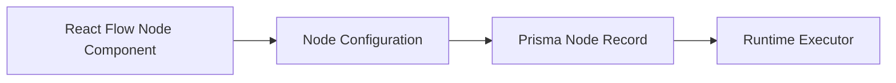

For example, an OpenAI node has:

- A visual component on the canvas.
- A settings dialog for prompts and credentials.
- A persisted node record.
- An executor that calls OpenAI during workflow execution.

### Scripted Pipeline

In a traditional scripted pipeline, the control flow is hardcoded:

```ts
const input = await receiveForm();
const summary = await callOpenAI(input);
await sendSlackMessage(summary);
```

Changing the workflow means editing and redeploying code.

### Node-Based Pipeline

In a node-based system, the workflow is data:

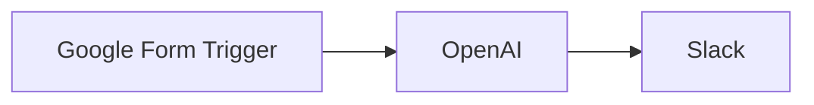

The database stores nodes and connections. The execution engine interprets the
graph at runtime.

| Scripted Pipeline | Node-Based Architecture |
|---|---|
| Flow is hardcoded | Flow is stored as data |
| Changes require code edits | Users change the graph visually |
| Integrations are tightly coupled | Executors are registered independently |
| Usually developer-operated | Can be operated by end users |

### Interview Answer

> A workflow node is one configured unit of work, such as a trigger, an AI
> request, or a Slack notification. The node has a visual representation,
> persisted configuration, and a runtime executor. Unlike a scripted pipeline,
> where control flow is hardcoded, Nodeflowz stores control flow as nodes and
> connections. That makes workflows editable at runtime and lets the execution
> engine interpret the graph without redeploying code.

## 03. Why use Next.js App Router instead of separate frontend and backend applications?

Nodeflowz is a full-stack SaaS application where the frontend and backend are
tightly connected. Next.js App Router allows the UI, application APIs,
authentication routes, webhook endpoints, and server-side logic to live in one
TypeScript project.

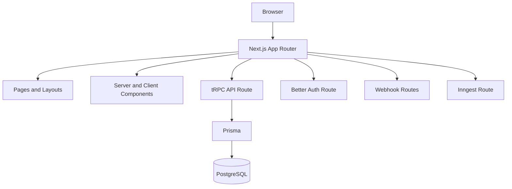

The project uses App Router routes for:

```text
/api/trpc/[trpc]
/api/auth/[...all]
/api/inngest
/api/webhooks/stripe
/api/webhooks/google-form
```

### Benefits

- Shared TypeScript types between frontend and backend.
- End-to-end type safety through tRPC.
- Fewer independently deployed services.
- App Router layouts and server-side rendering.
- Route handlers for webhooks and integrations.
- Easier authentication and session handling.
- Faster iteration for a product-stage SaaS application.

### Trade-Off

A separate backend becomes more attractive when:

- Many non-web clients consume the API.
- Backend teams deploy independently.
- Different services have significantly different scaling requirements.
- The platform exposes a large public API.

### Interview Answer

> I chose Next.js App Router because Nodeflowz is a tightly integrated
> full-stack TypeScript SaaS application. It lets the project keep the React
> frontend, server-side routes, authentication, webhooks, and tRPC procedures
> together. That reduces infrastructure complexity and gives end-to-end type
> safety. If the platform later needs many public clients or independently
> scaled services, I would separate those specific backend responsibilities.

## 04. Describe the data flow from workflow creation to storage and execution.

### Creating a Workflow

When the user creates a workflow, the frontend calls the `workflows.create`
tRPC mutation.

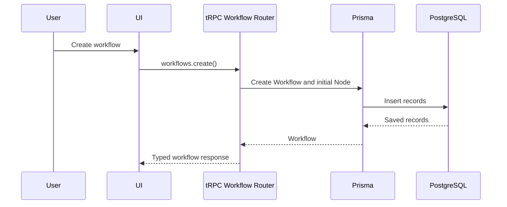

For a blank workflow, the server creates an initial placeholder node:

```ts
return prisma.workflow.create({
  data: {
    name: generateSlug(3),
    userId: ctx.auth.user.id,
    nodes: {
      create: {
        type: NodeType.INITIAL,
        position: { x: 0, y: 0 },
        name: NodeType.INITIAL,
      },
    },
  },
});
```

### Editing and Saving the Graph

The editor keeps React Flow nodes and edges in controlled React state:

```ts
const [nodes, setNodes] = useState<Node[]>(workflow.nodes);
const [edges, setEdges] = useState<Edge[]>(workflow.edges);
```

When the user clicks Save, the editor reads the latest graph:

```ts
const nodes = editor.getNodes();
const edges = editor.getEdges();

saveWorkflow.mutate({
  id: workflowId,
  nodes,
  edges,
});
```

The backend saves the entire graph in a transaction:

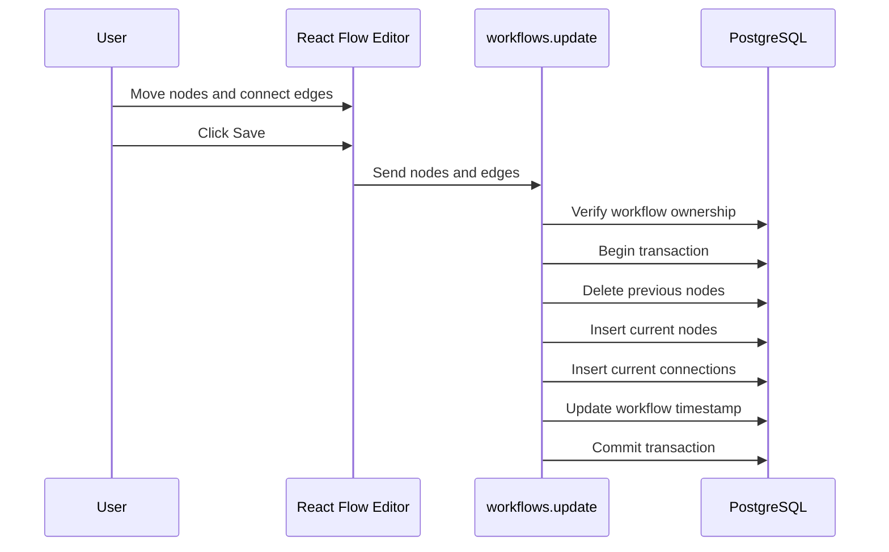

### Executing the Workflow

The execute mutation verifies ownership and queues an event:

```ts
const workflow = await prisma.workflow.findUniqueOrThrow({
  where: {
    id: input.id,
    userId: ctx.auth.user.id,
  },
});

await sendWorkflowExecution({
  workflowId: input.id,
});
```

The Inngest worker then executes the graph:

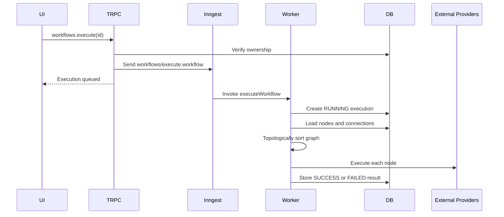

The executor registry selects the runtime implementation:

```ts
const executor = getExecutor(node.type as NodeType);

context = await executor({
  data: node.data as Record<string, unknown>,
  nodeId: node.id,
  userId,
  context,
  step,
  publish,
});
```

### Interview Answer

> Workflow creation and editing happen through tRPC. React Flow stores the
> graph as nodes and edges in browser state. On save, those nodes and edges are
> persisted transactionally as Prisma `Node` and `Connection` records. On
> execution, the API verifies ownership and sends an Inngest event. The worker
> loads the graph, topologically sorts it, executes each node through the
> executor registry, and stores the final execution status and output.

## 05. What were the biggest technical challenges, and how were they resolved?

### Challenge 1: Representing a Visual Graph as Durable Data

The React Flow canvas works with frontend nodes and edges, but the graph must
survive reloads and be executable by the backend.

The solution was to persist:

- `Workflow` as the graph owner.
- `Node` for every workflow operation.
- `Connection` for every directed edge.
- `position` and `data` as JSON for flexible node configuration.

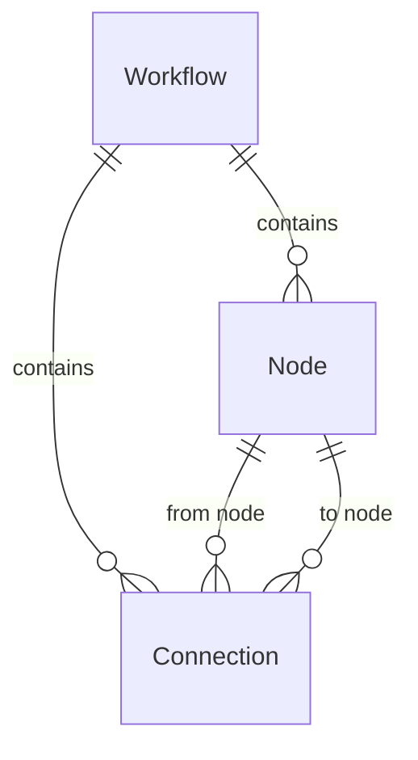

### Challenge 2: Executing Nodes in Dependency Order

Canvas position does not determine execution order. The engine must derive the
order from graph connections.

The project converts connections to dependency edges and uses topological
sorting:

```ts
const edges: [string, string][] = connections.map((connection) => [
  connection.fromNodeId,
  connection.toNodeId,
]);

const sortedNodeIds = toposort(edges);
```

Topological sorting also detects cycles:

```text
A -> B -> C -> A
```

Such a graph cannot be executed as a simple dependency pipeline, so execution
fails with a cycle error.

### Challenge 3: Making Integrations Extensible

Putting every integration inside one large execution function would become
difficult to maintain.

The project uses an executor registry:

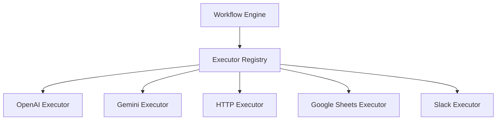

Every executor implements a common interface:

```ts
export type NodeExecutor<TData = Record<string, unknown>> = (
  params: NodeExecutorParams<TData>,
) => Promise<WorkflowContext>;
```

### Challenge 4: Handling Long-Running and Failure-Prone Work

AI providers, scraping agents, and external APIs may take a long time or fail
transiently. Executing them inside an HTTP request would cause timeouts and make
retries difficult.

The project queues workflows through Inngest:

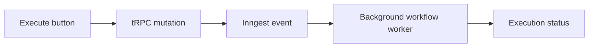

Inngest provides asynchronous steps and retries. Configuration errors use
`NonRetriableError` so they do not retry unnecessarily.

### Challenge 5: Secure Credential Handling

Third-party integrations need API keys. Credential values are encrypted before
storage and only decrypted inside server-side executors.

```ts
return prisma.credential.create({
  data: {
    name,
    userId: ctx.auth.user.id,
    type,
    value: encrypt(value),
  },
});
```

At execution time:

```ts
const openai = createOpenAI({
  apiKey: decrypt(credential.value),
});
```

### Interview Answer

> The main challenges were converting an interactive visual graph into durable
> executable data, determining dependency order, keeping integrations
> extensible, handling long-running failures safely, and protecting user
> credentials. I resolved those with normalized workflow graph models,
> topological sorting, an executor registry, Inngest background jobs, and
> encrypted user-scoped credentials.

## 06. Walk through the Prisma schema and its relationships.

The Prisma schema can be divided into authentication, workflow, credential, and
execution models.

### Overall Relationships

```mermaid
erDiagram
    User ||--o{ Session : has
    User ||--o{ Account : has
    User ||--o{ Workflow : owns
    User ||--o{ Credential : owns

    Workflow ||--o{ Node : contains
    Workflow ||--o{ Connection : contains
    Workflow ||--o{ Execution : has

    Credential ||--o{ Node : used_by
    Node ||--o{ Connection : from
    Node ||--o{ Connection : to
```

### Authentication Models

`User`, `Session`, `Account`, and `Verification` support Better Auth.

```prisma
model User {
  id          String
  sessions    Session[]
  accounts    Account[]
  workflows   Workflow[]
  credentials Credential[]
}
```

Deleting a user cascades to related sessions, accounts, workflows, and
credentials.

### Workflow

`Workflow` is the parent object for a user-created automation:

```prisma
model Workflow {
  id          String @id @default(cuid())
  name        String
  nodes       Node[]
  connections Connection[]
  executions  Execution[]

  userId String
  user   User @relation(fields: [userId], references: [id], onDelete: Cascade)
}
```

### Node

`Node` stores one operation in the workflow:

```prisma
model Node {
  id         String @id @default(cuid())
  workflowId String
  name       String
  type       NodeType
  position   Json
  data       Json @default("{}")
  credentialId String?
}
```

Important fields:

- `type` selects the visual component and runtime executor.
- `position` stores canvas coordinates.
- `data` stores type-specific settings.
- `credentialId` optionally points to an encrypted user credential.

### Connection

`Connection` represents a directed edge:

```prisma
model Connection {
  id         String @id @default(cuid())
  workflowId String
  fromNodeId String
  toNodeId   String
  fromOutput String @default("main")
  toInput    String @default("main")

  @@unique([fromNodeId, toNodeId, fromOutput, toInput])
}
```

The unique constraint prevents duplicate edges between the same node handles.

### Credential

`Credential` stores encrypted third-party keys:

```prisma
model Credential {
  id     String @id @default(cuid())
  name   String
  value  String
  type   CredentialType
  userId String
  Node   Node[]
}
```

Credentials are user-scoped and may be reused by multiple nodes.

### Execution

`Execution` stores workflow run history:

```prisma
model Execution {
  id             String @id @default(cuid())
  workflowId     String
  status         ExecutionStatus @default(RUNNING)
  error          String?
  errorStack     String?
  startedAt      DateTime @default(now())
  completedAt    DateTime?
  inngestEventId String @unique
  output         Json?
}
```

The unique `inngestEventId` identifies the background execution event.

### Interview Answer

> The schema is centered on `User` and `Workflow`. A user owns workflows and
> encrypted credentials. A workflow contains nodes, directed connections, and
> execution records. Nodes store their visual position and flexible
> configuration as JSON, while connections define graph dependencies.
> Executions store runtime status, errors, timestamps, and final output.

## 07. How would you scale Nodeflowz to handle 10x the current load?

I would begin by identifying the main pressure points:

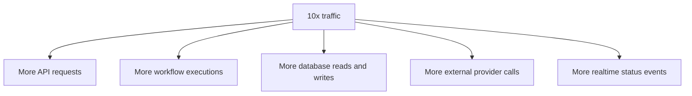

### 1. Horizontally Scale the Worker Layer

The API is already decoupled from execution through Inngest, so the worker
layer can scale horizontally.

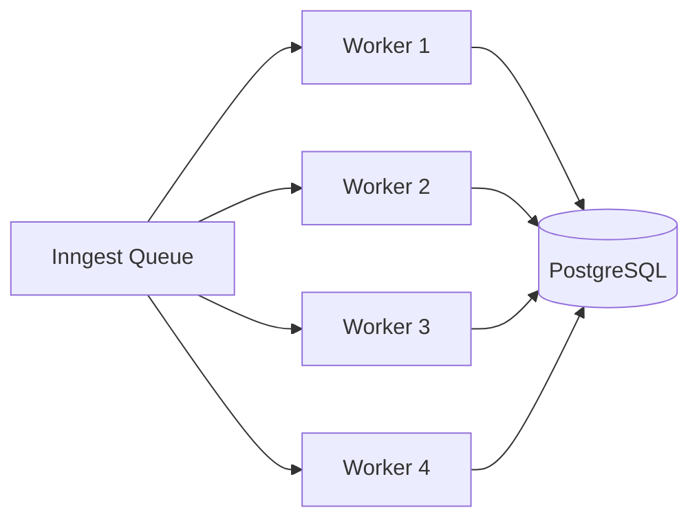

I would add:

- Worker concurrency limits.
- Per-provider concurrency limits.
- Separate queues for heavy and lightweight node types.
- Priority for paid plans.
- Idempotency keys for external side effects.

### 2. Add Database Indexes

Important query patterns include:

- Workflows by user and update time.
- Nodes and connections by workflow.
- Executions by workflow and start time.
- Credentials by user and type.

Recommended indexes:

```prisma
model Workflow {
  @@index([userId, updatedAt])
}

model Node {
  @@index([workflowId])
}

model Connection {
  @@index([workflowId])
}

model Execution {
  @@index([workflowId, startedAt])
  @@index([workflowId, status])
}

model Credential {
  @@index([userId, type])
}
```

### 3. Reduce Workflow Save Write Amplification

The current save operation deletes all nodes and recreates the graph.


At larger scale, I would calculate a graph diff:

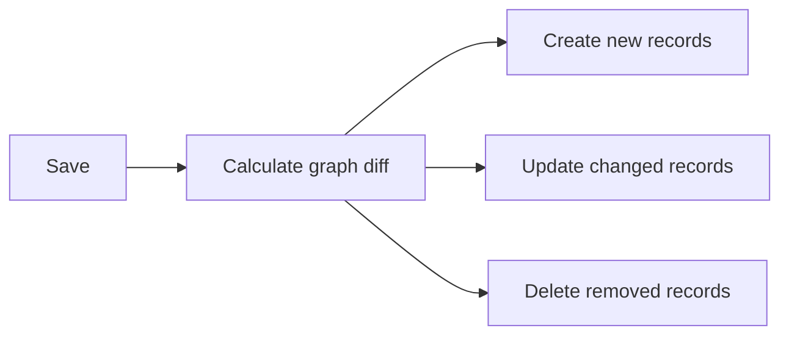

This reduces database writes, lock duration, and transaction size.

### 4. Execute Independent Branches in Parallel

The current engine executes sorted nodes sequentially. Independent branches can
run concurrently.

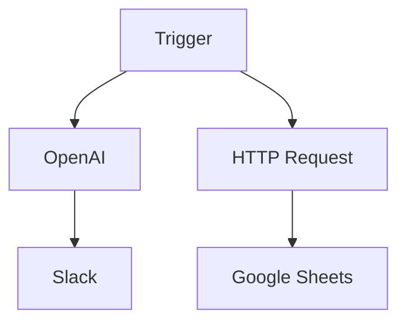

The engine can execute by dependency level:

```text
Level 0: Trigger
Level 1: OpenAI and HTTP Request
Level 2: Slack and Google Sheets
```

```ts
for (const level of executionLevels) {
  const outputs = await Promise.all(
    level.map((node) => executeNode(node, context)),
  );

  context = mergeOutputs(context, outputs);
}
```

### 5. Protect External Providers

At 10x traffic, external providers may become the bottleneck before Nodeflowz.

I would add:

- Token bucket rate limiting.
- Exponential backoff with jitter.
- Provider-specific concurrency limits.
- Circuit breakers.
- Dead-letter handling.
- Per-user quotas.

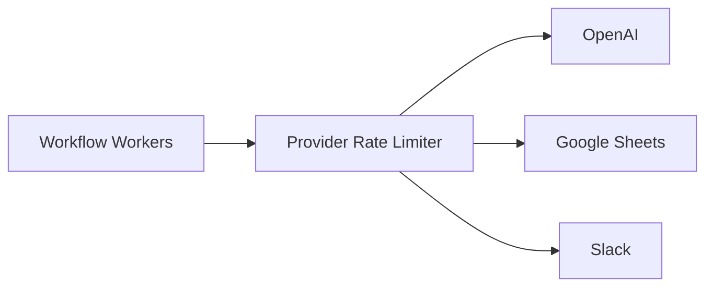

### 6. Cache Carefully

Good cache candidates:

- Subscription state.
- Workflow list summaries.
- Integration metadata.
- Provider configuration.

Secrets and decrypted credentials should never be placed in shared caches.

### 7. Improve Observability

At larger scale, I would monitor:

- Queue depth and oldest job age.
- Workflow and node execution duration.
- Failures by node type.
- Provider latency and rate limits.
- Database query latency.
- Worker concurrency.
- Retry and dead-letter counts.

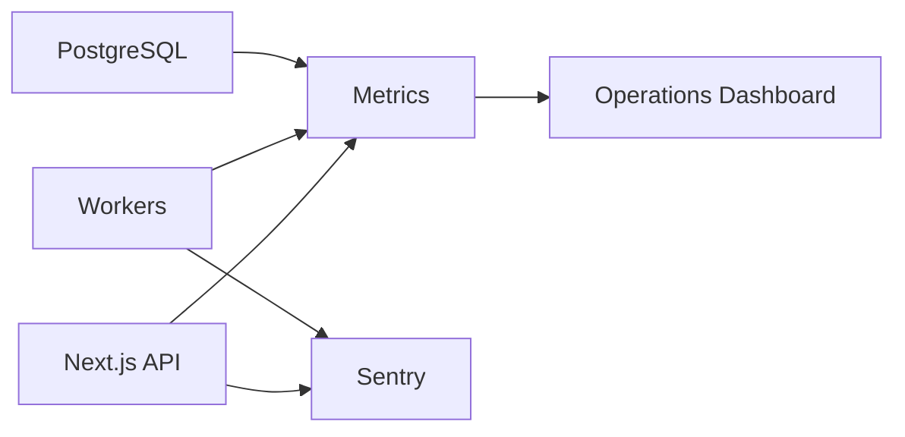

### Interview Answer

> To handle 10x load, I would first scale Inngest workers horizontally and add
> provider-specific concurrency controls. Then I would improve database indexes,
> replace full graph recreation with incremental graph updates, and execute
> independent DAG branches in parallel. Finally, I would add caching,
> circuit-breakers, rate limits, and stronger observability so the platform can
> scale without overwhelming PostgreSQL or external providers.

