# Section 2: TypeScript & Next.js

This section covers the TypeScript and Next.js App Router concepts used in
Nodeflowz, with interview-ready explanations, diagrams, and code examples.

## 08. What is the difference between a Server Component and a Client Component, and which did you use for the canvas?

In the Next.js App Router, components are Server Components by default.

A Server Component executes on the server. It can access server-only modules,
databases, environment secrets, and backend services without shipping that
logic to the browser.

A Client Component executes in the browser after hydration. It can use React
state, effects, event handlers, browser APIs, and interactive libraries.

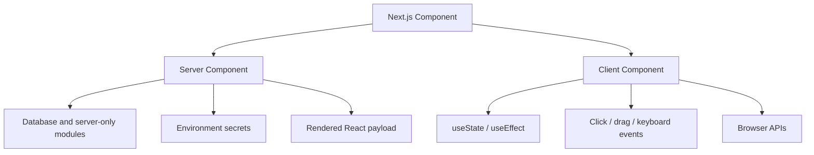

### Server Component Characteristics

- Default in the App Router.
- Runs on the server.
- Can directly call server-side data sources.
- Does not add its component JavaScript to the browser bundle.
- Cannot use `useState`, `useEffect`, or browser event handlers.

Example:

```tsx
import prisma from "@/lib/db";

export default async function WorkflowCount() {
  const count = await prisma.workflow.count();

  return <p>{count} workflows</p>;
}
```

### Client Component Characteristics

- Declared with `"use client"`.
- Runs in the browser.
- Can use state, effects, event handlers, and browser APIs.
- Required for interactive UI such as a drag-and-drop canvas.

The Nodeflowz canvas is a Client Component:

```tsx
"use client";

import { useCallback, useMemo, useState } from "react";
import {
  ReactFlow,
  addEdge,
  applyEdgeChanges,
  applyNodeChanges,
} from "@xyflow/react";
```

The editor requires browser-side capabilities:

```tsx
const [nodes, setNodes] = useState<Node[]>(workflow.nodes);
const [edges, setEdges] = useState<Edge[]>(workflow.edges);

const onConnect = useCallback(
  (connection: Connection) => {
    setEdges((currentEdges) => addEdge(connection, currentEdges));
  },
  [],
);
```

### Component Boundary

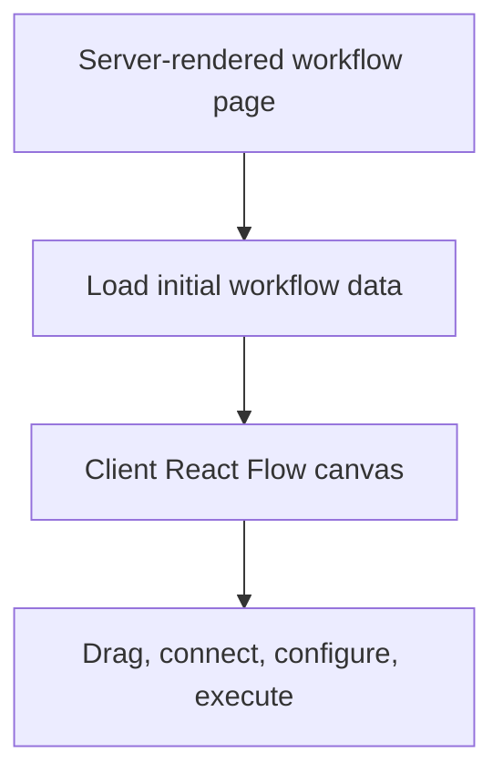

### Interview Answer

> Server Components run on the server and are ideal for loading data, accessing
> secrets, and reducing browser JavaScript. Client Components run in the
> browser and support state, effects, and event handlers. I used a Client
> Component for the React Flow canvas because dragging nodes, creating edges,
> opening dialogs, and maintaining local graph state all require browser-side
> interactivity.

## 09. How do you type a generic API response wrapper that handles success and error states without using `any`?

A safe generic API response should make invalid states impossible. For example,
a successful response should always have data, while a failed response should
always have an error.

This can be represented with a generic discriminated union:

```ts
type ApiSuccess<T> = {
  success: true;
  data: T;
};

type ApiFailure<E = string> = {
  success: false;
  error: E;
};

type ApiResponse<T, E = string> = ApiSuccess<T> | ApiFailure<E>;
```

Example workflow response:

```ts
type WorkflowDto = {
  id: string;
  name: string;
};

async function getWorkflow(
  workflowId: string,
): Promise<ApiResponse<WorkflowDto>> {
  try {
    const workflow = await loadWorkflow(workflowId);

    return {
      success: true,
      data: workflow,
    };
  } catch {
    return {
      success: false,
      error: "Workflow could not be loaded",
    };
  }
}
```

TypeScript narrows the union by checking `success`:

```ts
const response = await getWorkflow("workflow_123");

if (response.success) {
  console.log(response.data.name);
} else {
  console.error(response.error);
}
```

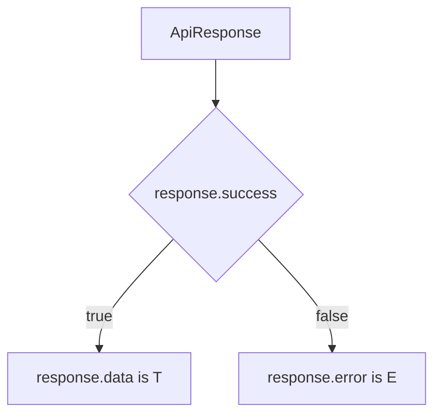

For richer errors:

```ts
type ApiError = {
  code: "NOT_FOUND" | "UNAUTHORIZED" | "VALIDATION_ERROR";
  message: string;
  fieldErrors?: Record<string, string[]>;
};

type WorkflowResponse = ApiResponse<WorkflowDto, ApiError>;
```

Nodeflowz usually does not need a manual wrapper for internal APIs because tRPC
infers procedure input and output types. This wrapper is still useful for
public REST endpoints and integration boundaries.

### Interview Answer

> I use a generic discriminated union with `success: true` and
> `success: false` variants. This allows TypeScript to safely narrow the
> response and guarantees that success responses contain data while failures
> contain an error. It avoids `any` and prevents callers from accidentally
> reading missing fields.

## 10. What is a discriminated union? Give a real example from this project.

A discriminated union is a union of object types that share a field containing
a distinct literal value. TypeScript uses that field to determine the exact
member of the union.

Example:

```ts
type ExecutionViewState =
  | {
      status: "RUNNING";
      startedAt: Date;
    }
  | {
      status: "SUCCESS";
      completedAt: Date;
      output: Record<string, unknown>;
    }
  | {
      status: "FAILED";
      error: string;
      errorStack?: string;
    };
```

The `status` field is the discriminant:

```ts
function describeExecution(execution: ExecutionViewState) {
  switch (execution.status) {
    case "RUNNING":
      return `Started at ${execution.startedAt.toISOString()}`;

    case "SUCCESS":
      return execution.output;

    case "FAILED":
      return execution.error;
  }
}
```

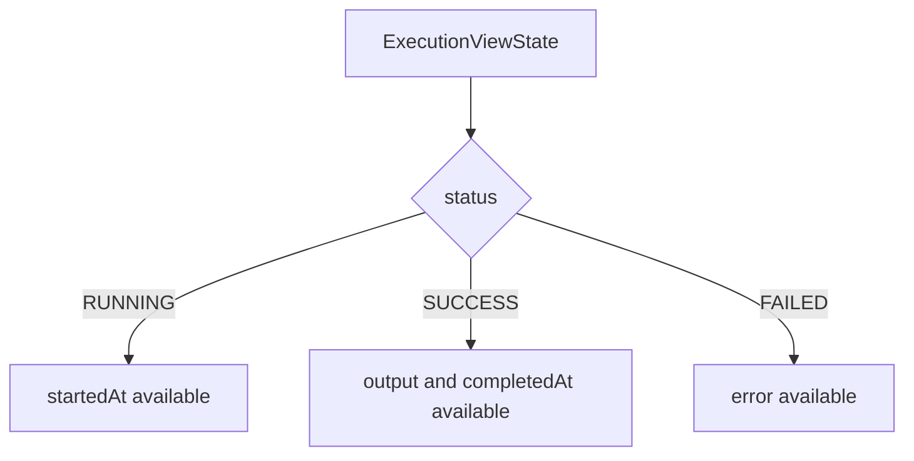

The Prisma schema contains the underlying status enum:

```prisma
enum ExecutionStatus {
  RUNNING
  SUCCESS
  FAILED
}
```

A stronger type-safe representation of workflow node configuration would also
use a discriminated union:

```ts
type ConfiguredWorkflowNode =
  | {
      type: "OPENAI";
      data: {
        credentialId: string;
        variableName: string;
        userPrompt: string;
      };
    }
  | {
      type: "HTTP_REQUEST";
      data: {
        url: string;
        method: "GET" | "POST";
      };
    }
  | {
      type: "GOOGLE_SHEETS";
      data: {
        spreadsheetId: string;
        sheetName: string;
      };
    };
```

TypeScript then understands node-specific data:

```ts
function validateNode(node: ConfiguredWorkflowNode) {
  switch (node.type) {
    case "OPENAI":
      return node.data.userPrompt.length > 0;

    case "HTTP_REQUEST":
      return URL.canParse(node.data.url);

    case "GOOGLE_SHEETS":
      return node.data.sheetName.length > 0;
  }
}
```

### Interview Answer

> A discriminated union is a union whose members share a literal field such as
> `status` or `type`. TypeScript uses that field to narrow the object safely.
> In Nodeflowz, execution state naturally maps to a discriminated union with
> `RUNNING`, `SUCCESS`, and `FAILED` variants. Node configurations could also
> use `NodeType` as the discriminant so each node type has strongly typed data.

## 11. What is the difference between `interface` and `type`? When would you pick one?

Both `interface` and `type` can describe object shapes:

```ts
interface Workflow {
  id: string;
  name: string;
}
```

```ts
type Workflow = {
  id: string;
  name: string;
};
```

The main practical distinction is that interfaces are designed around object
contracts and extension, while type aliases can represent almost any type
expression.

### Interface

Interfaces are useful for extensible object contracts:

```ts
interface NodeExecutorParams<TData = Record<string, unknown>> {
  data: TData;
  nodeId: string;
  userId: string;
  context: WorkflowContext;
}

interface AiNodeExecutorParams extends NodeExecutorParams {
  model: string;
}
```

Interfaces support declaration merging:

```ts
interface ProviderConfig {
  name: string;
}

interface ProviderConfig {
  timeoutMs: number;
}

// ProviderConfig now has name and timeoutMs.
```

### Type Alias

Type aliases are useful for:

- Unions.
- Intersections.
- Function signatures.
- Tuples.
- Mapped and conditional types.

Real project patterns:

```ts
export type WorkflowContext = Record<string, unknown>;

export type NodeExecutor<TData = Record<string, unknown>> = (
  params: NodeExecutorParams<TData>,
) => Promise<WorkflowContext>;
```

Union example:

```ts
type NodeStatus = "initial" | "loading" | "success" | "error";
```

### Selection Guide

| Requirement | Preferred Choice |
|---|---|
| Public object contract intended for extension | `interface` |
| Function type | `type` |
| Union or intersection | `type` |
| Conditional or mapped type | `type` |
| Simple internal object shape | Either |

### Interview Answer

> I use interfaces for object contracts that may be extended, such as executor
> parameter objects. I use type aliases for unions, function signatures,
> conditional types, and aliases such as `WorkflowContext`. For a simple object
> shape, either works, so consistency with the surrounding code matters most.

## 12. How did you handle environment variable typing and validation?

The current project accesses environment variables directly:

```ts
clientId: process.env.GITHUB_CLIENT_ID as string,
clientSecret: process.env.GITHUB_CLIENT_SECRET as string,
```

It also uses non-null assertions:

```ts
const cryptr = new Cryptr(process.env.ENCRYPTION_KEY!);
```

This tells TypeScript that the values exist, but it does not validate them at
runtime. If a variable is missing, the application may fail later while
handling authentication, encryption, billing, or workflow execution.

### Stronger Zod-Based Approach

I would centralize server environment validation:

```ts
import { z } from "zod";

const serverEnvSchema = z.object({
  DATABASE_URL: z.string().min(1),
  ENCRYPTION_KEY: z.string().min(32),
  GITHUB_CLIENT_ID: z.string().min(1),
  GITHUB_CLIENT_SECRET: z.string().min(1),
  GOOGLE_CLIENT_ID: z.string().min(1),
  GOOGLE_CLIENT_SECRET: z.string().min(1),
  POLAR_ACCESS_TOKEN: z.string().min(1),
  POLAR_SUCCESS_URL: z.string().url(),
});

export const serverEnv = serverEnvSchema.parse(process.env);
```

Usage becomes type-safe:

```ts
import { serverEnv } from "@/lib/env";

const cryptr = new Cryptr(serverEnv.ENCRYPTION_KEY);
```

Client-accessible variables require the `NEXT_PUBLIC_` prefix:

```ts
const clientEnvSchema = z.object({
  NEXT_PUBLIC_APP_URL: z.string().url(),
});

export const clientEnv = clientEnvSchema.parse({
  NEXT_PUBLIC_APP_URL: process.env.NEXT_PUBLIC_APP_URL,
});
```

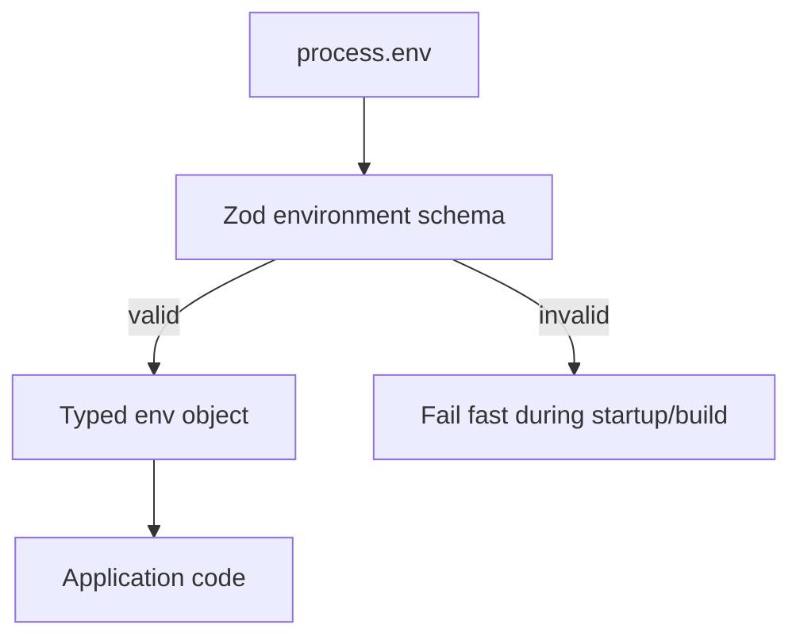

### Security Boundary

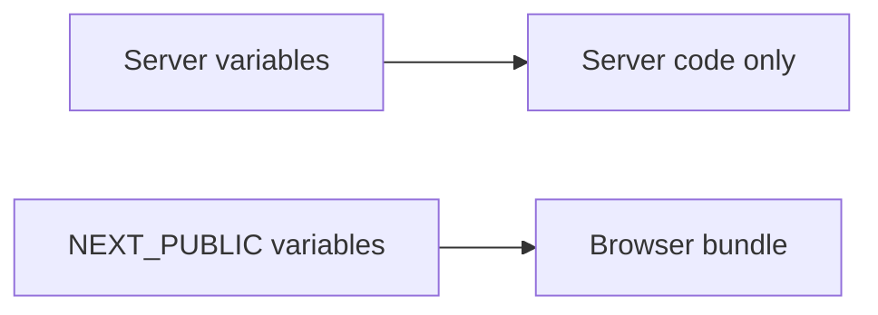

Secrets such as encryption keys, database URLs, provider secrets, and auth
secrets must never use the `NEXT_PUBLIC_` prefix.

### Interview Answer

> The current version uses direct `process.env` access with TypeScript casts and
> non-null assertions. For production hardening, I would centralize all
> environment variables in a Zod schema, validate them at startup, and export a
> typed environment object. That makes the application fail fast and prevents
> missing configuration from appearing as a runtime error much later.

## 13. Explain the `satisfies` operator and a case where it helps in this codebase.

The `satisfies` operator verifies that a value conforms to a type while
preserving the value's precise inferred type.

Nodeflowz already uses it for the React Flow node component registry:

```ts
export const nodeComponents = {
  [NodeType.INITIAL]: InitialNode,
  [NodeType.HTTP_REQUEST]: HttpRequestNode,
  [NodeType.GOOGLE_SHEETS]: GoogleSheetsNode,
  [NodeType.MANUAL_TRIGGER]: ManualTriggerNode,
  [NodeType.GOOGLE_FORM_TRIGGER]: GoogleFormTrigger,
  [NodeType.STRIPE_TRIGGER]: StripeTriggerNode,
  [NodeType.GEMINI]: GeminiNode,
  [NodeType.OPENAI]: OpenAiNode,
  [NodeType.TINYFISH]: TinyFishNode,
  [NodeType.ANTHROPIC]: AnthropicNode,
  [NodeType.DISCORD]: DiscordNode,
  [NodeType.SLACK]: SlackNode,
} as const satisfies NodeTypes;
```

This provides two benefits:

1. TypeScript verifies that the object is valid for React Flow's `NodeTypes`.
2. TypeScript preserves the exact object keys.

That allows:

```ts
export type RegisteredNodeType = keyof typeof nodeComponents;
```

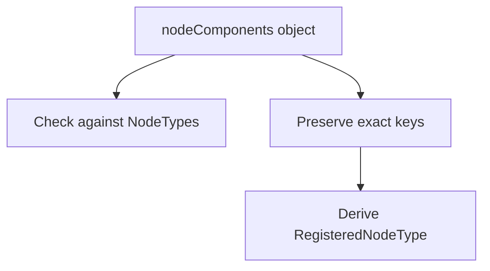

Without `satisfies`, an explicit annotation may widen the object:

```ts
const nodeComponents: NodeTypes = {
  // Validated, but exact key information may be lost.
};
```

Another useful location is the executor registry:

```ts
export const executorRegistry = {
  [NodeType.MANUAL_TRIGGER]: manualTriggerExecutor,
  [NodeType.INITIAL]: manualTriggerExecutor,
  [NodeType.HTTP_REQUEST]: httpRequestExecutor,
  [NodeType.GOOGLE_SHEETS]: googleSheetsExecutor,
  [NodeType.GOOGLE_FORM_TRIGGER]: googleFormTriggerExecutor,
  [NodeType.STRIPE_TRIGGER]: stripeTriggerExecutor,
  [NodeType.GEMINI]: geminiExecutor,
  [NodeType.ANTHROPIC]: anthropicExecutor,
  [NodeType.OPENAI]: openAiExecutor,
  [NodeType.TINYFISH]: tinyFishExecutor,
  [NodeType.DISCORD]: discordExecutor,
  [NodeType.SLACK]: slackExecutor,
} satisfies Record<NodeType, NodeExecutor>;
```

If a new `NodeType` is added without an executor, TypeScript reports an error.

### Interview Answer

> `satisfies` checks that a value matches a required type without widening away
> its precise inferred shape. In Nodeflowz, the node component registry uses it
> to verify compatibility with React Flow while preserving exact node type
> keys. It is also useful for the executor registry because it can guarantee
> that every `NodeType` has an executor.

## 14. How does Next.js App Router handle caching and revalidation, and how did this affect workflow CRUD?

Next.js App Router has multiple caching concepts:

- Request memoization during a server render.
- `fetch` caching and revalidation.
- Full-route caching for statically rendered routes.
- React's server-side `cache`.
- Client-side caches such as React Query.

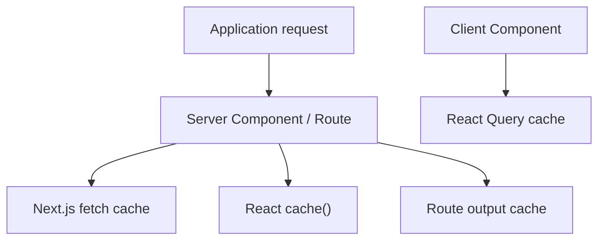

### Next.js Fetch Revalidation

Cached data can be revalidated by time:

```ts
await fetch("https://example.com/integrations", {
  next: {
    revalidate: 3600,
  },
});
```

Or by tag:

```ts
await fetch("https://example.com/workflows", {
  next: {
    tags: ["workflows"],
  },
});
```

```ts
import { revalidateTag } from "next/cache";

revalidateTag("workflows");
```

### Nodeflowz CRUD Strategy

Workflow CRUD is handled primarily with tRPC and React Query rather than
statically cached `fetch` calls.

Query:

```ts
export const useSuspenseWorkflow = (id: string) => {
  const trpc = useTRPC();

  return useSuspenseQuery(
    trpc.workflows.getOne.queryOptions({ id }),
  );
};
```

After a successful mutation, the relevant queries are invalidated:

```ts
queryClient.invalidateQueries(
  trpc.workflows.getMany.queryOptions({}),
);

queryClient.invalidateQueries(
  trpc.workflows.getOne.queryOptions({ id: data.id }),
);
```

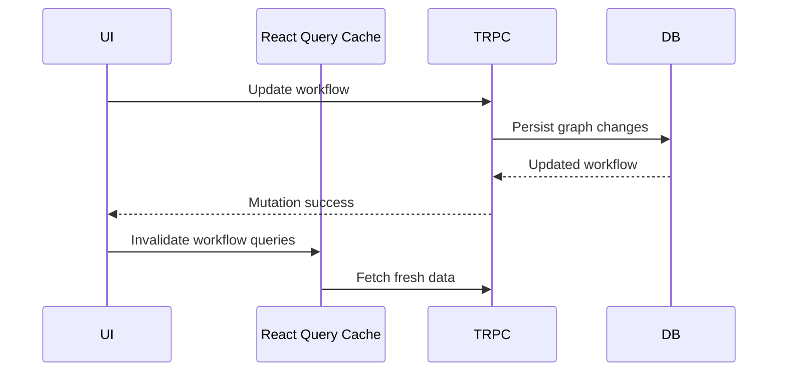

This strategy fits workflow data because it is:

- User-specific.
- Authenticated.
- Frequently mutated.
- Expected to become fresh immediately after a save.

### Interview Answer

> App Router supports server-side fetch caching, route caching, time-based
> revalidation, and tag-based revalidation. For Nodeflowz workflow CRUD, I rely
> mainly on tRPC with React Query invalidation because workflow data is
> user-specific and frequently updated. After a create, update, rename, or
> delete mutation, the client invalidates the relevant query keys and refetches
> fresh data.

## 15. Explain TypeScript's `infer` keyword and extract the resolved value from a `Promise`.

The `infer` keyword extracts part of a type inside a conditional type.

A utility that extracts a Promise's resolved value:

```ts
type PromiseValue<T> = T extends Promise<infer TResult>
  ? TResult
  : T;
```

Examples:

```ts
type Text = PromiseValue<Promise<string>>;
// string

type Count = PromiseValue<number>;
// number
```

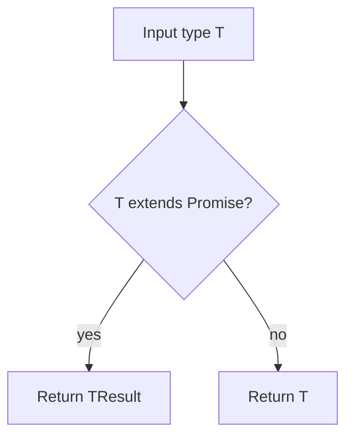

For nested promises, use recursion:

```ts
type DeepPromiseValue<T> = T extends Promise<infer TResult>
  ? DeepPromiseValue<TResult>
  : T;
```

Example:

```ts
type WorkflowResult = DeepPromiseValue<
  Promise<Promise<{ id: string; name: string }>>
>;

// { id: string; name: string }
```

A useful real-world pattern combines `infer` with `ReturnType`:

```ts
async function loadWorkflow() {
  return {
    id: "workflow_123",
    name: "daily-summary",
  };
}

type LoadedWorkflow = PromiseValue<ReturnType<typeof loadWorkflow>>;
```

`LoadedWorkflow` automatically follows the function's actual return value. This
avoids duplicating the same type manually.

TypeScript also provides a built-in `Awaited<T>` utility:

```ts
type LoadedWorkflowBuiltIn = Awaited<ReturnType<typeof loadWorkflow>>;
```

### Interview Answer

> `infer` lets a conditional type capture and name part of another type. To
> extract a Promise's resolved value, I check whether `T` extends
> `Promise<infer TResult>` and return `TResult`. In application code, this is
> useful with `ReturnType` so types stay synchronized with async functions.

## 16. What is tRPC, and how does it compare to API routes?

tRPC is a TypeScript-first RPC framework that provides end-to-end type safety
between the server and TypeScript clients.

Nodeflowz defines an application router:

```ts
export const appRouter = createTRPCRouter({
  credentials: credentialsRouter,
  workflows: workflowRouter,
  executions: executionsRouter,
});

export type AppRouter = typeof appRouter;
```

The client consumes that router type:

```ts
export const { TRPCProvider, useTRPC } =
  createTRPCContext<AppRouter>();
```

Example procedure:

```ts
execute: protectedProcedure
  .input(z.object({ id: z.string() }))
  .mutation(async ({ input, ctx }) => {
    const workflow = await prisma.workflow.findUniqueOrThrow({
      where: {
        id: input.id,
        userId: ctx.auth.user.id,
      },
    });

    await sendWorkflowExecution({
      workflowId: workflow.id,
    });

    return workflow;
  });
```

The frontend receives typed input and output automatically:

```ts
const executeWorkflow = useExecuteWorkflow();

executeWorkflow.mutate({
  id: workflowId,
});
```

Passing the wrong property is a compile-time error:

```ts
executeWorkflow.mutate({
  workflowId,
  // Error: the procedure expects { id: string }.
});
```

### tRPC Flow

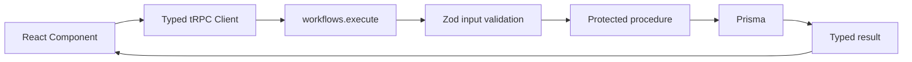

### Equivalent API Route

```ts
import { z } from "zod";

const bodySchema = z.object({
  id: z.string(),
});

export async function POST(request: Request) {
  const body = bodySchema.parse(await request.json());

  await sendWorkflowExecution({
    workflowId: body.id,
  });

  return Response.json(
    {
      status: "queued",
    },
    {
      status: 202,
    },
  );
}
```

Client:

```ts
await fetch("/api/workflows/execute", {
  method: "POST",
  headers: {
    "Content-Type": "application/json",
  },
  body: JSON.stringify({
    id: workflowId,
  }),
});
```

The API route is universal HTTP, but the client does not automatically know its
input and output types unless schemas or generated clients are shared.

### Comparison

| Area | tRPC | API Routes / REST |
|---|---|---|
| Type safety | End-to-end for TypeScript clients | Requires shared types or generated client |
| External consumers | Less convenient | Universal |
| Boilerplate | Low | Higher |
| Public APIs | Usually not ideal | Strong fit |
| Webhooks | Not ideal | Strong fit |
| Internal Next.js application API | Strong fit | Also valid |

Nodeflowz uses both approaches:

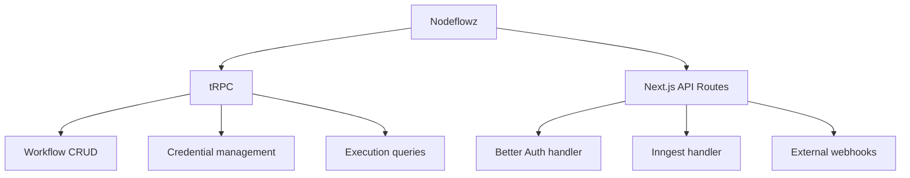

### Trade-Offs

tRPC advantages:

- End-to-end TypeScript inference.
- Natural Zod validation.
- Low boilerplate.
- Strong React Query integration.
- Excellent for an internal full-stack TypeScript application.

tRPC trade-offs:

- Couples consumers to TypeScript tooling.
- Less convenient for public or polyglot clients.
- Does not naturally provide the universal contract of REST/OpenAPI.

API route advantages:

- Standard HTTP interface.
- Easy for external providers and webhooks.
- Language-independent.
- Natural fit for public APIs.

API route trade-offs:

- More manual validation and response typing.
- Client and server contracts can drift.
- Often needs OpenAPI or generated SDKs for strong type safety.

### Interview Answer

> tRPC lets the frontend call backend procedures with end-to-end inferred
> TypeScript types. I use it for application-owned operations such as workflow
> CRUD, credentials, and execution queries. I use normal API routes for
> integration boundaries such as webhooks, authentication handlers, and
> Inngest. The trade-off is that tRPC is excellent for an internal TypeScript
> application, while REST endpoints are easier for public and non-TypeScript
> consumers.
