# Section 3: React & Drag-and-Drop Canvas

This section explains how Nodeflowz uses React and React Flow to represent,
render, validate, and edit visual workflow graphs.

## 17. How does React Flow represent nodes and edges internally? What state shape did you use?

React Flow represents a workflow as two collections:

- Nodes represent visual workflow steps.
- Edges represent directed connections between nodes.

A simplified React Flow node looks like:

```ts
type WorkflowCanvasNode = {
  id: string;
  type?: string;
  position: {
    x: number;
    y: number;
  };
  data: Record<string, unknown>;
};
```

A simplified edge looks like:

```ts
type WorkflowCanvasEdge = {
  id: string;
  source: string;
  target: string;
  sourceHandle?: string | null;
  targetHandle?: string | null;
};
```

For example:

```ts
const nodes = [
  {
    id: "trigger",
    type: "MANUAL_TRIGGER",
    position: { x: 0, y: 100 },
    data: {},
  },
  {
    id: "openai",
    type: "OPENAI",
    position: { x: 300, y: 100 },
    data: {
      variableName: "summary",
      userPrompt: "Summarize {{input}}",
    },
  },
];

const edges = [
  {
    id: "trigger-openai",
    source: "trigger",
    target: "openai",
    sourceHandle: "main",
    targetHandle: "main",
  },
];
```

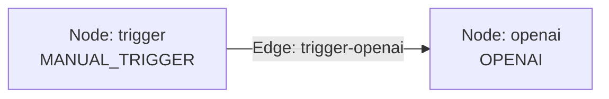

Nodeflowz stores canvas state in the editor:

```tsx
const [nodes, setNodes] = useState<Node[]>(workflow.nodes);
const [edges, setEdges] = useState<Edge[]>(workflow.edges);
```

The React Flow graph maps closely to the Prisma schema.

Frontend edge:

```ts
{
  source: "trigger",
  target: "openai",
  sourceHandle: "main",
  targetHandle: "main"
}
```

Database connection:

```prisma
model Connection {
  fromNodeId String
  toNodeId   String
  fromOutput String @default("main")
  toInput    String @default("main")
}
```

Mapping between frontend and database:

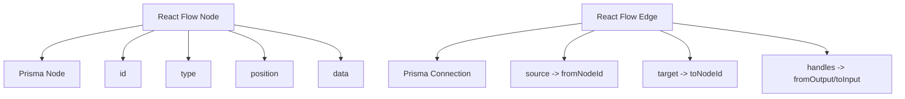

### Interview Answer

> React Flow represents the canvas as a graph containing a `nodes` array and an
> `edges` array. Each node has a stable ID, node type, canvas position, and
> configuration data. Each edge references a source node, target node, and
> optional handles. In Nodeflowz, those arrays live in React state and map
> directly to the Prisma `Node` and `Connection` models when the workflow is
> saved.

## 18. Explain controlled vs uncontrolled components. Is the canvas controlled or uncontrolled?

A controlled component receives its current value from React state and reports
changes through callbacks.

```tsx
const [name, setName] = useState("");

return (
  <input
    value={name}
    onChange={(event) => setName(event.target.value)}
  />
);
```

React owns the value.

An uncontrolled component maintains its own internal value:

```tsx
const inputRef = useRef<HTMLInputElement>(null);

return <input ref={inputRef} defaultValue="Nodeflowz" />;
```

The DOM owns the current value, and the application reads it through a ref when
needed.

### Nodeflowz Canvas

The Nodeflowz canvas is controlled because the editor passes `nodes` and
`edges` into React Flow:

```tsx
<ReactFlow
  nodes={nodes}
  edges={edges}
  onNodesChange={onNodesChange}
  onEdgesChange={onEdgesChange}
  onConnect={onConnect}
  nodeTypes={nodeComponents}
/>
```

When the user changes the graph, React Flow emits change objects. The
application applies those changes to React state:

```tsx
const onNodesChange = useCallback(
  (changes: NodeChange[]) => {
    setNodes((currentNodes) =>
      applyNodeChanges(changes, currentNodes),
    );
  },
  [],
);

const onEdgesChange = useCallback(
  (changes: EdgeChange[]) => {
    setEdges((currentEdges) =>
      applyEdgeChanges(changes, currentEdges),
    );
  },
  [],
);

const onConnect = useCallback(
  (connection: Connection) => {
    setEdges((currentEdges) =>
      addEdge(connection, currentEdges),
    );
  },
  [],
);
```

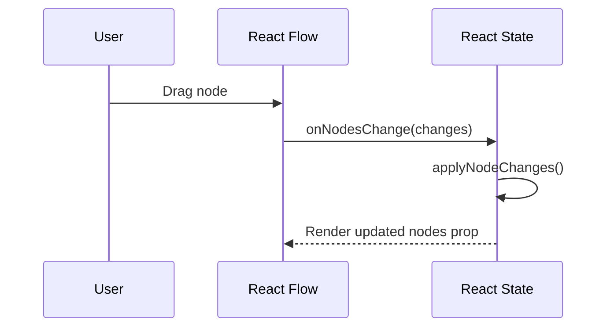

The editor instance is also stored in a Jotai atom:

```ts
export const editorAtom = atom<ReactFlowInstance | null>(null);
```

This lets other UI components, such as the Save button, read the latest graph:

```ts
const nodes = editor.getNodes();
const edges = editor.getEdges();
```

### Interview Answer

> A controlled component gets its current value from React state, while an
> uncontrolled component manages state internally. The Nodeflowz canvas is
> controlled because the editor owns the `nodes` and `edges` arrays and passes
> them into React Flow. React Flow emits graph changes, and the editor applies
> them back into state.

## 19. How did you prevent excessive re-renders while dragging a node?

Dragging a node can generate many updates per second. Performance depends on
keeping the drag update path small and avoiding unnecessary object and function
recreation.

### Stable Event Handlers

Nodeflowz wraps canvas handlers with `useCallback`:

```tsx
const onNodesChange = useCallback(
  (changes: NodeChange[]) => {
    setNodes((currentNodes) =>
      applyNodeChanges(changes, currentNodes),
    );
  },
  [],
);
```

This gives React Flow a stable callback reference across renders.

### Functional State Updates

The handlers use functional state updates:

```tsx
setNodes((currentNodes) =>
  applyNodeChanges(changes, currentNodes),
);
```

This avoids capturing stale state and allows callbacks to keep an empty
dependency array.

### Memoized Node Components

Individual visual node components use `memo`:

```tsx
export const InitialNode = memo((props: NodeProps) => {
  const [selectorOpen, setSelectorOpen] = useState(false);

  return (
    <NodeSelector open={selectorOpen} onOpenChange={setSelectorOpen}>
      {/* Visual node */}
    </NodeSelector>
  );
});
```

`AddNodeButton` is also memoized:

```tsx
export const AddNodeButton = memo(() => {
  const [selectorOpen, setSelectorOpen] = useState(false);

  return (
    <NodeSelector open={selectorOpen} onOpenChange={setSelectorOpen}>
      {/* Button */}
    </NodeSelector>
  );
});
```

### Stable Node Type Registry

The `nodeComponents` registry is declared outside the editor component:

```ts
export const nodeComponents = {
  [NodeType.INITIAL]: InitialNode,
  [NodeType.HTTP_REQUEST]: HttpRequestNode,
  [NodeType.GOOGLE_SHEETS]: GoogleSheetsNode,
  [NodeType.MANUAL_TRIGGER]: ManualTriggerNode,
  [NodeType.OPENAI]: OpenAiNode,
  [NodeType.SLACK]: SlackNode,
} as const satisfies NodeTypes;
```

If this object were recreated inside `Editor` on every render, React Flow would
need to repeatedly process the node type mapping.

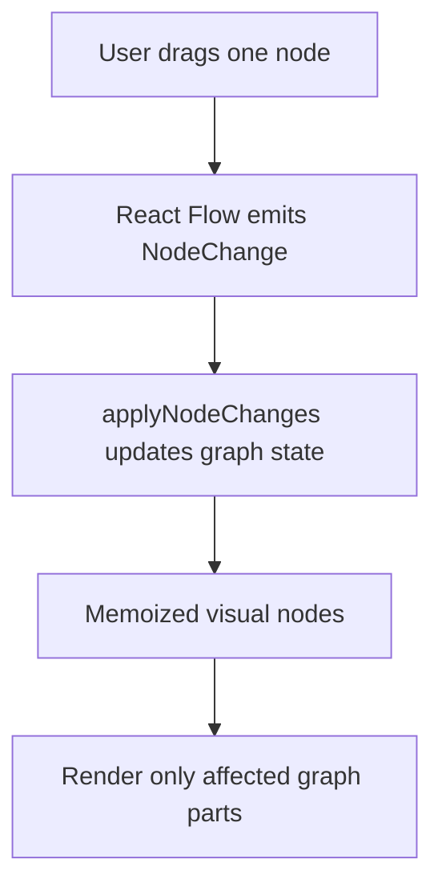

### Additional Optimizations for Large Workflows

For larger graphs, I would also:

- Keep node `data` small and avoid large nested objects.
- Avoid inline functions and objects passed to node components.
- Debounce expensive validation and persistence.
- Commit undo history on drag stop, not every drag frame.
- Subscribe components only to the state slices they need.
- Virtualize sidebars and execution lists.
- Move graph state to a selector-based store if the editor becomes very large.

For example, validation could be delayed until the graph stops changing:

```ts
const debouncedValidate = useMemo(
  () => debounce(validateWorkflow, 200),
  [],
);
```

### Interview Answer

> The drag path is kept efficient with stable `useCallback` handlers,
> functional state updates, memoized node components, and a node type registry
> declared outside the editor component. I also avoid saving or performing
> expensive graph operations on every drag frame. For much larger workflows, I
> would debounce validation and use selector-based state subscriptions.

## 20. How did you implement realtime workflow validation?

Workflow validation is graph validation. The application needs to detect
problems such as:

- Missing trigger nodes.
- Multiple restricted trigger nodes.
- Unconnected nodes.
- Cycles.
- Invalid node configuration.
- Invalid source and target handles.

The current frontend already prevents multiple manual triggers:

```ts
if (selection.type === NodeType.MANUAL_TRIGGER) {
  const nodes = getNodes();

  const hasManualTrigger = nodes.some(
    (node) => node.type === NodeType.MANUAL_TRIGGER,
  );

  if (hasManualTrigger) {
    toast.error("Only one manual trigger is allowed");
    return;
  }
}
```

The backend detects cycles during topological sorting:

```ts
try {
  sortedNodeIds = toposort(edges);
} catch (error) {
  if (error instanceof Error && error.message.includes("Cyclic")) {
    throw new Error("Workflow contains a cycle");
  }

  throw error;
}
```

### Frontend Validation Model

Validation issues can be represented as a discriminated union:

```ts
type ValidationIssue =
  | {
      type: "NO_TRIGGER";
      message: string;
    }
  | {
      type: "UNCONNECTED_NODE";
      nodeId: string;
      message: string;
    }
  | {
      type: "CYCLE";
      message: string;
    };
```

Validator:

```ts
function validateWorkflow(
  nodes: Node[],
  edges: Edge[],
): ValidationIssue[] {
  const issues: ValidationIssue[] = [];

  const triggerTypes = new Set([
    NodeType.MANUAL_TRIGGER,
    NodeType.GOOGLE_FORM_TRIGGER,
    NodeType.STRIPE_TRIGGER,
  ]);

  const triggerCount = nodes.filter(
    (node) => node.type && triggerTypes.has(node.type as NodeType),
  ).length;

  if (triggerCount === 0) {
    issues.push({
      type: "NO_TRIGGER",
      message: "Workflow requires a trigger node.",
    });
  }

  const connectedNodeIds = new Set<string>();

  for (const edge of edges) {
    connectedNodeIds.add(edge.source);
    connectedNodeIds.add(edge.target);
  }

  for (const node of nodes) {
    if (
      node.type !== NodeType.INITIAL &&
      !connectedNodeIds.has(node.id)
    ) {
      issues.push({
        type: "UNCONNECTED_NODE",
        nodeId: node.id,
        message: "Node is not connected to the workflow.",
      });
    }
  }

  if (hasCycle(nodes, edges)) {
    issues.push({
      type: "CYCLE",
      message: "Workflow contains a cycle.",
    });
  }

  return issues;
}
```

### Cycle Detection with DFS

```ts
function hasCycle(nodes: Node[], edges: Edge[]) {
  const adjacency = new Map<string, string[]>();

  for (const node of nodes) {
    adjacency.set(node.id, []);
  }

  for (const edge of edges) {
    adjacency.get(edge.source)?.push(edge.target);
  }

  const visiting = new Set<string>();
  const visited = new Set<string>();

  function visit(nodeId: string): boolean {
    if (visiting.has(nodeId)) return true;
    if (visited.has(nodeId)) return false;

    visiting.add(nodeId);

    for (const nextNodeId of adjacency.get(nodeId) ?? []) {
      if (visit(nextNodeId)) return true;
    }

    visiting.delete(nodeId);
    visited.add(nodeId);

    return false;
  }

  return nodes.some((node) => visit(node.id));
}
```

The validation result can be derived from graph state:

```tsx
const validationIssues = useMemo(
  () => validateWorkflow(nodes, edges),
  [nodes, edges],
);

const canExecute = validationIssues.length === 0;
```

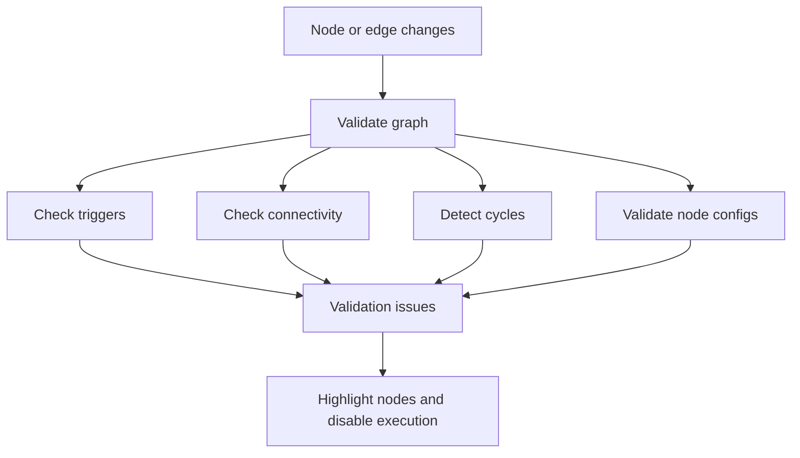

The backend must validate again before execution because frontend validation can
be bypassed.

### Interview Answer

> I treat validation as graph analysis. The frontend can derive issues from the
> current nodes and edges, checking triggers, connectivity, configuration, and
> cycles. The current code already prevents duplicate manual triggers, and the
> backend rejects cycles during topological sorting. For production, I would
> compute validation issues in a memoized or debounced validator, visually mark
> invalid nodes, disable execution, and repeat critical checks on the server.

## 21. What is `useCallback` vs `useMemo`? Give a concrete canvas example.

`useCallback` memoizes a function reference.

```ts
const memoizedFunction = useCallback(() => {
  performAction();
}, [dependency]);
```

`useMemo` memoizes a computed value.

```ts
const memoizedValue = useMemo(() => {
  return calculateValue();
}, [dependency]);
```

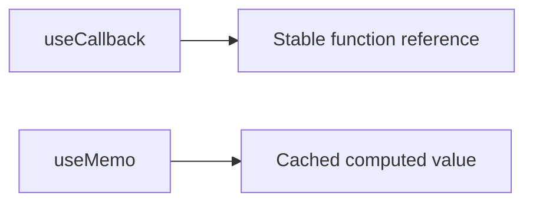

### `useCallback` in the Canvas

React Flow receives event handlers as props:

```tsx
const onConnect = useCallback(
  (connection: Connection) => {
    setEdges((currentEdges) =>
      addEdge(connection, currentEdges),
    );
  },
  [],
);
```

Keeping the handler stable avoids giving React Flow a new callback instance on
every editor render.

Other examples:

```tsx
const onNodesChange = useCallback(
  (changes: NodeChange[]) => {
    setNodes((currentNodes) =>
      applyNodeChanges(changes, currentNodes),
    );
  },
  [],
);

const onEdgesChange = useCallback(
  (changes: EdgeChange[]) => {
    setEdges((currentEdges) =>
      applyEdgeChanges(changes, currentEdges),
    );
  },
  [],
);
```

### `useMemo` in the Canvas

Nodeflowz derives whether the workflow contains a manual trigger:

```tsx
const hasManualTrigger = useMemo(() => {
  return nodes.some(
    (node) => node.type === NodeType.MANUAL_TRIGGER,
  );
}, [nodes]);
```

The value controls whether the execution button is visible:

```tsx
{hasManualTrigger && (
  <Panel position="bottom-center">
    <ExecuteWorkflowButton workflowId={workflowId} />
  </Panel>
)}
```

Another useful `useMemo` case is graph validation:

```tsx
const validationIssues = useMemo(
  () => validateWorkflow(nodes, edges),
  [nodes, edges],
);
```

### Important Note

Memoization has overhead. It should be used when:

- Referential stability matters to a child library or memoized component.
- A calculation is meaningfully expensive.
- A derived object is used as a dependency.

It should not be added automatically to every value or function.

### Interview Answer

> `useCallback` memoizes a function reference, while `useMemo` memoizes the
> result of a calculation. In the canvas, I use `useCallback` for React Flow
> event handlers such as `onConnect` and `onNodesChange`. I use `useMemo` for
> derived graph values such as whether a manual trigger exists or whether the
> workflow has validation issues.

## 22. How would you implement undo and redo for the canvas?

Undo and redo require preserving previous graph states or preserving reversible
commands.

There are two common approaches:

1. Snapshot history.
2. Command pattern.

### Snapshot History

Store the previous, current, and future graph states:

```ts
type GraphSnapshot = {
  nodes: Node[];
  edges: Edge[];
};

type GraphHistory = {
  past: GraphSnapshot[];
  present: GraphSnapshot;
  future: GraphSnapshot[];
};
```

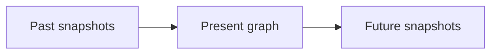

Commit a change:

```ts
function commitSnapshot(
  history: GraphHistory,
  next: GraphSnapshot,
): GraphHistory {
  return {
    past: [...history.past, history.present],
    present: next,
    future: [],
  };
}
```

Undo:

```ts
function undo(history: GraphHistory): GraphHistory {
  const previous = history.past.at(-1);

  if (!previous) return history;

  return {
    past: history.past.slice(0, -1),
    present: previous,
    future: [history.present, ...history.future],
  };
}
```

Redo:

```ts
function redo(history: GraphHistory): GraphHistory {
  const next = history.future[0];

  if (!next) return history;

  return {
    past: [...history.past, history.present],
    present: next,
    future: history.future.slice(1),
  };
}
```

Snapshots are straightforward but may consume significant memory for large
graphs.

### Command Pattern

The command pattern records each action and the information needed to reverse
it.

```ts
type CanvasCommand =
  | {
      type: "ADD_NODE";
      node: Node;
    }
  | {
      type: "MOVE_NODE";
      nodeId: string;
      from: { x: number; y: number };
      to: { x: number; y: number };
    }
  | {
      type: "DELETE_NODE";
      node: Node;
      connectedEdges: Edge[];
    }
  | {
      type: "ADD_EDGE";
      edge: Edge;
    }
  | {
      type: "DELETE_EDGE";
      edge: Edge;
    };
```

Apply a command:

```ts
function applyCommand(
  graph: GraphSnapshot,
  command: CanvasCommand,
): GraphSnapshot {
  switch (command.type) {
    case "ADD_NODE":
      return {
        ...graph,
        nodes: [...graph.nodes, command.node],
      };

    case "MOVE_NODE":
      return {
        ...graph,
        nodes: graph.nodes.map((node) =>
          node.id === command.nodeId
            ? { ...node, position: command.to }
            : node,
        ),
      };

    case "DELETE_NODE":
      return {
        nodes: graph.nodes.filter(
          (node) => node.id !== command.node.id,
        ),
        edges: graph.edges.filter(
          (edge) =>
            edge.source !== command.node.id &&
            edge.target !== command.node.id,
        ),
      };

    case "ADD_EDGE":
      return {
        ...graph,
        edges: [...graph.edges, command.edge],
      };

    case "DELETE_EDGE":
      return {
        ...graph,
        edges: graph.edges.filter(
          (edge) => edge.id !== command.edge.id,
        ),
      };
  }
}
```

Invert a command:

```ts
function invertCommand(command: CanvasCommand): CanvasCommand {
  switch (command.type) {
    case "ADD_NODE":
      return {
        type: "DELETE_NODE",
        node: command.node,
        connectedEdges: [],
      };

    case "MOVE_NODE":
      return {
        type: "MOVE_NODE",
        nodeId: command.nodeId,
        from: command.to,
        to: command.from,
      };

    case "DELETE_NODE":
      return {
        type: "ADD_NODE",
        node: command.node,
      };

    case "ADD_EDGE":
      return {
        type: "DELETE_EDGE",
        edge: command.edge,
      };

    case "DELETE_EDGE":
      return {
        type: "ADD_EDGE",
        edge: command.edge,
      };
  }
}
```

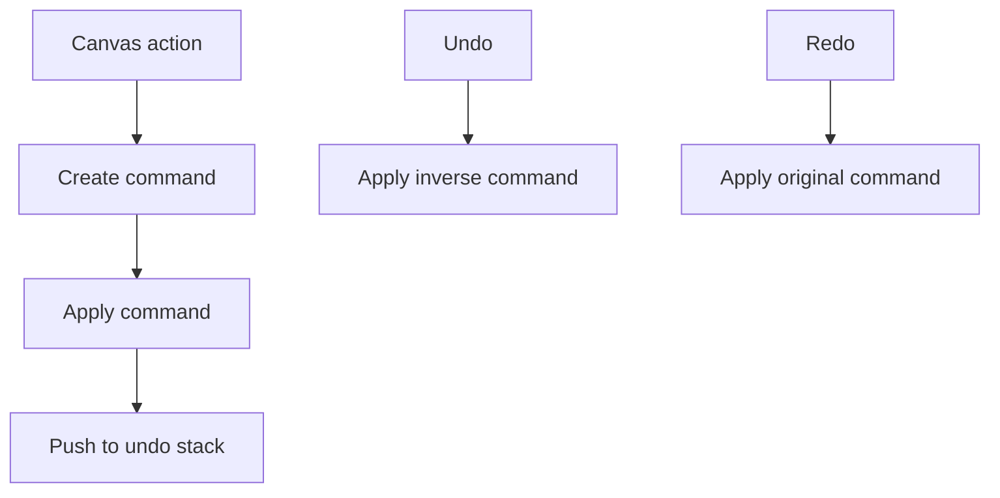

### Handling Node Dragging

The application should not add one command for every mouse movement. It should
record one move command when dragging finishes.

```tsx
const dragStartPosition = useRef<{ x: number; y: number } | null>(null);

<ReactFlow
  onNodeDragStart={(_, node) => {
    dragStartPosition.current = node.position;
  }}
  onNodeDragStop={(_, node) => {
    if (!dragStartPosition.current) return;

    executeCommand({
      type: "MOVE_NODE",
      nodeId: node.id,
      from: dragStartPosition.current,
      to: node.position,
    });

    dragStartPosition.current = null;
  }}
/>
```

### Interview Answer

> The simplest implementation stores `past`, `present`, and `future` graph
> snapshots. For better memory efficiency and more precise behavior, I would use
> the command pattern. Each add, delete, connect, or move operation becomes a
> reversible command. For dragging, I would record only the start and final
> position and commit one move command on drag stop.

## 23. Explain React reconciliation and how `key` placement affects dynamic workflow nodes.

React reconciliation is the process React uses to compare the previous render
tree with the next render tree and determine the smallest set of UI changes.

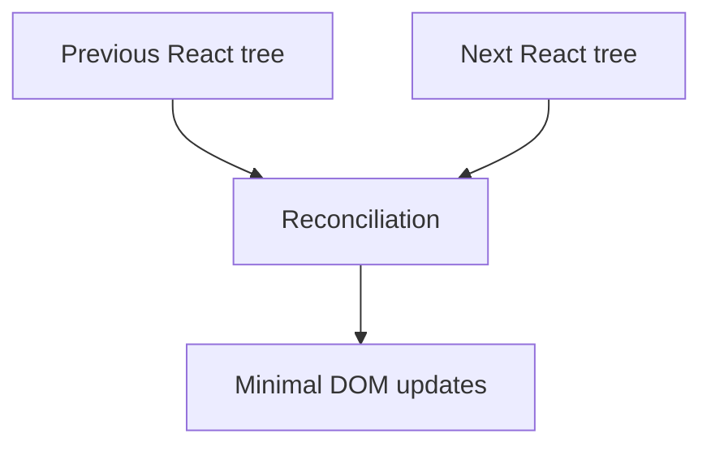

For lists, React uses `key` to identify which item corresponds to which previous
component instance.

### Incorrect Key Choice

Using an array index:

```tsx
{nodes.map((node, index) => (
  <WorkflowNodeCard
    key={index}
    node={node}
  />
))}
```

Suppose the original list is:

```text
key 0: OpenAI
key 1: Slack
key 2: Google Sheets
```

After inserting a trigger at the beginning:

```text
key 0: Manual Trigger
key 1: OpenAI
key 2: Slack
key 3: Google Sheets
```

React may associate old component state with the wrong workflow node because
the numeric keys moved.

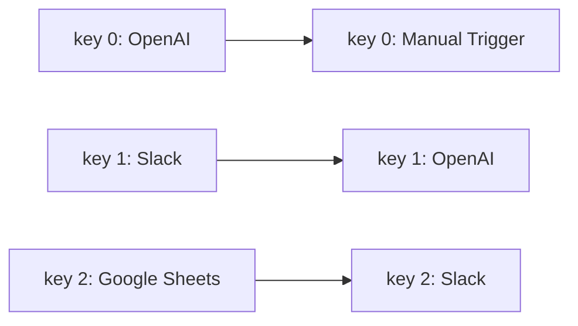

This can cause incorrect state such as:

- The wrong settings dialog remaining open.
- Form state moving to another node.
- Realtime status appearing on the wrong node.
- Local loading state attaching to another component.

### Stable Node IDs

The correct approach uses stable IDs:

```tsx
{nodes.map((node) => (
  <WorkflowNodeCard
    key={node.id}
    node={node}
  />
))}
```

Nodeflowz creates stable IDs with `createId()`:

```ts
const newNode = {
  id: createId(),
  data: {},
  position: flowPosition,
  type: selection.type,
};
```

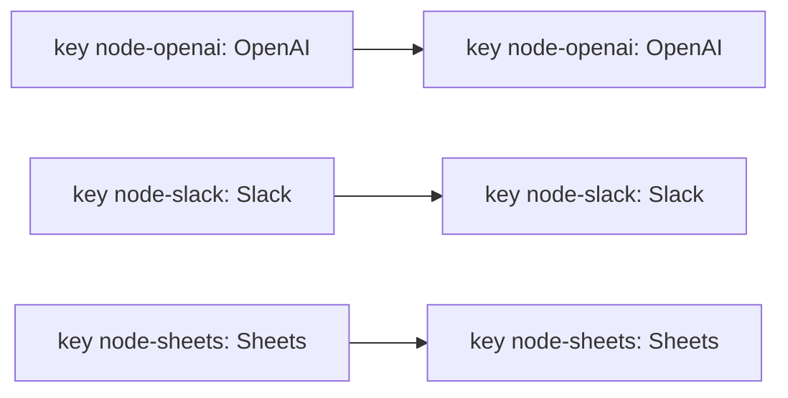

The node selector also uses stable type keys:

```tsx
{triggerNodes.map((nodeType) => (
  <div
    key={nodeType.type}
    onClick={() => handleNodeSelect(nodeType)}
  >
    {nodeType.label}
  </div>
))}
```

### Key Placement Rule

The `key` belongs on the element directly returned from `map`:

```tsx
{nodes.map((node) => (
  <WorkflowNodeCard key={node.id} node={node} />
))}
```

Not on an inner child:

```tsx
{nodes.map((node) => (
  <div>
    <WorkflowNodeCard key={node.id} node={node} />
  </div>
))}
```

In the second example, React is reconciling the outer `div` list, and those
elements do not have keys.

### Interview Answer

> React reconciliation compares the previous and next component trees and uses
> keys to preserve component identity in lists. Dynamic workflow nodes must use
> stable node IDs as keys because nodes can be inserted, deleted, and reordered.
> Using array indexes could cause React to preserve settings, form state, or
> realtime status on the wrong node. The key must be placed on the outer element
> returned by the list mapping operation.
