# Section 4: Node.js & Event Loop

This section explains the Node.js runtime concepts that matter to Nodeflowz,
especially asynchronous workflow execution, long-running provider calls,
streams, and backpressure.

## 24. Explain the Node.js event loop. What are its phases?

Node.js executes JavaScript on a main thread, but it can still handle many
concurrent I/O operations because it uses an event loop.

When Node.js starts an asynchronous operation, such as a network request or
database query, it delegates that work to the operating system or libuv. When
the operation completes, its callback becomes eligible to run on the main
JavaScript thread.

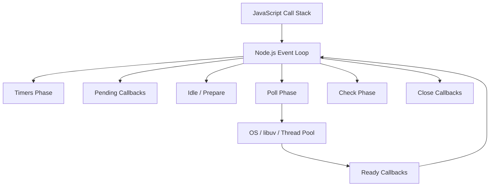

### Timers Phase

The timers phase executes callbacks scheduled with:

```ts
setTimeout(() => {
  console.log("Timer complete");
}, 100);

setInterval(() => {
  console.log("Interval callback");
}, 1000);
```

The timeout is a minimum delay. It does not guarantee that the callback runs at
the exact requested time.

### Pending Callbacks Phase

This phase executes certain system-level I/O callbacks deferred from a previous
event loop iteration, such as some TCP errors.

Application code rarely interacts with this phase directly.

### Idle and Prepare Phases

These are internal libuv phases used to prepare the event loop. Application
developers normally do not schedule work directly into them.

### Poll Phase

The poll phase processes completed I/O callbacks and may wait for new I/O.

Typical operations include:

- Database responses.
- HTTP responses.
- File system operations.
- Socket events.

```ts
import { readFile } from "node:fs";

readFile("workflow.json", () => {
  console.log("File read callback");
});
```

For Nodeflowz, most external provider and PostgreSQL operations spend their
waiting time outside the JavaScript call stack:

```ts
const credential = await prisma.credential.findUnique({
  where: {
    id: credentialId,
    userId,
  },
});

const result = await generateText({
  model,
  prompt,
});
```

While those operations wait for I/O, Node.js can process other requests and
workflow operations.

### Check Phase

The check phase runs callbacks scheduled with `setImmediate`:

```ts
setImmediate(() => {
  console.log("Check phase callback");
});
```

### Close Callbacks Phase

This phase handles close callbacks for resources such as sockets:

```ts
socket.on("close", () => {
  console.log("Socket closed");
});
```

### Microtask Queues

Node.js also processes microtasks between event loop work:

- `process.nextTick` queue.
- Promise microtask queue.

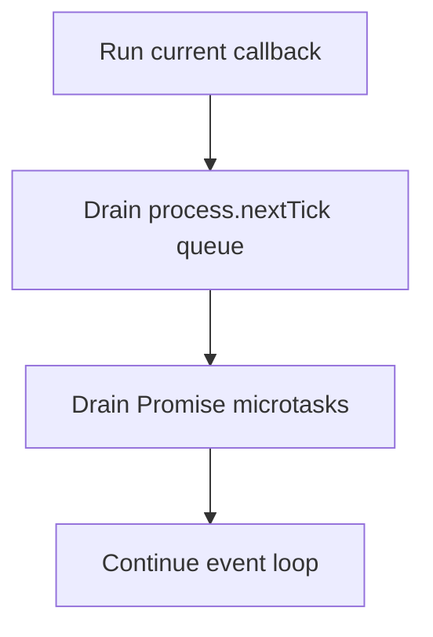

Example:

```ts
console.log("start");

Promise.resolve().then(() => {
  console.log("promise");
});

process.nextTick(() => {
  console.log("next tick");
});

console.log("end");
```

Typical output:

```text
start
end
next tick
promise
```

### Interview Answer

> Node.js runs JavaScript on one main thread and uses an event loop to process
> asynchronous callbacks. The main phases are timers, pending callbacks,
> internal idle/prepare, poll for I/O, check for `setImmediate`, and close
> callbacks. Between work, Node drains `process.nextTick` and Promise
> microtasks. This model lets Nodeflowz wait for database and external API calls
> without blocking other requests.

## 25. What is the difference between `setImmediate`, `process.nextTick`, and `setTimeout(fn, 0)`? Which runs first?

These APIs all defer work, but they schedule it in different queues.

### `process.nextTick`

`process.nextTick` schedules a callback to run immediately after the current
JavaScript operation finishes, before the event loop proceeds.

```ts
process.nextTick(() => {
  console.log("nextTick");
});
```

It runs before Promise microtasks in Node.js.

Excessive recursive `nextTick` usage can starve the event loop:

```ts
function repeatForever() {
  process.nextTick(repeatForever);
}

repeatForever();
```

Because the `nextTick` queue never empties, timers and I/O callbacks may not
run.

### `setTimeout(fn, 0)`

`setTimeout(fn, 0)` schedules a callback for the timers phase after at least the
minimum timer delay.

```ts
setTimeout(() => {
  console.log("timeout");
}, 0);
```

It does not mean that the callback runs immediately.

### `setImmediate`

`setImmediate` schedules a callback for the check phase, which runs after the
poll phase.

```ts
setImmediate(() => {
  console.log("immediate");
});
```

### Typical Ordering

```ts
process.nextTick(() => console.log("nextTick"));

Promise.resolve().then(() => console.log("promise"));

setTimeout(() => console.log("timeout"), 0);

setImmediate(() => console.log("immediate"));
```

A common top-level result is:

```text
nextTick
promise
timeout
immediate
```

However, the ordering between `setTimeout(fn, 0)` and `setImmediate` at the top
level is not guaranteed.

Inside an I/O callback, `setImmediate` usually runs first:

```ts
import { readFile } from "node:fs";

readFile("workflow.json", () => {
  setTimeout(() => console.log("timeout"), 0);
  setImmediate(() => console.log("immediate"));
});
```

Typical output:

```text
immediate
timeout
```

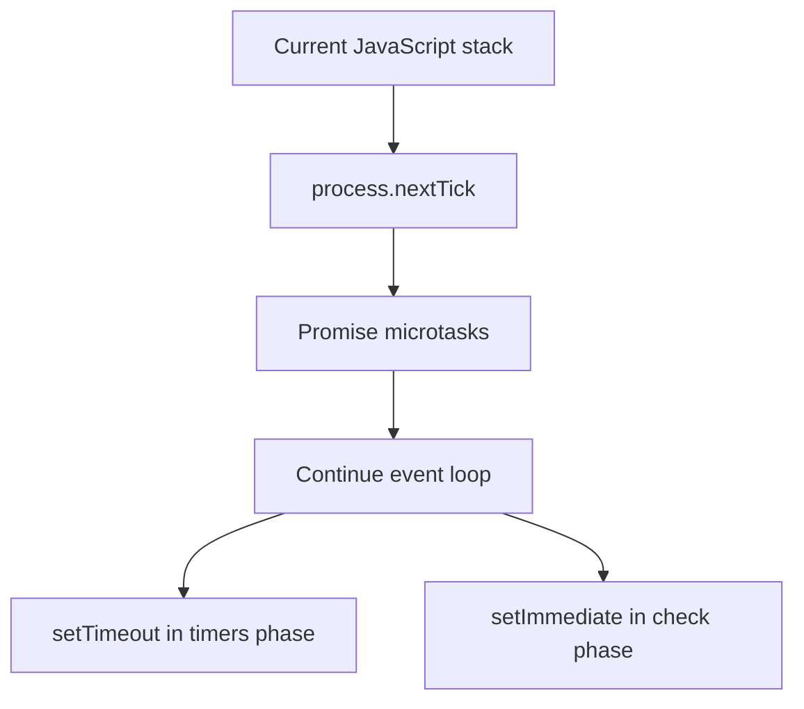

### When to Use Them

| API | Typical Purpose |
|---|---|
| `process.nextTick` | Run immediately after current operation; use sparingly |
| Promise microtask | Continue async logic |
| `setImmediate` | Yield until after I/O polling |
| `setTimeout` | Run after a minimum delay |

### Interview Answer

> `process.nextTick` runs first after the current call stack and before Promise
> microtasks. `setTimeout(fn, 0)` runs in the timers phase, while `setImmediate`
> runs in the check phase. At the top level, timeout and immediate ordering can
> vary, but inside an I/O callback `setImmediate` generally runs before a
> zero-delay timer.

## 26. How does Node.js handle CPU-intensive tasks without blocking the event loop?

Asynchronous I/O does not automatically make CPU-intensive JavaScript
non-blocking.

This code blocks the main thread:

```ts
function calculateLargeResult() {
  let result = 0;

  for (let index = 0; index < 10_000_000_000; index++) {
    result += index;
  }

  return result;
}

calculateLargeResult();
```

While it runs, Node.js cannot:

- Process new HTTP requests.
- Handle completed database queries.
- Execute timers.
- Process other workflow callbacks.

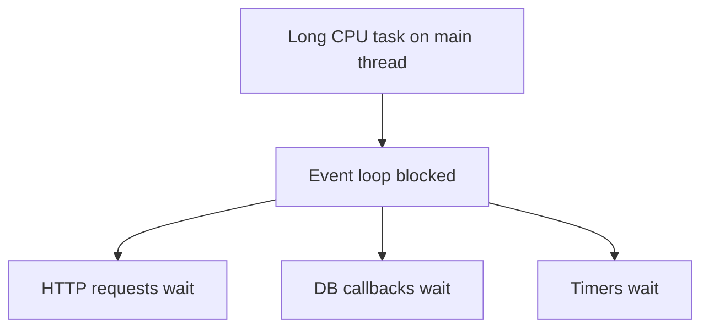

### Worker Threads

CPU-heavy JavaScript can run in a worker thread:

```ts
import { Worker } from "node:worker_threads";

function runCpuTask(input: number) {
  return new Promise<number>((resolve, reject) => {
    const worker = new Worker("./cpu-worker.js", {
      workerData: input,
    });

    worker.on("message", resolve);
    worker.on("error", reject);
    worker.on("exit", (code) => {
      if (code !== 0) {
        reject(new Error(`Worker stopped with code ${code}`));
      }
    });
  });
}
```

Worker:

```js
const { parentPort, workerData } = require("node:worker_threads");

let result = 0;

for (let index = 0; index < workerData; index++) {
  result += index;
}

parentPort.postMessage(result);
```

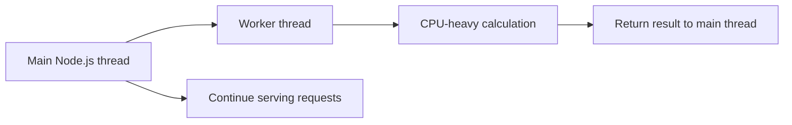

### Other Options

- Use separate worker processes.
- Queue work for dedicated worker services.
- Break work into smaller chunks and yield between chunks.
- Use native libraries that perform work outside JavaScript.
- Delegate specialized tasks to external services.

For Nodeflowz, the main execution workload is primarily I/O-bound because nodes
call databases, AI providers, and external APIs. If a future node performs
large local transformations, image processing, or data analysis, that work
should run in a worker thread or specialized worker service.

### Interview Answer

> Async I/O does not protect Node.js from CPU-heavy JavaScript. A long
> calculation still blocks the main thread. I would move CPU-intensive work to
> worker threads, separate processes, or dedicated queue workers. Nodeflowz
> currently performs mostly I/O-bound provider calls, but any heavy local data
> transformation should be isolated from the main request-handling thread.

## 27. How did you prevent a long-running workflow node from blocking other executions?

Nodeflowz separates the API request from workflow execution.

When a user clicks Execute, the tRPC procedure verifies ownership and sends an
Inngest event:

```ts
await sendWorkflowExecution({
  workflowId: input.id,
});
```

Event creation:

```ts
export const sendWorkflowExecution = async (data: {
  workflowId: string;
  [key: string]: unknown;
}) => {
  return inngest.send({
    name: "workflows/execute.workflow",
    data,
    id: createId(),
  });
};
```

The API request does not wait for the entire workflow to finish.

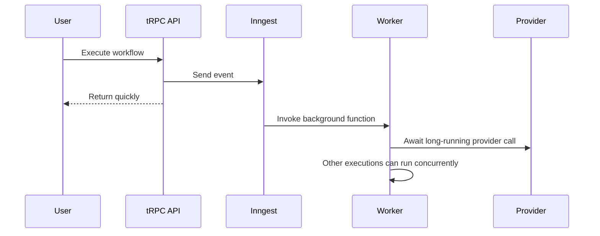

The background function runs nodes asynchronously:

```ts
for (const node of sortedNodes) {
  const executor = getExecutor(node.type as NodeType);

  context = await executor({
    data: node.data as Record<string, unknown>,
    nodeId: node.id,
    userId,
    context,
    step,
    publish,
  });
}
```

An OpenAI executor awaits network I/O:

```ts
const { steps } = await step.ai.wrap(
  "openai-generate-text",
  generateText,
  {
    model: openai("gpt-4"),
    system: systemPrompt,
    prompt: userPrompt,
  },
);
```

While the provider request is waiting, the Node.js event loop is free to handle
other work. Inngest also provides retries and step isolation.

### Production Hardening

For stronger isolation, I would add:

- Node-level timeouts.
- Worker concurrency limits.
- Per-provider concurrency limits.
- Separate queues for heavy node types.
- Cancellation support.
- Idempotency keys.
- Circuit breakers.

Timeout example:

```ts
async function withTimeout<T>(
  promise: Promise<T>,
  timeoutMs: number,
): Promise<T> {
  return Promise.race([
    promise,
    new Promise<T>((_, reject) => {
      setTimeout(() => {
        reject(new Error("Operation timed out"));
      }, timeoutMs);
    }),
  ]);
}
```

### Interview Answer

> I prevented long-running nodes from blocking user requests by moving workflow
> execution into Inngest. The API only validates and queues the job, while a
> background function runs the nodes. Provider calls are asynchronous, so while
> one execution waits for network I/O, Node.js can process other work. At larger
> scale I would also enforce timeouts, concurrency limits, cancellation, and
> separate queues for heavy nodes.

## 28. What are Node.js streams? Could Nodeflowz benefit from streaming?

Streams process data incrementally instead of loading the entire value into
memory.

The main stream types are:

- Readable: produces data.
- Writable: consumes data.
- Duplex: both readable and writable.
- Transform: consumes data and emits transformed data.


### Readable Stream

```ts
import { createReadStream } from "node:fs";

const readable = createReadStream("large-workflow-export.csv");
```

### Writable Stream

```ts
import { createWriteStream } from "node:fs";

const writable = createWriteStream("processed-output.csv");
```

### Transform Stream

```ts
import { Transform } from "node:stream";

const uppercase = new Transform({
  transform(chunk, _encoding, callback) {
    callback(null, chunk.toString().toUpperCase());
  },
});
```

### Stream Pipeline

```ts
import { pipeline } from "node:stream/promises";

await pipeline(
  createReadStream("input.txt"),
  uppercase,
  createWriteStream("output.txt"),
);
```

### Where Nodeflowz Could Benefit

Nodeflowz currently passes workflow context as in-memory JSON objects:

```ts
export type WorkflowContext = Record<string, unknown>;
```

This is appropriate for normal automation payloads, but buffering becomes
expensive for:

- Large CSV files.
- Large Google Sheets exports.
- Large HTTP response bodies.
- Bulk CRM records.
- Web scraping datasets.
- Log ingestion.
- AI token streaming.

Instead of buffering an entire HTTP response:

```ts
const response = await fetch(url);
const text = await response.text();
```

The node could process chunks:

```ts
const response = await fetch(url);

if (!response.body) {
  throw new Error("Response body is missing");
}

for await (const chunk of response.body) {
  await processChunk(chunk);
}
```

Possible streaming workflow:

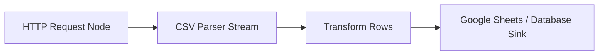

For AI providers, tokens could be streamed to the canvas as they are generated:

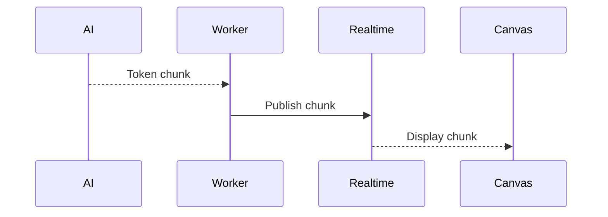

### Interview Answer

> Node.js streams process data incrementally rather than buffering everything
> in memory. They are useful for large files, HTTP bodies, bulk records, and AI
> token output. Nodeflowz could use streams for large data-processing nodes, for
> example reading a large CSV from an HTTP node and writing rows to Google
> Sheets without storing the entire file in memory.

## 29. Explain backpressure in Node.js streams. How would you implement it in a high-throughput pipeline?

Backpressure occurs when a producer creates data faster than a consumer can
process it.


Without backpressure, memory usage can grow until the process becomes slow or
crashes.

### Writable Stream Backpressure

`writable.write()` returns a boolean:

- `true`: the internal buffer can accept more data.
- `false`: stop writing and wait for the `drain` event.

```ts
import { once } from "node:events";
import type { Writable } from "node:stream";

async function writeChunks(
  writable: Writable,
  chunks: Buffer[],
) {
  for (const chunk of chunks) {
    const canContinue = writable.write(chunk);

    if (!canContinue) {
      await once(writable, "drain");
    }
  }

  writable.end();
}
```

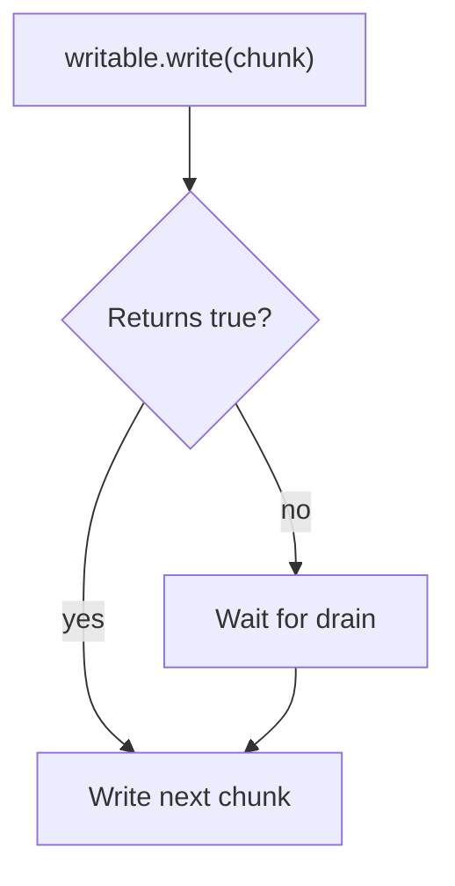

The `pipeline` utility handles stream backpressure automatically:

```ts
import { pipeline } from "node:stream/promises";

await pipeline(
  sourceStream,
  transformStream,
  destinationStream,
);
```

### Backpressure in a Workflow Platform

Backpressure applies at more than the stream level.

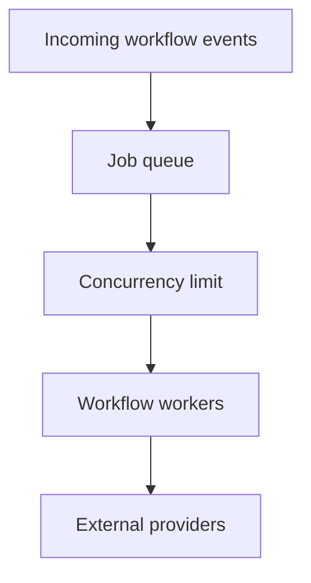

If jobs enter faster than workers and providers can process them, the queue
absorbs the load. Workers should process only a controlled number at a time.

Semaphore example:

```ts
class Semaphore {
  private active = 0;
  private readonly waiting: Array<() => void> = [];

  constructor(private readonly maximum: number) {}

  async acquire() {
    if (this.active < this.maximum) {
      this.active++;
      return;
    }

    await new Promise<void>((resolve) => {
      this.waiting.push(resolve);
    });

    this.active++;
  }

  release() {
    this.active--;
    this.waiting.shift()?.();
  }
}
```

Provider-specific limits:

```ts
const providerLimits = {
  openai: new Semaphore(10),
  googleSheets: new Semaphore(5),
  slack: new Semaphore(20),
};
```

Use the limiter:

```ts
async function runOpenAiNode() {
  await providerLimits.openai.acquire();

  try {
    return await callOpenAI();
  } finally {
    providerLimits.openai.release();
  }
}
```

### High-Throughput Design

I would combine:

- Queue-level buffering.
- Per-worker concurrency limits.
- Per-provider concurrency limits.
- Token bucket rate limiting.
- Retry backoff.
- Circuit breakers.
- Stream-level backpressure for large payloads.

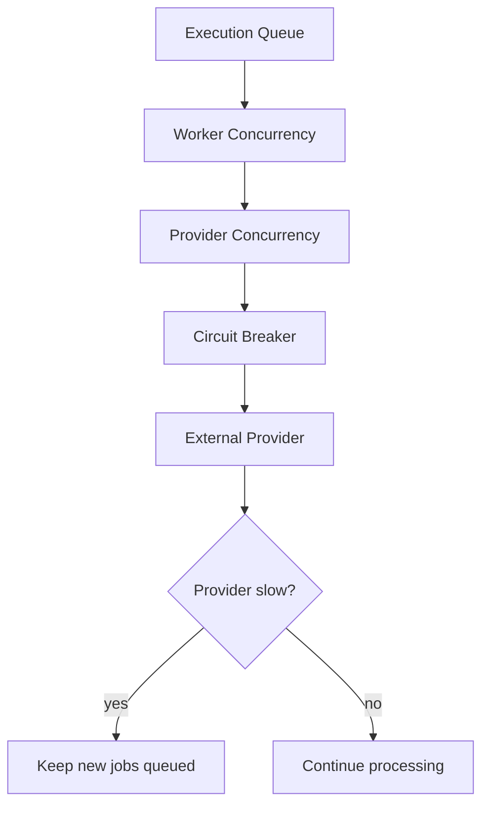

### Interview Answer

> Backpressure means the consumer is slower than the producer. In Node streams,
> a writable signals backpressure when `write()` returns false, and the producer
> waits for `drain`; `pipeline` handles this automatically. In Nodeflowz, I
> would apply the same principle at the queue level using worker and
> provider-specific concurrency limits, allowing the queue to absorb bursts
> instead of overwhelming memory, PostgreSQL, or external APIs.
