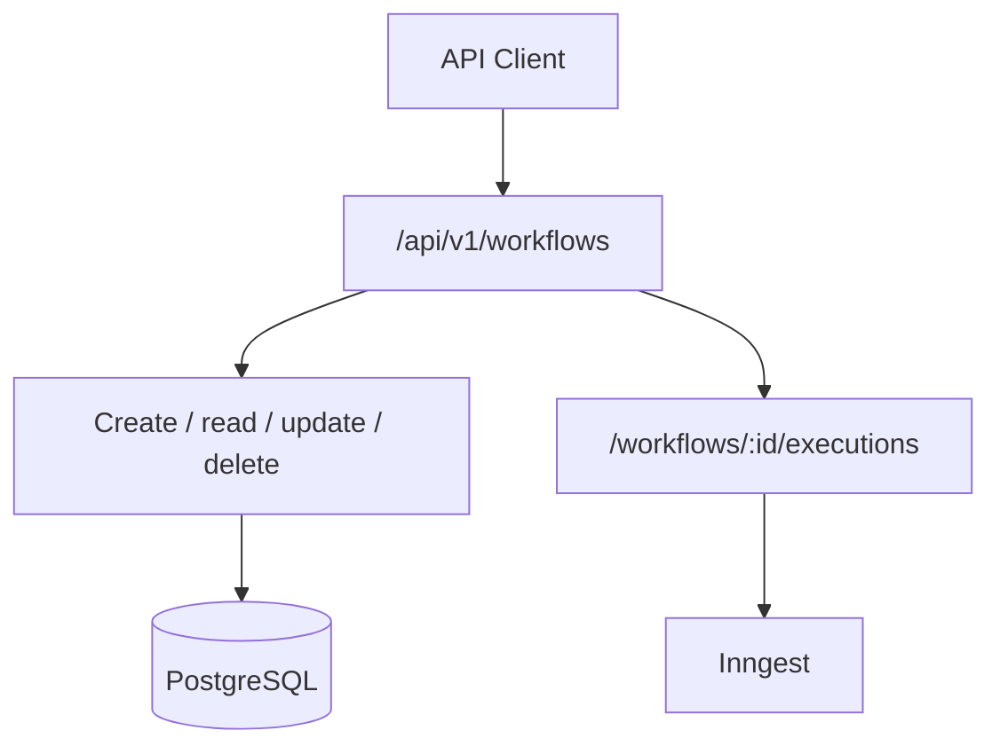
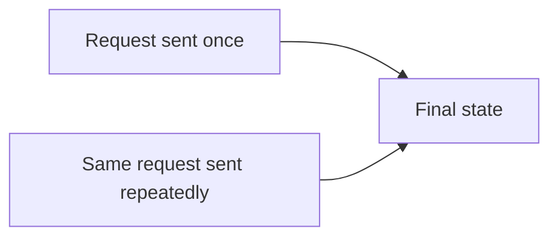
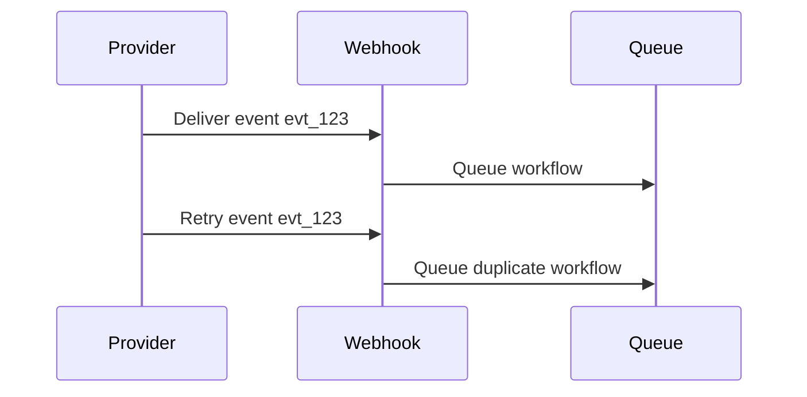
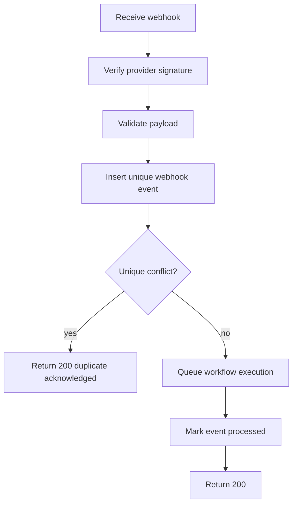
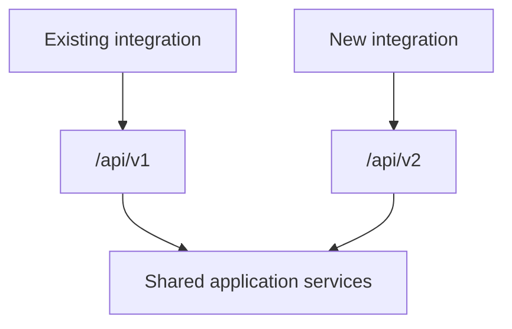
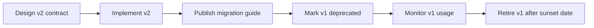
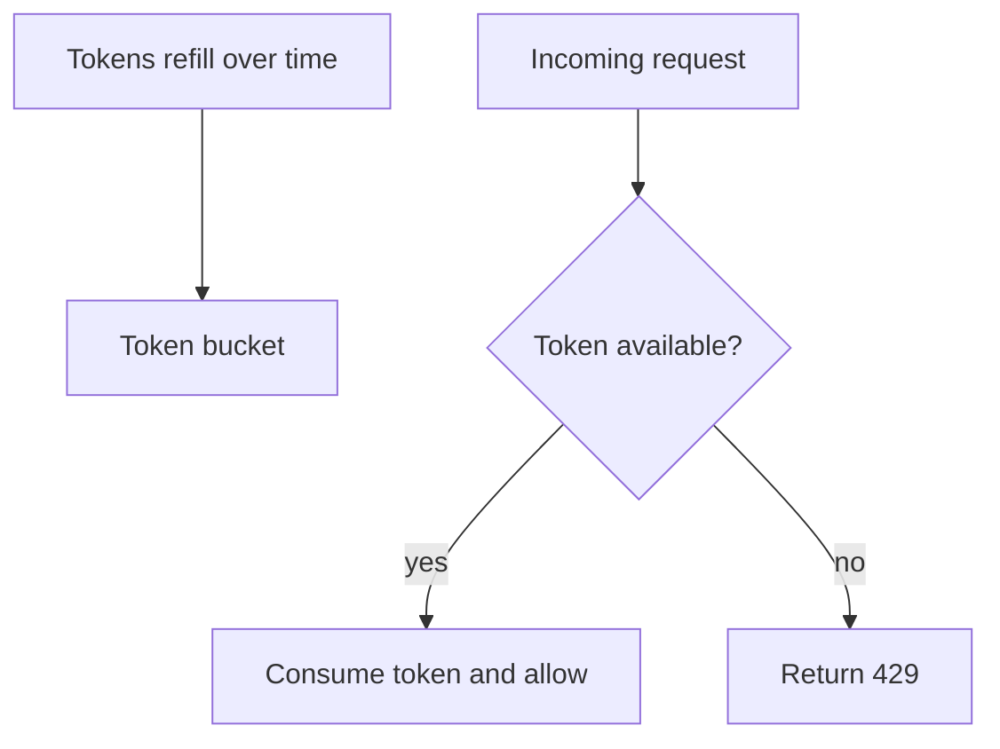
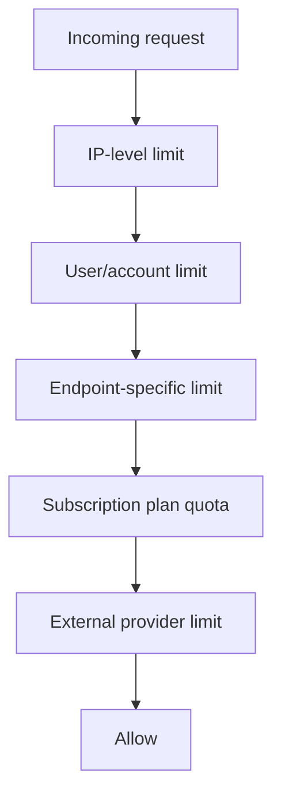
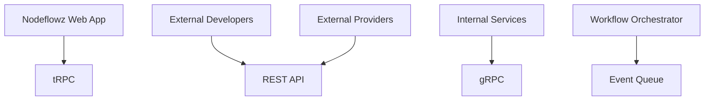
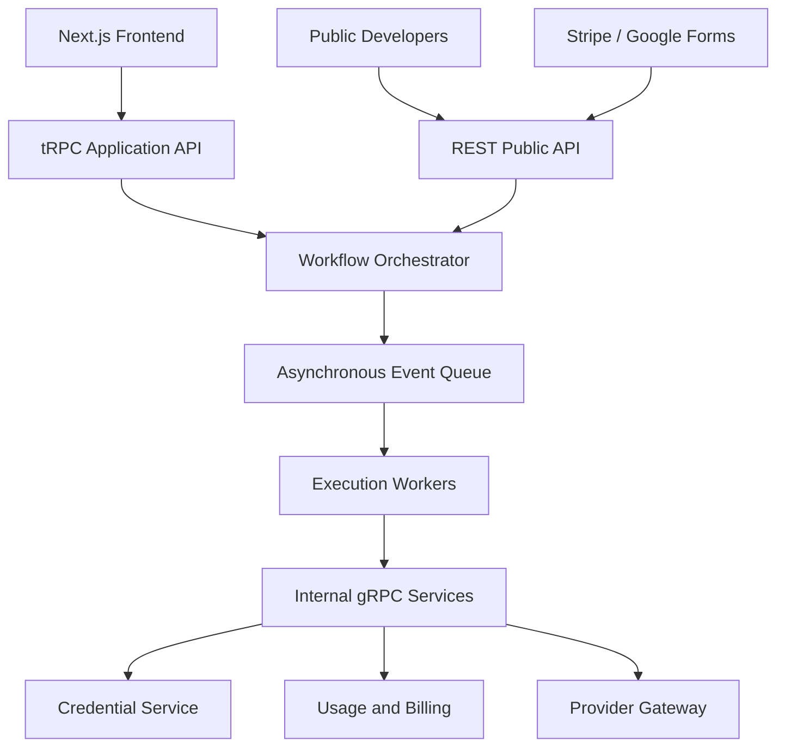

# Section 5: API Design & REST

This section explains API design decisions for Nodeflowz. The current
application primarily uses tRPC for internal application operations and Next.js
route handlers for webhooks and integration boundaries.

## 30. What HTTP methods and status codes did you use for workflow CRUD endpoints, and why?

Nodeflowz currently implements workflow CRUD mainly through tRPC procedures:

```ts
export const workflowRouter = createTRPCRouter({
  create: premiumProcedure.mutation(...),
  getMany: protectedProcedure.query(...),
  getOne: protectedProcedure.query(...),
  update: protectedProcedure.mutation(...),
  updateName: protectedProcedure.mutation(...),
  remove: protectedProcedure.mutation(...),
  execute: protectedProcedure.mutation(...),
});
```

tRPC sends these operations over HTTP, but the application exposes procedures
rather than manually designed REST resource routes.

If I exposed Nodeflowz as a public REST API, I would design it around workflow
and execution resources:

| Operation | Endpoint | Method | Success Status |
|---|---|---:|---:|
| List workflows | `/api/v1/workflows` | `GET` | `200 OK` |
| Get one workflow | `/api/v1/workflows/:id` | `GET` | `200 OK` |
| Create workflow | `/api/v1/workflows` | `POST` | `201 Created` |
| Replace workflow graph | `/api/v1/workflows/:id` | `PUT` | `200 OK` |
| Partially update workflow | `/api/v1/workflows/:id` | `PATCH` | `200 OK` |
| Delete workflow | `/api/v1/workflows/:id` | `DELETE` | `204 No Content` |
| Queue execution | `/api/v1/workflows/:id/executions` | `POST` | `202 Accepted` |
| Get execution | `/api/v1/executions/:id` | `GET` | `200 OK` |



### Why These Methods?

`GET` reads a resource without changing server state:

```http
GET /api/v1/workflows/workflow_123
```

`POST` creates a new subordinate resource:

```http
POST /api/v1/workflows
```

`PUT` replaces the complete workflow graph representation:

```http
PUT /api/v1/workflows/workflow_123
```

`PATCH` updates only selected fields, such as a workflow name:

```http
PATCH /api/v1/workflows/workflow_123
```

`DELETE` removes a resource:

```http
DELETE /api/v1/workflows/workflow_123
```

### Execution Should Return `202 Accepted`

Workflow execution is asynchronous. The server accepts and queues the request,
but the workflow has not completed yet.

```ts
export async function POST(
  _request: Request,
  context: {
    params: Promise<{ workflowId: string }>;
  },
) {
  const { workflowId } = await context.params;

  const event = await sendWorkflowExecution({
    workflowId,
  });

  return Response.json(
    {
      status: "queued",
      eventId: event.ids[0],
    },
    {
      status: 202,
    },
  );
}
```

### Common Status Codes

| Status | Meaning |
|---:|---|
| `200 OK` | Successful read or update |
| `201 Created` | New resource created |
| `202 Accepted` | Asynchronous operation queued |
| `204 No Content` | Successful delete with no body |
| `400 Bad Request` | Invalid request syntax or missing input |
| `401 Unauthorized` | Authentication required |
| `403 Forbidden` | Authenticated but not allowed |
| `404 Not Found` | Resource does not exist or is not visible |
| `409 Conflict` | Duplicate resource or version conflict |
| `422 Unprocessable Content` | Structurally valid but semantically invalid |
| `429 Too Many Requests` | Rate limit exceeded |
| `500 Internal Server Error` | Unexpected server failure |

### Interview Answer

> Internally, Nodeflowz uses tRPC procedures for workflow CRUD. If exposing
> REST, I would use `GET` for reads, `POST` for creation, `PUT` for complete
> graph replacement, `PATCH` for partial changes, and `DELETE` for removal.
> Workflow execution would return `202 Accepted` because it only queues an
> asynchronous background job.

## 31. What is idempotency? Which endpoints are idempotent?

An operation is idempotent when repeating the same request produces the same
final server state as executing it once.



### Naturally Idempotent Operations

`GET` is idempotent because reading data does not change it:

```http
GET /api/v1/workflows/workflow_123
```

`PUT` is intended to be idempotent because sending the same full replacement
multiple times produces the same state:

```http
PUT /api/v1/workflows/workflow_123
```

`DELETE` is conceptually idempotent because after the first successful delete,
repeated requests still leave the resource deleted.

`PATCH` may be idempotent depending on the operation:

```json
{
  "name": "daily-report"
}
```

Setting the same name repeatedly is idempotent.

This patch is not idempotent:

```json
{
  "incrementRunLimitBy": 1
}
```

### Non-Idempotent Operations

Creating a workflow is not naturally idempotent:

```http
POST /api/v1/workflows
```

Sending it twice may create two workflows.

Queuing an execution is also not naturally idempotent:

```http
POST /api/v1/workflows/workflow_123/executions
```

Sending it twice may run the workflow twice.

Current Nodeflowz execution events use a new ID:

```ts
return inngest.send({
  name: "workflows/execute.workflow",
  data,
  id: createId(),
});
```

Repeated execution requests therefore produce distinct events.

### Adding Idempotency Keys

Clients can send:

```http
Idempotency-Key: execution-request-abc123
```

Schema:

```prisma
model IdempotencyRecord {
  id          String   @id @default(cuid())
  userId      String
  key         String
  operation   String
  response    Json?
  createdAt   DateTime @default(now())
  expiresAt   DateTime

  @@unique([userId, operation, key])
}
```

Execution handler:

```ts
async function queueExecutionIdempotently(input: {
  userId: string;
  workflowId: string;
  idempotencyKey: string;
}) {
  return prisma.$transaction(async (tx) => {
    const existing = await tx.idempotencyRecord.findUnique({
      where: {
        userId_operation_key: {
          userId: input.userId,
          operation: "execute-workflow",
          key: input.idempotencyKey,
        },
      },
    });

    if (existing) {
      return existing.response;
    }

    const execution = await tx.execution.create({
      data: {
        workflowId: input.workflowId,
        inngestEventId: createId(),
      },
    });

    await tx.idempotencyRecord.create({
      data: {
        userId: input.userId,
        operation: "execute-workflow",
        key: input.idempotencyKey,
        response: {
          executionId: execution.id,
        },
        expiresAt: new Date(Date.now() + 24 * 60 * 60 * 1000),
      },
    });

    return {
      executionId: execution.id,
    };
  });
}
```

### Nodeflowz Operation Summary

| Operation | Idempotent? |
|---|---|
| Get workflow | Yes |
| List workflows | Yes |
| Rename to a fixed name | Yes |
| Replace graph with fixed graph | Final state is idempotent |
| Delete workflow | Conceptually yes |
| Create workflow | No |
| Execute workflow | No, unless using idempotency key |
| Receive webhook | No, unless deduplicated |

### Interview Answer

> Idempotency means repeated identical requests have the same effect as one
> request. Reads, fixed-value updates, replacements, and deletes are generally
> idempotent. Workflow creation, execution, and webhook-triggered runs are not
> naturally idempotent. For those operations, I would accept an idempotency key
> and enforce uniqueness in PostgreSQL.

## 32. How did you design webhook triggers to handle duplicate deliveries?

Webhook providers commonly use at-least-once delivery. If they do not receive a
successful response, they retry, and even successful deliveries may occasionally
be repeated.

The current Stripe workflow trigger extracts the provider event ID:

```ts
const stripeData = {
  eventId: body.id,
  eventType: body.type,
  timestamp: body.created,
  livemode: body.livemode,
  raw: body.data?.object,
};
```

It then queues an execution:

```ts
await sendWorkflowExecution({
  workflowId,
  initialData: {
    stripe: stripeData,
  },
});
```

The current implementation does not persist the webhook event ID for
deduplication. Therefore, duplicate deliveries can currently queue duplicate
workflow executions.



### Production Idempotent Design

Store received provider events:

```prisma
model WebhookEvent {
  id          String   @id @default(cuid())
  provider    String
  externalId  String
  workflowId  String
  eventType   String
  receivedAt  DateTime @default(now())
  processedAt DateTime?

  @@unique([provider, externalId, workflowId])
}
```

Webhook flow:



Handler:

```ts
import { Prisma } from "@/generated/prisma";

export async function POST(request: Request) {
  const workflowId = new URL(request.url).searchParams.get("workflowId");

  if (!workflowId) {
    return Response.json(
      {
        success: false,
        error: "Missing workflowId",
      },
      {
        status: 400,
      },
    );
  }

  const event = await verifyAndParseStripeEvent(request);

  try {
    await prisma.webhookEvent.create({
      data: {
        provider: "stripe",
        externalId: event.id,
        workflowId,
        eventType: event.type,
      },
    });
  } catch (error) {
    if (
      error instanceof Prisma.PrismaClientKnownRequestError &&
      error.code === "P2002"
    ) {
      return Response.json(
        {
          success: true,
          duplicate: true,
        },
        {
          status: 200,
        },
      );
    }

    throw error;
  }

  await sendWorkflowExecution({
    workflowId,
    idempotencyKey: `stripe:${workflowId}:${event.id}`,
    initialData: {
      stripe: event.data.object,
    },
  });

  return Response.json(
    {
      success: true,
    },
    {
      status: 200,
    },
  );
}
```

Returning `200 OK` for duplicates is important. The provider needs to know that
the event was accepted and should not continue retrying.

### Signature Verification

Deduplication is not enough. The application must verify that the webhook
actually came from the expected provider.

```ts
const event = stripe.webhooks.constructEvent(
  rawBody,
  signature,
  process.env.STRIPE_WEBHOOK_SECRET!,
);
```

### Interview Answer

> Webhooks use at-least-once delivery, so duplicate events are expected. The
> current trigger extracts Stripe's event ID but does not yet persist it for
> deduplication. In production, I would verify the signature and insert the
> provider event ID into a table with a unique constraint. If the insert
> conflicts, I return `200 OK` without queuing another execution.

## 33. Describe your API versioning strategy.

For public REST APIs, I would use explicit URL-based major versions:

```text
/api/v1/workflows
/api/v2/workflows
```



This approach is easy for external developers to understand and lets the
platform support old and new contracts simultaneously.

### Non-Breaking Changes

Usually safe:

- Adding optional response fields.
- Adding optional request fields.
- Adding new endpoints.
- Adding new enum values if clients tolerate unknown values.

### Breaking Changes

Examples:

- Renaming a response field.
- Removing a field.
- Changing a field type.
- Changing authentication behavior.
- Changing endpoint semantics.

Suppose v1 returns:

```json
{
  "id": "workflow_123",
  "name": "daily-report"
}
```

The new contract requires:

```json
{
  "workflow": {
    "id": "workflow_123",
    "displayName": "daily-report"
  },
  "metadata": {
    "apiVersion": 2
  }
}
```

I would introduce `/api/v2` rather than changing `/api/v1` in place.

### Migration Process



Deprecation response headers:

```http
Deprecation: true
Sunset: Fri, 01 January 2027 00:00:00 GMT
Link: </docs/migrate-v1-to-v2>; rel="deprecation"
```

### Versioning tRPC

tRPC is used internally, so I would generally evolve it by adding new
procedures while keeping old procedures during migration:

```ts
export const workflowRouter = createTRPCRouter({
  getOne: oldGetOneProcedure,
  getOneV2: newGetOneProcedure,
});
```

For a larger transition:

```ts
export const appRouter = createTRPCRouter({
  v1: v1Router,
  v2: v2Router,
});
```

### Database Compatibility

API versioning and database migrations must be coordinated. Both v1 and v2 may
run simultaneously, so the database schema must support both until v1 is
retired.

### Interview Answer

> For public integrations, I would use explicit major versions such as
> `/api/v1` and `/api/v2`. Breaking changes go into a new version while the old
> contract remains available during a documented deprecation period. Internal
> tRPC procedures can evolve by adding new procedures and migrating the
> frontend gradually. Database changes must remain compatible with both
> versions during the transition.

## 34. How did you implement rate limiting? Which algorithm did you choose?

The current Nodeflowz codebase does not contain a dedicated API rate-limiting
layer. It currently protects operations with:

- Authentication through `protectedProcedure`.
- Subscription gating through `premiumProcedure`.
- Asynchronous execution through Inngest.
- Provider-side limits from external APIs.

For production, I would add distributed rate limiting backed by Redis.

### Algorithm Options

#### Fixed Window

Count requests in fixed time windows:

```text
100 requests between 10:00 and 10:01
```

Simple, but users can create a burst at the boundary:

```text
100 requests at 10:00:59
100 requests at 10:01:00
```

#### Sliding Window

Counts requests over the latest rolling period. It is more accurate but may
require more storage or computation.

#### Leaky Bucket

Processes requests at a steady rate. This smooths traffic but does not naturally
allow bursts.

#### Token Bucket

Tokens refill at a fixed rate. Each request consumes a token. It supports short
bursts while enforcing a sustained rate.



For Nodeflowz, I would choose token bucket because normal usage can be bursty.
A user may quickly save or test a workflow several times, but sustained abusive
traffic must still be controlled.

### Simplified Token Bucket

```ts
type Bucket = {
  tokens: number;
  updatedAt: number;
};

const buckets = new Map<string, Bucket>();

function allowRequest(input: {
  key: string;
  capacity: number;
  refillPerSecond: number;
}) {
  const now = Date.now();
  const bucket = buckets.get(input.key) ?? {
    tokens: input.capacity,
    updatedAt: now,
  };

  const elapsedSeconds = (now - bucket.updatedAt) / 1000;
  const refillAmount = elapsedSeconds * input.refillPerSecond;

  bucket.tokens = Math.min(
    input.capacity,
    bucket.tokens + refillAmount,
  );
  bucket.updatedAt = now;

  if (bucket.tokens < 1) {
    buckets.set(input.key, bucket);
    return false;
  }

  bucket.tokens -= 1;
  buckets.set(input.key, bucket);

  return true;
}
```

This in-memory example is not suitable for horizontally scaled production
instances because every instance has separate state.

### tRPC Middleware

```ts
const rateLimitedProcedure = protectedProcedure.use(
  async ({ ctx, next, path }) => {
    const allowed = await distributedRateLimiter.allow({
      key: `${ctx.auth.user.id}:${path}`,
      capacity: 20,
      refillPerSecond: 1,
    });

    if (!allowed) {
      throw new TRPCError({
        code: "TOO_MANY_REQUESTS",
        message: "Rate limit exceeded",
      });
    }

    return next();
  },
);
```

### Multiple Limiting Layers



Suggested limits:

| Operation | Rate Limit Scope |
|---|---|
| Login and signup | IP address |
| Workflow creation | User and subscription plan |
| Workflow execution | User, plan, and workflow |
| Webhook ingestion | Provider, IP, and workflow |
| AI provider calls | User credential and provider |
| Google Sheets writes | User credential and provider quota |

### Interview Answer

> The current project has authentication and subscription gating but no
> dedicated rate limiter yet. For production, I would use a Redis-backed token
> bucket. It allows reasonable short bursts while enforcing a sustained rate.
> I would apply limits at multiple levels: IP, user, endpoint, subscription
> plan, and external provider.

## 35. Compare REST, GraphQL, and gRPC for an orchestration platform.

No single protocol is ideal for every Nodeflowz communication path. I would use
different protocols at different boundaries.



### REST

REST models APIs as resources over standard HTTP.

Example:

```text
GET    /api/v1/workflows
POST   /api/v1/workflows
GET    /api/v1/workflows/:id
PATCH  /api/v1/workflows/:id
POST   /api/v1/workflows/:id/executions
GET    /api/v1/executions/:id
```

Advantages:

- Universal and easy to understand.
- Excellent for public APIs.
- Natural for webhook integrations.
- Easy to test with browsers, curl, or Postman.
- Clear HTTP caching and status semantics.

Trade-offs:

- Clients may over-fetch or require several requests.
- Types can drift without OpenAPI or generated clients.
- Complex nested queries can become cumbersome.

Best Nodeflowz uses:

- Public developer API.
- Workflow execution endpoints.
- Webhook endpoints.
- External integrations.

### GraphQL

GraphQL lets clients request exactly the fields they need.

```graphql
query WorkflowPage($id: ID!) {
  workflow(id: $id) {
    id
    name
    nodes {
      id
      type
    }
    executions(limit: 10) {
      id
      status
      startedAt
    }
  }
}
```

Advantages:

- Flexible client queries.
- Strong schema.
- Useful for complex, nested dashboard views.
- Reduces over-fetching.

Trade-offs:

- More complex caching and authorization.
- N+1 database query risks.
- Query complexity and cost must be controlled.
- Less natural for webhooks.

Best possible Nodeflowz uses:

- Analytics dashboard.
- Administrative reporting.
- Complex marketplace queries.

### gRPC

gRPC uses Protocol Buffers and is designed for efficient service-to-service
communication.

```proto
service WorkflowExecutionService {
  rpc ExecuteWorkflow(ExecuteWorkflowRequest)
    returns (ExecuteWorkflowResponse);

  rpc GetExecutionStatus(GetExecutionStatusRequest)
    returns (ExecutionStatusResponse);
}

message ExecuteWorkflowRequest {
  string workflow_id = 1;
  string user_id = 2;
  string idempotency_key = 3;
}
```

Advantages:

- Efficient binary serialization.
- Strong cross-language contracts.
- Supports streaming.
- Good for low-latency internal services.

Trade-offs:

- Less browser-friendly.
- Harder to inspect manually.
- Requires additional infrastructure and tooling.
- Not appropriate for normal webhook providers.

Best Nodeflowz uses at scale:

- Workflow orchestrator to execution workers.
- Credential service.
- Billing and usage service.
- Internal provider gateway.

### Recommended Architecture



Recommended choices:

```text
Internal TypeScript web application: tRPC
Public API and webhooks: REST
Internal service-to-service calls at scale: gRPC
Long-running workflow orchestration: asynchronous events and queues
```

### Interview Answer

> I would use REST for the public API and webhooks because it is universal and
> integration-friendly. The internal Next.js frontend can continue using tRPC
> for end-to-end TypeScript safety. If Nodeflowz is split into multiple backend
> services, I would use gRPC for efficient, strongly typed service-to-service
> communication. Workflow execution itself should remain event-driven because
> it is asynchronous by nature. GraphQL is useful for complex read-heavy
> dashboards, but I would not make it the default orchestration protocol.
