# Section 6: Background Jobs & Queue

This section explains why Nodeflowz uses asynchronous workflow execution and
how a production queue system should handle retries, failures, duplicate
delivery, horizontal scaling, realtime status, and priority scheduling.

## 36. Why is asynchronous job execution necessary for a workflow platform?

A workflow may contain several slow or failure-prone operations:

- AI model calls.
- Web scraping agents.
- HTTP requests.
- Google Sheets writes.
- Slack and Discord messages.
- Third-party webhook operations.

If Nodeflowz executed the entire workflow inside the user's HTTP request, the
request would remain open until all nodes completed.

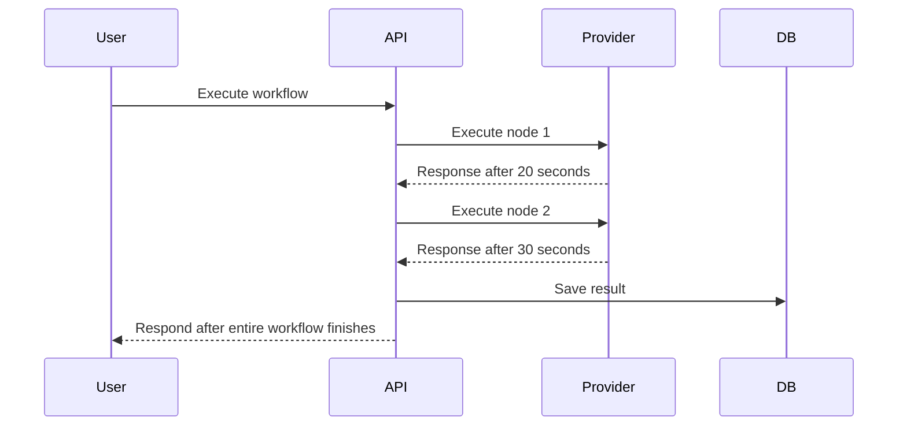

### Problems With Synchronous Execution

- HTTP requests may time out.
- Serverless functions may exceed execution limits.
- The user must wait for slow providers.
- A provider outage holds requests open.
- Retry behavior becomes difficult.
- Failure recovery is harder.
- API instances become workflow workers.
- Traffic spikes can overwhelm request-handling capacity.

### Nodeflowz Asynchronous Flow

The API validates the request and sends an Inngest event:

```ts
await sendWorkflowExecution({
  workflowId: input.id,
});
```

The event sender:

```ts
export const sendWorkflowExecution = async (data: {
  workflowId: string;
  [key: string]: unknown;
}) => {
  return inngest.send({
    name: "workflows/execute.workflow",
    data,
    id: createId(),
  });
};
```

Inngest invokes the background function separately:

```ts
export const executeWorkflow = inngest.createFunction(
  {
    id: "execute-workflow",
    retries: process.env.NODE_ENV === "production" ? 3 : 0,
  },
  {
    event: "workflows/execute.workflow",
  },
  async ({ event, step, publish }) => {
    // Execute workflow nodes.
  },
);
```

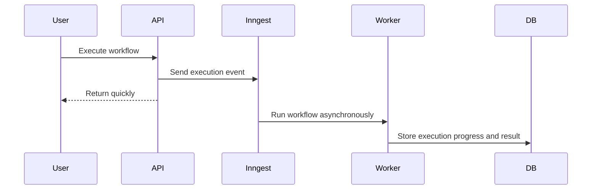

### Benefits

- API latency is independent of workflow duration.
- Jobs can be retried.
- Workers can scale independently.
- Failures can be persisted and replayed.
- Queue depth absorbs traffic bursts.
- Long-running provider calls do not occupy user requests.

### Interview Answer

> Asynchronous execution is necessary because workflow nodes can take seconds
> or minutes and can fail transiently. Running them synchronously would cause
> request timeouts, poor user experience, and tightly couple API capacity to
> workflow capacity. Nodeflowz queues an Inngest event and returns quickly,
> while a background worker handles execution, retries, status updates, and
> final persistence.

## 37. What is exponential backoff? Show retry delay pseudocode.

Exponential backoff increases the delay after every failed retry.

Without backoff:

```text
Retry after 1 second
Retry after 1 second
Retry after 1 second
```

With exponential backoff:

```text
Retry after 1 second
Retry after 2 seconds
Retry after 4 seconds
Retry after 8 seconds
```

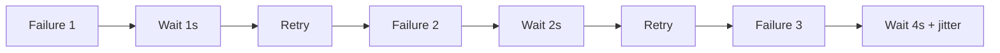

### Why Add Jitter?

If many jobs fail at the same time and use identical retry delays, they retry
together and may overload the provider again. This is called a thundering herd.

Jitter adds controlled randomness:

```ts
function calculateRetryDelay(input: {
  attempt: number;
  baseDelayMs?: number;
  maximumDelayMs?: number;
}) {
  const baseDelayMs = input.baseDelayMs ?? 1000;
  const maximumDelayMs = input.maximumDelayMs ?? 60_000;

  const exponentialDelay =
    baseDelayMs * 2 ** input.attempt;

  const cappedDelay = Math.min(
    exponentialDelay,
    maximumDelayMs,
  );

  const jitter = Math.random() * cappedDelay * 0.2;

  return cappedDelay + jitter;
}
```

Retry loop pseudocode:

```ts
async function runWithRetries<T>(
  operation: () => Promise<T>,
  maximumAttempts: number,
) {
  for (let attempt = 0; attempt < maximumAttempts; attempt++) {
    try {
      return await operation();
    } catch (error) {
      if (!isRetriable(error) || attempt === maximumAttempts - 1) {
        throw error;
      }

      const delayMs = calculateRetryDelay({
        attempt,
      });

      await sleep(delayMs);
    }
  }

  throw new Error("Unreachable");
}
```

### Retriable vs Non-Retriable Errors

| Error | Retry? |
|---|---:|
| Provider timeout | Yes |
| Provider `500` or `503` | Yes |
| Rate limit `429` | Yes, respect retry headers |
| Network interruption | Yes |
| Missing credential | No |
| Invalid node configuration | No |
| Invalid API key | Usually no |

Nodeflowz marks configuration errors as non-retriable:

```ts
if (!data.credentialId) {
  throw new NonRetriableError(
    "OpenAI node: Credential is required",
  );
}
```

The workflow function configures retries:

```ts
retries: process.env.NODE_ENV === "production" ? 3 : 0
```

### Interview Answer

> Exponential backoff increases the wait time after each failed attempt, usually
> doubling it until a maximum delay. I also add jitter so thousands of failed
> jobs do not retry at the same moment. Transient errors such as timeouts, rate
> limits, and provider outages are retried, while invalid credentials or node
> configuration use non-retriable errors.

## 38. Explain at-most-once, at-least-once, and exactly-once delivery.

Delivery semantics describe how many times a queued message may be delivered or
processed.

### At-Most-Once

A message is delivered zero or one time.

```text
No duplicate processing, but a message may be lost.
```

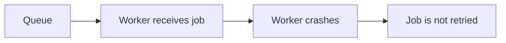

Appropriate for non-critical telemetry where occasional loss is acceptable.

### At-Least-Once

A message is delivered one or more times.

```text
The job should not be lost, but duplicate processing is possible.
```

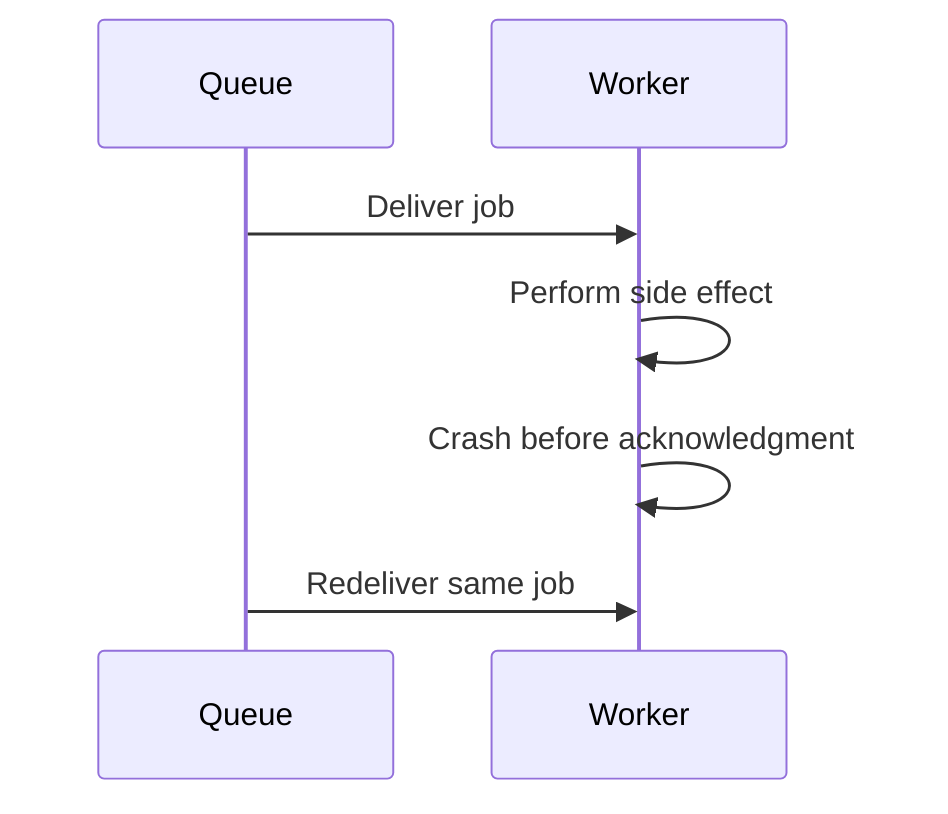

Most durable job queues and webhook systems use at-least-once delivery.

### Exactly-Once

A message is processed exactly one time.

True exactly-once behavior across distributed systems is extremely difficult
because the system cannot always atomically combine:

- Queue acknowledgment.
- Database state update.
- External side effect.

In practice, systems achieve **effectively-once processing** by combining
at-least-once delivery with idempotent operations.

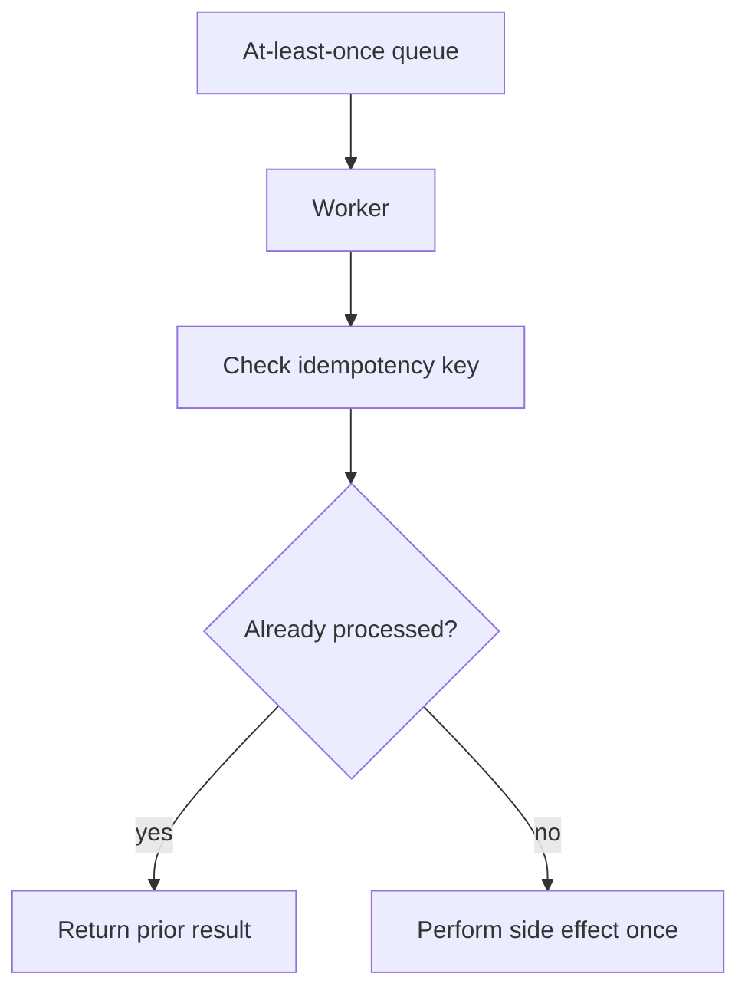

### Nodeflowz Semantics

Nodeflowz uses Inngest retries, so workflow execution should be designed for
at-least-once semantics.

The `Execution` model uses a unique Inngest event ID:

```prisma
model Execution {
  id             String @id @default(cuid())
  workflowId     String
  inngestEventId String @unique
}
```

This helps prevent duplicate execution records for the same event. However,
each external side effect must also be idempotent.

For example:

```ts
const idempotencyKey = `${executionId}:${nodeId}`;

await provider.performOperation({
  idempotencyKey,
  payload,
});
```

### Interview Answer

> At-most-once avoids duplicates but can lose work. At-least-once avoids loss
> but may deliver jobs repeatedly. Exactly-once is difficult across distributed
> systems, so production systems usually combine at-least-once delivery with
> idempotent processing to achieve effectively-once behavior. Nodeflowz should
> assume at-least-once execution because jobs can be retried.

## 39. How did you handle job failures: dead-letter queues, alerts, and replay?

The current workflow function records final failures through Inngest's
`onFailure` handler:

```ts
onFailure: async ({ event }) => {
  return prisma.execution.update({
    where: {
      inngestEventId: event.data.event.id,
    },
    data: {
      status: ExecutionStatus.FAILED,
      error: event.data.error.message,
      errorStack: event.data.error.stack,
    },
  });
},
```

The execution model stores the failure:

```prisma
model Execution {
  status      ExecutionStatus @default(RUNNING)
  error       String? @db.Text
  errorStack  String? @db.Text
  startedAt   DateTime @default(now())
  completedAt DateTime?
  output      Json?
}
```

Current failure flow:

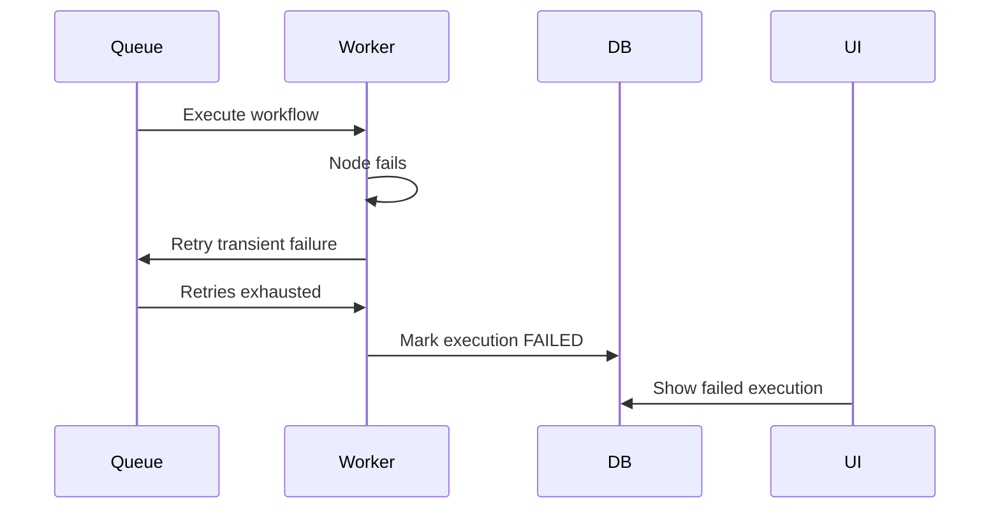

### Production Dead-Letter Design

A dead-letter queue stores jobs that still fail after all retry attempts.

```prisma
model DeadLetterJob {
  id             String   @id @default(cuid())
  workflowId     String
  executionId    String?
  originalEventId String
  eventName      String
  payload        Json
  error          String   @db.Text
  errorStack     String?  @db.Text
  attempts       Int
  createdAt      DateTime @default(now())
  replayedAt     DateTime?
  replayedBy     String?

  @@index([workflowId, createdAt])
}
```

Failure handler:

```ts
async function moveToDeadLetter(input: {
  workflowId: string;
  executionId?: string;
  eventId: string;
  payload: unknown;
  error: Error;
  attempts: number;
}) {
  await prisma.deadLetterJob.create({
    data: {
      workflowId: input.workflowId,
      executionId: input.executionId,
      originalEventId: input.eventId,
      eventName: "workflows/execute.workflow",
      payload: input.payload as object,
      error: input.error.message,
      errorStack: input.error.stack,
      attempts: input.attempts,
    },
  });
}
```

### Manual Replay

```ts
async function replayDeadLetterJob(input: {
  deadLetterJobId: string;
  userId: string;
}) {
  const job = await prisma.deadLetterJob.findUniqueOrThrow({
    where: {
      id: input.deadLetterJobId,
    },
  });

  await sendWorkflowExecution({
    ...(job.payload as Record<string, unknown>),
    replayOf: job.id,
  });

  await prisma.deadLetterJob.update({
    where: {
      id: job.id,
    },
    data: {
      replayedAt: new Date(),
      replayedBy: input.userId,
    },
  });
}
```

### Alerting

Not every single workflow failure should page an engineer. Alerts should focus
on platform-level patterns:

- Provider failure rate crosses a threshold.
- Queue depth continuously increases.
- Dead-letter volume spikes.
- A critical tenant repeatedly fails.
- PostgreSQL or worker error rate rises.

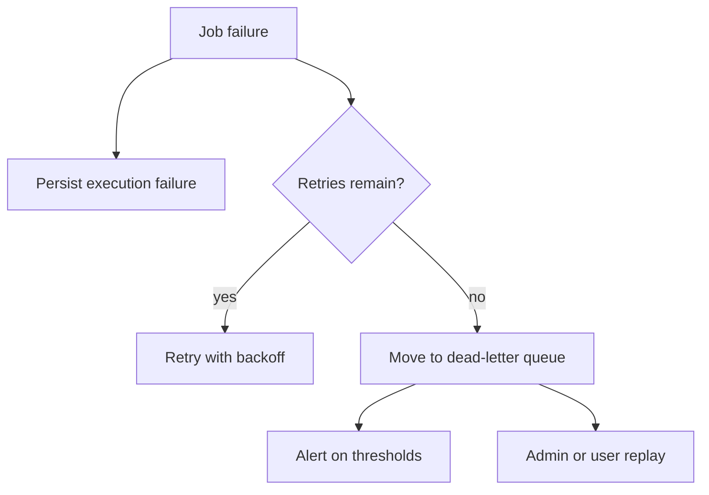

### Interview Answer

> Currently, Inngest retries transient failures and `onFailure` marks the
> execution as failed with its error and stack. For production, I would move
> exhausted jobs into a dead-letter table or queue, expose an authorized replay
> action, and alert on aggregate failure patterns such as provider outages or
> increasing dead-letter volume.

## 40. How did you design realtime execution status without polling the database?

Nodeflowz separates durable execution history from realtime canvas updates.

The `Execution` table stores durable run state:

```prisma
model Execution {
  id             String @id @default(cuid())
  workflowId     String
  status         ExecutionStatus @default(RUNNING)
  error          String?
  errorStack     String?
  startedAt      DateTime @default(now())
  completedAt    DateTime?
  inngestEventId String @unique
  output         Json?
}
```

Executors receive a realtime `publish` function:

```ts
export interface NodeExecutorParams<TData = Record<string, unknown>> {
  data: TData;
  nodeId: string;
  userId: string;
  context: WorkflowContext;
  step: StepTools;
  publish: Realtime.PublishFn;
}
```

An executor publishes status changes:

```ts
await publish(
  openAiChannel().status({
    nodeId,
    status: "loading",
  }),
);
```

After success:

```ts
await publish(
  openAiChannel().status({
    nodeId,
    status: "success",
  }),
);
```

The frontend subscribes with Inngest Realtime:

```ts
const { data } = useInngestSubscription({
  refreshToken,
  enabled: true,
});
```

It finds the latest message for the current node:

```ts
const latestMessage = data
  ?.filter(
    (message) =>
      message.kind === "data" &&
      message.channel === channel &&
      message.topic === topic &&
      message.data.nodeId === nodeId,
  )
  .sort(
    (left, right) =>
      new Date(right.createdAt).getTime() -
      new Date(left.createdAt).getTime(),
  )[0];
```

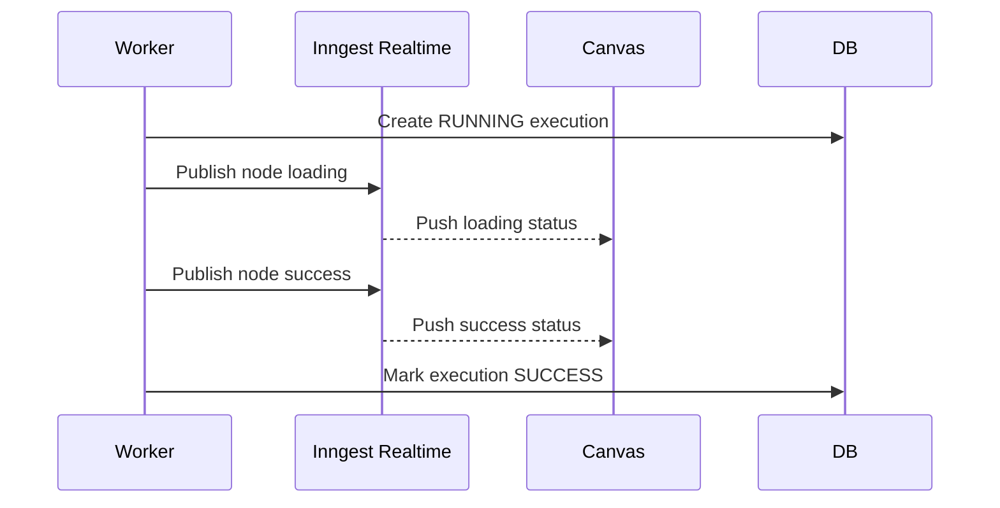

This avoids polling PostgreSQL every second.

### Durable Node-Level Logs

For production-grade history, I would add an execution log model:

```prisma
enum ExecutionLogLevel {
  DEBUG
  INFO
  WARN
  ERROR
}

model ExecutionLog {
  id          String   @id @default(cuid())
  executionId String
  nodeId      String?
  level       ExecutionLogLevel
  message     String   @db.Text
  metadata    Json?
  createdAt   DateTime @default(now())

  @@index([executionId, createdAt])
}
```

Every important status update would be:

1. Persisted as durable history.
2. Published to the realtime channel.

```ts
async function recordNodeEvent(input: {
  executionId: string;
  nodeId: string;
  status: "loading" | "success" | "error";
  message: string;
}) {
  await prisma.executionLog.create({
    data: {
      executionId: input.executionId,
      nodeId: input.nodeId,
      level: input.status === "error" ? "ERROR" : "INFO",
      message: input.message,
      metadata: {
        status: input.status,
      },
    },
  });

  await publishNodeStatus(input.nodeId, input.status);
}
```

### Interview Answer

> I use Inngest Realtime to push node status events directly to the canvas, so
> the UI does not poll PostgreSQL every second. The `Execution` table stores
> durable run status and final output. For richer production history, I would
> add an `ExecutionLog` table and both persist and publish every important node
> event.

## 41. How would you scale workers horizontally while preventing duplicate execution?

Horizontal worker scaling means multiple workers consume jobs concurrently:

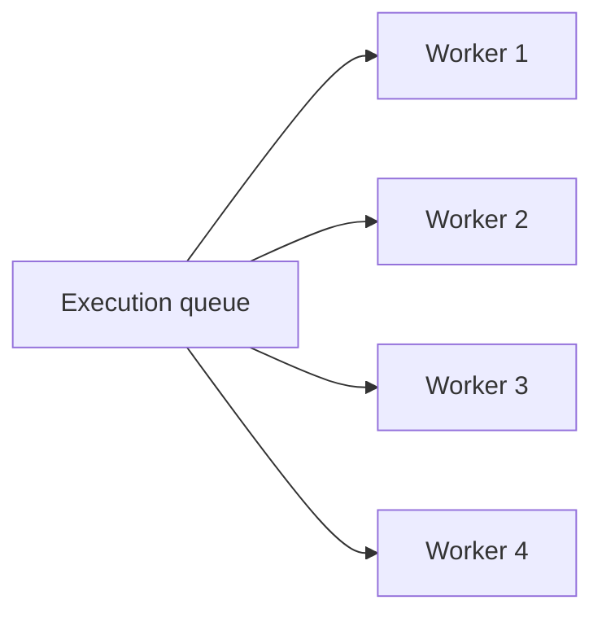

With at-least-once delivery, a job may be delivered again if a worker crashes
before acknowledging completion.

Preventing duplicate side effects requires several layers:

1. Globally unique job or event IDs.
2. Unique database constraints.
3. Atomic execution claims.
4. Per-node execution records.
5. Provider idempotency keys.

### Atomic Execution Claim

Add queue-aware statuses:

```prisma
enum ExecutionStatus {
  QUEUED
  RUNNING
  SUCCESS
  FAILED
  CANCELLED
}
```

Claim one execution:

```ts
async function claimExecution(
  executionId: string,
  workerId: string,
) {
  const result = await prisma.execution.updateMany({
    where: {
      id: executionId,
      status: "QUEUED",
    },
    data: {
      status: "RUNNING",
      workerId,
      startedAt: new Date(),
    },
  });

  return result.count === 1;
}
```

Only one worker can change the state from `QUEUED` to `RUNNING`.

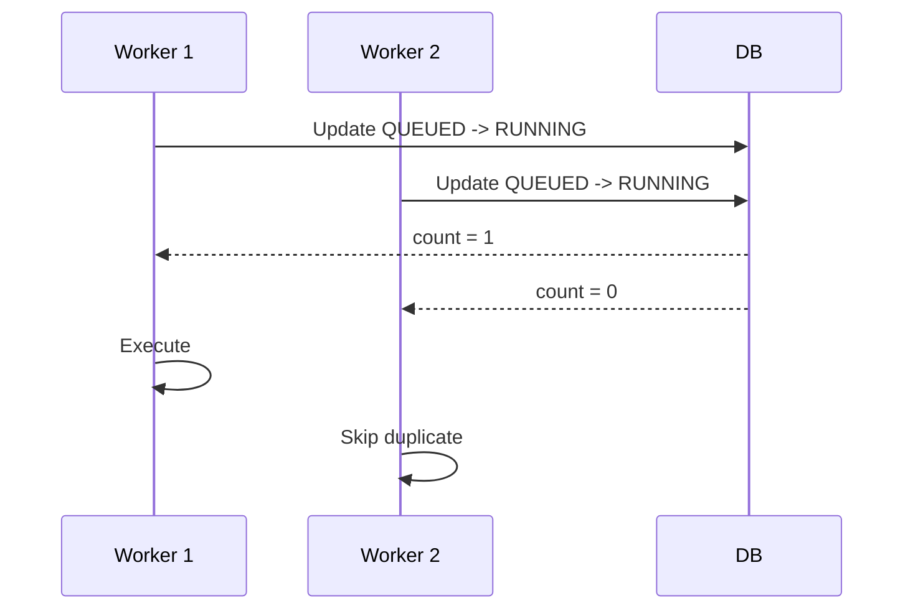

### Per-Node Idempotency

An execution may be retried after several nodes have already succeeded.

```prisma
model NodeExecution {
  id          String @id @default(cuid())
  executionId String
  nodeId      String
  status      ExecutionStatus
  output      Json?

  @@unique([executionId, nodeId])
}
```

Before executing a node:

```ts
const existing = await prisma.nodeExecution.findUnique({
  where: {
    executionId_nodeId: {
      executionId,
      nodeId,
    },
  },
});

if (existing?.status === "SUCCESS") {
  return existing.output;
}
```

### Provider Idempotency Keys

For providers that support them:

```ts
const idempotencyKey = `${executionId}:${nodeId}`;

await provider.performOperation(payload, {
  idempotencyKey,
});
```

### Interview Answer

> I would scale workers horizontally and assume duplicate delivery is possible.
> A worker must atomically claim an execution by changing its state from
> `QUEUED` to `RUNNING`. I would also use unique event IDs, per-node execution
> records, and provider idempotency keys. This produces effectively-once side
> effects even when the queue uses at-least-once delivery.

## 42. Design a priority queue where paid users execute before free-tier users.

The scheduler must prioritize paid users while ensuring free-tier jobs do not
starve indefinitely.

Plan priorities:

```text
Enterprise: highest priority
Pro: medium priority
Free: lowest priority
```

### Job Schema

```prisma
enum JobStatus {
  QUEUED
  RUNNING
  SUCCESS
  FAILED
  DEAD
}

enum SubscriptionPlan {
  FREE
  PRO
  ENTERPRISE
}

model WorkflowJob {
  id          String   @id @default(cuid())
  workflowId  String
  userId      String
  plan        SubscriptionPlan
  priority    Int
  status      JobStatus @default(QUEUED)
  payload     Json
  attempts    Int @default(0)
  availableAt DateTime @default(now())
  lockedAt    DateTime?
  lockedBy    String?
  createdAt   DateTime @default(now())

  @@index([status, priority, availableAt, createdAt])
}
```

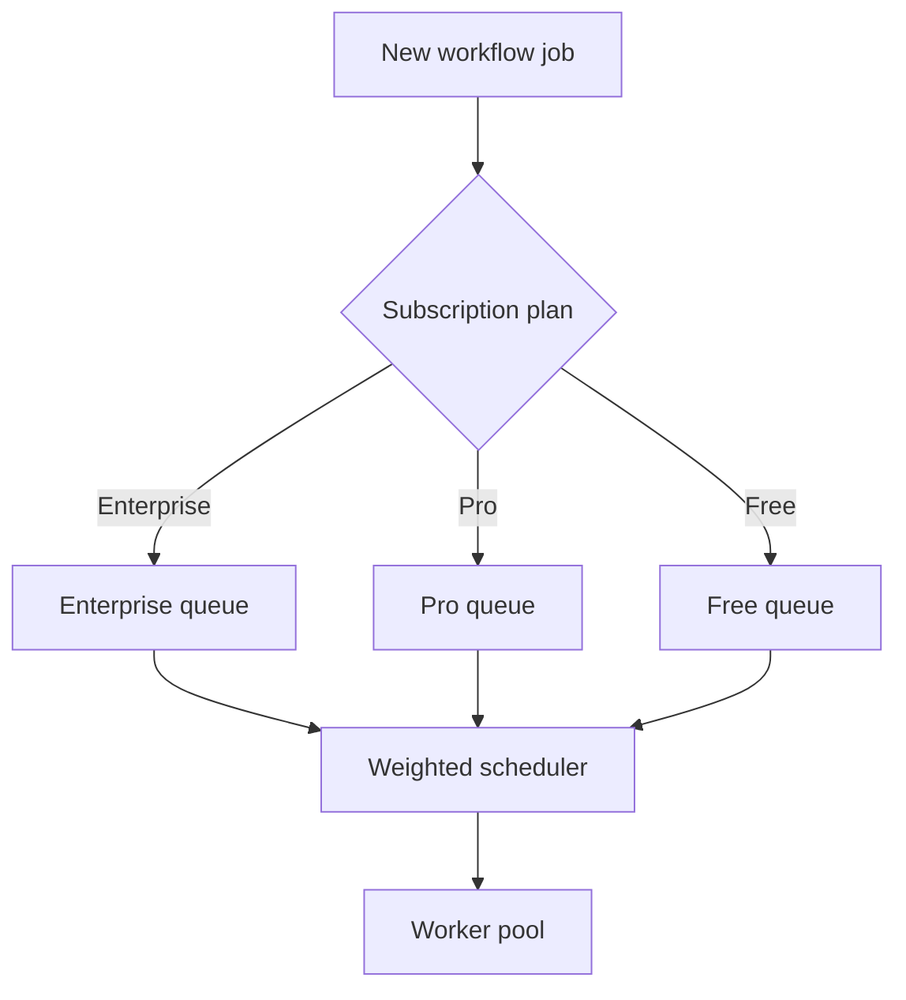

### Atomic Claim

```ts
async function claimNextJob(workerId: string) {
  return prisma.$transaction(async (tx) => {
    const job = await tx.workflowJob.findFirst({
      where: {
        status: "QUEUED",
        availableAt: {
          lte: new Date(),
        },
      },
      orderBy: [
        {
          priority: "asc",
        },
        {
          createdAt: "asc",
        },
      ],
    });

    if (!job) return null;

    const claimed = await tx.workflowJob.updateMany({
      where: {
        id: job.id,
        status: "QUEUED",
      },
      data: {
        status: "RUNNING",
        lockedAt: new Date(),
        lockedBy: workerId,
      },
    });

    return claimed.count === 1 ? job : null;
  });
}
```

### Preventing Starvation

Strict priority could allow paid traffic to block free-tier jobs forever.

Use weighted fair scheduling:

```text
Out of every 9 scheduling slots:
5 Enterprise
3 Pro
1 Free
```

```ts
const weightedSchedule = [
  "ENTERPRISE",
  "ENTERPRISE",
  "ENTERPRISE",
  "ENTERPRISE",
  "ENTERPRISE",
  "PRO",
  "PRO",
  "PRO",
  "FREE",
] as const;

let currentSlot = 0;

function selectNextPlan() {
  const plan = weightedSchedule[currentSlot];
  currentSlot = (currentSlot + 1) % weightedSchedule.length;
  return plan;
}
```

Another option is priority aging. The priority of a waiting job gradually
increases:

```ts
function effectivePriority(job: {
  priority: number;
  createdAt: Date;
}) {
  const waitingMinutes =
    (Date.now() - job.createdAt.getTime()) / 60_000;

  const agingBonus = Math.floor(waitingMinutes / 5);

  return Math.max(0, job.priority - agingBonus);
}
```

### Concurrency Controls

Priority determines job order, but concurrency limits protect resources:

```ts
const planConcurrency = {
  ENTERPRISE: 50,
  PRO: 20,
  FREE: 5,
};

const providerConcurrency = {
  OPENAI: 10,
  GOOGLE_SHEETS: 5,
  SLACK: 20,
};
```

Each job must acquire both a plan slot and a provider slot:

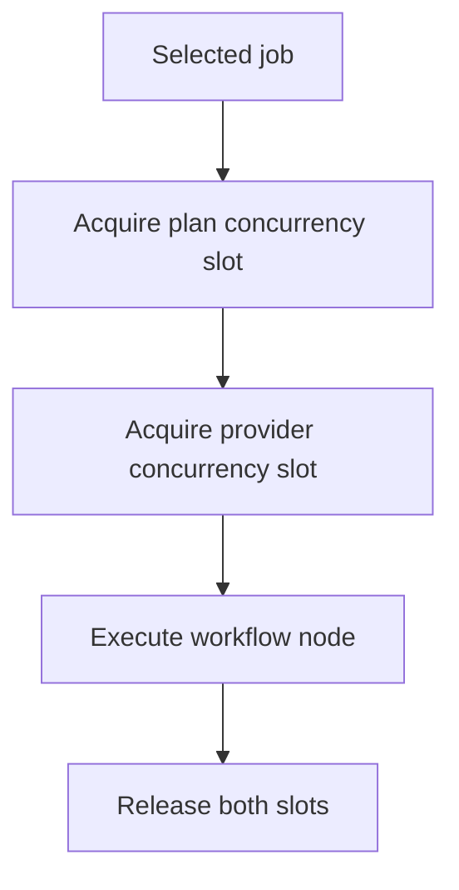

Worker loop:

```ts
async function workerLoop(workerId: string) {
  while (true) {
    const preferredPlan = selectNextPlan();

    const job =
      (await claimNextJobForPlan(workerId, preferredPlan)) ??
      (await claimAnyAvailableJob(workerId));

    if (!job) {
      await sleep(1000);
      continue;
    }

    try {
      await executeWithConcurrencyLimits(job);
      await markJobSuccessful(job.id);
    } catch (error) {
      await retryOrDeadLetter(job, error);
    }
  }
}
```

### Interview Answer

> I would store jobs with a plan and priority, then atomically claim the highest
> eligible jobs. To prevent free-tier starvation, I would use weighted fair
> scheduling or priority aging rather than strict priority alone. I would also
> enforce concurrency limits by subscription plan and external provider so
> higher priority does not overload PostgreSQL or third-party APIs.
