# Section 7: PostgreSQL & Prisma

This section explains the PostgreSQL and Prisma concepts used by Nodeflowz,
including query efficiency, indexing, transactions, tenant isolation,
migrations, MVCC, and denormalization.

## 43. What is the N+1 query problem? How does Prisma `include` resolve it?

The N+1 query problem happens when an application first loads a list of parent
records and then runs one additional query for every parent to load related
records.

For example, this implementation loads workflows and then queries their nodes
individually:

```ts
const workflows = await prisma.workflow.findMany({
  where: {
    userId,
  },
});

const workflowsWithNodes = [];

for (const workflow of workflows) {
  const nodes = await prisma.node.findMany({
    where: {
      workflowId: workflow.id,
    },
  });

  workflowsWithNodes.push({
    ...workflow,
    nodes,
  });
}
```

If a user has 50 workflows:

```text
1 query loads workflows
50 queries load nodes
51 total database queries
```

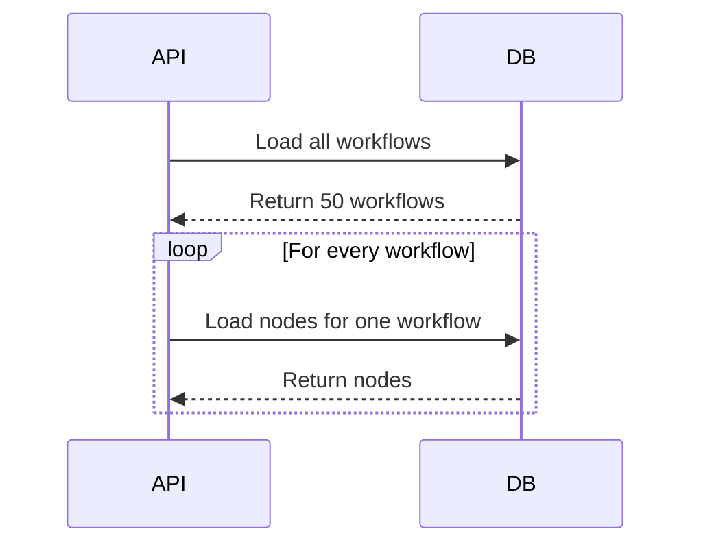

This causes:

- More database round trips.
- Higher latency.
- More database connection usage.
- Poor performance as the number of parents grows.

### Loading Relations With Prisma

Prisma can load relations through `include`:

```ts
const workflows = await prisma.workflow.findMany({
  where: {
    userId,
  },
  include: {
    nodes: true,
    connections: true,
  },
});
```

Nodeflowz uses this pattern when loading a workflow for the editor:

```ts
const workflow = await prisma.workflow.findUniqueOrThrow({
  where: {
    id: input.id,
    userId: ctx.auth.user.id,
  },
  include: {
    nodes: true,
    connections: true,
  },
});
```

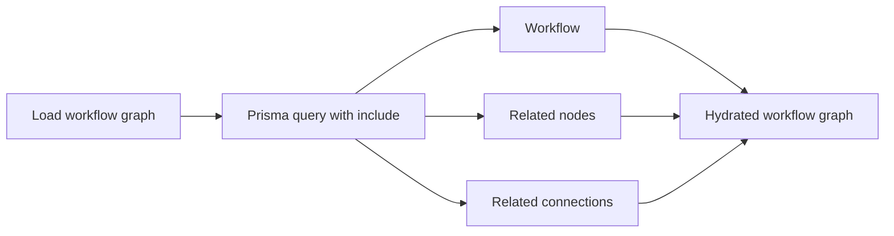

Depending on Prisma's relation loading strategy and database connector, Prisma
may use joins or optimized related queries. The important improvement is that
the application no longer performs one explicit query per workflow.

### Avoid Over-Fetching

For list pages, loading every node may be unnecessary. Use relation counts or
selected fields:

```ts
const workflows = await prisma.workflow.findMany({
  where: {
    userId,
  },
  select: {
    id: true,
    name: true,
    updatedAt: true,
    _count: {
      select: {
        nodes: true,
        executions: true,
      },
    },
  },
});
```

### Interview Answer

> N+1 occurs when one parent query causes one child query for every returned
> parent. In Nodeflowz, it could happen if I loaded workflows and then queried
> nodes separately for each workflow. Prisma's `include` or nested `select`
> loads the required relations through an optimized query plan and avoids
> application-level N+1 round trips.

## 44. Explain `findUnique`, `findFirst`, and `findMany`.

Prisma provides different query methods depending on whether the result is
uniquely identifiable and whether one or many rows are needed.

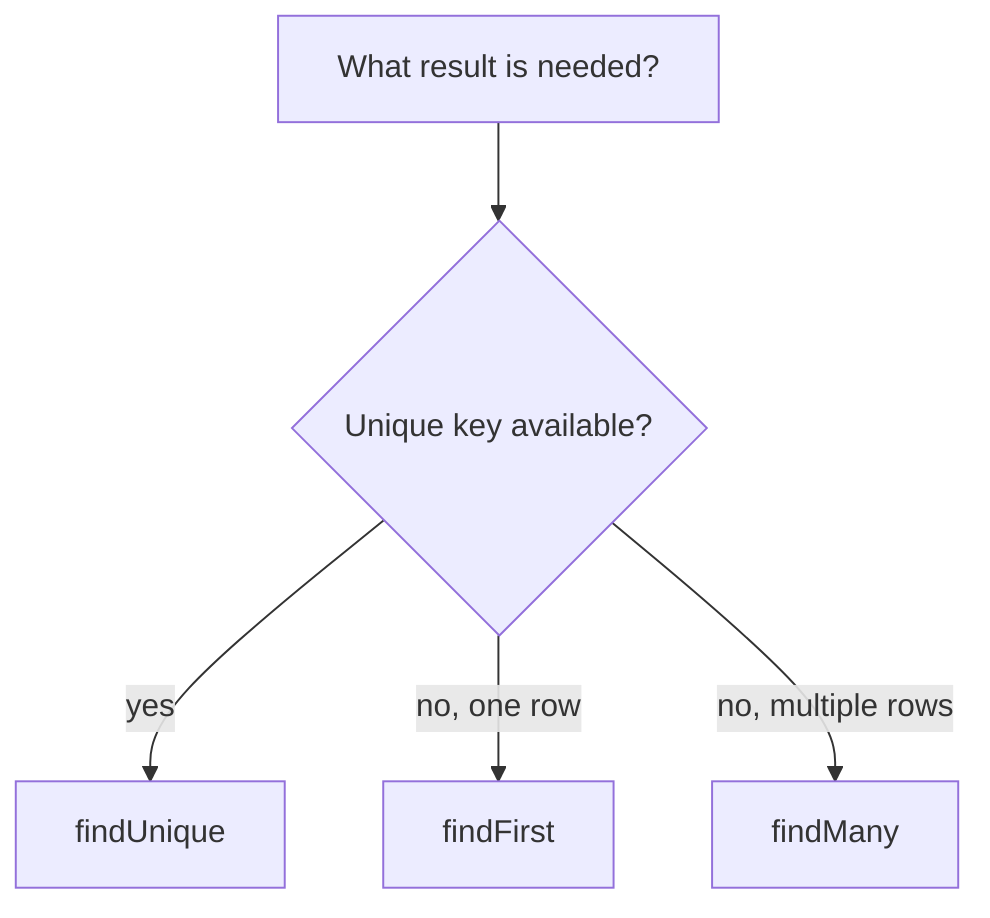

### `findUnique`

Use `findUnique` when querying by a unique field or unique constraint:

```ts
const workflow = await prisma.workflow.findUnique({
  where: {
    id: workflowId,
  },
});
```

The schema declares `id` as unique:

```prisma
model Workflow {
  id String @id @default(cuid())
}
```

Nodeflowz commonly uses `findUniqueOrThrow`:

```ts
const workflow = await prisma.workflow.findUniqueOrThrow({
  where: {
    id: input.id,
    userId: ctx.auth.user.id,
  },
});
```

This both identifies the workflow by its unique `id` and checks ownership.

Use `findUniqueOrThrow` when absence is exceptional and should immediately
produce an error.

### `findFirst`

Use `findFirst` when multiple rows may match but only one is required:

```ts
const latestFailedExecution = await prisma.execution.findFirst({
  where: {
    workflowId,
    status: "FAILED",
  },
  orderBy: {
    startedAt: "desc",
  },
});
```

This query is not unique because a workflow may have many failed executions.
Ordering determines which matching record is returned.

### `findMany`

Use `findMany` for lists, filtering, pagination, and sorting:

```ts
const workflows = await prisma.workflow.findMany({
  skip: (page - 1) * pageSize,
  take: pageSize,
  where: {
    userId: ctx.auth.user.id,
    name: {
      contains: search,
      mode: "insensitive",
    },
  },
  orderBy: {
    updatedAt: "desc",
  },
});
```

### Summary

| Method | Use Case | Result |
|---|---|---|
| `findUnique` | Query by unique field or constraint | One row or `null` |
| `findUniqueOrThrow` | Unique record must exist | One row or exception |
| `findFirst` | First row matching non-unique filters | One row or `null` |
| `findMany` | Lists, pagination, multiple matches | Array |

### Interview Answer

> I use `findUnique` when a unique identifier such as `id`, email, or token is
> available. I use `findFirst` when several rows may match but I only need one,
> often with an order. I use `findMany` for lists, filtering, pagination, and
> sorting. In Nodeflowz, workflow ownership checks commonly use
> `findUniqueOrThrow`, while dashboard lists use `findMany`.

## 45. What is a database index? Which Nodeflowz columns should be indexed?

A database index is an additional data structure that lets PostgreSQL locate
matching rows without scanning the entire table.

Without an index:

```text
Read every workflow row and check userId.
```

With an index:

```text
Navigate directly to rows for that userId.
```

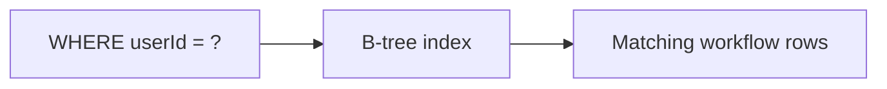

Indexes improve reads but have costs:

- Consume disk space.
- Slow inserts and updates because indexes must also be updated.
- Require maintenance.

Indexes should be chosen from real query patterns, especially columns used in:

- `WHERE`
- `JOIN`
- `ORDER BY`
- Unique constraints

### Existing Schema Indexes

The schema already indexes authentication fields:

```prisma
model Session {
  @@index([userId])
}

model Account {
  @@index([userId])
}

model Verification {
  @@index([identifier])
}
```

### Workflow Listing

Nodeflowz lists workflows by user and sorts them by update time:

```ts
prisma.workflow.findMany({
  where: {
    userId,
  },
  orderBy: {
    updatedAt: "desc",
  },
});
```

Recommended:

```prisma
model Workflow {
  @@index([userId, updatedAt])
}
```

The order matters. This composite index supports locating one user's workflows
and returning them in update order.

### Nodes and Connections

The editor loads nodes and connections by workflow:

```prisma
model Node {
  @@index([workflowId])
}

model Connection {
  @@index([workflowId])
  @@index([fromNodeId])
  @@index([toNodeId])
}
```

### Executions

Execution history is commonly filtered by workflow and ordered by start time:

```prisma
model Execution {
  @@index([workflowId, startedAt])
  @@index([workflowId, status])
}
```

### Credentials

Nodeflowz fetches credentials by user and credential type:

```ts
prisma.credential.findMany({
  where: {
    userId,
    type,
  },
});
```

Recommended:

```prisma
model Credential {
  @@index([userId, type])
}
```

### Search Index Consideration

The workflow list uses case-insensitive substring search:

```ts
name: {
  contains: search,
  mode: "insensitive",
}
```

A normal B-tree index may not efficiently support arbitrary substring search.
For a large dataset, PostgreSQL trigram indexing can help:

```sql
CREATE EXTENSION IF NOT EXISTS pg_trgm;

CREATE INDEX workflow_name_trgm_idx
ON "Workflow"
USING gin (lower(name) gin_trgm_ops);
```

### Interview Answer

> An index helps PostgreSQL find and order rows without scanning the whole
> table. I would index Nodeflowz based on its access patterns:
> `Workflow(userId, updatedAt)`, `Node(workflowId)`,
> `Connection(workflowId)`, `Execution(workflowId, startedAt)`, and
> `Credential(userId, type)`. For case-insensitive substring workflow search, I
> would consider a PostgreSQL trigram index.

## 46. How would you handle production migrations without downtime?

Nodeflowz stores Prisma migrations under:

```text
prisma/migrations/
```

Local development typically uses:

```bash
npx prisma migrate dev
```

Production deployment should use:

```bash
npx prisma migrate deploy
```

`migrate deploy` applies already-created migrations without generating new
development migrations.

### Expand-and-Contract Strategy

Zero-downtime migrations should remain compatible with both the old and new
application versions during a rolling deployment.

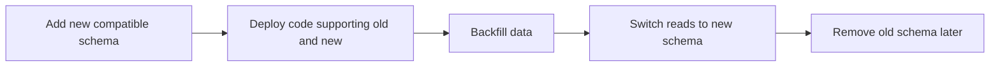

Suppose `Workflow.name` must become `displayName`.

Unsafe migration:

```text
Drop name and immediately add required displayName.
```

Old running application instances still expect `name` and will fail.

### Safe Migration

Step 1: Add the new nullable field:

```prisma
model Workflow {
  name        String
  displayName String?
}
```

Step 2: Deploy code that writes both fields:

```ts
await prisma.workflow.update({
  where: {
    id: workflowId,
  },
  data: {
    name: input.name,
    displayName: input.name,
  },
});
```

Step 3: Backfill existing rows in batches:

```sql
UPDATE "Workflow"
SET "displayName" = "name"
WHERE "displayName" IS NULL;
```

For a large table, batch the operation to avoid long locks and transaction
growth.

Step 4: Deploy code reading the new field:

```ts
const visibleName = workflow.displayName ?? workflow.name;
```

Step 5: Make `displayName` required and remove `name` in a later release.

### Index Migration

Creating a large index may block writes. PostgreSQL supports concurrent index
creation:

```sql
CREATE INDEX CONCURRENTLY execution_workflow_started_idx
ON "Execution" ("workflowId", "startedAt");
```

Because `CREATE INDEX CONCURRENTLY` cannot run inside a normal transaction,
this may require a carefully designed custom migration.

### Production Migration Rules

- Prefer additive schema changes first.
- Add new columns as nullable initially.
- Backfill large tables in batches.
- Avoid long-running locks.
- Keep old and new application versions compatible.
- Run migrations once as a deployment release step.
- Monitor migration duration and database locks.
- Remove old schema only in a later deployment.

### Interview Answer

> I would use `prisma migrate deploy` in production and follow an
> expand-and-contract process. First add backwards-compatible schema, deploy
> code that supports both old and new fields, backfill data, switch reads, and
> remove old fields in a later release. For large tables, I would batch
> backfills and use concurrent index creation where appropriate.

## 47. What is a transaction in Prisma? Where is it necessary in Nodeflowz?

A transaction groups multiple database operations into one atomic unit.

Either:

- Every operation succeeds and commits.
- Any operation fails and all operations roll back.

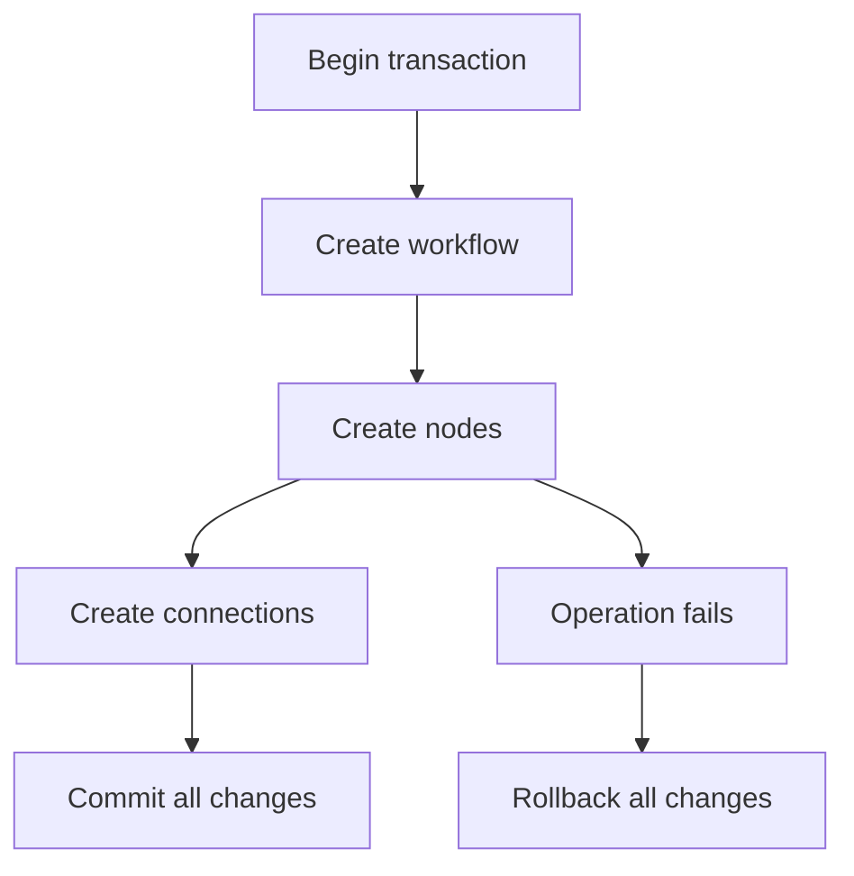

Nodeflowz correctly uses a transaction when creating a workflow from a
template:

```ts
return prisma.$transaction(async (tx) => {
  const workflow = await tx.workflow.create({
    data: {
      name: template.name,
      userId: ctx.auth.user.id,
    },
  });

  await tx.node.createMany({
    data: template.nodes.map((node) => ({
      ...node,
      workflowId: workflow.id,
    })),
  });

  await tx.connection.createMany({
    data: template.edges.map((edge) => ({
      ...edge,
      workflowId: workflow.id,
    })),
  });

  return workflow;
});
```

Without a transaction:

```text
Workflow created successfully
Nodes created successfully
Connection creation fails
Broken partial workflow remains in the database
```

The workflow update also uses a transaction:

```ts
return prisma.$transaction(async (tx) => {
  await tx.node.deleteMany({
    where: {
      workflowId: id,
    },
  });

  await tx.node.createMany({
    data: nodes.map((node) => ({
      id: node.id,
      workflowId: id,
      name: node.type || "unknown",
      type: node.type as NodeType,
      position: node.position,
      data: node.data || {},
    })),
  });

  await tx.connection.createMany({
    data: edges.map((edge) => ({
      workflowId: id,
      fromNodeId: edge.source,
      toNodeId: edge.target,
      fromOutput: edge.sourceHandle || "main",
      toInput: edge.targetHandle || "main",
    })),
  });
});
```

If connection insertion fails after node deletion, the transaction rolls back
and preserves the original graph.

### Transaction Scope

Transactions should be kept short. Avoid performing slow external API calls
inside a database transaction:

```ts
// Avoid this pattern.
await prisma.$transaction(async (tx) => {
  await tx.execution.create(...);
  await callSlowExternalProvider();
  await tx.execution.update(...);
});
```

Long transactions hold resources, increase contention, and interfere with
PostgreSQL cleanup.

### Interview Answer

> A transaction makes several database writes atomic. It is necessary when the
> writes represent one logical operation. Nodeflowz uses transactions when
> creating template workflows and saving workflow graphs, because a failure
> halfway through node or edge creation must not leave a partial or corrupted
> workflow.

## 48. How did you enforce multi-tenant data isolation?

Nodeflowz is a multi-tenant application because multiple users share the same
database while owning separate workflows and credentials.

The schema models ownership:

```prisma
model User {
  workflows   Workflow[]
  credentials Credential[]
}

model Workflow {
  userId String
  user   User @relation(fields: [userId], references: [id], onDelete: Cascade)
}

model Credential {
  userId String
  user   User @relation(fields: [userId], references: [id], onDelete: Cascade)
}
```

### Application-Layer Isolation

Protected tRPC procedures resolve the authenticated session:

```ts
export const protectedProcedure = baseProcedure.use(
  async ({ ctx, next }) => {
    const session = await auth.api.getSession({
      headers: await headers(),
    });

    if (!session) {
      throw new TRPCError({
        code: "UNAUTHORIZED",
        message: "Unauthorized",
      });
    }

    return next({
      ctx: {
        ...ctx,
        auth: session,
      },
    });
  },
);
```

Every tenant-owned query includes the authenticated user ID:

```ts
const workflow = await prisma.workflow.findUniqueOrThrow({
  where: {
    id: input.id,
    userId: ctx.auth.user.id,
  },
});
```

Credential access is also scoped:

```ts
const credential = await prisma.credential.findUniqueOrThrow({
  where: {
    id: input.id,
    userId: ctx.auth.user.id,
  },
});
```

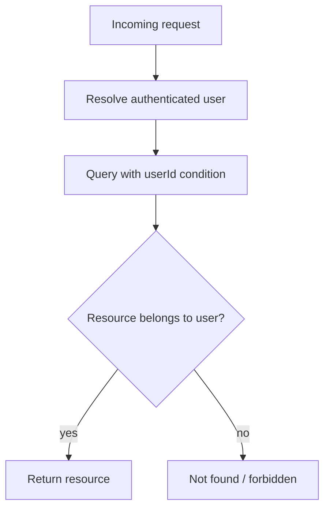

This approach also avoids revealing whether another tenant's resource exists.

### Database-Level Defense in Depth

The current implementation primarily enforces tenant isolation in application
queries. For stronger database-level protection, PostgreSQL Row-Level Security
can enforce tenant filtering even if application code forgets it.

```sql
ALTER TABLE "Workflow" ENABLE ROW LEVEL SECURITY;

CREATE POLICY workflow_tenant_policy
ON "Workflow"
USING (
  "userId" = current_setting('app.current_user_id', true)
);
```

Set the tenant context for the transaction:

```sql
SELECT set_config('app.current_user_id', 'user_123', true);
```

### Additional Protections

- Add indexes on ownership columns.
- Verify ownership before queueing background jobs.
- Include tenant ID in execution and logging records.
- Never accept a client-provided `userId` as authoritative.
- Use scoped service methods to reduce accidental unscoped queries.

### Interview Answer

> Nodeflowz models ownership through `userId` relations and scopes every
> protected workflow and credential query by the authenticated user's ID.
> Background execution is queued only after ownership verification. For defense
> in depth at larger scale, I would add PostgreSQL Row-Level Security so an
> accidentally unscoped query still cannot expose another tenant's data.

## 49. Explain PostgreSQL MVCC and its effect on workflow status queries.

MVCC stands for Multiversion Concurrency Control.

Instead of overwriting a row in place, PostgreSQL creates a new row version
when a transaction updates data. Readers see a consistent snapshot based on
their transaction visibility.

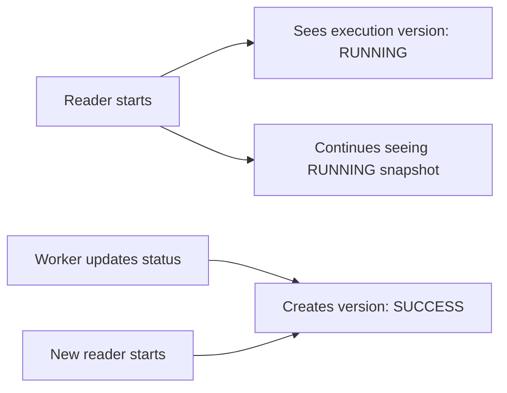

### Why MVCC Helps Nodeflowz

Users may read execution history while workers update execution state:

```ts
const executions = await prisma.execution.findMany({
  where: {
    workflowId,
  },
  orderBy: {
    startedAt: "desc",
  },
});
```

At the same time:

```ts
await prisma.execution.update({
  where: {
    inngestEventId,
  },
  data: {
    status: "SUCCESS",
    completedAt: new Date(),
    output: context,
  },
});
```

Normal readers generally do not block writers, and writers generally do not
block normal readers.

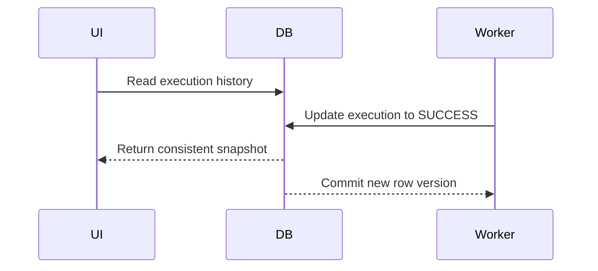

This is useful for read-heavy execution dashboards under high concurrency.

### MVCC Costs

Old row versions become dead tuples after they are no longer visible.
PostgreSQL's vacuum process must clean them up.

Frequently updated tables can experience:

- Dead tuple accumulation.
- Table and index bloat.
- Slower scans.
- Increased storage usage.

The `Execution` table may be update-heavy because status changes from
`RUNNING` to `SUCCESS` or `FAILED`.

### Operational Considerations

Monitor:

- Autovacuum activity.
- Dead tuple counts.
- Table and index bloat.
- Long-running transactions.
- Query plans and index usage.

Avoid long transactions because they can keep old row versions visible and
prevent cleanup.

### Isolation Levels

PostgreSQL's common isolation levels affect which versions a transaction sees:

- `READ COMMITTED`: each statement sees a fresh committed snapshot.
- `REPEATABLE READ`: the transaction sees one consistent snapshot.
- `SERIALIZABLE`: strongest isolation with possible serialization failures.

For normal status list queries, `READ COMMITTED` is usually sufficient.

### Interview Answer

> PostgreSQL MVCC stores multiple row versions so readers can see a consistent
> snapshot while workers update execution status. This allows read-heavy
> dashboards and execution updates to proceed with less blocking. The trade-off
> is dead tuples and possible table bloat, so autovacuum health and avoiding
> long-running transactions are important.

## 50. When would you denormalize the schema? Give a Nodeflowz example.

Normalization reduces duplication and keeps data consistent. Denormalization
intentionally stores duplicated or derived values to make important reads
faster.

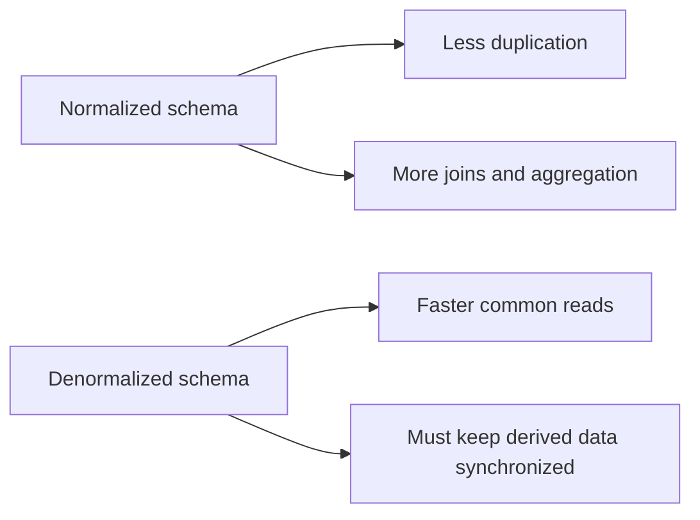

Denormalization is appropriate when:

- A read path is extremely frequent.
- The normalized query requires expensive joins or aggregations.
- Slightly more complex writes are acceptable.
- Consistency can be maintained transactionally or asynchronously.

### Nodeflowz Workflow Dashboard

A workflow dashboard may show:

```text
Workflow name
Updated time
Node count
Last execution status
Last execution time
```

In a fully normalized schema, each list request may need:

- Workflow rows.
- Node counts.
- Latest execution lookup.
- Possibly failure counts.

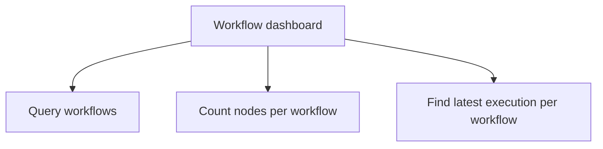

For a high-traffic dashboard, denormalize summary values onto `Workflow`:

```prisma
model Workflow {
  id                  String @id @default(cuid())
  name                String
  userId              String
  nodeCount           Int @default(0)
  lastExecutionId     String?
  lastExecutionStatus ExecutionStatus?
  lastExecutedAt      DateTime?

  @@index([userId, updatedAt])
  @@index([userId, lastExecutedAt])
}
```

When saving a workflow:

```ts
await tx.workflow.update({
  where: {
    id: workflowId,
  },
  data: {
    nodeCount: nodes.length,
    updatedAt: new Date(),
  },
});
```

When execution completes:

```ts
await prisma.$transaction(async (tx) => {
  await tx.execution.update({
    where: {
      id: executionId,
    },
    data: {
      status: "SUCCESS",
      completedAt: new Date(),
      output,
    },
  });

  await tx.workflow.update({
    where: {
      id: workflowId,
    },
    data: {
      lastExecutionId: executionId,
      lastExecutionStatus: "SUCCESS",
      lastExecutedAt: new Date(),
    },
  });
});
```

The dashboard now performs one simple query:

```ts
const workflows = await prisma.workflow.findMany({
  where: {
    userId,
  },
  select: {
    id: true,
    name: true,
    updatedAt: true,
    nodeCount: true,
    lastExecutionStatus: true,
    lastExecutedAt: true,
  },
  orderBy: {
    updatedAt: "desc",
  },
});
```

### Execution Progress Example

Another useful denormalization is execution progress:

```prisma
model Execution {
  totalNodes     Int @default(0)
  completedNodes Int @default(0)
  failedNodeId   String?
}
```

The UI can display progress without counting all node execution rows.

### Consistency Trade-Off

Denormalized values can become stale if writes fail. Protect them with:

- Database transactions.
- Reconciliation jobs.
- Event-driven updates.
- Periodic consistency checks.

### Interview Answer

> I would denormalize when a common read path becomes too expensive because of
> repeated joins or aggregations. In Nodeflowz, the workflow dashboard could
> store `nodeCount`, `lastExecutionStatus`, and `lastExecutedAt` directly on the
> workflow. Those values would be updated transactionally when a workflow is
> saved or an execution completes, making dashboard queries much faster.
