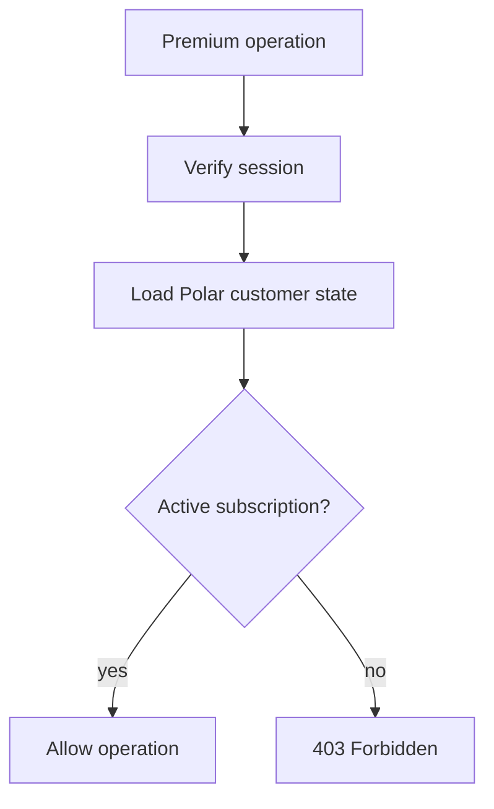
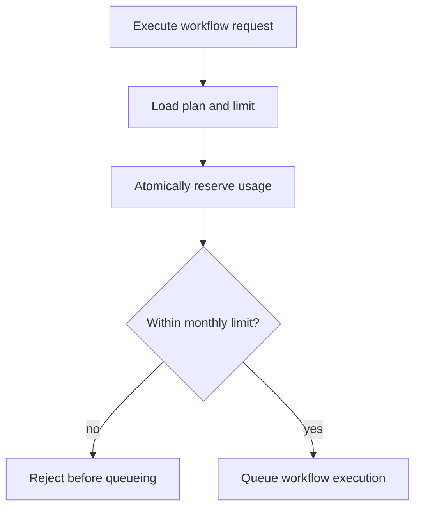
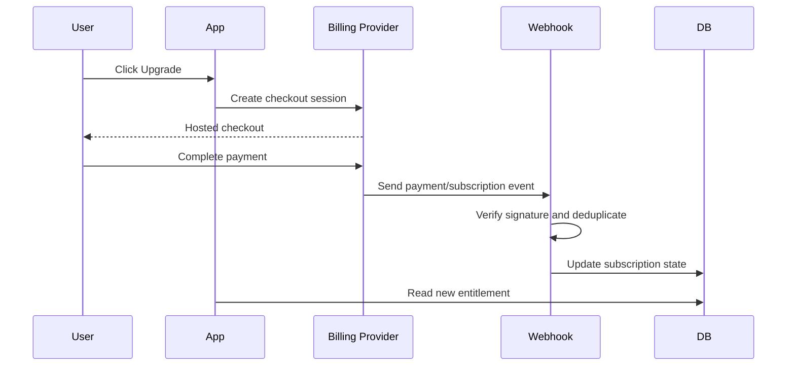
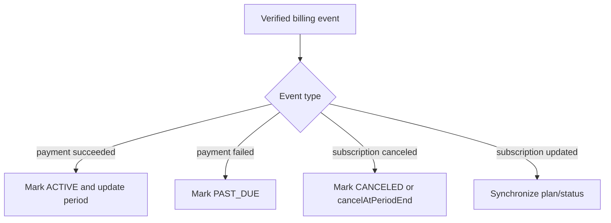
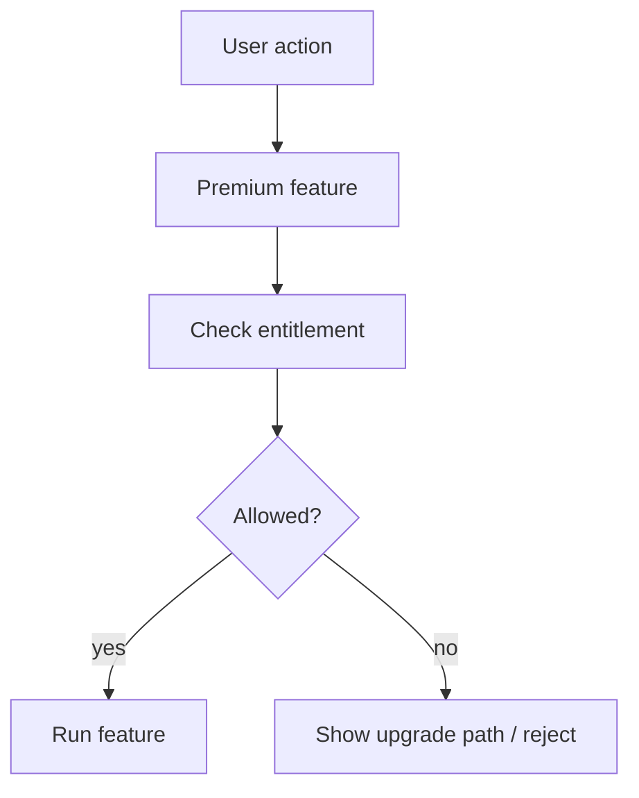
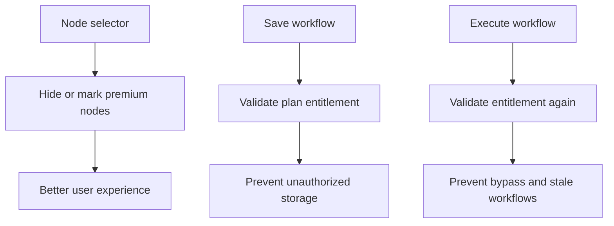
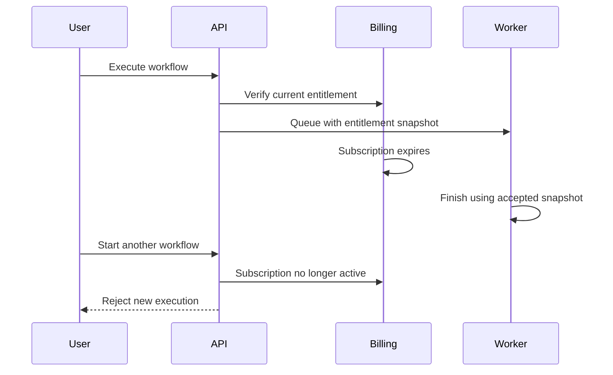
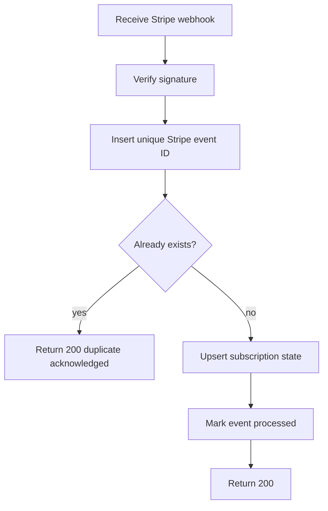

# Section 9: SaaS & Subscriptions

This section explains subscription gating, usage limits, paywalls, entitlement
decisions, and idempotent billing webhooks for Nodeflowz.

The current project uses Polar for subscription checkout and entitlement
checks. Its Stripe webhook route is currently a workflow trigger integration,
not the application's subscription billing handler.

## 58. How did you implement usage-based limits?

The current Nodeflowz implementation primarily enforces active-subscription
access rather than full usage-based metering.

The `premiumProcedure` middleware loads the user's Polar customer state:

```ts
export const premiumProcedure = protectedProcedure.use(
  async ({ ctx, next }) => {
    const customer = await polarClient.customers.getStateExternal({
      externalId: ctx.auth.user.id,
    });

    const hasActiveSubscription =
      Array.isArray(customer.activeSubscriptions) &&
      customer.activeSubscriptions.length > 0;

    if (!hasActiveSubscription) {
      throw new TRPCError({
        code: "FORBIDDEN",
        message: "Active subscription required",
      });
    }

    return next({
      ctx: {
        ...ctx,
        customer,
      },
    });
  },
);
```

This middleware is used for premium operations such as workflow creation:

```ts
create: premiumProcedure
  .input(...)
  .mutation(async ({ ctx, input }) => {
    // Create workflow.
  });
```

Current behavior:



### Usage-Based Limits

For limits such as:

```text
Free: 100 workflow runs per month
Pro: 10,000 workflow runs per month
Enterprise: custom limit
```

I would enforce usage at the API or service layer, backed by atomic database
counters.



### Usage Counter Schema

```prisma
model UsageCounter {
  id        String   @id @default(cuid())
  userId    String
  metric    String
  period    String
  count     Int      @default(0)
  updatedAt DateTime @updatedAt

  @@unique([userId, metric, period])
  @@index([period, metric])
}
```

Example period:

```text
2026-06
```

### Avoiding Race Conditions

A naive check followed by increment is unsafe:

```ts
const usage = await getUsage();

if (usage.count < limit) {
  await incrementUsage();
}
```

Two concurrent requests may both observe the same count and both pass.

A PostgreSQL conditional update can reserve usage atomically:

```ts
async function reserveWorkflowRun(input: {
  userId: string;
  period: string;
  limit: number;
}) {
  await prisma.usageCounter.upsert({
    where: {
      userId_metric_period: {
        userId: input.userId,
        metric: "workflow_runs",
        period: input.period,
      },
    },
    create: {
      userId: input.userId,
      metric: "workflow_runs",
      period: input.period,
      count: 0,
    },
    update: {},
  });

  const reserved = await prisma.$executeRaw`
    UPDATE "UsageCounter"
    SET "count" = "count" + 1
    WHERE "userId" = ${input.userId}
      AND "metric" = 'workflow_runs'
      AND "period" = ${input.period}
      AND "count" < ${input.limit}
  `;

  if (reserved !== 1) {
    throw new TRPCError({
      code: "FORBIDDEN",
      message: "Monthly workflow run limit reached",
    });
  }
}
```

Then queue execution only after the reservation succeeds.

### Where to Enforce Limits

| Layer | Responsibility |
|---|---|
| UI | Show usage and upgrade messaging |
| API/service layer | Authoritative limit enforcement |
| Database | Atomic counters and uniqueness |
| Worker | Defense-in-depth checks for expensive operations |

### Reservation and Refund

If queueing fails after usage is reserved, the counter should be refunded or
the reservation recorded separately.

```prisma
model UsageReservation {
  id           String   @id @default(cuid())
  userId       String
  metric       String
  amount       Int
  executionId  String?  @unique
  status       String
  createdAt    DateTime @default(now())
}
```

### Interview Answer

> The current project gates premium operations by checking Polar subscription
> state in tRPC middleware. For true usage limits, I would enforce them in the
> API or service layer before expensive work is queued, with PostgreSQL-backed
> atomic counters. The UI can display usage, but the server and database must
> provide authoritative enforcement so concurrent requests cannot exceed the
> limit.

## 59. Explain the subscription payment webhook flow.

The current Nodeflowz billing integration uses Polar through Better Auth:

```ts
plugins: [
  polar({
    client: polarClient,
    createCustomerOnSignUp: true,
    use: [
      checkout({
        products: [
          {
            productId: "f3c6b1f5-ef4e-403d-9dae-63e813662787",
            slug: "pro",
          },
        ],
        successUrl: process.env.POLAR_SUCCESS_URL,
        authenticatedUsersOnly: true,
      }),
      portal(),
    ],
  }),
]
```

The Stripe webhook route currently present in the codebase is a workflow
trigger:

```ts
await sendWorkflowExecution({
  workflowId,
  initialData: {
    stripe: stripeData,
  },
});
```

It does not upgrade the Nodeflowz user's subscription.

### Typical Subscription Payment Flow

Whether the provider is Polar or Stripe, the billing flow is conceptually:



### Subscription Schema

```prisma
enum SubscriptionStatus {
  TRIALING
  ACTIVE
  PAST_DUE
  CANCELED
  EXPIRED
}

enum SubscriptionPlan {
  FREE
  PRO
  ENTERPRISE
}

model Subscription {
  id                     String   @id @default(cuid())
  userId                 String   @unique
  provider               String
  providerCustomerId     String   @unique
  providerSubscriptionId String   @unique
  plan                   SubscriptionPlan
  status                 SubscriptionStatus
  currentPeriodEnd       DateTime
  cancelAtPeriodEnd      Boolean  @default(false)
  updatedAt              DateTime @updatedAt
}
```

### Webhook Event Handling

Relevant events may include:

```text
checkout completed
subscription created
subscription updated
invoice payment succeeded
invoice payment failed
subscription canceled
```

The database subscription state should be updated from verified webhook events,
not solely from the browser's checkout success redirect.



### Interview Answer

> Nodeflowz currently uses Polar for subscription checkout and active
> subscription checks. The Stripe webhook in the repository is a workflow
> trigger, not the product billing handler. In a billing flow, checkout starts
> from the app, the provider processes payment, and a signed webhook becomes the
> source of truth that updates the user's subscription and entitlements.

## 60. What is a paywall? How did you implement feature gating?

A paywall blocks access to paid features unless the user has the required
subscription or entitlement.



### Current Server-Side Gate

Nodeflowz uses `premiumProcedure` to protect paid operations:

```ts
if (!hasActiveSubscription) {
  throw new TRPCError({
    code: "FORBIDDEN",
    message: "Active subscription required",
  });
}
```

The server-side check is the authoritative gate.

The UI may hide or disable premium features, but UI-only gating is insecure
because users can call APIs directly.

### Feature-Level Entitlements

A scalable system should define which plan can access each feature:

```ts
const nodePlanRequirements = {
  MANUAL_TRIGGER: "FREE",
  HTTP_REQUEST: "FREE",
  OPENAI: "PRO",
  ANTHROPIC: "PRO",
  GEMINI: "PRO",
  GOOGLE_SHEETS: "PRO",
  TINYFISH: "PRO",
  SLACK: "PRO",
  DISCORD: "PRO",
} as const;
```

Validate selected nodes:

```ts
type Plan = "FREE" | "PRO" | "ENTERPRISE";

function assertNodesAllowedForPlan(
  nodes: Array<{ type?: string | null }>,
  plan: Plan,
) {
  for (const node of nodes) {
    if (!node.type) continue;

    const requiredPlan =
      nodePlanRequirements[
        node.type as keyof typeof nodePlanRequirements
      ];

    if (requiredPlan === "PRO" && plan === "FREE") {
      throw new TRPCError({
        code: "FORBIDDEN",
        message: `${node.type} requires a Pro plan`,
      });
    }
  }
}
```

### Validate on Save and Execute



Why validate again during execution?

- Users can bypass the frontend.
- A workflow may have been created while paid.
- Plan requirements may change.
- Subscription status may have changed.

### Capability-Based Entitlements

Instead of hardcoding plans everywhere, use capabilities:

```ts
type Capability =
  | "workflow:create"
  | "node:ai"
  | "node:google-sheets"
  | "execution:priority"
  | "execution:high-limit";

const planCapabilities: Record<Plan, Set<Capability>> = {
  FREE: new Set(["workflow:create"]),
  PRO: new Set([
    "workflow:create",
    "node:ai",
    "node:google-sheets",
    "execution:priority",
  ]),
  ENTERPRISE: new Set([
    "workflow:create",
    "node:ai",
    "node:google-sheets",
    "execution:priority",
    "execution:high-limit",
  ]),
};
```

### Interview Answer

> A paywall restricts premium features based on subscription entitlement. In
> Nodeflowz, `premiumProcedure` performs the authoritative server-side
> subscription check. For premium nodes, I would hide or label them in the UI,
> validate them when saving, and validate again before execution. The backend
> must remain authoritative because frontend gates can be bypassed.

## 61. How would you handle a subscription expiring during workflow execution?

There are two main policies.

### Policy A: Snapshot Entitlement at Start

If the user is entitled when execution starts, allow the workflow to complete.

Advantages:

- Predictable user experience.
- Avoids partial workflows.
- Clear billing boundary.
- Easier retries and idempotency.

### Policy B: Recheck Before Every Premium Node

If the subscription expires, stop before the next premium node.

Advantages:

- Strict billing enforcement.

Disadvantages:

- Workflows may fail halfway through.
- Retries become confusing.
- A small timing difference changes the result.

For Nodeflowz, I would usually snapshot entitlement when execution is accepted.



### Execution Snapshot

```prisma
model Execution {
  id                  String   @id @default(cuid())
  workflowId          String
  status              ExecutionStatus
  planSnapshot        String
  entitlementSnapshot Json
  entitlementCheckedAt DateTime
}
```

At queue time:

```ts
const entitlement = await loadUserEntitlement(userId);

if (!entitlement.canExecuteWorkflow) {
  throw new TRPCError({
    code: "FORBIDDEN",
    message: "Subscription does not allow workflow execution",
  });
}

const execution = await prisma.execution.create({
  data: {
    workflowId,
    status: "RUNNING",
    planSnapshot: entitlement.plan,
    entitlementSnapshot: entitlement.capabilities,
    entitlementCheckedAt: new Date(),
    inngestEventId,
  },
});
```

### Limits on Long-Running Work

Snapshot entitlement should not allow a workflow to run indefinitely.

Add:

- Maximum execution duration.
- Maximum node count.
- Maximum provider spend.
- Cancellation support.
- Usage reservation before execution.

```ts
if (executionDurationMs > maximumExecutionDurationMs) {
  throw new Error("Execution exceeded maximum duration");
}
```

### Retry Behavior

Retries for the same execution should generally use the same entitlement
snapshot. A retry is not a new customer request.

Manual replay may be treated as a new execution and recheck current
entitlement.

### Interview Answer

> I would snapshot the user's entitlement when the workflow is accepted. If the
> subscription expires while that execution is running, I would let the
> accepted execution finish but reject new runs. This avoids partial workflows
> and gives a clear billing boundary. Retries use the same snapshot, while a
> manual replay can be treated as a new request and recheck entitlement.

## 62. Design an idempotent Stripe `invoice.payment_succeeded` webhook handler.

Stripe uses at-least-once webhook delivery, so the same event can arrive more
than once.

The webhook handler must:

1. Read the raw request body.
2. Verify the Stripe signature.
3. Check whether the event ID was already processed.
4. Update subscription state transactionally.
5. Return `200 OK` for duplicates.



### Webhook Event Table

```prisma
model BillingWebhookEvent {
  id          String   @id @default(cuid())
  provider    String
  externalId  String
  eventType   String
  payload     Json?
  processedAt DateTime?
  createdAt   DateTime @default(now())

  @@unique([provider, externalId])
}
```

### Subscription Table

```prisma
model Subscription {
  id                     String   @id @default(cuid())
  userId                 String   @unique
  providerCustomerId     String   @unique
  providerSubscriptionId String   @unique
  plan                   String
  status                 String
  currentPeriodEnd       DateTime
  updatedAt              DateTime @updatedAt
}
```

### Signature Verification

Stripe requires the raw body:

```ts
const rawBody = await request.text();
const signature = request.headers.get("stripe-signature");

if (!signature) {
  return Response.json(
    {
      error: "Missing Stripe signature",
    },
    {
      status: 400,
    },
  );
}

const event = stripe.webhooks.constructEvent(
  rawBody,
  signature,
  process.env.STRIPE_WEBHOOK_SECRET!,
);
```

Parsing JSON before signature verification can invalidate the signed payload.

### Idempotent Handler

```ts
import { Prisma } from "@/generated/prisma";
import Stripe from "stripe";

export async function POST(request: Request) {
  const rawBody = await request.text();
  const signature = request.headers.get("stripe-signature");

  if (!signature) {
    return Response.json(
      {
        error: "Missing Stripe signature",
      },
      {
        status: 400,
      },
    );
  }

  let event: Stripe.Event;

  try {
    event = stripe.webhooks.constructEvent(
      rawBody,
      signature,
      process.env.STRIPE_WEBHOOK_SECRET!,
    );
  } catch {
    return Response.json(
      {
        error: "Invalid Stripe signature",
      },
      {
        status: 400,
      },
    );
  }

  if (event.type !== "invoice.payment_succeeded") {
    return Response.json(
      {
        received: true,
      },
      {
        status: 200,
      },
    );
  }

  try {
    await prisma.$transaction(async (tx) => {
      await tx.billingWebhookEvent.create({
        data: {
          provider: "stripe",
          externalId: event.id,
          eventType: event.type,
          payload: event.data.object as object,
        },
      });

      const invoice = event.data.object as Stripe.Invoice;

      const customerId =
        typeof invoice.customer === "string"
          ? invoice.customer
          : invoice.customer?.id;

      const subscriptionId =
        typeof invoice.subscription === "string"
          ? invoice.subscription
          : invoice.subscription?.id;

      if (!customerId || !subscriptionId) {
        throw new Error(
          "Invoice is missing customer or subscription",
        );
      }

      const providerSubscription =
        await stripe.subscriptions.retrieve(subscriptionId);

      const userId = providerSubscription.metadata.userId;

      if (!userId) {
        throw new Error("Subscription is missing userId metadata");
      }

      await tx.subscription.upsert({
        where: {
          providerSubscriptionId: subscriptionId,
        },
        create: {
          userId,
          providerCustomerId: customerId,
          providerSubscriptionId: subscriptionId,
          plan:
            providerSubscription.items.data[0]?.price.lookup_key ??
            "pro",
          status: providerSubscription.status,
          currentPeriodEnd: new Date(
            providerSubscription.current_period_end * 1000,
          ),
        },
        update: {
          plan:
            providerSubscription.items.data[0]?.price.lookup_key ??
            "pro",
          status: providerSubscription.status,
          currentPeriodEnd: new Date(
            providerSubscription.current_period_end * 1000,
          ),
        },
      });

      await tx.billingWebhookEvent.update({
        where: {
          provider_externalId: {
            provider: "stripe",
            externalId: event.id,
          },
        },
        data: {
          processedAt: new Date(),
        },
      });
    });
  } catch (error) {
    if (
      error instanceof Prisma.PrismaClientKnownRequestError &&
      error.code === "P2002"
    ) {
      return Response.json(
        {
          received: true,
          duplicate: true,
        },
        {
          status: 200,
        },
      );
    }

    return Response.json(
      {
        error: "Webhook processing failed",
      },
      {
        status: 500,
      },
    );
  }

  return Response.json(
    {
      received: true,
    },
    {
      status: 200,
    },
  );
}
```

### External Call Inside Transaction

The example retrieves the Stripe subscription inside the transaction for
clarity, but a long external API call should generally not be made while a
database transaction is open.

A stronger design:

1. Verify and parse event.
2. Retrieve required Stripe state.
3. Begin short database transaction.
4. Insert event and update subscription atomically.

However, the event insert must still reliably prevent concurrent duplicate
processing.

### Event Ordering

Billing events can arrive out of order. Store the provider event creation time
or subscription version and avoid applying stale state over newer state.

```prisma
model Subscription {
  providerUpdatedAt DateTime?
}
```

### Interview Answer

> I would verify the Stripe signature using the raw body, then insert Stripe's
> event ID into a table with a unique constraint. The subscription update and
> processed marker are committed transactionally. If the same event arrives
> again, the unique constraint identifies it as a duplicate and the handler
> returns `200 OK` without applying the upgrade twice. I would also account for
> out-of-order events and keep database transactions short.
