# Section 11: System Design

This section explains Nodeflowz as a distributed workflow orchestration system.
It covers its current architecture and how the platform could evolve for
conditional execution, distributed scheduling, billion-row logs,
cross-workflow triggers, provider circuit breakers, and active-active regions.

## 68. Draw the high-level Nodeflowz architecture and identify the protocols.

Nodeflowz has four primary architectural layers:

1. Interactive frontend.
2. Application API and authentication.
3. Persistent workflow and execution storage.
4. Asynchronous workflow execution and integrations.

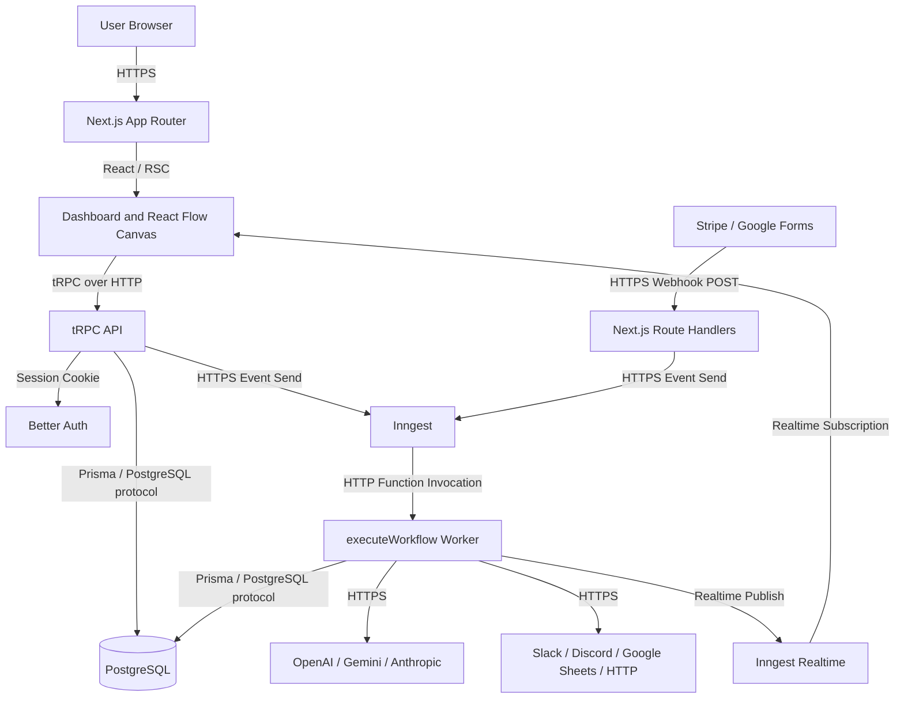

### Frontend

The React Flow canvas lets users create and connect workflow nodes.

The editor stores:

```ts
const [nodes, setNodes] = useState<Node[]>(workflow.nodes);
const [edges, setEdges] = useState<Edge[]>(workflow.edges);
```

### Application API

tRPC handles application-owned operations:

- Workflow CRUD.
- Credential management.
- Execution queries.
- Workflow execution requests.

```ts
export const appRouter = createTRPCRouter({
  credentials: credentialsRouter,
  workflows: workflowRouter,
  executions: executionsRouter,
});
```

### Persistence

Prisma stores:

- Users and sessions.
- Workflows.
- Nodes and connections.
- Encrypted credentials.
- Execution results.

### Background Execution

When a workflow runs, tRPC sends an Inngest event:

```ts
await sendWorkflowExecution({
  workflowId: input.id,
});
```

Inngest invokes the worker, which:

1. Creates an execution record.
2. Loads the graph.
3. Sorts nodes.
4. Executes nodes through the executor registry.
5. Stores final output.
6. Publishes realtime node status.

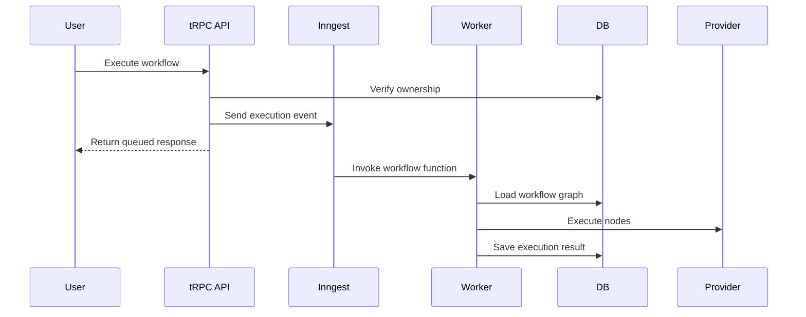

### Protocol Summary

| Communication | Protocol |
|---|---|
| Browser to Next.js | HTTPS |
| UI to tRPC | HTTP |
| Application to PostgreSQL | PostgreSQL protocol through Prisma |
| API to Inngest | HTTPS event API |
| Inngest to Next.js function route | HTTP |
| Worker to providers | HTTPS |
| Worker to UI status | Inngest Realtime |
| External providers to webhooks | HTTPS POST |

### Interview Answer

> Nodeflowz uses Next.js and React Flow for the interactive frontend, tRPC and
> Better Auth for authenticated application APIs, Prisma with PostgreSQL for
> durable state, and Inngest for asynchronous workflow execution. The API
> validates and queues work, while the worker loads the graph, executes node
> strategies, stores results, calls external providers over HTTPS, and publishes
> realtime status back to the canvas.

## 69. How does the workflow engine determine execution order?

A workflow is a directed graph:

- Nodes are units of work.
- Connections are directed dependencies.

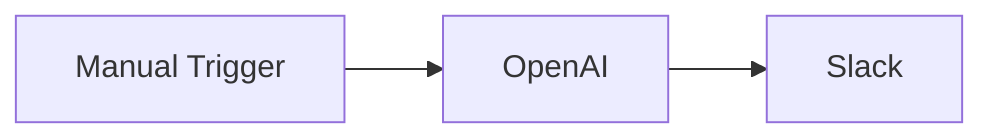

The database stores directed edges:

```prisma
model Connection {
  fromNodeId String
  toNodeId   String
  fromOutput String @default("main")
  toInput    String @default("main")
}
```

### Current Topological Sort

The worker loads the graph:

```ts
const workflow = await prisma.workflow.findUniqueOrThrow({
  where: {
    id: workflowId,
  },
  include: {
    nodes: true,
    connections: true,
  },
});
```

Connections are converted into topological-sort edges:

```ts
const edges: [string, string][] = connections.map(
  (connection) => [
    connection.fromNodeId,
    connection.toNodeId,
  ],
);

const sortedNodeIds = toposort(edges);
```

Topological sorting guarantees that every dependency appears before the node
that depends on it.

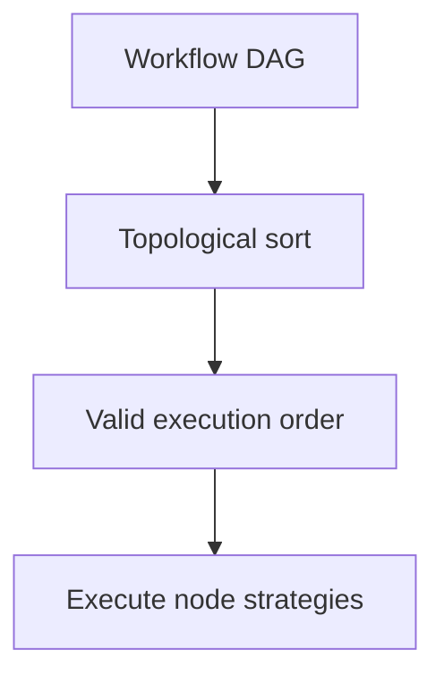

The current worker executes sorted nodes sequentially:

```ts
let context = event.data.initialData || {};

for (const node of sortedNodes) {
  const executor = getExecutor(node.type as NodeType);

  context = await executor({
    data: node.data as Record<string, unknown>,
    nodeId: node.id,
    userId,
    context,
    step,
    publish,
  });
}
```

### Cycle Detection

A directed cycle has no valid topological order:

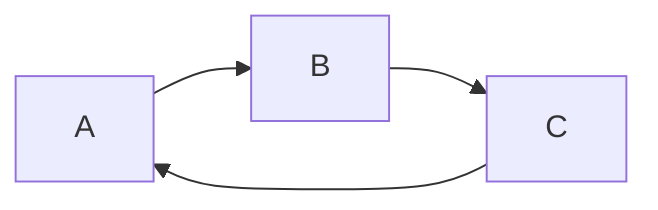

The sorting utility rejects cycles:

```ts
try {
  sortedNodeIds = toposort(edges);
} catch (error) {
  if (error instanceof Error && error.message.includes("Cyclic")) {
    throw new Error("Workflow contains a cycle");
  }

  throw error;
}
```

### Conditional Branches

A conditional node selects one or more outgoing paths.

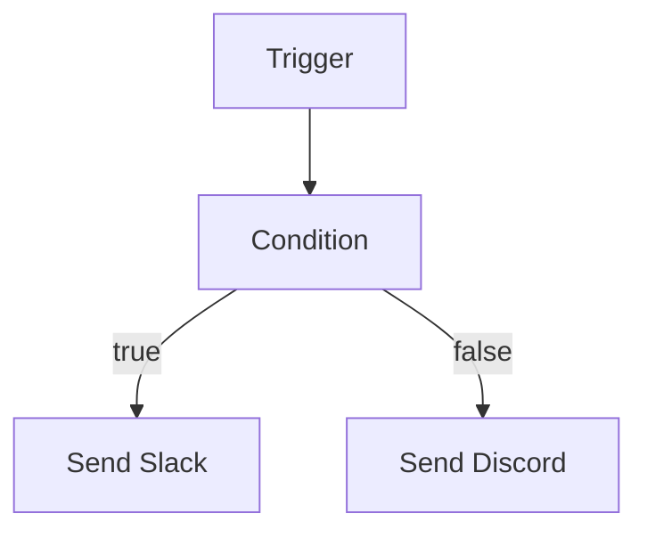

The existing `fromOutput` field can represent branch names:

```text
fromOutput = "true"
fromOutput = "false"
```

Condition output:

```ts
type ConditionResult = {
  selectedOutputs: string[];
  context: WorkflowContext;
};

function executeCondition(
  expression: string,
  context: WorkflowContext,
): ConditionResult {
  const result = evaluateExpressionSafely(expression, context);

  return {
    selectedOutputs: [result ? "true" : "false"],
    context,
  };
}
```

The scheduler follows only active connections:

```ts
function selectOutgoingConnections(input: {
  nodeId: string;
  selectedOutputs: string[];
  connections: Connection[];
}) {
  return input.connections.filter(
    (connection) =>
      connection.fromNodeId === input.nodeId &&
      input.selectedOutputs.includes(connection.fromOutput),
  );
}
```

### Parallel Branches

Independent nodes can execute concurrently:

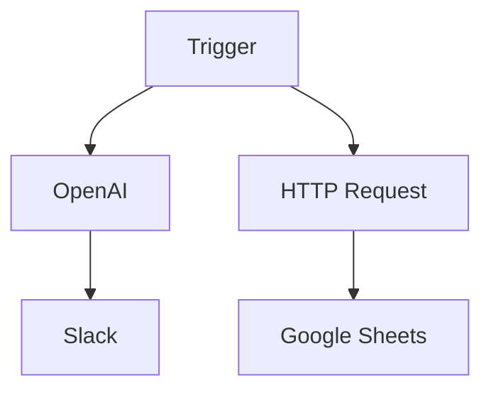

Execution levels:

```text
Level 0: Trigger
Level 1: OpenAI and HTTP Request
Level 2: Slack and Google Sheets
```

Build levels with in-degree tracking:

```ts
function buildExecutionLevels(
  nodes: Node[],
  connections: Connection[],
) {
  const inDegree = new Map(
    nodes.map((node) => [node.id, 0]),
  );

  const outgoing = new Map(
    nodes.map((node) => [node.id, [] as string[]]),
  );

  for (const connection of connections) {
    inDegree.set(
      connection.toNodeId,
      (inDegree.get(connection.toNodeId) ?? 0) + 1,
    );

    outgoing
      .get(connection.fromNodeId)
      ?.push(connection.toNodeId);
  }

  const levels: Node[][] = [];
  let ready = nodes.filter(
    (node) => inDegree.get(node.id) === 0,
  );

  while (ready.length > 0) {
    levels.push(ready);

    const next: Node[] = [];

    for (const node of ready) {
      for (const targetId of outgoing.get(node.id) ?? []) {
        const remaining = (inDegree.get(targetId) ?? 0) - 1;
        inDegree.set(targetId, remaining);

        if (remaining === 0) {
          const target = nodes.find(
            (candidate) => candidate.id === targetId,
          );

          if (target) next.push(target);
        }
      }
    }

    ready = next;
  }

  return levels;
}
```

Execute one level in parallel:

```ts
for (const level of levels) {
  const outputs = await Promise.all(
    level.map((node) => executeNode(node, context)),
  );

  context = mergeBranchOutputs(context, outputs);
}
```

### Context Merge Rules

Parallel branches may write the same variable. The platform needs a
deterministic rule:

- Require unique variable names.
- Namespace outputs by node ID.
- Reject conflicting writes.
- Add an explicit merge node.

### Interview Answer

> The engine treats the workflow as a directed acyclic graph and uses
> topological sorting so dependencies execute before dependent nodes. The
> current worker executes that order sequentially. Conditional branches can use
> named output handles, and parallel branches can be grouped by dependency
> level and run with bounded concurrency. Parallel output merging must follow a
> deterministic conflict policy.

## 70. How would you implement cron triggers at scale?

A single in-memory cron scheduler is not reliable at scale:

- If it crashes, schedules may be missed.
- If several instances run, schedules may execute repeatedly.
- Deployments and restarts disrupt timers.

The schedule must be persisted and claimed through a distributed lease.

### Schedule Schema

```prisma
model WorkflowSchedule {
  id             String   @id @default(cuid())
  workflowId     String
  cronExpression String
  timezone       String
  nextRunAt      DateTime
  enabled        Boolean  @default(true)
  lockedAt       DateTime?
  lockedUntil    DateTime?
  lockedBy       String?
  createdAt      DateTime @default(now())
  updatedAt      DateTime @updatedAt

  @@index([enabled, nextRunAt])
}
```

### Distributed Scheduler

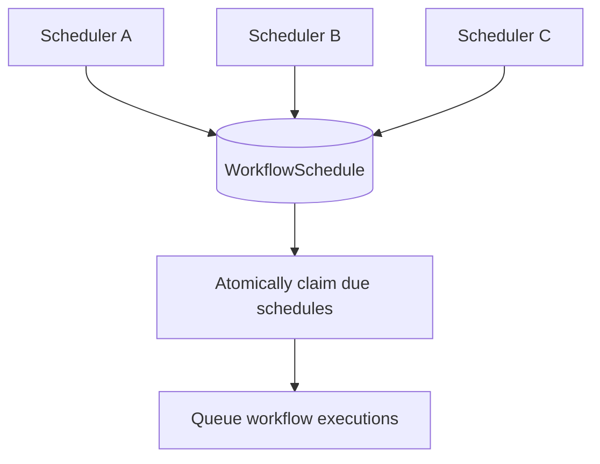

Find due schedules:

```ts
const now = new Date();

const dueSchedules = await prisma.workflowSchedule.findMany({
  where: {
    enabled: true,
    nextRunAt: {
      lte: now,
    },
    OR: [
      {
        lockedUntil: null,
      },
      {
        lockedUntil: {
          lt: now,
        },
      },
    ],
  },
  orderBy: {
    nextRunAt: "asc",
  },
  take: 100,
});
```

Atomically claim one:

```ts
async function claimSchedule(
  scheduleId: string,
  schedulerId: string,
) {
  const now = new Date();

  const result = await prisma.workflowSchedule.updateMany({
    where: {
      id: scheduleId,
      enabled: true,
      OR: [
        {
          lockedUntil: null,
        },
        {
          lockedUntil: {
            lt: now,
          },
        },
      ],
    },
    data: {
      lockedAt: now,
      lockedUntil: new Date(now.getTime() + 60_000),
      lockedBy: schedulerId,
    },
  });

  return result.count === 1;
}
```

### Idempotent Scheduled Execution

The unique occurrence is:

```text
schedule ID + scheduled execution time
```

```ts
const idempotencyKey =
  `cron:${schedule.id}:${schedule.nextRunAt.toISOString()}`;
```

Store it uniquely:

```prisma
model ScheduledOccurrence {
  id             String   @id @default(cuid())
  scheduleId     String
  scheduledFor   DateTime
  executionId    String?
  createdAt      DateTime @default(now())

  @@unique([scheduleId, scheduledFor])
}
```

Queue occurrence:

```ts
await prisma.$transaction(async (tx) => {
  const occurrence = await tx.scheduledOccurrence.create({
    data: {
      scheduleId: schedule.id,
      scheduledFor: schedule.nextRunAt,
    },
  });

  await tx.workflowSchedule.update({
    where: {
      id: schedule.id,
    },
    data: {
      nextRunAt: calculateNextRun(
        schedule.cronExpression,
        schedule.timezone,
      ),
      lockedAt: null,
      lockedUntil: null,
      lockedBy: null,
    },
  });

  await sendWorkflowExecution({
    workflowId: schedule.workflowId,
    idempotencyKey,
    scheduledOccurrenceId: occurrence.id,
  });
});
```

In production, avoid external queue calls inside a database transaction. Use an
outbox table so occurrence creation and event publication are reliable.

### Scheduler Crash

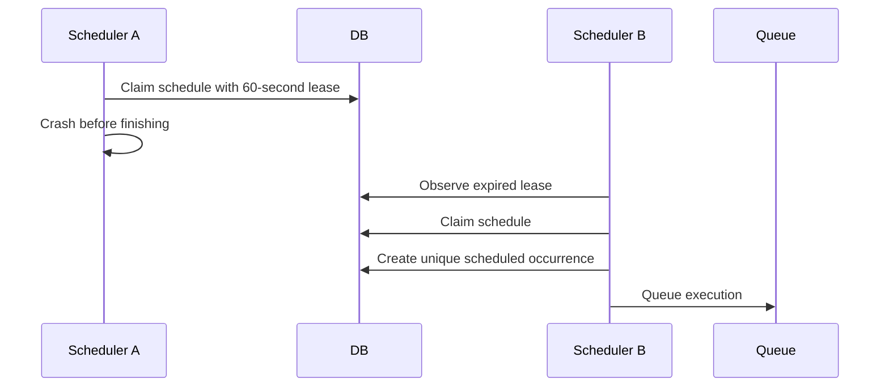

The expired lease allows recovery. The unique occurrence prevents duplicate
runs.

### Misfire Policy

After downtime, several runs may have been missed. Define a policy:

- Skip missed runs.
- Execute only the latest missed run.
- Catch up every missed run.
- Catch up up to a configured limit.

### Interview Answer

> I would persist schedules with `nextRunAt` and use short distributed leases.
> Multiple scheduler instances can scan due schedules, but an atomic claim lets
> only one process each occurrence. If a scheduler crashes, the lease expires
> and another instance recovers it. A unique `(scheduleId, scheduledFor)` record
> makes the occurrence idempotent and prevents duplicate runs.

## 71. Design execution-log storage for one billion rows and sub-100ms failed-run queries.

Target query:

```text
Show the latest failed runs from the last 7 days for tenant X.
```

At one billion rows, the dashboard must not scan a generic, unpartitioned log
table.

### Separate Summary From Verbose Logs

Execution summary:

```prisma
model ExecutionSummary {
  id          String   @id
  tenantId    String
  workflowId  String
  status      String
  startedAt   DateTime
  completedAt DateTime?
  errorCode   String?
  error       String?
}
```

Verbose node logs:

```prisma
model ExecutionLog {
  id          String   @id
  tenantId    String
  executionId String
  nodeId      String?
  level       String
  message     String
  metadata    Json?
  createdAt   DateTime

  @@index([executionId, createdAt])
}
```

The common dashboard query hits the narrow summary table, not verbose logs.

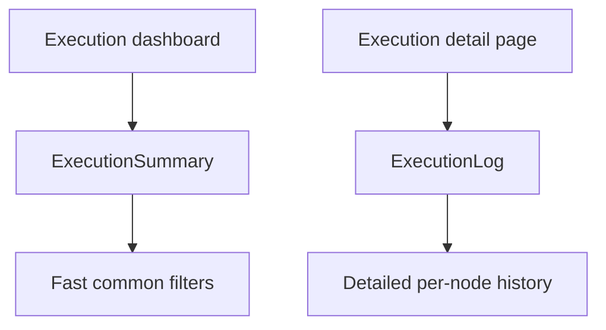

### Time Partitioning

Partition summaries by time:

```sql
CREATE TABLE execution_summary (
  id text NOT NULL,
  tenant_id text NOT NULL,
  workflow_id text NOT NULL,
  status text NOT NULL,
  started_at timestamptz NOT NULL,
  completed_at timestamptz,
  error_code text,
  error text
) PARTITION BY RANGE (started_at);
```

Monthly partition:

```sql
CREATE TABLE execution_summary_2026_06
PARTITION OF execution_summary
FOR VALUES FROM ('2026-06-01') TO ('2026-07-01');
```

Depending on event volume, daily partitions may be more appropriate.

### Partial Index for Failed Runs

```sql
CREATE INDEX execution_summary_2026_06_failed_tenant_time_idx
ON execution_summary_2026_06 (
  tenant_id,
  started_at DESC
)
WHERE status = 'FAILED';
```

The index contains only failed rows and is ordered for the target query.

Query:

```sql
SELECT
  id,
  workflow_id,
  status,
  started_at,
  error_code
FROM execution_summary
WHERE tenant_id = $1
  AND status = 'FAILED'
  AND started_at >= now() - interval '7 days'
ORDER BY started_at DESC
LIMIT 100;
```

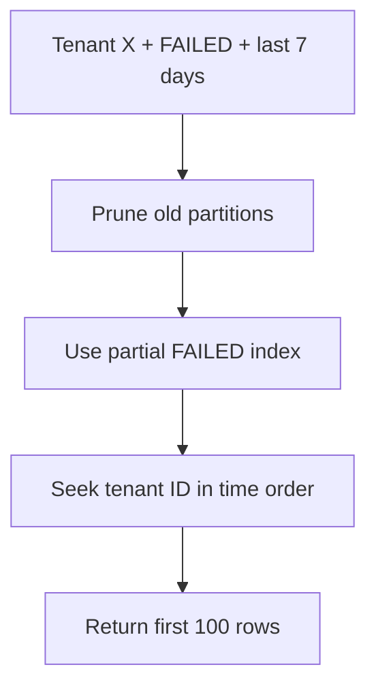

### Additional Scale Techniques

#### Cursor Pagination

Avoid large offsets:

```sql
SELECT id, workflow_id, status, started_at
FROM execution_summary
WHERE tenant_id = $1
  AND status = 'FAILED'
  AND started_at >= now() - interval '7 days'
  AND (started_at, id) < ($2, $3)
ORDER BY started_at DESC, id DESC
LIMIT 100;
```

#### Retention and Tiering

- Hot recent summaries in PostgreSQL.
- Older verbose logs in object storage or a log analytics system.
- Retention policy for unnecessary detailed logs.

#### Tenant Sharding

If one database cannot support the load, shard by tenant ID or tenant home
region. A routing layer directs queries to the correct shard.

#### Read Replicas

Read-heavy dashboards may use replicas, accepting a small amount of replication
lag.

#### Pre-Aggregation

Store daily failure counts for charts:

```prisma
model TenantExecutionDailyMetric {
  tenantId    String
  date        DateTime
  status      String
  count       BigInt

  @@unique([tenantId, date, status])
}
```

### Achieving the Latency Target

Sub-100ms depends on:

- Partition pruning.
- Highly selective indexes.
- Bounded result size.
- Warm cache.
- Avoiding large selected columns.
- Proper tenant distribution.
- Database capacity and locality.

### Interview Answer

> I would split narrow execution summaries from verbose node logs. The summary
> table would be time-partitioned and each active partition would have a partial
> index on `(tenant_id, started_at DESC)` for failed rows. The last-seven-days
> query then prunes old partitions and reads a small ordered index range. I
> would also use cursor pagination, retention policies, read replicas, and
> tenant sharding as volume grows.

## 72. How would you implement cross-workflow triggers?

Cross-workflow triggers allow:

```text
Workflow A succeeds -> Workflow B starts
```

This should be implemented as an event-driven subscription, not as a direct
in-process function call.

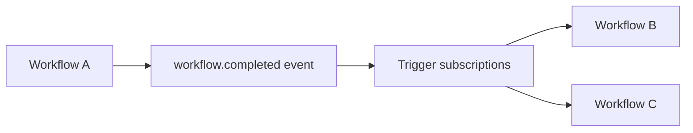

### Subscription Schema

```prisma
model WorkflowTriggerSubscription {
  id               String  @id @default(cuid())
  tenantId         String
  sourceWorkflowId String
  targetWorkflowId String
  eventType         String
  enabled           Boolean @default(true)

  @@index([sourceWorkflowId, eventType])
  @@unique([
    sourceWorkflowId,
    targetWorkflowId,
    eventType
  ])
}
```

### Completion Event

After the execution succeeds:

```ts
await prisma.execution.update({
  where: {
    id: executionId,
  },
  data: {
    status: "SUCCESS",
    completedAt: new Date(),
    output: context,
  },
});

await publishWorkflowCompleted({
  tenantId,
  workflowId,
  executionId,
  output: context,
  triggerDepth,
});
```

### Transactional Outbox

There is a failure window if the database update succeeds but event publication
fails.

Use an outbox table:

```prisma
model OutboxEvent {
  id          String   @id @default(cuid())
  tenantId    String
  eventType   String
  aggregateId String
  payload     Json
  publishedAt DateTime?
  createdAt   DateTime @default(now())

  @@index([publishedAt, createdAt])
}
```

Commit execution success and outbox event together:

```ts
await prisma.$transaction(async (tx) => {
  await tx.execution.update({
    where: {
      id: executionId,
    },
    data: {
      status: "SUCCESS",
      completedAt: new Date(),
      output: context,
    },
  });

  await tx.outboxEvent.create({
    data: {
      tenantId,
      eventType: "workflow.completed",
      aggregateId: workflowId,
      payload: {
        workflowId,
        executionId,
        output: context,
        triggerDepth,
      },
    },
  });
});
```

A publisher process reliably sends unpublished events.

### Trigger Handler

```ts
async function handleWorkflowCompleted(event: {
  tenantId: string;
  workflowId: string;
  executionId: string;
  output: Record<string, unknown>;
  triggerDepth: number;
}) {
  const subscriptions =
    await prisma.workflowTriggerSubscription.findMany({
      where: {
        tenantId: event.tenantId,
        sourceWorkflowId: event.workflowId,
        eventType: "workflow.completed",
        enabled: true,
      },
    });

  for (const subscription of subscriptions) {
    await sendWorkflowExecution({
      workflowId: subscription.targetWorkflowId,
      initialData: {
        sourceWorkflow: {
          workflowId: event.workflowId,
          executionId: event.executionId,
          output: event.output,
        },
      },
      triggerDepth: event.triggerDepth + 1,
      idempotencyKey:
        `workflow-completed:${event.executionId}:${subscription.targetWorkflowId}`,
    });
  }
}
```

### Preventing Loops

Cross-workflow subscriptions may form a cycle:

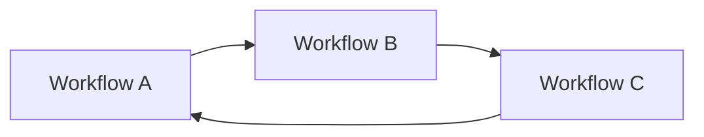

Protections:

- Detect cycles when subscriptions are created.
- Limit trigger depth.
- Use idempotency keys.
- Store trigger ancestry.
- Enforce same-tenant ownership unless explicitly allowed.

```ts
if (event.triggerDepth >= 10) {
  throw new Error("Maximum cross-workflow trigger depth exceeded");
}
```

### Interview Answer

> I would model cross-workflow triggers as domain-event subscriptions. When
> Workflow A succeeds, its execution update and a `workflow.completed` outbox
> event are committed together. A publisher delivers the event, and
> subscriptions queue Workflow B with A's output as initial data. Idempotency
> keys, trigger-depth limits, tenant checks, and cycle detection prevent
> duplicate runs and infinite loops.

## 73. Design a circuit breaker for AI provider nodes.

A circuit breaker prevents Nodeflowz from repeatedly calling an unhealthy
provider.

The circuit has three states:

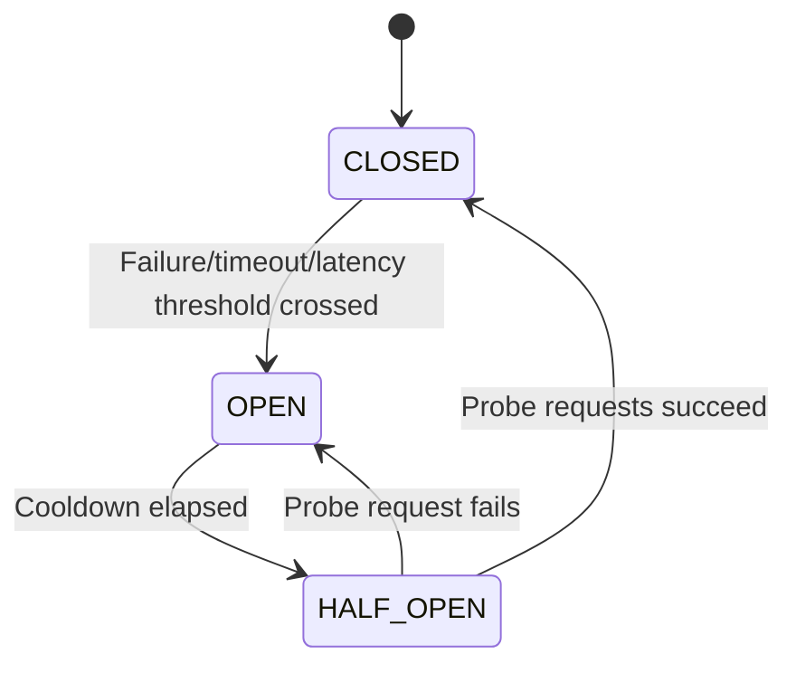

### Closed

- Normal requests are allowed.
- Successes and failures are measured.
- The circuit opens if failure thresholds are exceeded.

### Open

- Calls fail fast without contacting the provider.
- The system protects workers and the provider from repeated failures.
- After a cooldown, the circuit moves to half-open.

### Half-Open

- A limited number of probe requests are allowed.
- Successful probes close the circuit.
- A failed probe opens it again.

### Metrics

Useful transition metrics:

- Consecutive failure count.
- Failure rate over a rolling window.
- Timeout rate.
- Provider `5xx` rate.
- Provider `429` rate.
- P95 or P99 latency.
- Minimum request volume.

Example policy:

```ts
const circuitPolicy = {
  minimumRequests: 20,
  failureRateToOpen: 0.5,
  timeoutRateToOpen: 0.3,
  p95LatencyMsToOpen: 15_000,
  cooldownMs: 60_000,
  halfOpenProbeLimit: 3,
};
```

### Simplified Circuit Breaker

```ts
type CircuitState = "CLOSED" | "OPEN" | "HALF_OPEN";

class CircuitBreaker {
  private state: CircuitState = "CLOSED";
  private consecutiveFailures = 0;
  private openedAt = 0;
  private halfOpenRequests = 0;

  constructor(
    private readonly failureThreshold: number,
    private readonly cooldownMs: number,
    private readonly halfOpenLimit: number,
  ) {}

  async execute<T>(operation: () => Promise<T>): Promise<T> {
    this.transitionFromOpenIfReady();

    if (this.state === "OPEN") {
      throw new Error("Provider circuit is open");
    }

    if (
      this.state === "HALF_OPEN" &&
      this.halfOpenRequests >= this.halfOpenLimit
    ) {
      throw new Error("Provider circuit probe limit reached");
    }

    if (this.state === "HALF_OPEN") {
      this.halfOpenRequests++;
    }

    try {
      const result = await operation();
      this.recordSuccess();
      return result;
    } catch (error) {
      this.recordFailure();
      throw error;
    }
  }

  private transitionFromOpenIfReady() {
    if (
      this.state === "OPEN" &&
      Date.now() - this.openedAt >= this.cooldownMs
    ) {
      this.state = "HALF_OPEN";
      this.halfOpenRequests = 0;
    }
  }

  private recordSuccess() {
    this.consecutiveFailures = 0;

    if (this.state === "HALF_OPEN") {
      this.state = "CLOSED";
      this.halfOpenRequests = 0;
    }
  }

  private recordFailure() {
    this.consecutiveFailures++;

    if (
      this.state === "HALF_OPEN" ||
      this.consecutiveFailures >= this.failureThreshold
    ) {
      this.state = "OPEN";
      this.openedAt = Date.now();
    }
  }
}
```

Usage:

```ts
const result = await openAiCircuit.execute(() => {
  return generateText({
    model: openai("gpt-4"),
    prompt: userPrompt,
  });
});
```

### Shared State

At scale, in-memory state is insufficient because every worker has a different
view.

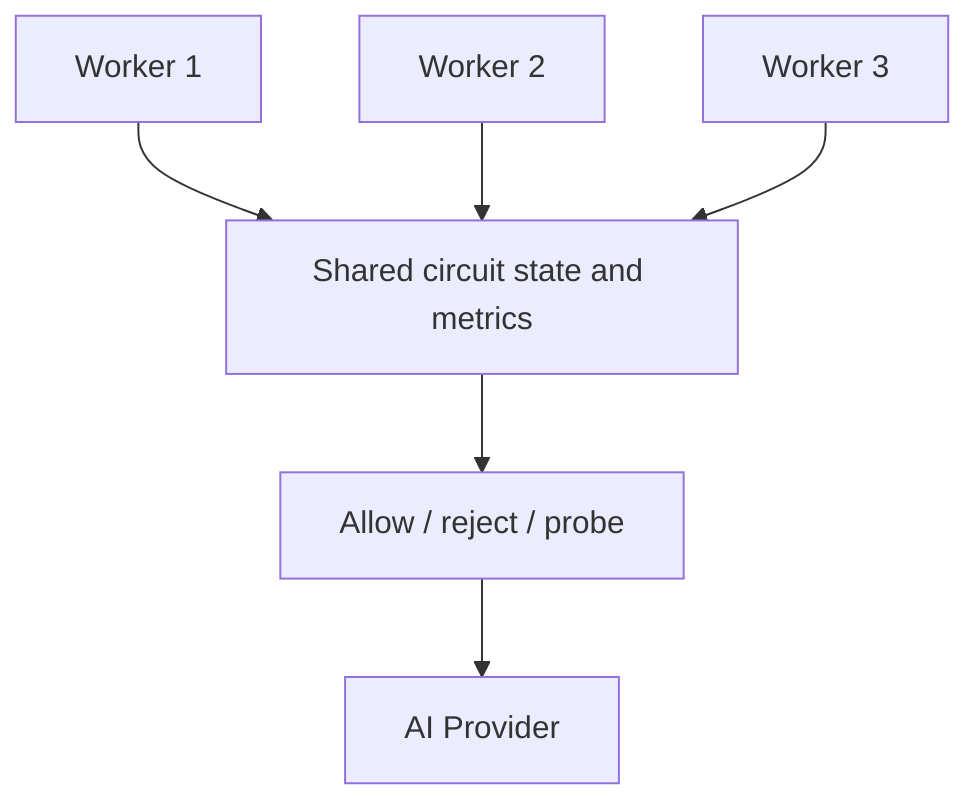

Redis or another shared low-latency store can hold:

- Circuit state.
- Open timestamp.
- Rolling success/failure counts.
- Probe lease.

### Fallback Policy

If the circuit is open:

- Fail clearly.
- Queue retry for later.
- Use a configured fallback provider if behavior is compatible.
- Do not silently switch providers if output or compliance guarantees differ.

### Interview Answer

> The circuit breaker has closed, open, and half-open states. It opens when
> rolling failure rate, timeout rate, or latency exceeds thresholds. While open,
> calls fail fast. After a cooldown, a few half-open probe requests determine
> whether the provider has recovered. At scale, all workers share circuit state
> and metrics through Redis so they make consistent decisions.

## 74. How would you architect multi-region active-active Nodeflowz?

An active-active deployment has multiple regions serving traffic and processing
work simultaneously.

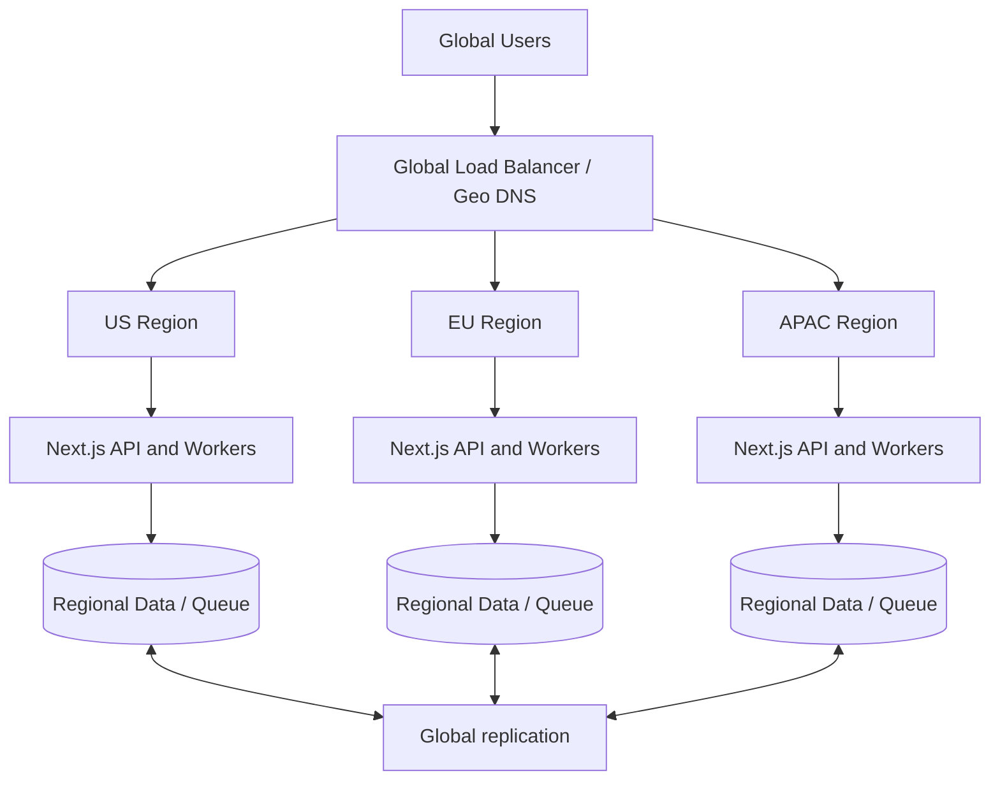

Stateless components are easier to run active-active:

- Next.js application instances.
- tRPC routes.
- Webhook handlers.
- Execution workers.
- Static assets.

The main difficulty is state consistency.

### Recommended Tenant Home-Region Model

A practical design assigns each tenant a home region:

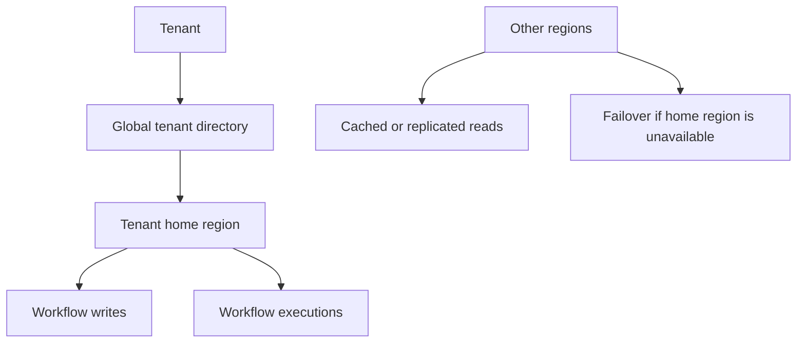

Advantages:

- Most writes avoid global conflicts.
- Workflow execution stays near tenant data.
- Simpler consistency model.
- Regions remain active for their assigned tenants.

### Consistency Challenge 1: Concurrent Workflow Edits

Two regions may edit the same workflow:

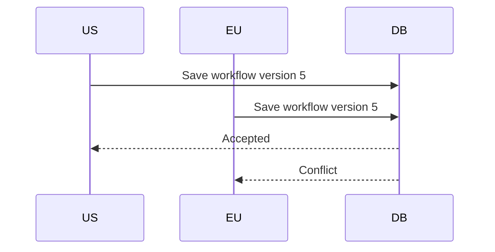

Use optimistic concurrency:

```prisma
model Workflow {
  id      String @id @default(cuid())
  version Int    @default(1)
}
```

Update only the expected version:

```ts
const updated = await prisma.workflow.updateMany({
  where: {
    id: workflowId,
    version: expectedVersion,
  },
  data: {
    name: input.name,
    version: {
      increment: 1,
    },
  },
});

if (updated.count !== 1) {
  throw new Error(
    "Workflow was changed by another session",
  );
}
```

### Consistency Challenge 2: Duplicate Execution

An event may reach workers in multiple regions.

Use globally unique idempotency keys:

```prisma
model Execution {
  id             String @id @default(cuid())
  workflowId     String
  idempotencyKey String @unique
  region         String
}
```

The worker atomically claims the execution before running it.

### Consistency Challenge 3: Read-After-Write

A user saves in one region and immediately reads from a replica in another
region before replication completes.

Options:

- Route the tenant to its home region.
- Use sticky routing after writes.
- Send a minimum version with read requests.
- Read from the primary after a mutation.
- Use a globally consistent database at higher cost.

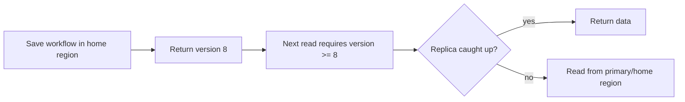

### Consistency Challenge 4: Webhook Deduplication

External providers may retry a webhook to another region.

All regions must:

- Verify provider signatures.
- Deduplicate using a globally unique event ID.
- Return `200 OK` for duplicates.

```prisma
model WebhookEvent {
  provider   String
  externalId String

  @@unique([provider, externalId])
}
```

### Consistency Challenge 5: Credential Security

Encrypted credentials must be available only in authorized regions and workers.

Consider:

- Regional KMS keys.
- Tenant data residency requirements.
- Region-specific encrypted copies.
- Strict worker identity and access controls.

### Queue Architecture

Options:

1. Global queue with region-aware routing.
2. Regional queues based on tenant home region.
3. Global event log replicated into regional consumers.

For Nodeflowz, regional queues aligned with tenant home regions simplify
execution ownership.

### Failover

When a home region fails:

1. Mark region unhealthy.
2. Promote or select failover region.
3. Update tenant directory.
4. Ensure replicated data is sufficiently current.
5. Resume queue processing using idempotent claims.

The recovery point objective determines how much data loss is acceptable. The
recovery time objective determines how quickly failover must occur.

### Interview Answer

> I would run the stateless app layer active-active but assign each tenant a
> home region for workflow writes and executions. That provides global capacity
> without forcing every write through multi-master conflict resolution. I would
> use optimistic concurrency for edits, global idempotency keys for executions
> and webhooks, version-aware reads for read-after-write consistency, regional
> queues, and a controlled failover process. True active-active writes are
> possible, but they significantly increase conflict-resolution complexity.
