# Nodeflowz Resume Project Deep Dive

This document explains the exact resume entry below in a simple, interview-ready way.

```latex
\resumeProjectHeading
{\textbf{Nodeflowz -- Workflow Automation Platform} \hspace{6pt}
\href{https://github.com/D-393Patel/nodeflowz}{ GitHub }
\hspace{6pt} \href{https://nodeflowz.vercel.app/login}{ Live }}{Jan 2026 -- Mar 2026}
\vspace{-6pt}
\begin{itemize}[leftmargin=0.25in]
\small{
\item \textbf{Tech:} Next.js, React.js, TypeScript, PostgreSQL, Prisma, tRPC, React Flow, Inngest
\item Built a visual workflow automation platform where users create, save, and execute node-based workflows.
\item Developed a React Flow editor with draggable nodes, edge connections, workflow saving, and execution controls.
\item Implemented secure workflow, credential, and execution APIs using tRPC, Prisma, PostgreSQL, and user-scoped queries.
\item Designed an asynchronous workflow engine using Inngest, DAG-based node ordering, execution history, and error tracking.
}
\end{itemize}
```

## 1. Simple Project Explanation

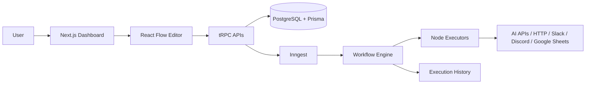

Nodeflowz is a workflow automation platform where users can visually create workflows using draggable nodes. Each node represents a task like an HTTP request, AI generation, Slack message, Discord message, or Google Sheets update.

The frontend is built with Next.js and React Flow, APIs are handled with tRPC, data is stored in PostgreSQL through Prisma, and workflows run asynchronously using Inngest.

## 2. 30-Second Interview Answer

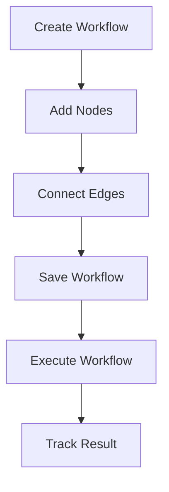

Nodeflowz is a visual workflow automation platform built with Next.js, React, TypeScript, React Flow, tRPC, Prisma, PostgreSQL, and Inngest. I built the workflow editor where users can drag nodes, connect them, save the workflow, and execute it. On execution, the backend sorts the workflow nodes using DAG-based ordering, runs each node asynchronously through Inngest, and stores execution history with success, failure, output, and error details.

## 3. 2-Minute Interview Answer

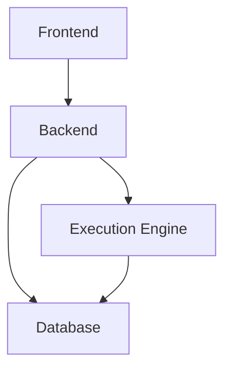

Nodeflowz is a full-stack workflow automation platform. On the frontend, I used Next.js App Router and React Flow to build a visual workflow editor. Users can add nodes, drag them, connect edges, save the workflow, and run it.

On the backend, I used tRPC for type-safe APIs. Prisma manages PostgreSQL tables for users, workflows, nodes, connections, credentials, and executions. Every protected API checks authentication and scopes data by the logged-in user.

For workflow execution, I used Inngest. When a user clicks execute, the backend queues a workflow execution event. Inngest loads the workflow from the database, sorts nodes based on their edges using topological sorting, runs each node executor in order, passes output from one node to the next, and finally stores success or failure in execution history.

## 4. Main Architecture

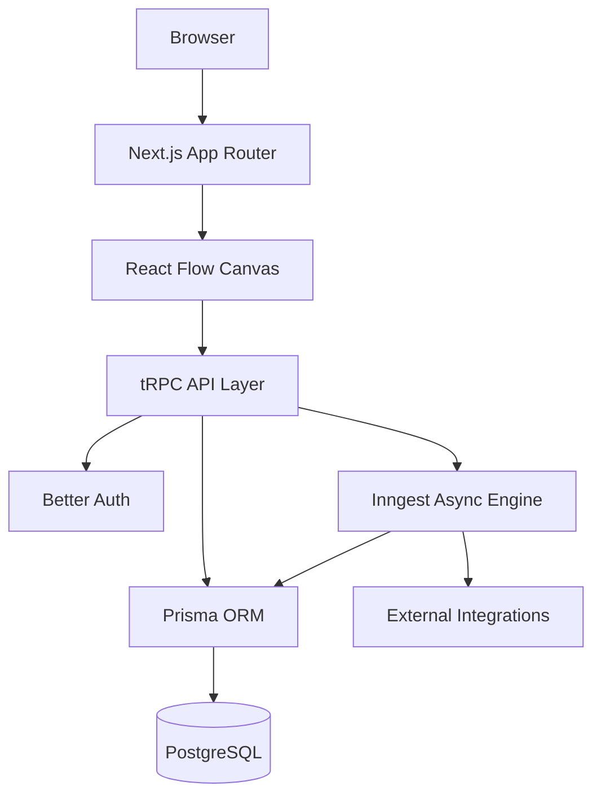

The project has four main parts:

- Frontend: Next.js and React Flow for visual workflow creation.
- API layer: tRPC for type-safe communication.
- Database: PostgreSQL with Prisma for workflows, nodes, edges, credentials, and executions.
- Workflow engine: Inngest for asynchronous workflow execution.

## 5. Workflow Execution Flow

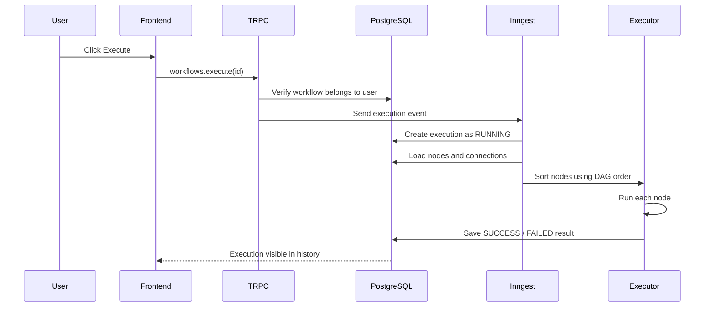

When the user clicks execute, the frontend calls a tRPC mutation. The backend verifies that the workflow belongs to the user, then sends an event to Inngest. Inngest creates an execution record, loads all nodes and edges, sorts the nodes using topological sorting, runs them one by one, and saves the final output or error.

## 6. DAG and Topological Sort

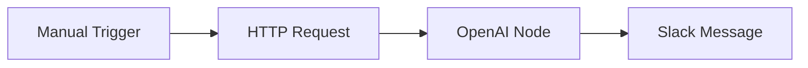

A workflow is stored as a graph. Nodes are tasks and edges define execution order. Before running the workflow, the backend uses topological sorting to decide which node should run first.

Example:

```text
Manual Trigger -> HTTP Request -> OpenAI -> Slack
```

The system runs:

1. Manual Trigger
2. HTTP Request
3. OpenAI
4. Slack

Code idea:

```ts
const edges = connections.map((conn) => [
  conn.fromNodeId,
  conn.toNodeId,
]);

const sortedNodeIds = toposort(edges);
```

Interview line:

> I used topological sorting so nodes execute in dependency order instead of relying on their visual position on the canvas.

## 7. Database Design

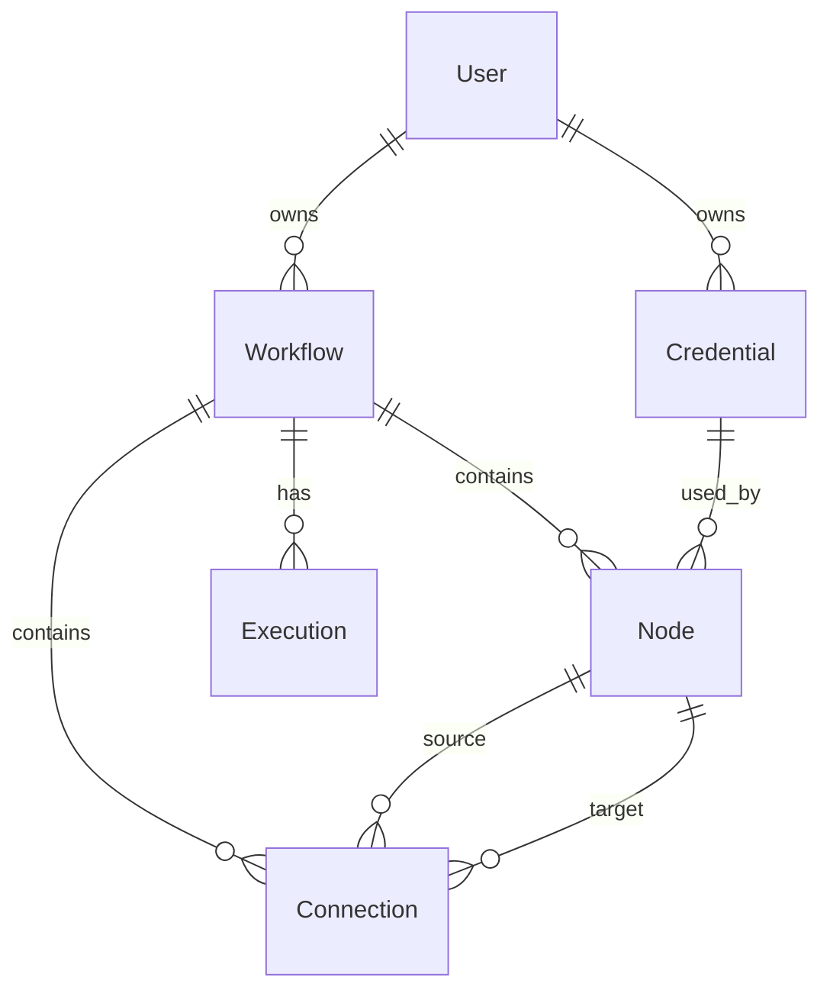

Tables:

| Table | Purpose |
|---|---|
| `User` | Stores user account data |
| `Session` | Stores logged-in session |
| `Account` | Stores OAuth/password provider account |
| `Credential` | Stores encrypted API keys |
| `Workflow` | Stores workflow name and owner |
| `Node` | Stores each workflow step |
| `Connection` | Stores edge between two nodes |
| `Execution` | Stores workflow run status, output, and errors |

Why PostgreSQL:

PostgreSQL is a good fit because the project has relational data: users own workflows, workflows contain nodes and connections, and executions belong to workflows. PostgreSQL also supports JSON fields, which are useful because every node type has different configuration data.

## 8. Frontend Architecture

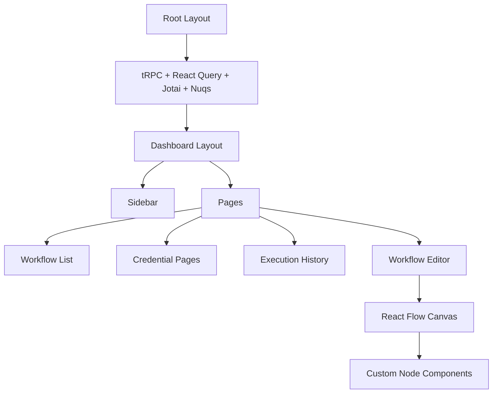

The frontend uses Next.js App Router. Server components handle route-level loading and authentication. Client components handle interactive parts like forms, workflow editor, node dialogs, and execution buttons.

State management:

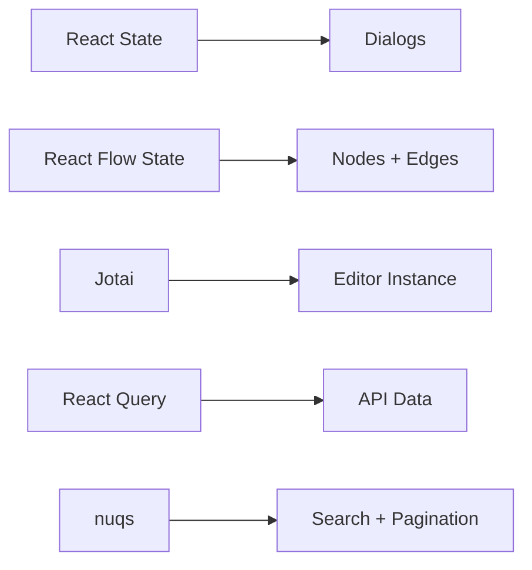

State usage:

- React Query: API data and cache.
- Jotai: stores React Flow editor instance.
- React Flow state: nodes and edges.
- nuqs: search and pagination query params.
- React local state: dialogs, input editing, UI state.

## 9. Backend Architecture

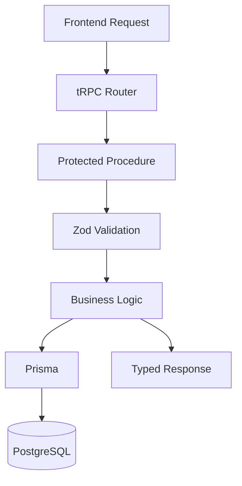

The backend uses tRPC routers. Every important mutation or query goes through a protected procedure. That means the backend checks if the user is logged in before accessing workflows, credentials, or executions.

Important backend modules:

- `workflows` router: create, save, rename, delete, execute workflows.
- `credentials` router: create, update, delete encrypted credentials.
- `executions` router: fetch execution history.
- Inngest function: runs workflows asynchronously.

## 10. Authentication Flow

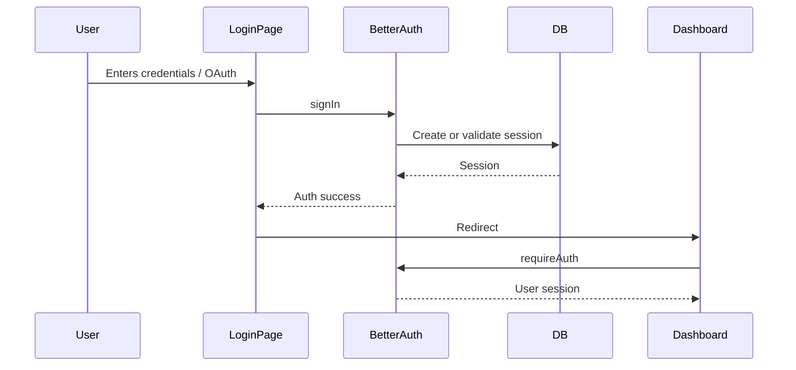

Authentication is handled by Better Auth. It supports email/password, GitHub, and Google login. Protected pages call `requireAuth`, and protected APIs use `protectedProcedure`. This ensures users can only access their own workflows and credentials.

Code idea:

```ts
const session = await auth.api.getSession({
  headers: await headers(),
});

if (!session) {
  redirect("/login");
}
```

## 11. Resume Bullet Questions

### Bullet 1

> Built a visual workflow automation platform where users create, save, and execute node-based workflows.

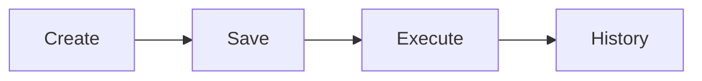

Question: What does node-based workflow mean?

Answer:

A node-based workflow means each operation is represented as a node. For example, one node can make an HTTP request, another can call OpenAI, and another can send a Slack message. Edges define the order in which these nodes run.

Question: How is a workflow saved?

Answer:

The frontend sends nodes and edges to the backend. The backend stores nodes in the `Node` table and connections in the `Connection` table using Prisma.

Question: Why not store the workflow as one JSON object?

Answer:

Storing nodes and edges separately makes it easier to query, update, validate ownership, and connect executions with individual workflow parts. JSON is still used inside each node for flexible configuration.

### Bullet 2

> Developed a React Flow editor with draggable nodes, edge connections, workflow saving, and execution controls.

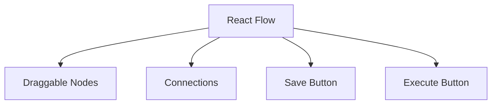

Question: Why did you use React Flow?

Answer:

React Flow provides built-in support for draggable nodes, edges, handles, minimap, controls, and canvas interactions. It saved time and gave a reliable base for building the workflow editor.

Question: How do you add a node?

Answer:

The user clicks the add-node button, selects a node type from the node selector, and the editor adds a new React Flow node with a generated ID, position, type, and empty data.

Question: How do you connect nodes?

Answer:

React Flow provides an `onConnect` callback. When the user connects two handles, the editor adds an edge between source and target nodes.

Code idea:

```ts
const onConnect = useCallback(
  (params: Connection) =>
    setEdges((edgesSnapshot) => addEdge(params, edgesSnapshot)),
  [],
);
```

### Bullet 3

> Implemented secure workflow, credential, and execution APIs using tRPC, Prisma, PostgreSQL, and user-scoped queries.

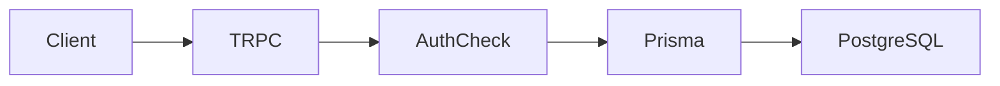

Question: What are user-scoped queries?

Answer:

User-scoped queries mean every database query checks the logged-in user's ID. For example, when fetching a workflow, the query checks both `workflowId` and `userId`, so one user cannot access another user's workflow.

Code idea:

```ts
return prisma.workflow.findUniqueOrThrow({
  where: {
    id: input.id,
    userId: ctx.auth.user.id,
  },
});
```

Question: Why tRPC?

Answer:

tRPC gives type-safe APIs between frontend and backend. Since the project is full-stack TypeScript, it avoids manually writing REST types and reduces API mismatch errors.

Question: How are credentials secured?

Answer:

Credentials are encrypted before storing in PostgreSQL. During execution, the backend decrypts the credential only when needed by a node executor.

Code idea:

```ts
value: encrypt(value)
```

### Bullet 4

> Designed an asynchronous workflow engine using Inngest, DAG-based node ordering, execution history, and error tracking.

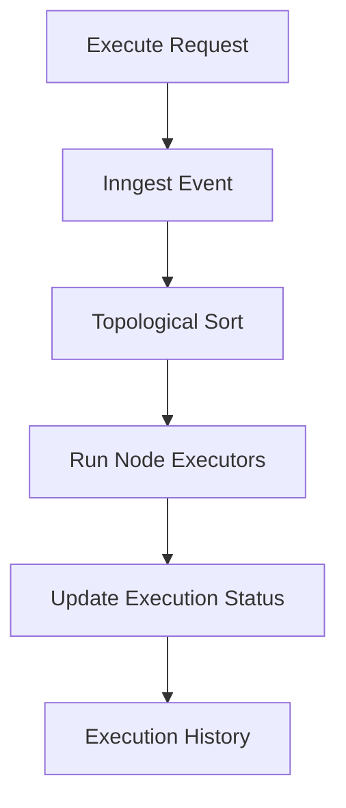

Question: Why asynchronous execution?

Answer:

Workflows may call external APIs, AI providers, or webhooks, which can take time. Running them asynchronously keeps the user request fast and allows retries, status tracking, and execution history.

Question: What is DAG-based ordering?

Answer:

DAG means Directed Acyclic Graph. In this project, nodes are connected in one direction, and cycles should not exist. The backend uses topological sorting to run nodes in the correct dependency order.

Question: How is error tracking handled?

Answer:

If execution fails, Inngest's failure handler updates the execution record as `FAILED` and stores the error message and stack trace. The UI shows these details in execution history.

## 12. Most Likely Interview Questions

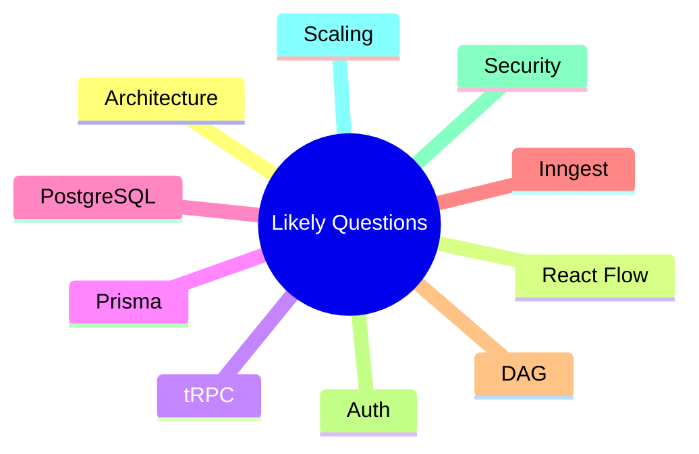

### 1. Explain your project.

Nodeflowz is a workflow automation platform. Users visually create workflows using React Flow, save them to PostgreSQL, and execute them through Inngest. The backend uses tRPC and Prisma, with protected APIs and user-scoped database queries.

### 2. What was your role?

I worked on the full-stack implementation, especially the visual workflow editor, workflow APIs, credential APIs, workflow execution engine, and execution history.

### 3. What is the most important feature?

The most important feature is the workflow execution engine. It loads saved nodes and connections, sorts them in dependency order using DAG logic, runs each node executor, and stores the final output or error.

### 4. What is React Flow used for?

React Flow is used to build the visual editor. It handles draggable nodes, edge connections, handles, minimap, and canvas controls.

### 5. What is tRPC used for?

tRPC is used for type-safe API communication between the frontend and backend.

### 6. What is Prisma used for?

Prisma is used as the ORM to define models, run migrations, and query PostgreSQL.

### 7. Why PostgreSQL?

PostgreSQL fits the relational structure of the app: users own workflows, workflows contain nodes and connections, and executions belong to workflows. It also supports JSON fields for flexible node data.

### 8. What is Inngest used for?

Inngest is used to run workflow executions asynchronously in the background.

### 9. Why not execute workflows directly inside API request?

Because workflows can be slow and involve external APIs. Running them in a background engine keeps the API response fast and improves reliability.

### 10. How do you protect user data?

Pages use `requireAuth`, APIs use protected tRPC procedures, and database queries are scoped by `userId`.

## 13. Difficult Questions With Safe Answers

### Is this project production-ready?

It has many production-oriented parts like authentication, encrypted credentials, execution history, async jobs, and Sentry. But I would still improve webhook signature verification, rate limiting, test coverage, workflow versioning, and secrets management before calling it fully production-ready.

### What is the biggest weakness?

The current workflow save logic is simple because it replaces nodes and connections during save. This works for the current scale, but for large workflows I would improve it using diff-based updates.

### What happens if a workflow contains a cycle?

The backend uses topological sorting, which can detect cyclic graphs. In the future, I would also prevent cycles directly in the editor before saving.

### What happens if one node fails?

The executor throws an error, Inngest marks the execution as failed, and the error message and stack trace are stored in the database for the user to inspect.

### How would you scale this?

I would keep the frontend on Vercel, use PostgreSQL with connection pooling, move heavy execution to background workers through Inngest, add Redis for caching and rate limits, and add worker concurrency controls.

## 14. Scaling Diagram

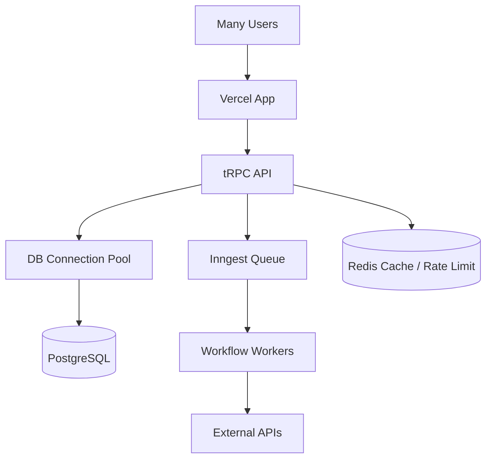

The app can scale by separating user requests from workflow execution. The frontend and APIs can scale horizontally, while Inngest handles background jobs. PostgreSQL should use connection pooling, and Redis can be added later for caching and rate limiting.

## 15. Security Diagram

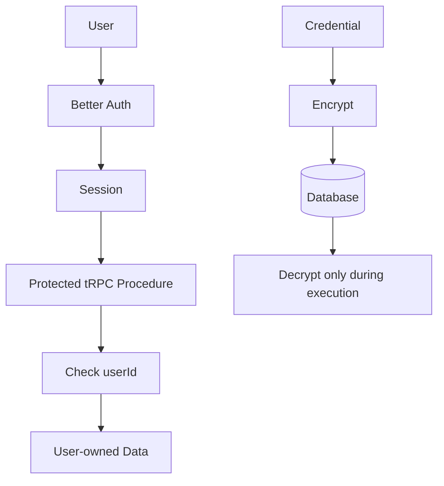

Security is handled in three layers:

1. User must be authenticated.
2. API checks ownership using `userId`.
3. Credentials are encrypted before storage.

## 16. Final Best Project Pitch

Use this in interviews:

> Nodeflowz is a full-stack workflow automation platform where users can visually build workflows using draggable nodes and connections. I built the editor using React Flow, created type-safe APIs with tRPC, stored workflows in PostgreSQL using Prisma, and executed workflows asynchronously using Inngest. The backend stores workflows as nodes and connections, sorts them using DAG-based topological ordering, executes each node, and saves execution history with success, failure, output, and errors.

This is short, impressive, and safe.

## 17. Code-Level Understanding

### Protected API

```ts
const session = await auth.api.getSession({
  headers: await headers(),
});

if (!session) {
  throw new TRPCError({
    code: "UNAUTHORIZED",
    message: "Unauthorized",
  });
}
```

Say:

> This protects backend APIs so unauthenticated users cannot access workflow data.

### User-scoped query

```ts
await prisma.workflow.findUniqueOrThrow({
  where: {
    id: input.id,
    userId: ctx.auth.user.id,
  },
});
```

Say:

> This prevents one user from accessing another user's workflow.

### Workflow execution loop

```ts
for (const node of sortedNodes) {
  const executor = getExecutor(node.type as NodeType);

  context = await executor({
    data: node.data as Record<string, unknown>,
    nodeId: node.id,
    userId,
    context,
    step,
    publish,
  });
}
```

Say:

> Each node receives the current context and returns updated context, so output from one node can be used by later nodes.

### DAG sorting

```ts
const edges = connections.map((conn) => [
  conn.fromNodeId,
  conn.toNodeId,
]);

const sortedNodeIds = toposort(edges);
```

Say:

> This converts graph connections into an execution order.

## 18. What Not To Say

Avoid:

- "I built a no-code platform like Zapier."
- "It is fully production ready."
- "React Flow executes the workflow."
- "Credentials are safe because input type is password."
- "The frontend handles security."

Say instead:

- "I built a workflow automation platform with visual node-based execution."
- "It has production-oriented features, and I know what I would improve next."
- "React Flow is only the editor. Execution happens on the backend using Inngest."
- "Credentials are encrypted before being stored and decrypted only during execution."
- "Security is enforced on backend APIs using session checks and user-scoped queries."

## 19. One-Line Answers

What is Nodeflowz?

> A visual workflow automation platform for creating, saving, and executing node-based workflows.

What did you build?

> The workflow editor, APIs, credential handling, execution engine, and execution history.

What is the hardest part?

> Executing graph-based workflows correctly using dependency ordering and async execution.

What is the best technical decision?

> Using Inngest for asynchronous workflow execution instead of running workflows inside API requests.

What would you improve?

> Webhook security, rate limiting, workflow versioning, tests, and diff-based graph saving.
