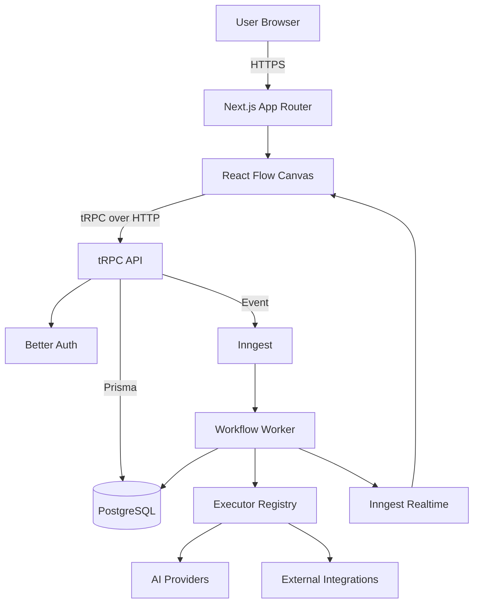

# Nodeflowz Interview Preparation Guide

This guide contains detailed, project-specific interview answers for Nodeflowz.
It covers the architecture, implementation decisions, current limitations, and
production-scale improvements discussed across questions 01-80.

Each section includes:

- Interview-ready explanations.
- Examples based on the Nodeflowz codebase.
- TypeScript, Prisma, SQL, YAML, and infrastructure examples.
- Mermaid architecture and sequence diagrams.
- Clear distinctions between the current implementation and proposed
  production improvements.

## Sections

| Section | Questions | Topics |
|---|---:|---|
| [01. Project Walkthrough](./01-project-walkthrough.md) | 01-07 | Product purpose, architecture, workflow nodes, data flow, Prisma schema, scaling |
| [02. TypeScript & Next.js](./02-typescript-and-nextjs.md) | 08-16 | Server and Client Components, TypeScript types, environment variables, caching, tRPC |
| [03. React & Drag-and-Drop Canvas](./03-react-and-drag-drop-canvas.md) | 17-23 | React Flow state, controlled canvas, rendering, validation, undo/redo, reconciliation |
| [04. Node.js & Event Loop](./04-nodejs-and-event-loop.md) | 24-29 | Event loop, scheduling APIs, CPU work, streams, backpressure |
| [05. API Design & REST](./05-api-design-and-rest.md) | 30-35 | HTTP methods, idempotency, webhooks, versioning, rate limiting, API protocols |
| [06. Background Jobs & Queue](./06-background-jobs-and-queue.md) | 36-42 | Async execution, retries, delivery semantics, DLQs, realtime status, priority queues |
| [07. PostgreSQL & Prisma](./07-postgresql-and-prisma.md) | 43-50 | N+1 queries, indexes, migrations, transactions, tenant isolation, MVCC, denormalization |
| [08. Authentication & Security](./08-authentication-and-security.md) | 51-57 | Authentication, authorization, JWTs, RBAC, CSRF/XSS, credentials, API keys |
| [09. SaaS & Subscriptions](./09-saas-and-subscriptions.md) | 58-62 | Usage limits, billing flow, paywalls, entitlements, Stripe webhook idempotency |
| [10. AI Provider Integration](./10-ai-provider-integration.md) | 63-67 | Provider abstraction, failure handling, prompt injection, streaming, runtime plugins |
| [11. System Design](./11-system-design.md) | 68-74 | Architecture, DAG execution, scheduling, large-scale logs, circuit breakers, multi-region |
| [12. DevOps & Tooling](./12-devops-and-tooling.md) | 75-80 | Biome, mprocs, Sentry, CI/CD, Docker, ECS and Kubernetes autoscaling |

## Architecture Summary

## Recommended Interview Structure

For broad architecture questions, answer in this order:

1. State the problem Nodeflowz solves.
2. Describe the current implementation.
3. Explain why the implementation was chosen.
4. Identify its trade-offs and limitations.
5. Describe how it would evolve at greater scale.

For advanced system-design questions, explicitly discuss:

- Failure modes.
- Idempotency.
- Concurrency and race conditions.
- Tenant isolation.
- Observability.
- Cost and operational trade-offs.

## Current Implementation vs Proposed Design

Some answers describe production-scale designs that are not currently
implemented in the repository. Examples include:

- Distributed rate limiting.
- Dead-letter queues.
- Cron scheduling.
- Conditional and parallel graph execution.
- PostgreSQL Row-Level Security.
- Runtime AI provider plugins.
- Multi-region active-active deployment.

These are labeled as proposed designs so the guide accurately represents the
current project while still demonstrating system-design knowledge.
