# Frontend Interview Questions 001-050

## 001. What is Nodeflowz from a frontend user's point of view?

Nodeflowz is a visual workflow automation application. From the frontend
perspective, the main experience is a dashboard where a user creates workflows,
opens a drag-and-drop canvas, adds trigger and action nodes, configures each
node through dialogs, saves the graph, and executes it.

I would explain it to an interviewer as:

> The frontend turns a backend workflow engine into an understandable visual
> product. Instead of asking users to write scripts, the UI lets them build a
> graph of connected nodes. The canvas is the primary interface, while the
> surrounding pages handle workflows, credentials, executions, and account
> navigation.

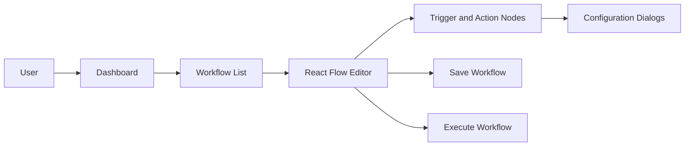

## 002. Which frontend framework is used in this repo?

The repo uses Next.js App Router with React and TypeScript. The frontend is not
a separate SPA; it lives in the same full-stack Next.js application as the API
routes, tRPC route, auth route, webhook routes, and Inngest route.

Key dependencies include:

```json
{
  "next": "^16.0.10",
  "react": "^19.2.4",
  "typescript": "^5.9.3",
  "@xyflow/react": "^12.10.1",
  "@tanstack/react-query": "^5.90.21",
  "@trpc/client": "^11.12.0",
  "jotai": "^2.18.1",
  "nuqs": "^2.8.9"
}
```

Interview answer:

> Nodeflowz uses Next.js App Router with React and TypeScript. For the visual
> workflow canvas it uses React Flow, for server communication it uses tRPC
> with TanStack Query, and for small shared editor state it uses Jotai.

## 003. Why is the workflow editor built as a React Client Component?

The editor must run in the browser because it depends on interactions that
cannot happen in a Server Component: dragging nodes, connecting edges, opening
dialogs, reading viewport coordinates, storing local graph state, and receiving
React Flow events.

Current code:

```tsx
"use client";

export const Editor = ({ workflowId }: { workflowId: string }) => {
  const { data: workflow } = useSuspenseWorkflow(workflowId);
  const [nodes, setNodes] = useState<Node[]>(workflow.nodes);
  const [edges, setEdges] = useState<Edge[]>(workflow.edges);

  return (
    <ReactFlow
      nodes={nodes}
      edges={edges}
      onNodesChange={onNodesChange}
      onEdgesChange={onEdgesChange}
      onConnect={onConnect}
    />
  );
};
```

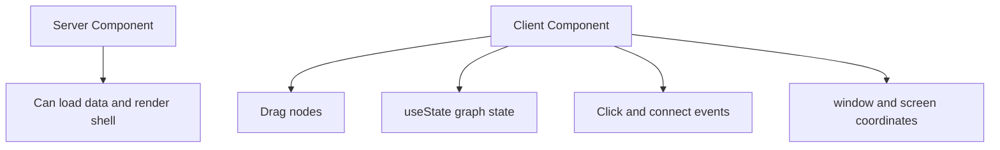

Interview answer:

> The editor is a Client Component because React Flow is an interactive browser
> library. The canvas needs local state, event handlers, browser coordinates,
> and immediate user interaction. I can still use Server Components around it
> for layout or initial data strategy, but the canvas itself must hydrate and
> run on the client.

## 004. What does the `"use client"` directive do in files like the editor and dialogs?

`"use client"` marks a module as a Client Component entry point in the Next.js
App Router. Everything exported from that file is allowed to use browser-only
features such as hooks, event handlers, DOM APIs, React Flow, and form state.

Examples in this repo include:

```tsx
"use client";

import { useState } from "react";
import { ReactFlow } from "@xyflow/react";
```

and:

```tsx
"use client";

import { useForm } from "react-hook-form";
import { Dialog } from "@/components/ui/dialog";
```

The important trade-off is bundle size. Client Components ship JavaScript to
the browser, so I keep them for genuinely interactive parts and leave static or
server-data-heavy work on the server where possible.

## 005. What is the purpose of `src/app/layout.tsx`?

`src/app/layout.tsx` is the root layout for the entire application. It defines
global fonts, global CSS, and app-wide providers.

Current pattern:

```tsx
export default function RootLayout({ children }: { children: React.ReactNode }) {
  return (
    <html lang="en">
      <body className={`${geistSans.variable} ${geistMono.variable} antialiased`}>
        <TRPCReactProvider>
          <NuqsAdapter>
            <Provider>
              {children}
              <Toaster />
            </Provider>
          </NuqsAdapter>
        </TRPCReactProvider>
      </body>
    </html>
  );
}
```

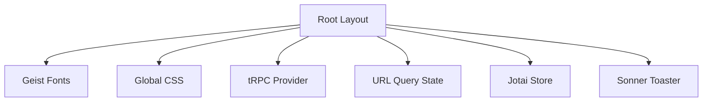

Interview answer:

> The root layout is where global application context is established. In
> Nodeflowz, it wraps every page with tRPC/TanStack Query for data fetching,
> nuqs for URL state, Jotai for shared client state, and Sonner for toast
> notifications.

## 006. Why are `TRPCReactProvider`, `NuqsAdapter`, `Jotai Provider`, and `Toaster` mounted at the root layout?

They are mounted at the root because many unrelated pages need them:

- Workflow pages need tRPC queries and mutations.
- List pages need URL-backed search and pagination through `nuqs`.
- The editor stores the React Flow instance in Jotai.
- Create, save, delete, and execute actions show Sonner toasts.

This avoids repeatedly wrapping feature pages and gives a single consistent
runtime context.

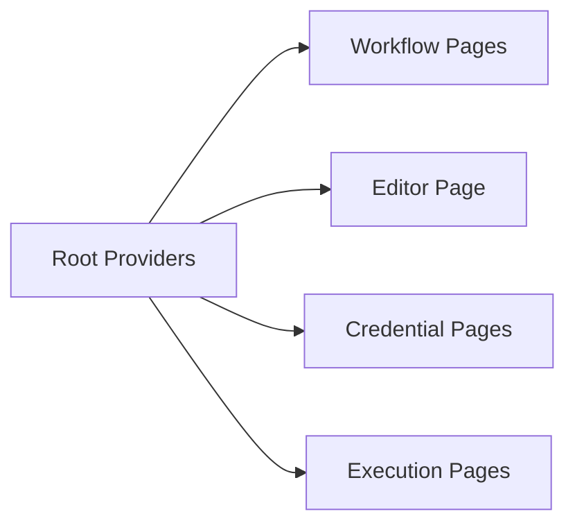

The trade-off is that provider code becomes part of the app shell. For very
large apps, I would consider moving heavy providers closer to only the routes
that need them.

## 007. What is React Flow used for in Nodeflowz?

React Flow powers the visual workflow canvas. It provides the primitives for
rendering draggable nodes, directed edges, connection handles, panels, minimap,
viewport controls, and graph-change events.

Current usage:

```tsx
<ReactFlow
  nodes={nodes}
  edges={edges}
  onNodesChange={onNodesChange}
  onEdgesChange={onEdgesChange}
  onConnect={onConnect}
  nodeTypes={nodeComponents}
  fitView
  snapGrid={[10, 10]}
  snapToGrid
>
  <Background />
  <Controls position="top-left" />
  <MiniMap />
</ReactFlow>
```

Interview answer:

> React Flow handles the graph editing layer. Nodeflowz supplies the domain
> concepts: node types, configuration dialogs, save behavior, execution
> behavior, and validation. React Flow gives us the canvas mechanics.

## 008. What are nodes and edges in the workflow canvas?

A node is one workflow step. An edge is a directed dependency between two
steps.

Example:

```ts
const nodes = [
  {
    id: "manual-trigger",
    type: NodeType.MANUAL_TRIGGER,
    position: { x: 0, y: 0 },
    data: {},
  },
  {
    id: "openai",
    type: NodeType.OPENAI,
    position: { x: 280, y: 0 },
    data: { variableName: "summary" },
  },
];

const edges = [
  {
    id: "edge-1",
    source: "manual-trigger",
    target: "openai",
    sourceHandle: "main",
    targetHandle: "main",
  },
];
```

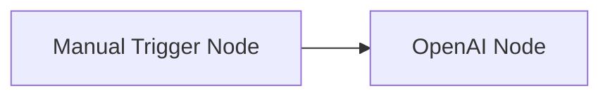

In the database, nodes become Prisma `Node` records and edges become
`Connection` records.

## 009. What is the difference between a trigger node and an execution/action node?

A trigger node starts a workflow. An execution or action node performs work
after a trigger has started the workflow.

Trigger examples:

- `MANUAL_TRIGGER`
- `GOOGLE_FORM_TRIGGER`
- `STRIPE_TRIGGER`

Execution examples:

- `HTTP_REQUEST`
- `OPENAI`
- `GEMINI`
- `ANTHROPIC`
- `TINYFISH`
- `GOOGLE_SHEETS`
- `SLACK`
- `DISCORD`

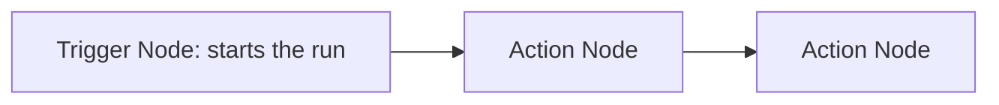

Interview answer:

> Triggers define when a workflow begins, while action nodes define what the
> workflow does. That separation matters because validation, execution entry
> points, and UI affordances are different for starter nodes and processing
> nodes.

## 010. What is the purpose of the initial placeholder node?

When a blank workflow is created, the backend creates an `INITIAL` node. This
gives the canvas something useful to render before the user chooses a real
trigger.

Current frontend:

```tsx
export const InitialNode = memo((props: NodeProps) => {
  const [selectorOpen, setSelectorOpen] = useState(false);

  return (
    <NodeSelector open={selectorOpen} onOpenChange={setSelectorOpen}>
      <WorkflowNode showToolbar={false}>
        <PlaceholderNode {...props} onClick={() => setSelectorOpen(true)}>
          <PlusIcon className="size-4" />
        </PlaceholderNode>
      </WorkflowNode>
    </NodeSelector>
  );
});
```

When the user selects a real node, `NodeSelector` replaces the initial node:

```ts
if (hasInitialTrigger) {
  return [newNode];
}
```

This creates a clean onboarding path: the first thing the user sees is an
obvious plus button on the canvas.

## 011. How does the `AddNodeButton` open the node selector?

`AddNodeButton` owns a small boolean state called `selectorOpen`. Clicking the
button sets it to `true`, and that value controls the `NodeSelector` sheet.

```tsx
export const AddNodeButton = memo(() => {
  const [selectorOpen, setSelectorOpen] = useState(false);

  return (
    <NodeSelector open={selectorOpen} onOpenChange={setSelectorOpen}>
      <Button onClick={() => setSelectorOpen(true)} size="icon" variant="outline">
        <PlusIcon />
      </Button>
    </NodeSelector>
  );
});
```

Interview answer:

> The add button is a tiny controlled wrapper around the node selector. It
> stores the open/closed state locally because no other component needs to own
> that state.

## 012. Why does `AddNodeButton` use `memo`?

`memo` prevents the button from re-rendering unless its props change. In this
case there are no props, so the button can stay stable while the editor
rerenders due to node movement, edge changes, or query state changes.

```tsx
export const AddNodeButton = memo(() => {
  // local state only
});

AddNodeButton.displayName = "AddNodeButton";
```

This is a small optimization. It is not the primary performance strategy for
the canvas, but it is reasonable because the button is embedded in a frequently
updating editor surface.

## 013. What is the purpose of `NodeSelector`?

`NodeSelector` is the UI and logic for adding nodes to the canvas. It shows
available trigger and execution node types, creates a new React Flow node, and
inserts it into the current graph.

Important responsibilities:

- Render trigger and execution choices.
- Prevent duplicate manual triggers.
- Calculate the new node position in flow coordinates.
- Generate a stable node ID.
- Replace the initial placeholder node if present.
- Close the sheet after selection.

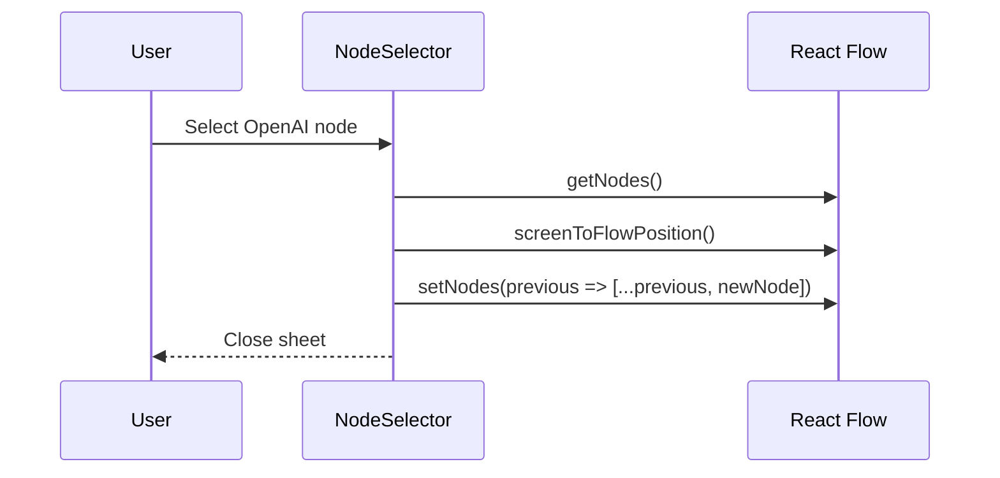

## 014. How are trigger nodes and execution nodes displayed in the selector?

The selector uses two arrays of options:

```ts
const triggerNodes: NodeTypeOption[] = [
  {
    type: NodeType.MANUAL_TRIGGER,
    label: "Trigger manually",
    description: "Runs the flow on clicking a button.",
    icon: MousePointerIcon,
  },
];

const executionNodes: NodeTypeOption[] = [
  {
    type: NodeType.HTTP_REQUEST,
    label: "HTTP Request",
    description: "Makes an HTTP Request",
    icon: GlobeIcon,
  },
];
```

Each option is rendered as a clickable row. The separator between trigger and
execution nodes helps the user understand that "starting a workflow" and
"doing work inside a workflow" are different concepts.

## 015. Why are icons sometimes React components and sometimes image paths?

Built-in generic icons use `lucide-react` components, while brand-specific
integrations use image paths under `public/logos`.

```tsx
{typeof Icon === "string" ? (
  
) : (
  <Icon className="size-5" />
)}
```

This lets the UI use clean vector icons for generic actions such as "manual
trigger" or "HTTP request", while showing recognizable logos for Google Sheets,
OpenAI, Slack, Discord, Stripe, and similar integrations.

## 016. What is the role of `lucide-react` in the frontend?

`lucide-react` provides icon components used across buttons, nodes, and status
indicators. Examples include `PlusIcon`, `FlaskConicalIcon`, `GlobeIcon`,
`MousePointerIcon`, `CheckCircle2Icon`, `Loader2Icon`, and `XCircleIcon`.

Example:

```tsx
<Button size="lg">
  <FlaskConicalIcon className="size-4" />
  Execution workflow
</Button>
```

Using a standard icon set keeps the UI consistent and avoids custom SVG
duplication.

## 017. What does Tailwind CSS provide in this project?

Tailwind provides utility classes for spacing, layout, typography, colors,
states, borders, responsive behavior, and component composition.

Example:

```tsx
<div className="flex items-center gap-6 w-full overflow-hidden">
  <span className="font-medium text-sm">{nodeType.label}</span>
  <span className="text-xs text-muted-foreground">
    {nodeType.description}
  </span>
</div>
```

Interview answer:

> Tailwind is the styling layer. It lets the project build consistent UI
> quickly while reusing design tokens such as `bg-card`, `text-muted-foreground`,
> `border`, and `bg-background` from the app's theme.

## 018. What is the purpose of the `cn` utility?

`cn` combines class names and resolves Tailwind conflicts. It is typically
implemented using `clsx` and `tailwind-merge`.

Example from `BaseNode`:

```tsx
className={cn(
  "bg-card hover:bg-accent text-card-foreground relative rounded-sm border",
  "hover:ring-1",
  className,
)}
```

This lets components provide defaults while still accepting caller overrides.

## 019. Why does the app use reusable UI components under `src/components/ui`?

The `ui` folder contains reusable design-system primitives: buttons, dialogs,
forms, sheets, selects, inputs, sidebars, tooltips, tables, and more. These are
low-level components that are not tied to workflow-specific business logic.

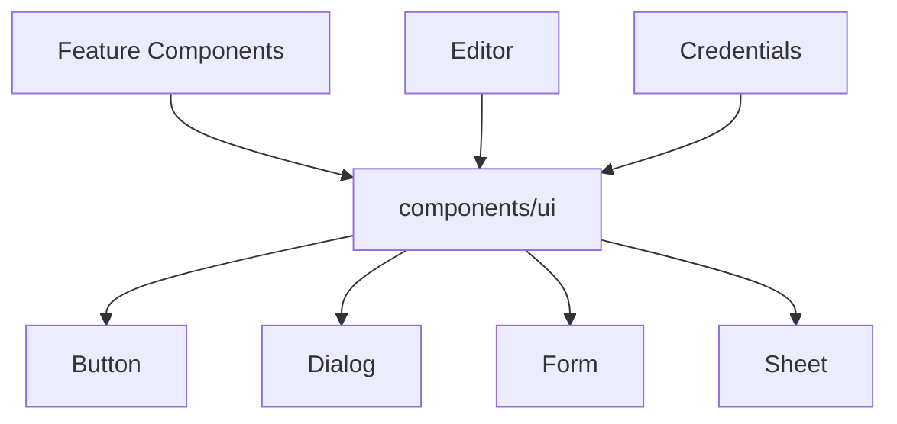

Interview answer:

> The reusable UI layer keeps styling and behavior consistent. Feature
> components compose these primitives with domain logic, instead of each page
> inventing its own dialog, button, form, or select styles.

## 020. What is the role of `sonner` toasts in workflow actions?

Sonner shows immediate feedback after actions such as creating, saving,
renaming, deleting, or executing workflows.

Example:

```ts
return useMutation(
  trpc.workflows.update.mutationOptions({
    onSuccess: (data) => {
      toast.success(`Workflow "${data.name}" saved`);
    },
    onError: (error) => {
      toast.error(`Failed to save workflow: ${error.message}`);
    },
  }),
);
```

Toasts are useful because these actions may not visibly change the current
screen. The toast confirms whether the operation succeeded or failed.

## 021. How does `Editor` load workflow data before rendering the canvas?

The editor calls `useSuspenseWorkflow(workflowId)`, which uses tRPC query
options with TanStack Query's `useSuspenseQuery`.

```ts
export const useSuspenseWorkflow = (id: string) => {
  const trpc = useTRPC();
  return useSuspenseQuery(trpc.workflows.getOne.queryOptions({ id }));
};
```

Then the editor initializes local graph state:

```tsx
const { data: workflow } = useSuspenseWorkflow(workflowId);
const [nodes, setNodes] = useState<Node[]>(workflow.nodes);
const [edges, setEdges] = useState<Edge[]>(workflow.edges);
```

The important point is that server data is the initial source of truth, but
while editing, the browser owns unsaved graph state.

## 022. Why does `Editor` use `useSuspenseWorkflow` instead of a plain fetch call?

`useSuspenseWorkflow` gives the editor a typed, cached, suspense-aware data
source through tRPC and TanStack Query. A plain `fetch` call would require more
manual work: constructing URLs, parsing JSON, handling errors, manually typing
responses, and managing cache invalidation.

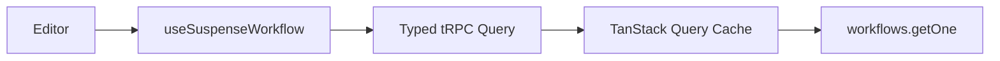

Interview answer:

> I use the project data layer rather than a raw fetch so the editor gets
> inferred input/output types, shared caching, Suspense integration, and query
> invalidation that works consistently with other workflow operations.

## 023. How are `nodes` and `edges` initialized in the editor?

They are initialized from the workflow returned by `workflows.getOne`.

```tsx
const { data: workflow } = useSuspenseWorkflow(workflowId);

const [nodes, setNodes] = useState<Node[]>(workflow.nodes);
const [edges, setEdges] = useState<Edge[]>(workflow.edges);
```

The backend maps Prisma records into React Flow shapes:

```ts
const nodes: Node[] = workflow.nodes.map((node) => ({
  id: node.id,
  type: node.type,
  position: node.position as { x: number; y: number },
  data: (node.data as Record<string, unknown>) || {},
}));

const edges: Edge[] = workflow.connections.map((connection) => ({
  id: connection.id,
  source: connection.fromNodeId,
  target: connection.toNodeId,
  sourceHandle: connection.fromOutput,
  targetHandle: connection.toInput,
}));
```

## 024. Is the React Flow canvas controlled or uncontrolled in this project?

It is controlled. The editor passes `nodes` and `edges` as props and updates
them through callbacks.

```tsx
<ReactFlow
  nodes={nodes}
  edges={edges}
  onNodesChange={onNodesChange}
  onEdgesChange={onEdgesChange}
  onConnect={onConnect}
/>
```

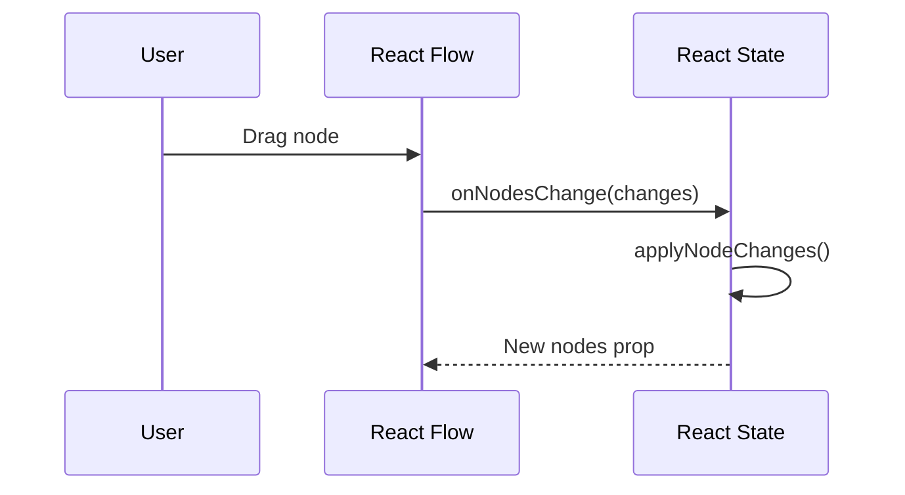

Interview answer:

> The canvas is controlled because React state owns the node and edge arrays.
> React Flow emits change objects, and the editor applies those changes back to
> state. This makes saving, validation, and derived UI easier because the graph
> is available in React.

## 025. What do `onNodesChange`, `onEdgesChange`, and `onConnect` do?

They translate React Flow events into state updates.

```tsx
const onNodesChange = useCallback(
  (changes: NodeChange[]) =>
    setNodes((nodesSnapshot) => applyNodeChanges(changes, nodesSnapshot)),
  [],
);

const onEdgesChange = useCallback(
  (changes: EdgeChange[]) =>
    setEdges((edgesSnapshot) => applyEdgeChanges(changes, edgesSnapshot)),
  [],
);

const onConnect = useCallback(
  (params: Connection) =>
    setEdges((edgesSnapshot) => addEdge(params, edgesSnapshot)),
  [],
);
```

`onNodesChange` handles node movement, selection, and deletion. `onEdgesChange`
handles edge updates. `onConnect` creates a new edge when the user connects two
handles.

## 026. Why are React Flow handlers wrapped in `useCallback`?

React Flow receives these handlers as props. If the editor created new function
objects on every render, React Flow would see changing props constantly.

`useCallback` gives stable function references:

```ts
const onConnect = useCallback((params: Connection) => {
  setEdges((edgesSnapshot) => addEdge(params, edgesSnapshot));
}, []);
```

The callbacks can have empty dependency arrays because they use functional
state updates instead of reading `nodes` or `edges` from closure.

Interview answer:

> I use `useCallback` here for referential stability. It helps a complex child
> library like React Flow avoid unnecessary work, especially during frequent
> interactions like dragging or connecting nodes.

## 027. Why do the state setters use functional updates?

Functional updates receive the latest state snapshot from React, avoiding stale
closures.

Good:

```ts
setEdges((edgesSnapshot) => addEdge(params, edgesSnapshot));
```

Riskier:

```ts
setEdges(addEdge(params, edges));
```

The second version closes over whatever `edges` was during render. During fast
interactions, batched updates, or stable callbacks, that can produce stale
updates. Functional updates also allow the callback dependency array to stay
empty safely.

## 028. How does `applyNodeChanges` differ from manually replacing the nodes array?

React Flow emits change objects, not necessarily full node replacements.
`applyNodeChanges` applies those changes according to React Flow's internal
semantics.

```ts
setNodes((nodesSnapshot) =>
  applyNodeChanges(changes, nodesSnapshot),
);
```

It handles cases like:

- Position changes.
- Selection changes.
- Node removal.
- Dimension updates.

Manually mapping the array is possible for simple movement, but it is easier to
miss React Flow-specific change types.

## 029. How does `addEdge` help preserve React Flow edge behavior?

`addEdge` creates an edge from a connection object using React Flow's expected
shape. It respects source, target, and handle metadata.

```ts
const onConnect = useCallback(
  (params: Connection) =>
    setEdges((edgesSnapshot) => addEdge(params, edgesSnapshot)),
  [],
);
```

In a more advanced implementation, I would wrap `addEdge` with validation:

```ts
const onConnect = useCallback((connection: Connection) => {
  if (!isValidConnection(connection, getNodes())) {
    toast.error("This connection is not allowed");
    return;
  }

  setEdges((edgesSnapshot) => addEdge(connection, edgesSnapshot));
}, [getNodes]);
```

## 030. Why is `hasManualTrigger` derived with `useMemo`?

The editor derives whether the workflow contains a manual trigger:

```ts
const hasManualTrigger = useMemo(() => {
  return nodes.some((node) => node.type === NodeType.MANUAL_TRIGGER);
}, [nodes]);
```

That value controls whether the execute button is shown:

```tsx
{hasManualTrigger && (
  <Panel position="bottom-center">
    <ExecuteWorkflowButton workflowId={workflowId} />
  </Panel>
)}
```

The computation is small, so `useMemo` is not strictly required. But it
communicates that the value is derived from graph state and keeps the pattern
ready for heavier graph-derived values such as validation results.

## 031. When would `useMemo` be unnecessary in this editor?

`useMemo` is unnecessary when a calculation is cheap and does not affect
referential equality of child props or dependencies.

For example, this would usually be fine:

```ts
const hasManualTrigger = nodes.some(
  (node) => node.type === NodeType.MANUAL_TRIGGER,
);
```

I would prioritize `useMemo` for:

- Expensive graph validation.
- Derived maps such as `nodeById`.
- Topological order preview.
- Objects passed to memoized children.
- Values used in dependency arrays.

Interview answer:

> Memoization is not a decoration. I use it when it avoids real work, preserves
> stable references, or clarifies a derived value that may grow more expensive.

## 032. What would happen if `nodeComponents` were recreated inside the editor on every render?

React Flow uses the `nodeTypes` object to decide which React component renders
each node type. If that object is recreated every render, React Flow receives a
new registry reference constantly.

Current good pattern:

```ts
export const nodeComponents = {
  [NodeType.INITIAL]: InitialNode,
  [NodeType.HTTP_REQUEST]: HttpRequestNode,
  [NodeType.OPENAI]: OpenAiNode,
  [NodeType.SLACK]: SlackNode,
} as const satisfies NodeTypes;
```

Then:

```tsx
<ReactFlow nodeTypes={nodeComponents} />
```

Interview answer:

> Keeping the registry outside the component gives React Flow a stable
> `nodeTypes` reference. Recreating it inside the editor can cause unnecessary
> work and warnings because React Flow treats node type changes as meaningful.

## 033. Why is `ReactFlowProvider` needed around the canvas?

`ReactFlowProvider` provides React Flow context to descendants that call hooks
such as `useReactFlow`.

`NodeSelector` uses:

```ts
const { setNodes, getNodes, screenToFlowPosition } = useReactFlow();
```

That hook needs a provider above it:

```tsx
<ReactFlowProvider>
  <ReactFlow>{/* panels and node selector users */}</ReactFlow>
</ReactFlowProvider>
```

Without the provider, components outside the direct React Flow context would
not be able to access the current editor instance.

## 034. How does `useReactFlow` let `NodeSelector` interact with the canvas?

`useReactFlow` exposes imperative helpers and state setters for the current
React Flow instance.

In `NodeSelector`, it provides:

```ts
const { setNodes, getNodes, screenToFlowPosition } = useReactFlow();
```

Those are used to:

- Read existing nodes.
- Prevent duplicate manual triggers.
- Convert screen coordinates into canvas coordinates.
- Insert a new node.

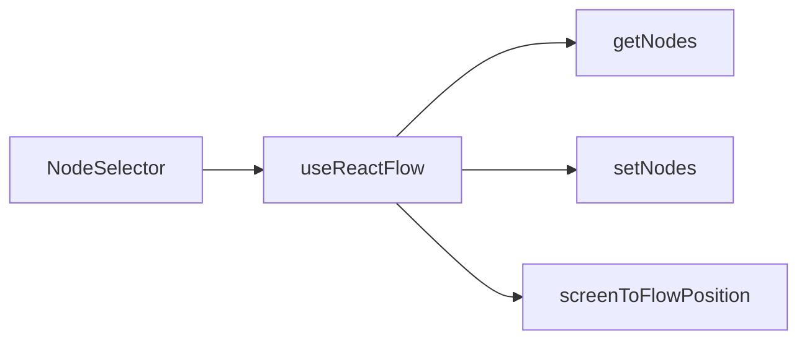

## 035. What does `screenToFlowPosition` solve when adding a new node?

Mouse and viewport coordinates are not the same as canvas coordinates. The
canvas may be panned or zoomed. `screenToFlowPosition` converts browser screen
coordinates into the coordinate system used by React Flow nodes.

Current code:

```ts
const centerX = window.innerWidth / 2;
const centerY = window.innerHeight / 2;

const flowPosition = screenToFlowPosition({
  x: centerX + (Math.random() - 0.5) * 200,
  y: centerY + (Math.random() - 0.5) * 200,
});
```

Interview answer:

> It makes node insertion feel correct regardless of pan or zoom. Without it,
> a node added near the screen center could appear somewhere unexpected in the
> graph coordinate space.

## 036. Why does the node selector generate IDs with `createId`?

Every node needs a stable unique ID for React Flow, React reconciliation,
database persistence, and edge references.

```ts
const newNode = {
  id: createId(),
  data: {},
  position: flowPosition,
  type: selection.type,
};
```

If node IDs collided or changed between renders, edges could point to the
wrong nodes and React could preserve component state incorrectly.

## 037. Why should workflow node IDs be stable?

Stable IDs connect four layers:

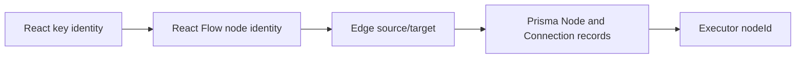

Stable IDs are used for:

- React component identity.
- React Flow graph updates.
- Edge `source` and `target`.
- Database node primary keys.
- Runtime status messages by `nodeId`.

Changing IDs unnecessarily would make the graph harder to reconcile, save, and
execute.

## 038. How does React reconciliation affect dynamic workflow nodes?

React reconciliation is how React compares old and new component trees. For
lists, keys tell React which item is the same item across renders.

Bad:

```tsx
{nodes.map((node, index) => (
  <WorkflowNodeCard key={index} node={node} />
))}
```

Good:

```tsx
{nodes.map((node) => (
  <WorkflowNodeCard key={node.id} node={node} />
))}
```

In Nodeflowz, this matters because nodes can be added, deleted, reordered, and
configured. Bad keys could cause one node's local dialog state or execution
status to appear on another node.

## 039. Why should array indexes not be used as keys for workflow nodes?

Index keys represent position, not identity. If the user inserts a node at the
beginning of a list, every later index changes.

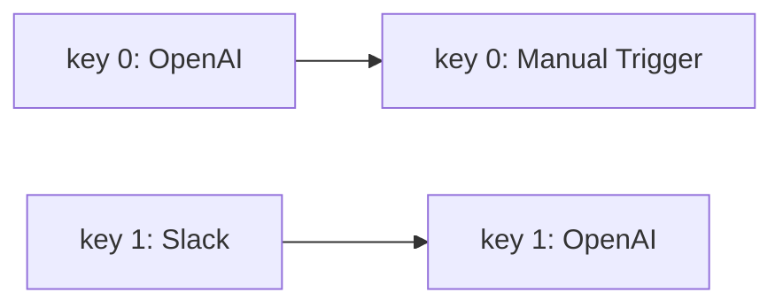

React may then reuse the wrong component instance. In a workflow editor, that
can cause:

- Wrong dialog open state.
- Wrong form draft.
- Wrong status indicator.
- Wrong hover or selection state.

Use the workflow node ID instead.

## 040. How would you prevent unnecessary renders while dragging nodes?

I would keep the drag update path small:

- Use stable handlers with `useCallback`.
- Use functional state updates.
- Keep `nodeTypes` stable outside render.
- Memoize node components.
- Avoid large objects in node `data`.
- Do not run validation or saving on every drag frame.
- Commit undo history on drag stop, not every drag event.

Current examples:

```ts
const onNodesChange = useCallback(
  (changes: NodeChange[]) =>
    setNodes((nodesSnapshot) => applyNodeChanges(changes, nodesSnapshot)),
  [],
);
```

```ts
export const nodeComponents = {
  [NodeType.OPENAI]: OpenAiNode,
} as const satisfies NodeTypes;
```

For large workflows:

```ts
const validationIssues = useMemo(
  () => validateWorkflow(nodes, edges),
  [nodes, edges],
);
```

or debounce heavy work:

```ts
const debouncedSaveDraft = useMemo(
  () => debounce(saveDraft, 500),
  [],
);
```

## 041. How does React Flow represent a workflow graph internally?

React Flow represents the graph as two arrays:

```ts
type CanvasNode = {
  id: string;
  type?: string;
  position: { x: number; y: number };
  data: Record<string, unknown>;
};

type CanvasEdge = {
  id: string;
  source: string;
  target: string;
  sourceHandle?: string | null;
  targetHandle?: string | null;
};
```

The graph is not nested. Edges describe relationships by referencing node IDs.

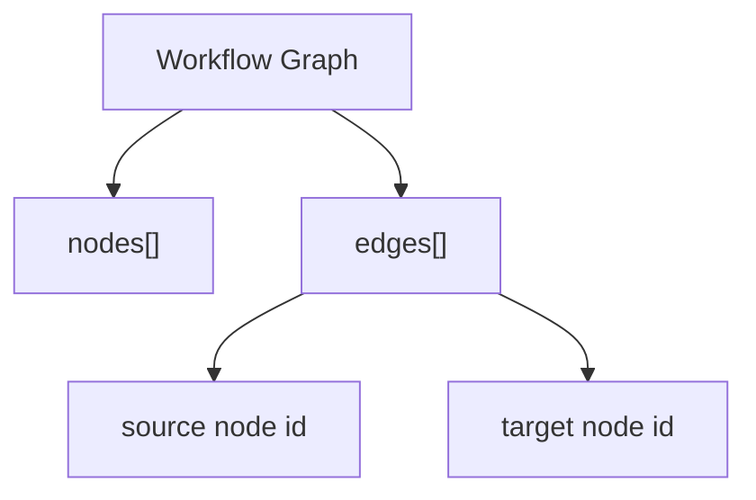

This shape maps well to database persistence because nodes and connections are
separate tables.

## 042. How does a frontend edge map to a backend connection?

Frontend edge:

```ts
{
  source: "node-a",
  target: "node-b",
  sourceHandle: "main",
  targetHandle: "main"
}
```

Backend connection:

```ts
{
  workflowId: id,
  fromNodeId: edge.source,
  toNodeId: edge.target,
  fromOutput: edge.sourceHandle || "main",
  toInput: edge.targetHandle || "main",
}
```

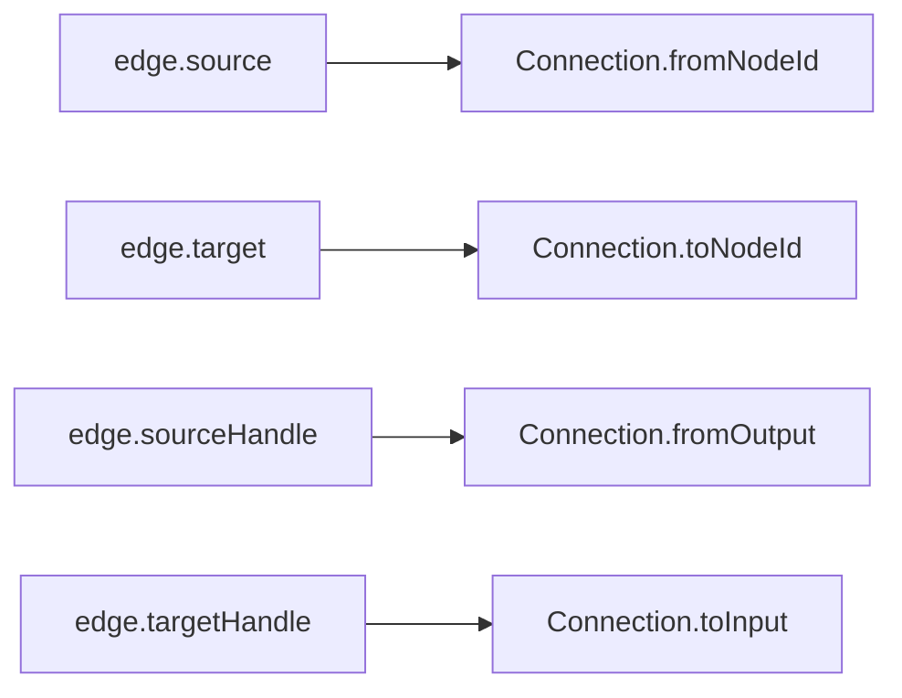

This conversion happens in the workflow update router when saving the graph.

## 043. What is the purpose of `sourceHandle` and `targetHandle`?

Handles identify specific connection points on a node. Today, many nodes use a
simple `"main"` handle. But handles become important when a node has multiple
outputs or inputs.

Example future conditional node:

```text
IF condition
  true  -> Slack
  false -> Discord
```

```ts
{
  source: "condition-node",
  sourceHandle: "true",
  target: "slack-node",
  targetHandle: "main",
}
```

Interview answer:

> Handles let a connection represent more than "node A goes to node B". They
> specify which output and input are connected, which is essential for
> branching, multiple inputs, and richer node contracts.

## 044. Why does the editor enable `snapToGrid`?

`snapToGrid` makes node placement cleaner and more predictable. It helps users
align nodes visually without needing pixel-perfect dragging.

```tsx
<ReactFlow
  snapGrid={[10, 10]}
  snapToGrid
/>
```

The benefit is mostly UX:

- Cleaner graphs.
- Easier scanning.
- Less visual noise.
- More consistent saved positions.

For advanced use, the grid size could be a user preference.

## 045. Why might `panOnDrag={false}` and `selectionOnDrag` be useful together?

With `panOnDrag={false}`, dragging the canvas background does not pan the
viewport. With `selectionOnDrag`, dragging can create a selection box.

```tsx
<ReactFlow
  panOnDrag={false}
  selectionOnDrag
/>
```

This combination makes the editor behave more like design tools where dragging
on the canvas can select multiple nodes. Users can still pan by scroll or other
configured controls.

## 046. What is the purpose of `fitView`?

`fitView` tells React Flow to adjust the viewport so the graph is visible when
the canvas initializes.

```tsx
<ReactFlow fitView />
```

This is useful when opening an existing workflow because saved nodes may be at
positions far from the default origin. Without `fitView`, users might open a
workflow and see an empty canvas even though nodes exist offscreen.

## 047. What are `Background`, `Controls`, `MiniMap`, and `Panel` used for?

They are React Flow helper components:

```tsx
<Background />
<Controls position="top-left" />
<MiniMap />
<Panel position="top-right">
  <AddNodeButton />
</Panel>
```

- `Background` renders the grid-like canvas background.
- `Controls` provides zoom and fit controls.
- `MiniMap` gives an overview of the graph.
- `Panel` anchors custom UI inside the canvas.

In Nodeflowz, panels are used for the add-node button and execute button.

## 048. How would you add custom handles to a node?

I would add React Flow `Handle` components to the node shell or a specialized
node component.

Example:

```tsx
import { Handle, Position } from "@xyflow/react";

export function HttpRequestNode() {
  return (
    <BaseNode>
      <Handle type="target" position={Position.Left} id="main" />
      <BaseNodeHeader>
        <BaseNodeHeaderTitle>HTTP Request</BaseNodeHeaderTitle>
      </BaseNodeHeader>
      <BaseNodeContent>Configure URL and method</BaseNodeContent>
      <Handle type="source" position={Position.Right} id="main" />
    </BaseNode>
  );
}
```

For branching:

```tsx
<Handle type="source" position={Position.Right} id="success" />
<Handle type="source" position={Position.Bottom} id="error" />
```

Then validation and execution must understand those handle IDs.

## 049. How would you restrict invalid connections between certain node types?

I would define connection rules and apply them in React Flow's connection
validation path.

Example:

```ts
function isValidConnection(
  connection: Connection,
  nodes: Node[],
): boolean {
  const source = nodes.find((node) => node.id === connection.source);
  const target = nodes.find((node) => node.id === connection.target);

  if (!source || !target) return false;
  if (source.id === target.id) return false;
  if (target.type?.includes("TRIGGER")) return false;

  return true;
}
```

```tsx
<ReactFlow
  isValidConnection={(connection) =>
    isValidConnection(connection, nodes)
  }
/>
```

I would also validate on the backend because frontend validation can be
bypassed.

## 050. How would you prevent cycles in the canvas before saving?

I would run cycle detection when a new connection is attempted. If adding the
edge creates a cycle, reject it.

```ts
function wouldCreateCycle(nodes: Node[], edges: Edge[], next: Connection) {
  const graph = new Map<string, string[]>();

  for (const node of nodes) graph.set(node.id, []);
  for (const edge of edges) graph.get(edge.source)?.push(edge.target);
  graph.get(next.source)?.push(next.target);

  const visiting = new Set<string>();
  const visited = new Set<string>();

  function visit(nodeId: string): boolean {
    if (visiting.has(nodeId)) return true;
    if (visited.has(nodeId)) return false;

    visiting.add(nodeId);
    for (const child of graph.get(nodeId) ?? []) {
      if (visit(child)) return true;
    }
    visiting.delete(nodeId);
    visited.add(nodeId);
    return false;
  }

  return nodes.some((node) => visit(node.id));
}
```

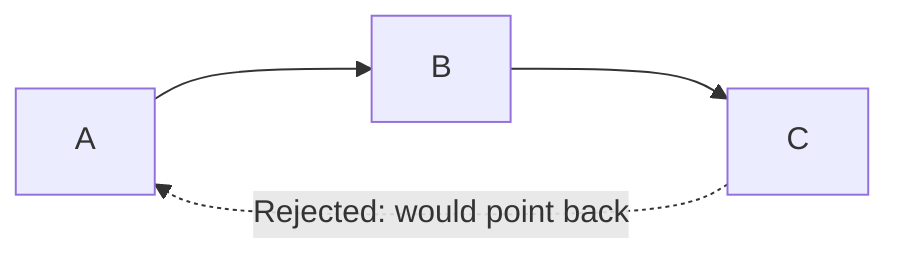

Interview answer:

> I would reject cyclic edges at connection time for immediate UX, then repeat
> the same critical validation on the backend before saving or executing. The
> frontend improves usability; the backend protects correctness.

