# Frontend Interview Questions 051-100

## 051. How would you highlight disconnected nodes?

I would derive a set of connected node IDs from the edges, then mark any
non-initial node missing from that set.

```ts
function getDisconnectedNodeIds(nodes: Node[], edges: Edge[]) {
  const connected = new Set<string>();

  for (const edge of edges) {
    connected.add(edge.source);
    connected.add(edge.target);
  }

  return nodes
    .filter((node) => node.type !== NodeType.INITIAL)
    .filter((node) => !connected.has(node.id))
    .map((node) => node.id);
}
```

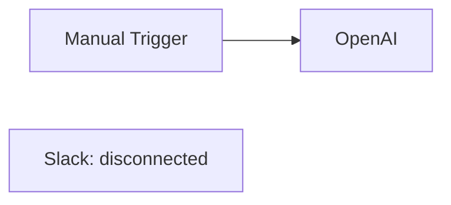

Then I would pass a validation status through node `data` or a derived status
map, and render a warning indicator in `BaseNode`.

## 052. How would you implement delete-node behavior safely?

Deleting a node must also remove edges connected to that node. React Flow can
emit deletion changes, but I would make the behavior explicit for toolbar
delete actions.

```ts
function deleteNode(nodeId: string) {
  setNodes((nodes) => nodes.filter((node) => node.id !== nodeId));
  setEdges((edges) =>
    edges.filter(
      (edge) => edge.source !== nodeId && edge.target !== nodeId,
    ),
  );
}
```

Important safeguards:

- Confirm destructive deletes when configured data exists.
- Prevent deleting the only required trigger without warning.
- Mark graph as dirty.
- Add one undo command containing the node and its connected edges.

## 053. How would you implement copy and paste for selected nodes?

I would read selected nodes and edges, clone them with new IDs, offset their
positions, and remap edge source/target IDs.

```ts
function cloneSelection(selectedNodes: Node[], selectedEdges: Edge[]) {
  const idMap = new Map<string, string>();

  const clonedNodes = selectedNodes.map((node) => {
    const id = createId();
    idMap.set(node.id, id);

    return {
      ...node,
      id,
      position: {
        x: node.position.x + 40,
        y: node.position.y + 40,
      },
      selected: true,
    };
  });

  const clonedEdges = selectedEdges
    .filter((edge) => idMap.has(edge.source) && idMap.has(edge.target))
    .map((edge) => ({
      ...edge,
      id: createId(),
      source: idMap.get(edge.source)!,
      target: idMap.get(edge.target)!,
    }));

  return { clonedNodes, clonedEdges };
}
```

The key detail is remapping IDs so copied edges point to copied nodes, not the
original nodes.

## 054. How would you implement undo and redo for graph edits?

The simplest implementation is snapshot history:

```ts
type GraphSnapshot = {
  nodes: Node[];
  edges: Edge[];
};

type GraphHistory = {
  past: GraphSnapshot[];
  present: GraphSnapshot;
  future: GraphSnapshot[];
};
```

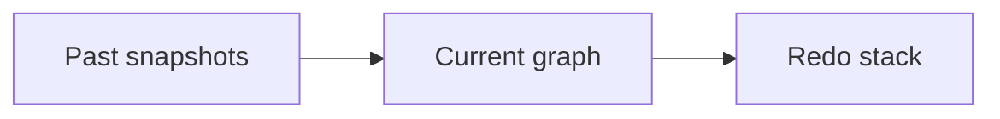

For large graphs, I would prefer the command pattern:

```ts
type CanvasCommand =
  | { type: "ADD_NODE"; node: Node }
  | { type: "DELETE_NODE"; node: Node; edges: Edge[] }
  | { type: "MOVE_NODE"; nodeId: string; from: XYPosition; to: XYPosition }
  | { type: "ADD_EDGE"; edge: Edge }
  | { type: "DELETE_EDGE"; edge: Edge };
```

Important detail: for dragging, record one command on drag stop, not one
command for every mouse movement.

## 055. How would you persist viewport zoom and pan per workflow?

React Flow exposes viewport information. I would store it as part of workflow
editor metadata.

```ts
type WorkflowViewport = {
  x: number;
  y: number;
  zoom: number;
};
```

On save:

```ts
const viewport = editor.getViewport();

saveWorkflow.mutate({
  id: workflowId,
  nodes: editor.getNodes(),
  edges: editor.getEdges(),
  viewport,
});
```

On load:

```tsx
<ReactFlow defaultViewport={workflow.viewport ?? undefined} />
```

This improves continuity because users return to the same part of a large
workflow where they were working.

## 056. What is the purpose of `NodeType` from Prisma on the frontend?

`NodeType` gives the frontend the same enum values that the database and
backend use for workflow nodes.

```ts
import { NodeType } from "@/generated/prisma";

if (node.type === NodeType.MANUAL_TRIGGER) {
  // show execute button
}
```

This prevents string drift between frontend and backend:

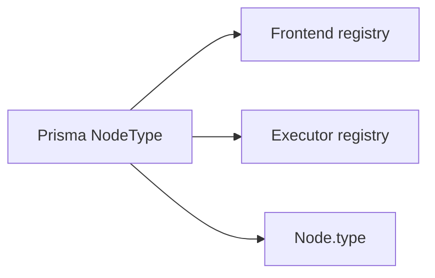

If a type is renamed or removed, TypeScript can catch many affected call sites.

## 057. Why does `nodeComponents` use `as const satisfies NodeTypes`?

Current code:

```ts
export const nodeComponents = {
  [NodeType.INITIAL]: InitialNode,
  [NodeType.HTTP_REQUEST]: HttpRequestNode,
  [NodeType.GOOGLE_SHEETS]: GoogleSheetsNode,
  [NodeType.MANUAL_TRIGGER]: ManualTriggerNode,
  [NodeType.OPENAI]: OpenAiNode,
} as const satisfies NodeTypes;
```

`satisfies` verifies that the object is compatible with React Flow's
`NodeTypes` while preserving exact keys.

Interview answer:

> `satisfies` gives us validation without widening. TypeScript checks that the
> registry is a valid React Flow node type map, but we can still derive precise
> keys from the object.

## 058. What type does `RegisteredNodeType` derive from?

```ts
export type RegisteredNodeType = keyof typeof nodeComponents;
```

This means `RegisteredNodeType` is the union of keys actually present in the
node component registry.

For example:

```ts
type RegisteredNodeType =
  | "INITIAL"
  | "HTTP_REQUEST"
  | "GOOGLE_SHEETS"
  | "MANUAL_TRIGGER"
  | "OPENAI";
```

The actual union depends on the registry contents. This is useful when the UI
wants to refer only to node types that are actually renderable.

## 059. What problem does `satisfies` solve compared with direct type annotation?

Direct annotation can widen the object:

```ts
const nodeComponents: NodeTypes = {
  [NodeType.OPENAI]: OpenAiNode,
};
```

Now TypeScript mainly knows it is a broad `NodeTypes` object.

With `satisfies`:

```ts
const nodeComponents = {
  [NodeType.OPENAI]: OpenAiNode,
} as const satisfies NodeTypes;
```

TypeScript checks compatibility but keeps the literal key information. This is
better for deriving types and catching registry drift.

## 060. How would you strongly type each node's `data` field by node type?

I would introduce a mapping from `NodeType` to data schema:

```ts
type NodeDataByType = {
  [NodeType.OPENAI]: {
    variableName: string;
    credentialId: string;
    systemPrompt?: string;
    userPrompt: string;
  };
  [NodeType.HTTP_REQUEST]: {
    variableName: string;
    url: string;
    method: "GET" | "POST" | "PUT" | "DELETE";
  };
  [NodeType.SLACK]: {
    credentialId: string;
    channel: string;
    message: string;
  };
};
```

Then:

```ts
type WorkflowNode<T extends keyof NodeDataByType> = Node<
  NodeDataByType[T],
  T
>;
```

This would reduce runtime mistakes when reading `node.data`.

## 061. How would a discriminated union improve workflow node configuration?

The current graph uses generic React Flow nodes where `data` is broad. A
discriminated union would let TypeScript narrow `data` based on `type`.

```ts
type ConfiguredNode =
  | {
      type: NodeType.OPENAI;
      data: {
        variableName: string;
        credentialId: string;
        userPrompt: string;
      };
    }
  | {
      type: NodeType.HTTP_REQUEST;
      data: {
        variableName: string;
        url: string;
        method: "GET" | "POST";
      };
    };
```

```ts
function validateNode(node: ConfiguredNode) {
  switch (node.type) {
    case NodeType.OPENAI:
      return node.data.userPrompt.length > 0;
    case NodeType.HTTP_REQUEST:
      return URL.canParse(node.data.url);
  }
}
```

The `type` field becomes the discriminant.

## 062. Why is `z.infer<typeof formSchema>` useful in dialogs?

It keeps the form value type synchronized with the Zod validation schema.

```ts
const formSchema = z.object({
  variableName: z.string().min(1),
  credentialId: z.string().min(1),
  systemPrompt: z.string().optional(),
  userPrompt: z.string().min(1),
});

export type OpenAiFormValues = z.infer<typeof formSchema>;
```

If the schema changes, the TypeScript type changes automatically. That avoids
duplicating a separate interface and accidentally letting the schema and form
type drift apart.

## 063. What are the risks of using `z.any()` in workflow update input?

The update router currently accepts flexible node data:

```ts
data: z.record(z.string(), z.any()).optional(),
```

This is convenient because every node type has different configuration. The
risk is that invalid or unexpected data can be saved and later fail during
execution.

Better production approach:

```ts
const openAiDataSchema = z.object({
  variableName: z.string().min(1),
  credentialId: z.string().min(1),
  userPrompt: z.string().min(1),
  systemPrompt: z.string().optional(),
});
```

Then validate based on `node.type` before saving or executing.

## 064. How would you replace loose `Record<string, unknown>` node data with safer types?

I would keep flexibility at the database boundary but validate data at the app
boundary.

```ts
const nodeDataSchemas = {
  [NodeType.OPENAI]: openAiDataSchema,
  [NodeType.HTTP_REQUEST]: httpRequestDataSchema,
  [NodeType.SLACK]: slackDataSchema,
} satisfies Partial<Record<NodeType, z.ZodTypeAny>>;

function parseNodeData(type: NodeType, data: unknown) {
  const schema = nodeDataSchemas[type];
  if (!schema) return {};
  return schema.parse(data);
}
```

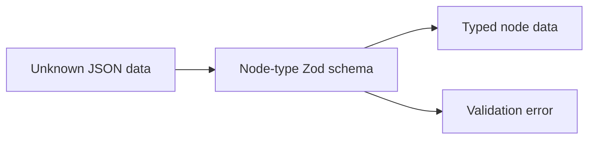

The database can still store JSON, but the application treats it as typed only
after validation.

## 065. How would you ensure every new `NodeType` has a node component and executor?

For frontend rendering:

```ts
export const nodeComponents = {
  [NodeType.INITIAL]: InitialNode,
  [NodeType.OPENAI]: OpenAiNode,
  // ...
} satisfies Record<NodeType, ComponentType<any>>;
```

For execution:

```ts
export const executorRegistry = {
  [NodeType.MANUAL_TRIGGER]: manualTriggerExecutor,
  [NodeType.OPENAI]: openAiExecutor,
  // ...
} satisfies Record<NodeType, NodeExecutor>;
```

If a new enum value is added and the registry is incomplete, TypeScript fails.
That turns integration drift into a compile-time problem.

## 066. Why does the OpenAI dialog use React Hook Form?

React Hook Form manages form state, validation, field registration, and submit
handling efficiently.

```ts
const form = useForm<OpenAiFormValues>({
  resolver: zodResolver(formSchema),
  defaultValues: {
    variableName: defaultValues.variableName || "",
    credentialId: defaultValues.credentialId || "",
    systemPrompt: defaultValues.systemPrompt || "",
    userPrompt: defaultValues.userPrompt || "",
  },
});
```

It pairs well with Zod because validation rules and TypeScript types come from
the same schema.

## 067. Why is Zod used for dialog validation?

Zod provides runtime validation and TypeScript inference. The OpenAI dialog
uses it to enforce required fields and a safe variable name format.

```ts
const formSchema = z.object({
  variableName: z
    .string()
    .min(1, { message: "Variable name is required" })
    .regex(/^[A-Za-z_$][A-Za-z0-9_$]*$/),
  credentialId: z.string().min(1, "Credential is required"),
  systemPrompt: z.string().optional(),
  userPrompt: z.string().min(1, "User prompt is required"),
});
```

Interview answer:

> Zod makes validation explicit, reusable, and type-safe. It prevents invalid
> node configuration from entering the graph and gives the user immediate form
> feedback.

## 068. What validation is applied to `variableName`?

`variableName` must:

- Be present.
- Start with a letter, underscore, or dollar sign.
- Continue with letters, numbers, underscores, or dollar signs.

```ts
z.string()
  .min(1, { message: "Variable name is required" })
  .regex(/^[A-Za-z_$][A-Za-z0-9_$]*$/);
```

Valid:

```text
summary
myOpenAi
_result
$value
```

Invalid:

```text
1summary
my-value
open ai
```

## 069. Why must `variableName` be a valid JavaScript-like identifier?

Node outputs are referenced in templates:

```text
{{myOpenAi.text}}
{{json httpResponse.data}}
```

A predictable identifier makes references easier to parse, autocomplete, and
validate. If users could create variables with spaces or punctuation, template
parsing would become more ambiguous.

Interview answer:

> I constrain variable names so downstream nodes can safely reference previous
> outputs. It is a small UX restriction that makes template syntax and runtime
> context lookup much more reliable.

## 070. Why does the OpenAI dialog reset form values when opened?

React Hook Form reads `defaultValues` on initialization. If the user opens the
same dialog for a different node, the component may still have old form state.

Current pattern:

```ts
useEffect(() => {
  if (open) {
    form.reset({
      variableName: defaultValues.variableName || "",
      credentialId: defaultValues.credentialId || "",
      systemPrompt: defaultValues.systemPrompt || "",
      userPrompt: defaultValues.userPrompt || "",
    });
  }
}, [open, defaultValues, form]);
```

This ensures the dialog always reflects the selected node's current data when
opened.

## 071. What bug can occur if default form values change but the form is not reset?

The user could open Node A, then Node B, and still see Node A's values. If they
click Save, Node B might accidentally receive Node A's prompt, credential, or
variable name.

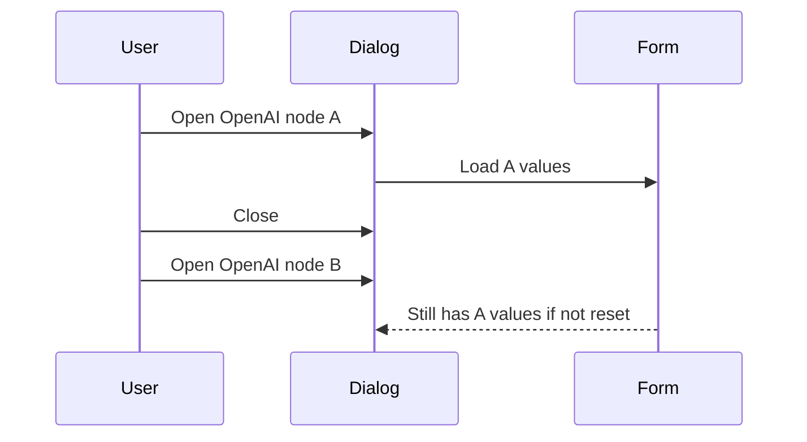

Resetting on open prevents stale form state from crossing node boundaries.

## 072. How does the credential dropdown load provider-specific credentials?

The OpenAI dialog calls:

```ts
const {
  data: credentials,
  isLoading: isLoadingCredentials,
} = useCredentialsByType(CredentialType.OPENAI);
```

Then it renders the options:

```tsx
{credentials?.map((credential) => (
  <SelectItem key={credential.id} value={credential.id}>
    {credential.name}
  </SelectItem>
))}
```

This keeps a node from accidentally selecting credentials for the wrong
provider.

## 073. How would you handle an empty credential list in the UI?

I would show a disabled select plus a clear call to create a credential.

```tsx
<Select disabled={isLoadingCredentials || !credentials?.length}>
  <SelectTrigger>
    <SelectValue
      placeholder={
        credentials?.length ? "Select a credential" : "No OpenAI credentials"
      }
    />
  </SelectTrigger>
</Select>
```

Production improvement:

```tsx
{!credentials?.length && (
  <Button variant="outline" asChild>
    <Link href="/credentials/new?type=OPENAI">Add OpenAI credential</Link>
  </Button>
)}
```

The goal is to make the user recover without leaving them stuck in a disabled
form.

## 074. How would you prevent saving a node with incomplete configuration?

I would validate at three layers:

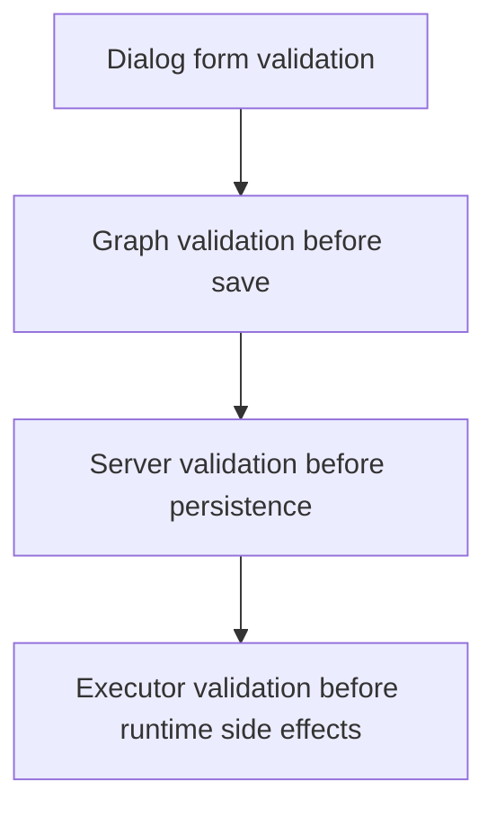

Dialog:

```ts
form.handleSubmit((values) => {
  onSubmit(values);
});
```

Graph validation:

```ts
const issues = validateWorkflow(nodes, edges);
if (issues.length) {
  toast.error("Fix workflow issues before saving");
  return;
}
```

Server validation is still required because the client can be bypassed.

## 075. How would you validate template variables like `{{json httpResponse.data}}`?

I would parse template expressions and compare references against variables
available before the current node in the DAG.

```ts
function extractTemplateRefs(template: string) {
  const matches = template.matchAll(/{{\s*(json\s+)?([A-Za-z_$][\w$]*(?:\.[\w$]+)*)\s*}}/g);
  return [...matches].map((match) => ({
    json: Boolean(match[1]),
    path: match[2],
  }));
}
```

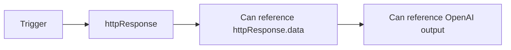

The advanced version should understand graph order, not just all variables in
the workflow.

## 076. Why is the React Flow instance stored in a Jotai atom?

The editor stores the React Flow instance globally:

```ts
export const editorAtom = atom<ReactFlowInstance | null>(null);
```

Then:

```tsx
<ReactFlow onInit={setEditor} />
```

This lets components outside the immediate `ReactFlow` props tree read the
current graph through methods like `getNodes()` and `getEdges()`, commonly for
save actions or editor toolbar behavior.

## 077. What are the trade-offs of storing the editor instance globally?

Benefits:

- Easy access from toolbar and header components.
- Avoids prop drilling editor instance through many layers.
- Keeps React Flow-specific imperative API in one shared place.

Risks:

- The atom can point to a stale editor after route changes.
- Multiple editors open at once would conflict.
- It makes component dependencies less explicit.
- Tests need to provide or reset global state.

I would clear the atom when the editor unmounts:

```ts
useEffect(() => {
  return () => setEditor(null);
}, [setEditor]);
```

## 078. When would you move graph state from local React state to Jotai or Zustand?

Local state is fine while only the editor owns `nodes` and `edges`.

I would move graph state to a store if:

- Many distant components need live graph data.
- Undo/redo becomes complex.
- Autosave needs centralized dirty state.
- Multiple panels inspect selected nodes.
- Derived selectors become expensive.
- Collaboration or presence features are added.

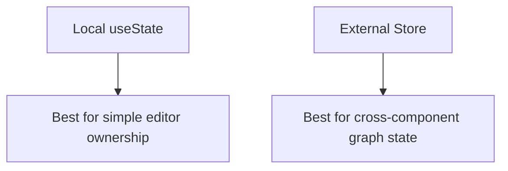

The store should support selectors so components subscribe only to the slices
they need.

## 079. How would you avoid stale editor state when navigating between workflows?

I would reset editor-related atoms and local state when `workflowId` changes or
the editor unmounts.

```ts
useEffect(() => {
  setNodes(workflow.nodes);
  setEdges(workflow.edges);
}, [workflow.id, workflow.nodes, workflow.edges]);
```

And:

```ts
useEffect(() => {
  return () => setEditor(null);
}, [setEditor]);
```

Also, query keys must include workflow ID:

```ts
trpc.workflows.getOne.queryOptions({ id });
```

That prevents data for workflow A from being reused as workflow B.

## 080. How would you track unsaved changes in the editor?

I would keep a baseline snapshot from the last loaded or saved graph, then
compare it to the current graph.

```ts
type GraphSnapshot = {
  nodes: Node[];
  edges: Edge[];
};

const savedSnapshotRef = useRef<GraphSnapshot>({
  nodes: workflow.nodes,
  edges: workflow.edges,
});
```

After changes:

```ts
const isDirty = !isEqualGraph(
  savedSnapshotRef.current,
  { nodes, edges },
);
```

After successful save, update the baseline.

For performance, large graphs should use a version counter or change flag
instead of deep equality on every render.

## 081. How would you warn the user before leaving with unsaved graph edits?

For browser tab close or refresh:

```ts
useEffect(() => {
  if (!isDirty) return;

  const handler = (event: BeforeUnloadEvent) => {
    event.preventDefault();
    event.returnValue = "";
  };

  window.addEventListener("beforeunload", handler);
  return () => window.removeEventListener("beforeunload", handler);
}, [isDirty]);
```

For in-app navigation, I would add a route transition confirmation using the
app's navigation pattern. The warning should only appear when there are real
unsaved changes, not after every canvas interaction once saved.

## 082. How would you debounce auto-save without losing changes?

I would debounce save requests but keep an immediate dirty flag and flush on
important lifecycle events.

```ts
const debouncedSave = useMemo(
  () => debounce((snapshot: GraphSnapshot) => {
    saveWorkflow.mutate(snapshot);
  }, 1000),
  [saveWorkflow],
);

useEffect(() => {
  if (isDirty) {
    debouncedSave({ nodes, edges });
  }
}, [nodes, edges, isDirty, debouncedSave]);
```

Important details:

- Do not save every drag frame.
- Save after drag stop or after debounce.
- Flush on page hide if possible.
- Cancel pending save on unmount only if changes are already saved elsewhere.

## 083. How would you design optimistic updates for workflow saving?

For save, optimistic UI mostly means showing the latest graph as saved before
the server round trip completes. I would:

- Mark status as `saving`.
- Optimistically update the workflow query cache.
- On success, mark `saved` and update the baseline snapshot.
- On error, mark `error` but keep the user's local graph intact.

```ts
const mutation = useMutation({
  mutationFn: saveWorkflow,
  onMutate: async (variables) => {
    await queryClient.cancelQueries(workflowQuery);
    const previous = queryClient.getQueryData(workflowQuery.queryKey);
    queryClient.setQueryData(workflowQuery.queryKey, variables);
    return { previous };
  },
  onError: (_error, _variables, context) => {
    queryClient.setQueryData(workflowQuery.queryKey, context?.previous);
  },
});
```

For graph editing, I would avoid rolling back the visible canvas automatically
because that can destroy user work.

## 084. How would you handle save conflicts from two browser tabs?

I would add optimistic concurrency with an `updatedAt` or version number.

```ts
saveWorkflow.mutate({
  id: workflowId,
  nodes,
  edges,
  expectedVersion: workflow.version,
});
```

Server:

```ts
const updated = await tx.workflow.updateMany({
  where: { id, userId, version: expectedVersion },
  data: { version: { increment: 1 } },
});

if (updated.count === 0) {
  throw new TRPCError({ code: "CONFLICT" });
}
```

The UI can then show a conflict dialog: reload remote, overwrite remote, or
compare changes.

## 085. What is tRPC used for in this frontend?

tRPC is used for type-safe internal application APIs. The frontend calls
procedures such as:

- `workflows.getMany`
- `workflows.getOne`
- `workflows.create`
- `workflows.update`
- `workflows.updateName`
- `workflows.remove`
- `workflows.execute`
- Credential queries and mutations.
- Execution queries.

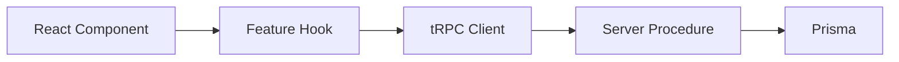

The main benefit is end-to-end TypeScript inference.

## 086. How does `useTRPC` connect React components to backend procedures?

`useTRPC` comes from:

```ts
export const { TRPCProvider, useTRPC } =
  createTRPCContext<AppRouter>();
```

It exposes typed query and mutation helpers:

```ts
const trpc = useTRPC();

return useSuspenseQuery(
  trpc.workflows.getOne.queryOptions({ id }),
);
```

Because `AppRouter` is the server router type, TypeScript knows the input and
output shape of each procedure.

## 087. Why does the app use TanStack Query with tRPC?

TanStack Query provides caching, mutation state, invalidation, Suspense support,
deduping, retries, and pending/error states. tRPC provides type-safe procedure
definitions.

Together:

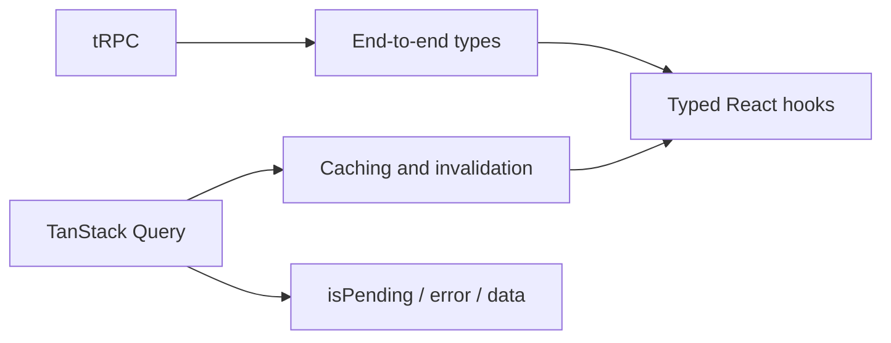

Interview answer:

> tRPC tells the client what it can call and what types to expect. TanStack
> Query manages the lifecycle of those calls in React.

## 088. What happens after a workflow create mutation succeeds?

The create hook shows a success toast and invalidates the workflow list query.

```ts
export const useCreateWorkflow = () => {
  const queryClient = useQueryClient();
  const trpc = useTRPC();

  return useMutation(
    trpc.workflows.create.mutationOptions({
      onSuccess: (data) => {
        toast.success(`Workflow "${data.name}" created`);
        queryClient.invalidateQueries(
          trpc.workflows.getMany.queryOptions({}),
        );
      },
      onError: (error) => {
        toast.error(`Failed to create workflow: ${error.message}`);
      },
    }),
  );
};
```

Invalidation causes the list to refetch so the new workflow appears.

## 089. Why are workflow queries invalidated after mutations?

Mutation results change server state. Cached queries may now be stale.

Examples:

- Create changes the workflow list.
- Rename changes list item text and detail page title.
- Save changes the workflow detail graph.
- Delete removes a workflow from the list.

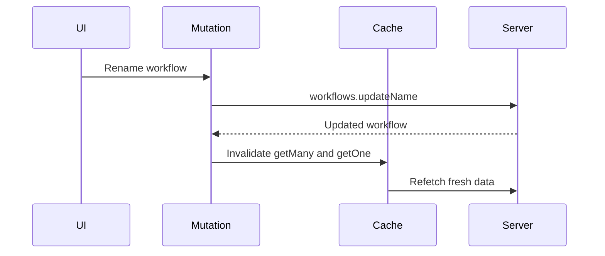

## 090. What is the difference between `queryOptions` and `queryFilter` usage here?

`queryOptions` creates a full query configuration, including the query key and
function. `queryFilter` is useful when invalidating or matching existing
queries.

Current examples:

```ts
useSuspenseQuery(trpc.workflows.getOne.queryOptions({ id }));
```

```ts
queryClient.invalidateQueries(
  trpc.workflows.getOne.queryFilter({ id: data.id }),
);
```

Interview answer:

> I use query options when I am running a query. I use query filters when I am
> matching or invalidating queries already in the cache.

## 091. How does `useSuspenseQuery` affect loading and error UI?

`useSuspenseQuery` suspends rendering while data is loading and throws errors
to the nearest error boundary.

This lets the component assume data exists:

```ts
const { data: workflow } = useSuspenseWorkflow(workflowId);
```

The loading and error UI should be handled by Suspense and error boundaries
around the editor route:

```tsx
<Suspense fallback={<EditorLoading />}>
  <ErrorBoundary fallback={<EditorError />}>
    <Editor workflowId={workflowId} />
  </ErrorBoundary>
</Suspense>
```

The repo already has `EditorLoading` and `EditorError` view components.

## 092. Where should Suspense and error boundaries be placed for the editor?

I would place them just outside the editor feature so only the editor canvas
falls back, not the entire app shell.

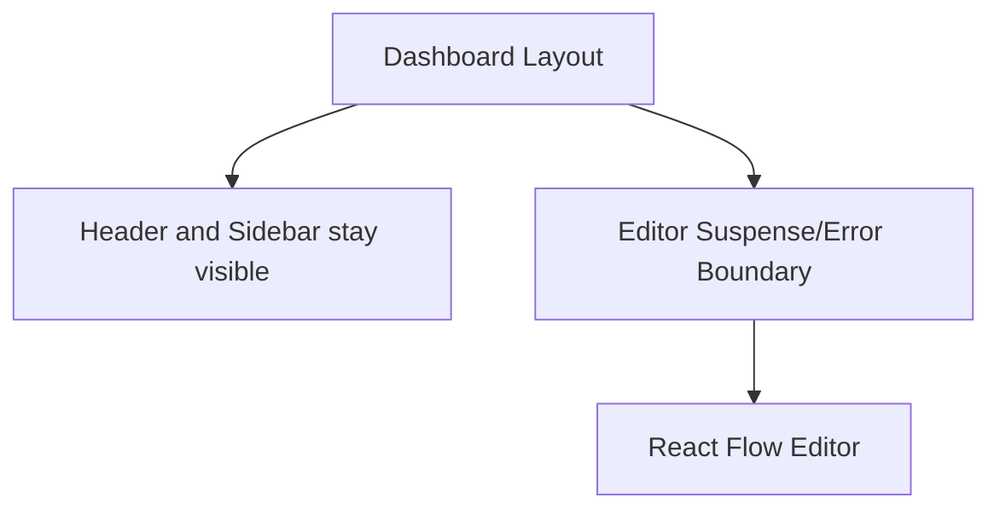

This keeps navigation stable while the heavy editor loads or errors. If the
workflow detail query fails, the user should still have the dashboard frame and
navigation available.

## 093. Why does the tRPC client use `httpBatchLink`?

`httpBatchLink` batches multiple tRPC calls into fewer HTTP requests when they
happen close together.

Current code:

```ts
createTRPCClient<AppRouter>({
  links: [
    httpBatchLink({
      transformer: superjson,
      url: getUrl(),
    }),
  ],
});
```

This can reduce network overhead on pages that load several independent
queries at once, such as dashboard pages with workflow lists and related user
data.

## 094. Why is `superjson` useful for this project?

JSON does not preserve richer JavaScript values like `Date` objects. SuperJSON
serializes and deserializes richer values safely between server and client.

```ts
httpBatchLink({
  transformer: superjson,
  url: getUrl(),
});
```

This matters because workflow records, execution records, and timestamps often
include dates. Without a transformer, a `Date` may arrive as a string and lose
type fidelity.

## 095. Why does the browser reuse a single QueryClient?

Current code:

```ts
let browserQueryClient: QueryClient;

function getQueryClient() {
  if (typeof window === "undefined") {
    return makeQueryClient();
  }

  if (!browserQueryClient) browserQueryClient = makeQueryClient();
  return browserQueryClient;
}
```

The browser reuses one QueryClient so the cache survives client rerenders and
initial Suspense behavior. Creating a new QueryClient every render would throw
away cache state and cause unnecessary refetching.

## 096. Why should the server create a new QueryClient per request?

The server must avoid sharing one user's cached data with another request.

```ts
if (typeof window === "undefined") {
  return makeQueryClient();
}
```

On the server, each request gets an isolated QueryClient. In the browser, one
user's session owns the cache, so reuse is safe and useful.

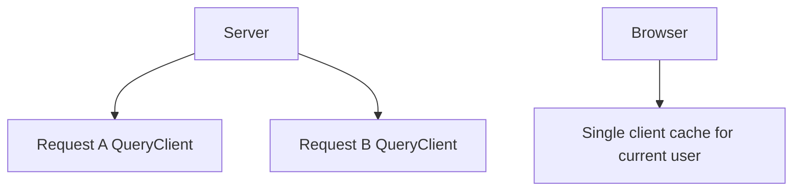

## 097. How would you prefetch workflow data on the server for faster editor loading?

I would prefetch the `workflows.getOne` query in the route or server component,
dehydrate the query cache, and hydrate it on the client. The exact helper
depends on the tRPC/TanStack setup, but the shape is:

```tsx
export default async function WorkflowPage({ params }) {
  const queryClient = makeQueryClient();

  await queryClient.prefetchQuery(
    trpc.workflows.getOne.queryOptions({ id: params.workflowId }),
  );

  return (
    <HydrationBoundary state={dehydrate(queryClient)}>
      <Editor workflowId={params.workflowId} />
    </HydrationBoundary>
  );
}
```

This reduces the client-side loading gap because the first query result is
already in the cache.

## 098. How would you handle pagination and search state in workflow lists?

The project uses `nuqs` patterns for URL-backed params. I would store page,
page size, and search in the URL so the list is shareable and browser-friendly.

```ts
const [params, setParams] = useWorkflowsParams();

setParams({
  search: "invoice",
  page: 1,
});
```

Then:

```ts
useSuspenseQuery(
  trpc.workflows.getMany.queryOptions(params),
);
```

URL state gives:

- Back/forward navigation.
- Shareable filtered views.
- Refresh persistence.
- Clear query keys for caching.

## 099. Why does the project use `nuqs` for URL query params?

`nuqs` provides typed URL state for Next.js apps. It lets components read and
write query params like React state while keeping the URL as the source of
truth.

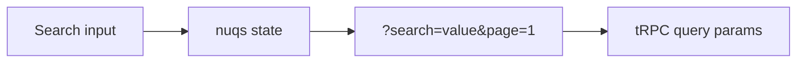

This is a good fit for dashboard filters, search, pagination, and selected
execution views because those states should survive refresh and be shareable.

## 100. Why is the execute button shown only when a manual trigger exists?

The current editor computes:

```ts
const hasManualTrigger = useMemo(() => {
  return nodes.some((node) => node.type === NodeType.MANUAL_TRIGGER);
}, [nodes]);
```

Then:

```tsx
{hasManualTrigger && (
  <Panel position="bottom-center">
    <ExecuteWorkflowButton workflowId={workflowId} />
  </Panel>
)}
```

The manual execute button makes sense only when the workflow has a manual
trigger. Other trigger types, such as Google Form or Stripe, start from
external events rather than a user pressing "execute now".

