# Frontend Interview Questions 101-150

## 101. What happens when `ExecuteWorkflowButton` is clicked?

The button calls the `useExecuteWorkflow` mutation with the current workflow ID.

```tsx
export const ExecuteWorkflowButton = ({ workflowId }: { workflowId: string }) => {
  const executeWorkflow = useExecuteWorkflow();

  const handleExecute = () => {
    executeWorkflow.mutate({ id: workflowId });
  };

  return (
    <Button
      size="lg"
      onClick={handleExecute}
      disabled={executeWorkflow.isPending}
    >
      <FlaskConicalIcon className="size-4" />
      Execution workflow
    </Button>
  );
};
```

The frontend does not execute the graph directly. It asks the backend to queue
execution. The backend verifies ownership and sends an Inngest event.

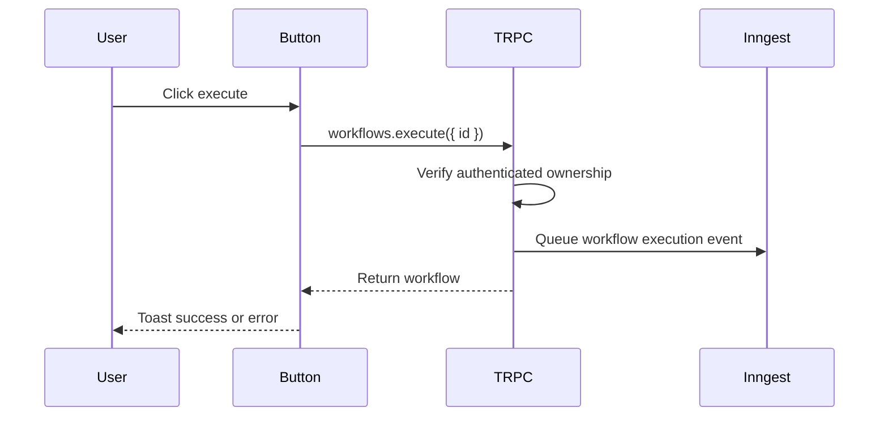

Interview answer:

> The button triggers a tRPC mutation. The frontend stays thin: it only
> requests execution and shows pending/success/error state. Actual execution is
> delegated to the backend and Inngest worker.

## 102. How does the frontend know execution is pending?

The mutation object from TanStack Query exposes `isPending`.

```tsx
const executeWorkflow = useExecuteWorkflow();

<Button disabled={executeWorkflow.isPending}>
  Execute workflow
</Button>
```

This prevents duplicate clicks while the mutation is in flight. For a better
UX, I would also show a spinner or change the button label:

```tsx
{executeWorkflow.isPending ? (
  <Loader2Icon className="size-4 animate-spin" />
) : (
  <FlaskConicalIcon className="size-4" />
)}
```

This pending state only represents the request to queue execution, not the full
background workflow run.

## 103. How would you disable execution when the workflow graph is invalid?

I would derive validation issues from the current graph and disable the button
when blocking issues exist.

```ts
const validationIssues = useMemo(
  () => validateWorkflow(nodes, edges),
  [nodes, edges],
);

const canExecute = validationIssues.every(
  (issue) => issue.severity !== "error",
);
```

```tsx
<ExecuteWorkflowButton
  workflowId={workflowId}
  disabled={!canExecute}
/>
```

Validation should check:

- At least one trigger.
- No duplicate restricted triggers.
- No cycles.
- Required node configuration exists.
- No disconnected required nodes.
- Handles are valid for the node type.

The server must repeat critical validation before execution.

## 104. How would you show per-node execution status on the canvas?

The project already has status primitives. `BaseNode` accepts a status and
renders icons:

```tsx
{status === "error" && (
  <XCircleIcon className="absolute right-0.5 bottom-0.5 size-2 text-red-700" />
)}
{status === "success" && (
  <CheckCircle2Icon className="absolute right-0.5 bottom-0.5 size-2 text-green-700" />
)}
{status === "loading" && (
  <Loader2Icon className="absolute right-0.5 bottom-0.5 size-2 animate-spin" />
)}
```

The status can come from `useNodeStatus`:

```tsx
const status = useNodeStatus({
  nodeId: props.id,
  channel: "openai",
  topic: "status",
  refreshToken: fetchOpenAiRealtimeToken,
});

return <BaseNode status={status}>...</BaseNode>;
```

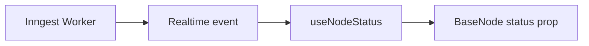

## 105. How does `useNodeStatus` subscribe to realtime messages?

The hook uses `useInngestSubscription` with a token-refresh function.

```ts
const { data } = useInngestSubscription({
  refreshToken,
  enabled: realtimeEnabled,
});
```

The token comes from a server action:

```ts
export async function fetchOpenAiRealtimeToken(): Promise<OpenAiToken> {
  const token = await getSubscriptionToken(inngest, {
    channel: openAiChannel(),
    topics: ["status"],
  });

  return token;
}
```

Then the hook filters messages for the current node, channel, and topic.

## 106. Why is realtime status gated by environment flags?

Current hook:

```ts
const realtimeEnabled =
  process.env.NODE_ENV === "production" ||
  process.env.NEXT_PUBLIC_ENABLE_REALTIME_NODE_STATUS === "true";
```

This allows local development to run without realtime subscriptions unless
explicitly enabled. Realtime services can require external connectivity,
tokens, or local tunnel setup, so gating prevents noisy failures during normal
development.

Interview answer:

> Realtime is useful but operationally more sensitive than normal UI state.
> The flag lets us keep local development simple while still enabling status
> streaming in production or when a developer opts in.

## 107. How does `useNodeStatus` filter messages for a specific node?

The hook filters by message kind, channel, topic, and `nodeId`:

```ts
const latestMessage = data
  .filter(
    (msg) =>
      msg.kind === "data" &&
      msg.channel === channel &&
      msg.topic === topic &&
      msg.data.nodeId === nodeId,
  )
  .sort((a, b) => {
    if (a.kind === "data" && b.kind === "data") {
      return (
        new Date(b.createdAt).getTime() -
        new Date(a.createdAt).getTime()
      );
    }
    return 0;
  })[0];
```

If the latest matching message is found, the hook updates local status:

```ts
if (latestMessage?.kind === "data") {
  setStatus(latestMessage.data.status as NodeStatus);
}
```

## 108. What are the performance risks of sorting realtime messages in a hook?

Sorting inside every node's hook can become expensive. If a workflow has 100
nodes and each node filters and sorts the same message array, the UI repeats a
lot of work.

Current pattern:

```text
Each node -> filter all messages -> sort matches -> pick latest
```

Better pattern:

```ts
const statusByNodeId = useMemo(() => {
  const map = new Map<string, NodeStatus>();

  for (const message of data ?? []) {
    if (message.kind !== "data") continue;
    map.set(message.data.nodeId, message.data.status);
  }

  return map;
}, [data]);
```

Then each node reads from the map. This changes repeated `O(n log n)` work into
one pass over messages.

## 109. How would you improve realtime status updates for large workflows?

I would centralize subscription and indexing at the editor level.

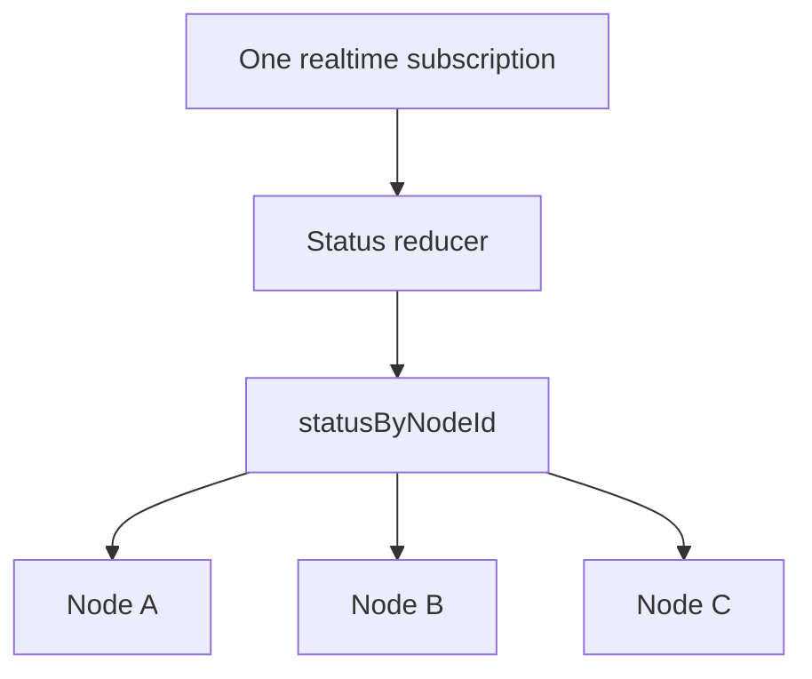

Possible implementation:

```ts
type StatusState = Record<string, NodeStatus>;

function statusReducer(state: StatusState, event: StatusEvent): StatusState {
  return {
    ...state,
    [event.nodeId]: event.status,
  };
}
```

Then pass status into node data or use a selector-based store. The goal is one
subscription and one processing pipeline per workflow, not one per node.

## 110. How would you handle execution errors visually on nodes?

I would show both a compact status indicator and a way to inspect details.

```tsx
<BaseNode status="error">
  <BaseNodeHeader>
    <BaseNodeHeaderTitle>OpenAI</BaseNodeHeaderTitle>
    <Tooltip>
      <TooltipTrigger>
        <XCircleIcon className="size-4 text-destructive" />
      </TooltipTrigger>
      <TooltipContent>{errorMessage}</TooltipContent>
    </Tooltip>
  </BaseNodeHeader>
</BaseNode>
```

For deep debugging, clicking the node could open an execution panel with:

- Error message.
- Stack or provider response when safe.
- Retry eligibility.
- Input and output preview.
- Timestamp and duration.

## 111. How are route groups like `(dashboard)`, `(editor)`, and `(auth)` useful?

Next.js route groups organize routes without adding path segments to the URL.

```text
src/app/(auth)/login/page.tsx          -> /login
src/app/(dashboard)/(rest)/workflows   -> /workflows
src/app/(dashboard)/(editor)/workflows/[workflowId] -> /workflows/:id
```

They let the app apply different layouts to different route families:

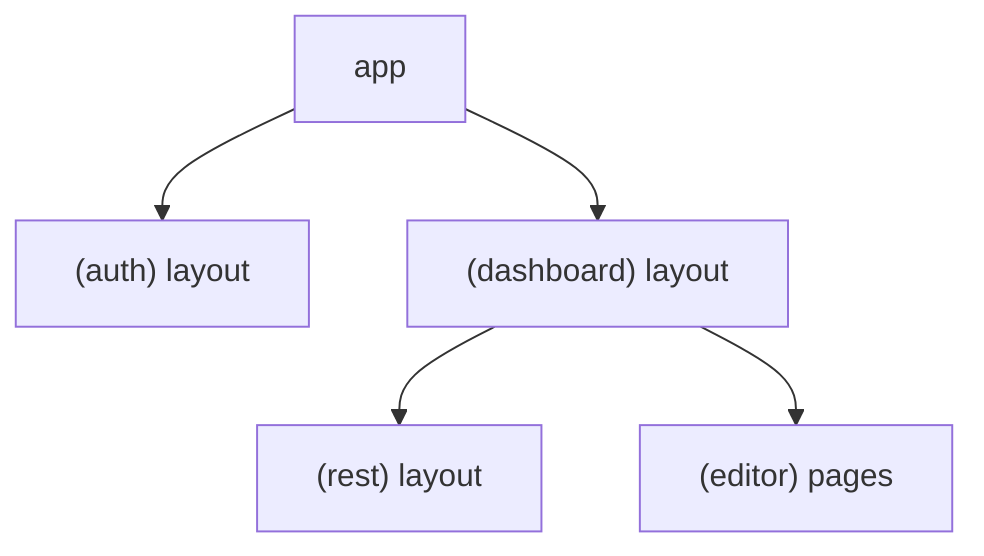

Interview answer:

> Route groups keep the filesystem organized and allow layout composition
> without affecting public URLs.

## 112. Why are dashboard and editor layouts separated?

Dashboard list/detail pages and the editor have different UX needs. Standard
dashboard pages use sidebars, headers, tables, filters, and forms. The editor
needs a full-height canvas with panels, minimap, and drag interactions.

Separating layouts lets the app tune each experience:

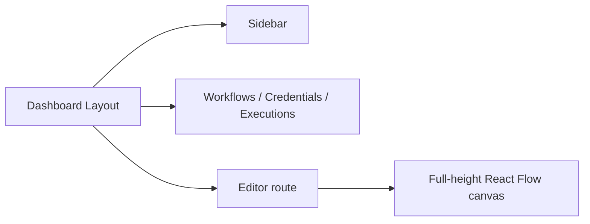

The current dashboard layout wraps children with `SidebarProvider`,
`AppSidebar`, and `SidebarInset`.

## 113. What should be rendered on the server versus the client in this app?

Server:

- Static layouts.
- Auth checks.
- Data prefetching.
- Metadata.
- Non-interactive summaries.
- Route handlers and server actions.

Client:

- React Flow editor.
- Dialogs and forms.
- Buttons with mutations.
- URL filter controls.
- Realtime subscriptions.
- Interactive sidebars or menus.

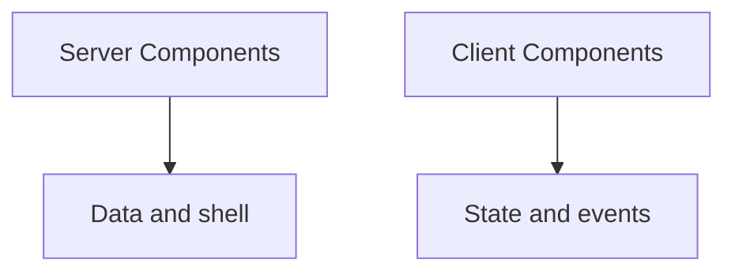

The guiding principle is: keep browser JavaScript for things that need browser
interactivity.

## 114. How would you reduce the JavaScript bundle size of the editor page?

I would load heavy editor-only code only on editor routes.

Possible improvements:

- Dynamic import React Flow-heavy editor components.
- Lazy-load node configuration dialogs.
- Split provider-specific nodes into chunks.
- Avoid importing all integrations into global layouts.
- Keep server-only logic out of client modules.
- Analyze bundle output after changes.

Example:

```tsx
const Editor = dynamic(
  () => import("@/features/editor/components/editor").then((m) => m.Editor),
  { ssr: false },
);
```

React Flow is inherently client-heavy, so route-level isolation matters.

## 115. How would dynamic imports help with heavy canvas-only code?

Dynamic imports delay loading until the component is actually needed.

```tsx
const OpenAiDialog = dynamic(() =>
  import("./dialog").then((module) => module.OpenAiDialog),
);
```

This is useful for node dialogs because a user may never open most of them
during a session. The initial editor can load the canvas first, and provider
configuration UI can load on demand.

Trade-off: dynamic imports add loading states and chunk boundaries, so I would
use them for genuinely heavy or rarely used UI.

## 116. What frontend code must never import server-only modules?

Client Components must not import modules that access:

- Prisma.
- Secret environment variables.
- Encryption helpers.
- Server-only auth utilities.
- Inngest server clients, except through server actions or API routes.
- Files marked with `server-only`.

Bad:

```tsx
"use client";
import prisma from "@/lib/db";
```

Good:

```tsx
const trpc = useTRPC();
useSuspenseQuery(trpc.workflows.getOne.queryOptions({ id }));
```

The client asks the server through tRPC or route handlers.

## 117. How would you protect authenticated dashboard pages?

I would enforce protection on the server, not only in the UI. The dashboard
layout or route loader should check the session and redirect unauthenticated
users.

```tsx
export default async function DashboardLayout({ children }) {
  const session = await auth.api.getSession(headers());

  if (!session) {
    redirect("/login");
  }

  return <DashboardShell>{children}</DashboardShell>;
}
```

The tRPC procedures already use `protectedProcedure`, which is the API-level
guard. The page-level guard improves UX and avoids rendering protected shells
for unauthenticated users.

## 118. How would you handle metadata for workflow pages?

For dynamic workflow pages, I would generate metadata server-side from the
workflow name.

```tsx
export async function generateMetadata({ params }): Promise<Metadata> {
  const workflow = await getWorkflowForCurrentUser(params.workflowId);

  return {
    title: `${workflow.name} - Nodeflowz`,
  };
}
```

This makes browser tabs and shared links more useful. It should respect auth:
do not leak workflow names to users who cannot access them.

## 119. What caching strategy fits authenticated workflow CRUD?

Workflow CRUD is user-specific, frequently mutated, and sensitive. I would not
rely on broad static route caching for it. The current React Query invalidation
strategy is a good fit.

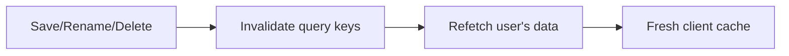

Server-side fetch caching is better for public or slow-changing data. Workflow
data should be fresh after mutations and scoped per user.

## 120. When would you use an API route instead of tRPC in this project?

I would use tRPC for internal TypeScript application operations, and API routes
for external integration boundaries.

Use tRPC:

- Workflow CRUD.
- Credential management.
- Execution queries.
- Internal dashboard actions.

Use API routes:

- Stripe webhooks.
- Google Form webhooks.
- Better Auth handler.
- Inngest handler.
- Public API endpoints.

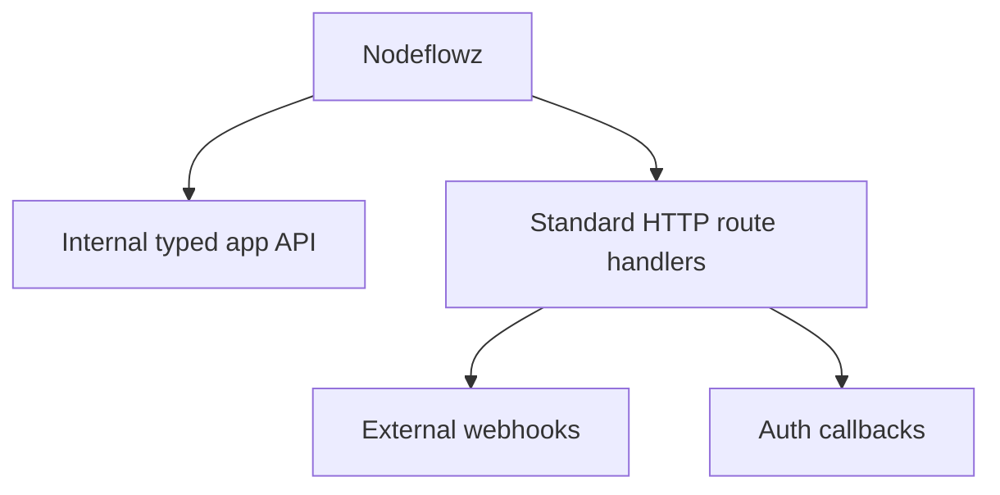

## 121. How does `BaseNode` provide a consistent visual shell for workflow nodes?

`BaseNode` wraps node UI with shared styling, focus behavior, and status
indicators.

```tsx
export const BaseNode = forwardRef<HTMLDivElement, BaseNodeProps>(
  ({ className, status, ...props }, ref) => (
    <div
      ref={ref}
      className={cn(
        "bg-card hover:bg-accent text-card-foreground relative rounded-sm border",
        "hover:ring-1",
        className,
      )}
      tabIndex={0}
      {...props}
    >
      {props.children}
      {status === "error" && <XCircleIcon />}
      {status === "success" && <CheckCircle2Icon />}
      {status === "loading" && <Loader2Icon />}
    </div>
  ),
);
```

This prevents every node from inventing its own border, spacing, and status
visuals.

## 122. How are loading, success, and error statuses shown on a node?

`BaseNode` renders a small absolute-positioned icon based on the `status` prop:

```tsx
{status === "loading" && (
  <Loader2Icon className="absolute right-0.5 bottom-0.5 size-2 animate-spin" />
)}
```

Status mapping:

| Status | Visual |
|---|---|
| `initial` | No icon |
| `loading` | Spinner |
| `success` | Check icon |
| `error` | X icon |

For accessibility, I would add `aria-label` or screen-reader text so status is
not communicated only through color or icon shape.

## 123. What accessibility issues should be checked in custom canvas nodes?

I would check:

- Keyboard focus order.
- Visible focus rings.
- Dialog labels and descriptions.
- Icon-only button labels.
- Color contrast.
- Screen-reader labels for status icons.
- Escape behavior for dialogs and sheets.
- Touch target sizes.
- Avoiding text trapped in canvas-only interactions.

Example:

```tsx
<Button size="icon" aria-label="Add workflow node">
  <PlusIcon />
</Button>
```

Canvas apps are harder to make accessible, so important actions should also be
available through keyboard or panel UI where possible.

## 124. Why does `BaseNode` include `tabIndex={0}`?

`tabIndex={0}` makes the node focusable using keyboard navigation.

```tsx
<div tabIndex={0}>
  {props.children}
</div>
```

This allows focus styles and keyboard actions to work. However, focusability
alone is not complete accessibility. The app should also define keyboard
shortcuts and ARIA labels for important actions.

## 125. How would keyboard navigation work on the canvas?

I would support:

- Arrow keys to move selected nodes.
- Shift+arrow for larger movement.
- Delete or Backspace to remove selected nodes.
- Enter to open configuration.
- Escape to clear selection or close dialogs.
- Cmd/Ctrl+S to save.
- Cmd/Ctrl+Z and Shift+Cmd/Ctrl+Z for undo/redo.

Example:

```ts
function handleKeyDown(event: KeyboardEvent) {
  if ((event.ctrlKey || event.metaKey) && event.key === "s") {
    event.preventDefault();
    saveCurrentWorkflow();
  }
}
```

Keyboard behavior should be discoverable through menus or tooltips, not hidden
as the only way to operate the app.

## 126. How would you make node configuration dialogs accessible?

The app already uses dialog primitives, which is a good start. I would ensure:

- Each dialog has `DialogTitle`.
- Each dialog has useful `DialogDescription`.
- Inputs have labels.
- Validation messages are tied to fields.
- Focus moves into the dialog on open and returns on close.
- Escape closes the dialog.
- Submit buttons are reachable by keyboard.

Current pattern:

```tsx
<DialogHeader>
  <DialogTitle>OpenAI Configuration</DialogTitle>
  <DialogDescription>
    Configure the AI model and prompts for this node.
  </DialogDescription>
</DialogHeader>
```

## 127. How would you improve mobile behavior for the workflow editor?

The editor is naturally desktop-heavy. For mobile, I would:

- Use a bottom sheet for node selection and configuration.
- Increase handle and button hit targets.
- Provide zoom controls that work well with touch.
- Offer a list/outline mode for workflow steps.
- Avoid relying on hover.
- Keep panels from covering nodes.
- Consider read-only or simplified editing on small screens.

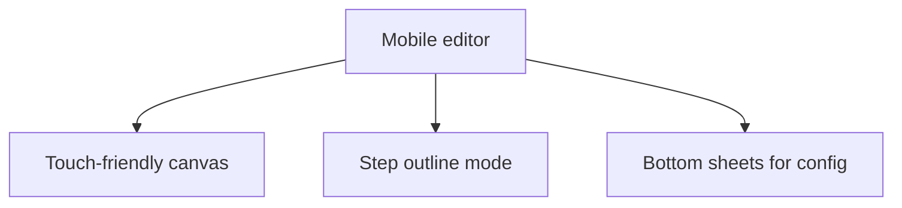

## 128. How would you handle long node labels or long prompt text?

For node labels, I would constrain width and use truncation:

```tsx
<BaseNodeHeaderTitle className="truncate">
  {title}
</BaseNodeHeaderTitle>
```

For prompt previews, I would avoid rendering the entire prompt on the node.
Instead:

- Show a short summary or first line.
- Use a tooltip or dialog for full text.
- Preserve full text in configuration.
- Prevent node width from expanding unpredictably.

Long content should not change graph layout while dragging.

## 129. How would you make the sidebar and canvas coexist responsively?

The dashboard layout uses a sidebar provider and inset:

```tsx
<SidebarProvider>
  <AppSidebar />
  <SidebarInset className="bg-accent/20">
    {children}
  </SidebarInset>
</SidebarProvider>
```

For the canvas, I would ensure the editor fills available space:

```tsx
<div className="w-full h-screen relative">
  <ReactFlow style={{ height: "100%", width: "100%" }} />
</div>
```

Responsive concerns:

- Recalculate canvas size when sidebar collapses.
- Avoid fixed panels that cover content.
- Use `fitView` after layout changes if necessary.
- Keep mobile navigation separate from canvas controls.

## 130. How would you design empty, loading, and error states for workflow pages?

The repo already has `LoadingView` and `ErrorView` patterns. I would use:

- Empty workflow list: clear create button and maybe template starter.
- Loading editor: skeleton or centered loading message.
- Error editor: retry button and navigation back to workflows.
- Empty executions: explain that runs appear after executing.
- Empty credentials: provider-specific add credential CTA.

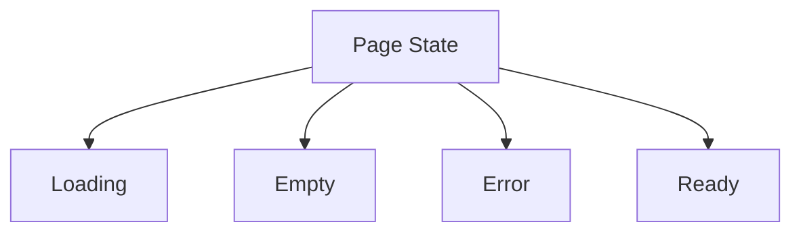

Good states tell the user what happened and what they can do next.

## 131. How is the frontend organized by features in this repo?

The repo uses feature folders:

```text
src/features/editor
src/features/workflows
src/features/credentials
src/features/executions
src/features/triggers
src/features/auth
src/features/subscriptions
```

Each feature owns its components, hooks, server routers, params, or utilities
where appropriate.

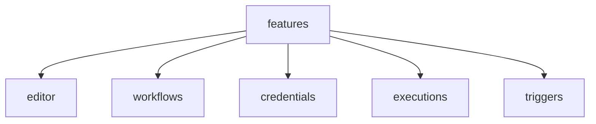

This scales better than organizing only by technical type, such as all
components in one folder and all hooks in another.

## 132. Why are workflow, execution, credential, trigger, and editor code split into feature folders?

Feature folders keep related UI, hooks, params, and server logic close to the
domain they serve.

Benefits:

- Easier navigation.
- Lower accidental coupling.
- Clear ownership boundaries.
- Easier deletion or refactoring of a feature.
- Better mental model for interview explanation.

Example:

```text
features/workflows
  components/
  hooks/
  server/
  params.ts
```

Shared primitives still live in `components/ui` or `lib`.

## 133. What is the difference between reusable components and feature components here?

Reusable components are domain-agnostic:

- `Button`
- `Dialog`
- `Form`
- `Select`
- `BaseNode`
- `Sidebar`

Feature components encode product logic:

- `Editor`
- `ExecuteWorkflowButton`
- `Workflows`
- `Credentials`
- `OpenAiDialog`
- `ManualTriggerNode`

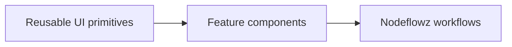

Interview answer:

> UI primitives know how to look and behave. Feature components know what the
> product means.

## 134. How would you add a new node type end to end on the frontend?

Steps:

1. Add or confirm the `NodeType` enum value in Prisma.
2. Regenerate Prisma types.
3. Create the visual node component.
4. Create a configuration dialog and schema.
5. Add the node to `nodeComponents`.
6. Add the option to `NodeSelector`.
7. Add frontend validation for its data.
8. Ensure save/load preserves its data.
9. Connect realtime status if needed.

Example registry addition:

```ts
export const nodeComponents = {
  ...,
  [NodeType.NEW_PROVIDER]: NewProviderNode,
} as const satisfies NodeTypes;
```

Backend executor registration is also required for actual execution.

## 135. Which files must change when adding a new AI provider node?

Frontend likely changes:

```text
src/config/node-components.ts
src/components/node-selector.tsx
src/features/executions/components/new-provider/node.tsx
src/features/executions/components/new-provider/dialog.tsx
src/features/executions/components/new-provider/actions.ts
public/logos/new-provider.svg
```

Shared/server changes:

```text
prisma/schema.prisma
src/features/executions/lib/executor-registry.ts
src/inngest/channels/new-provider.ts
src/inngest/functions.ts or provider executor wiring
src/features/credentials/... if credentials are required
```

Interview answer:

> A new provider needs a visual component, configuration form, selector option,
> registry entry, optional realtime token action, credential support, and a
> backend executor. The frontend node is only one piece of the full lifecycle.

## 136. How would you prevent node component registration from drifting from backend executor registration?

I would centralize node metadata:

```ts
type NodeDefinition<TData> = {
  type: NodeType;
  label: string;
  category: "trigger" | "action";
  component: ComponentType<NodeProps>;
  dataSchema: z.ZodType<TData>;
  executor?: NodeExecutor<TData>;
};
```

Then derive:

```ts
export const nodeComponents = Object.fromEntries(
  definitions.map((definition) => [definition.type, definition.component]),
);
```

At minimum, use `satisfies Record<NodeType, ...>` for both frontend and backend
registries so TypeScript catches missing entries.

## 137. How would you design a plugin-like node registry?

I would define node packages as metadata plus implementation:

```ts
type NodePlugin<TData> = {
  type: NodeType;
  label: string;
  description: string;
  icon: IconSource;
  category: "trigger" | "action";
  component: ComponentType<NodeProps<TData>>;
  dialog: ComponentType<NodeDialogProps<TData>>;
  schema: z.ZodType<TData>;
};
```

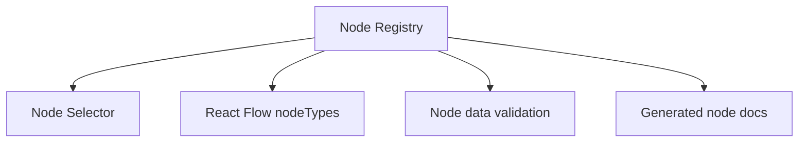

This makes new integrations easier to add consistently.

## 138. How would you lazy-load node configuration dialogs?

Use dynamic imports or `React.lazy` for dialog components:

```tsx
const OpenAiDialog = lazy(() =>
  import("./dialog").then((module) => ({
    default: module.OpenAiDialog,
  })),
);
```

Render with Suspense:

```tsx
{dialogOpen && (
  <Suspense fallback={<Spinner />}>
    <OpenAiDialog open={dialogOpen} onOpenChange={setDialogOpen} />
  </Suspense>
)}
```

This keeps the initial canvas lighter, especially as the number of provider
dialogs grows.

## 139. How would you version node schemas so old workflows still open?

Add a schema version to node data:

```ts
type VersionedOpenAiData =
  | { version: 1; prompt: string }
  | { version: 2; systemPrompt?: string; userPrompt: string };
```

Then migrate when loading:

```ts
function normalizeOpenAiData(data: unknown): OpenAiDataV2 {
  const parsed = openAiVersionedSchema.parse(data);

  if (parsed.version === 1) {
    return {
      version: 2,
      userPrompt: parsed.prompt,
      systemPrompt: "",
    };
  }

  return parsed;
}
```

This keeps old saved workflows usable after the UI evolves.

## 140. How would you migrate saved node data when a node config shape changes?

There are two strategies:

1. Lazy migration on read.
2. Database migration script.

Lazy migration:

```ts
const normalized = normalizeNodeData(node.type, node.data);
```

Database migration:

```ts
for (const node of nodes) {
  await prisma.node.update({
    where: { id: node.id },
    data: { data: migrateNodeData(node.data) },
  });
}
```

Lazy migration is safer for gradual rollout. Database migration is better when
the old shape must be removed completely.

## 141. How would you support workflow templates in the frontend?

The backend already supports a template input for creation:

```ts
z.object({
  template: workflowTemplateSchema.optional(),
}).optional()
```

Frontend could expose:

```tsx
createWorkflow.mutate({
  template: "tinyfish_hn_to_sheets",
});
```

UI:

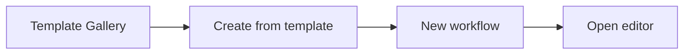

The template gallery should show what integrations and credentials are needed
before creation.

## 142. How would you support nested workflows or subflows?

I would introduce a node type like `RUN_WORKFLOW` that references another
workflow.

Data:

```ts
type RunWorkflowNodeData = {
  workflowId: string;
  inputMapping: Record<string, string>;
  outputVariableName: string;
};
```

UI:

- Select child workflow.
- Map parent variables to child inputs.
- Show child workflow summary.
- Prevent recursive cycles.

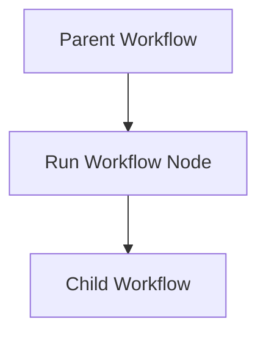

The backend must detect recursion and enforce ownership.

## 143. How would you support branching and conditional paths visually?

Add a condition node with multiple output handles:

```tsx
<Handle type="source" id="true" position={Position.Right} />
<Handle type="source" id="false" position={Position.Bottom} />
```

Graph:

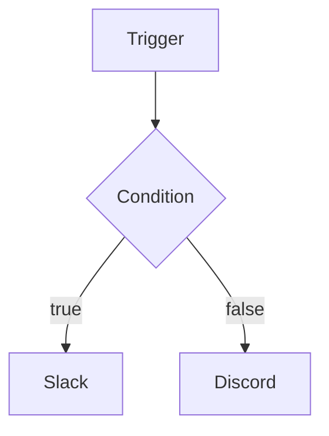

The edge handle IDs become semantic:

```ts
{
  source: conditionNode.id,
  sourceHandle: "true",
  target: slackNode.id,
}
```

The executor must evaluate the condition and choose the matching outgoing
branch.

## 144. How would you support multiple outputs from a node?

At the UI layer, multiple outputs are just multiple source handles:

```tsx
<Handle type="source" id="success" position={Position.Right} />
<Handle type="source" id="error" position={Position.Bottom} />
```

At the data layer, `fromOutput` stores the handle:

```ts
fromOutput: edge.sourceHandle || "main"
```

At the execution layer, the engine decides which outgoing connections are
eligible based on the output name.

Interview answer:

> React Flow handles multiple visual outputs with handles. Nodeflowz already
> persists handle IDs, so the main work is making validation and execution
> understand the meaning of each output.

## 145. How would you represent fan-out and fan-in in the canvas UI?

Fan-out means one node feeds multiple downstream nodes. Fan-in means multiple
upstream nodes feed one downstream node.

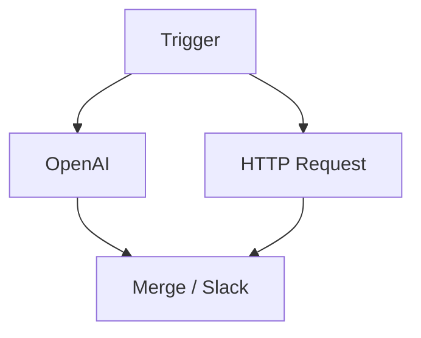

UI considerations:

- Make multiple edges visually clear.
- Allow merge nodes to show required inputs.
- Validate whether a node supports multiple inputs.
- Display waiting status when one branch is still running.
- Clarify how outputs are merged into context.

Fan-in is more complex than fan-out because execution must wait for all
required dependencies.

## 146. How would you implement client-side graph validation with typed validation errors?

Use a typed union:

```ts
type ValidationIssue =
  | { type: "NO_TRIGGER"; severity: "error"; message: string }
  | { type: "CYCLE"; severity: "error"; message: string }
  | { type: "DISCONNECTED_NODE"; severity: "warning"; nodeId: string; message: string }
  | { type: "INVALID_NODE_DATA"; severity: "error"; nodeId: string; message: string };
```

Validator:

```ts
function validateWorkflow(nodes: Node[], edges: Edge[]): ValidationIssue[] {
  return [
    ...validateTrigger(nodes),
    ...validateCycles(nodes, edges),
    ...validateConnectivity(nodes, edges),
    ...validateNodeData(nodes),
  ];
}
```

The UI can group global issues and node-specific issues separately.

## 147. How would you share validation rules between frontend and backend?

I would share pure schemas and graph utilities in a common module that does not
import browser-only or server-only code.

```text
src/features/workflows/shared/
  node-data-schemas.ts
  graph-validation.ts
  graph-types.ts
```

Rules that are safe to share:

- Zod node data schemas.
- Cycle detection.
- Required trigger checks.
- Handle compatibility.

Server-only rules:

- Ownership checks.
- Credential existence.
- Subscription limits.
- Secret availability.

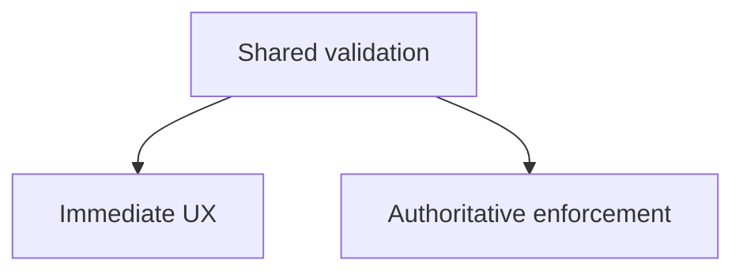

## 148. How would you detect cycles efficiently in a large workflow?

Use DFS with colors or Kahn's algorithm.

DFS:

```ts
function hasCycle(nodes: Node[], edges: Edge[]) {
  const adjacency = new Map<string, string[]>();
  for (const node of nodes) adjacency.set(node.id, []);
  for (const edge of edges) adjacency.get(edge.source)?.push(edge.target);

  const visiting = new Set<string>();
  const visited = new Set<string>();

  function visit(id: string): boolean {
    if (visiting.has(id)) return true;
    if (visited.has(id)) return false;

    visiting.add(id);
    for (const next of adjacency.get(id) ?? []) {
      if (visit(next)) return true;
    }
    visiting.delete(id);
    visited.add(id);
    return false;
  }

  return nodes.some((node) => visit(node.id));
}
```

Complexity is `O(V + E)`.

## 149. How would you topologically sort nodes on the frontend for preview?

Kahn's algorithm:

```ts
function topologicalSort(nodes: Node[], edges: Edge[]) {
  const inDegree = new Map(nodes.map((node) => [node.id, 0]));
  const adjacency = new Map(nodes.map((node) => [node.id, [] as string[]]));

  for (const edge of edges) {
    adjacency.get(edge.source)?.push(edge.target);
    inDegree.set(edge.target, (inDegree.get(edge.target) ?? 0) + 1);
  }

  const queue = nodes
    .filter((node) => inDegree.get(node.id) === 0)
    .map((node) => node.id);

  const result: string[] = [];

  while (queue.length) {
    const id = queue.shift()!;
    result.push(id);

    for (const next of adjacency.get(id) ?? []) {
      inDegree.set(next, inDegree.get(next)! - 1);
      if (inDegree.get(next) === 0) queue.push(next);
    }
  }

  if (result.length !== nodes.length) throw new Error("Cycle detected");
  return result;
}
```

This can power an execution preview panel.

## 150. How would you compute which variables are available to each node based on graph order?

First topologically sort the graph. Then walk nodes in order and accumulate
outputs.

```ts
type VariableInfo = {
  name: string;
  producerNodeId: string;
  schema?: unknown;
};

function computeAvailableVariables(nodes: Node[], edges: Edge[]) {
  const order = topologicalSort(nodes, edges);
  const availableByNodeId = new Map<string, VariableInfo[]>();
  const accumulated: VariableInfo[] = [];

  for (const nodeId of order) {
    availableByNodeId.set(nodeId, [...accumulated]);

    const node = nodes.find((item) => item.id === nodeId)!;
    const variableName = (node.data as any).variableName;

    if (typeof variableName === "string") {
      accumulated.push({ name: variableName, producerNodeId: node.id });
    }
  }

  return availableByNodeId;
}
```

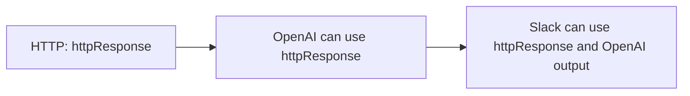

This enables template autocomplete and prevents referencing future outputs.

