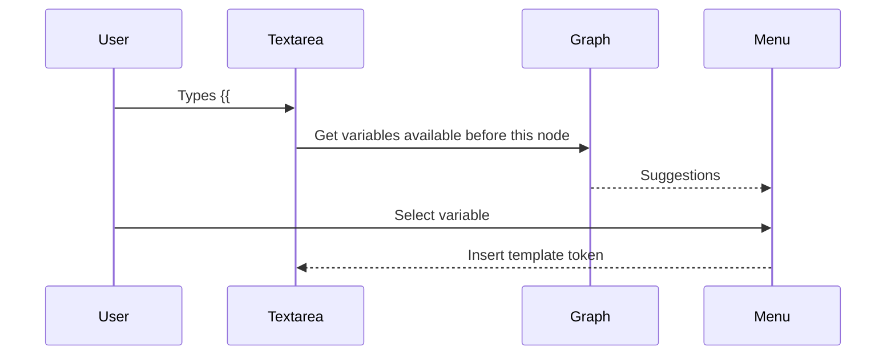
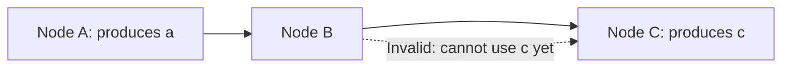
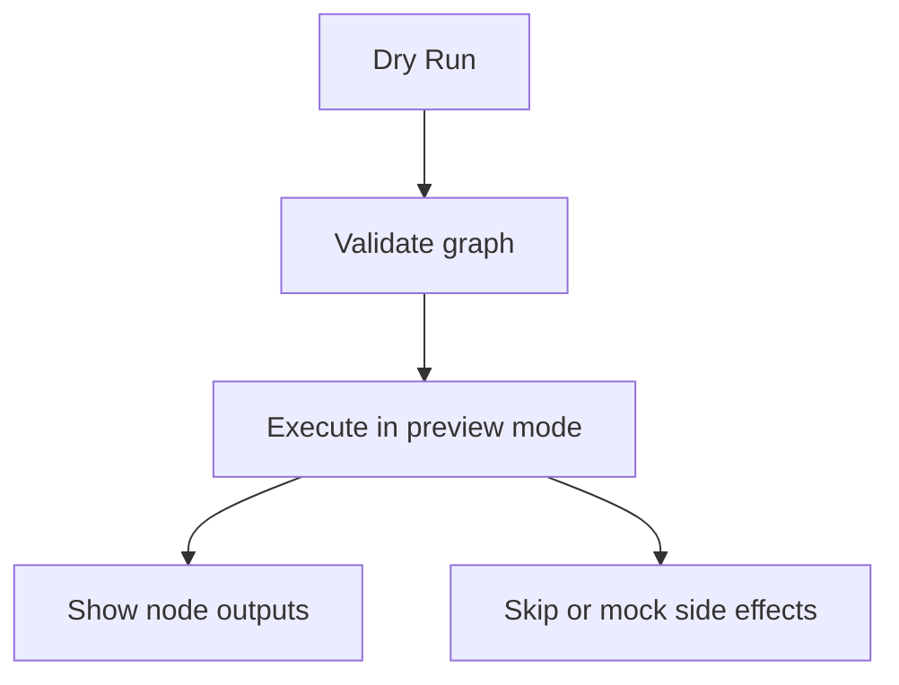
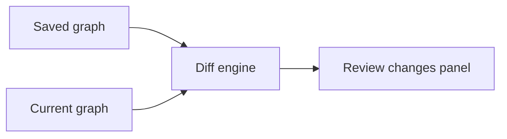
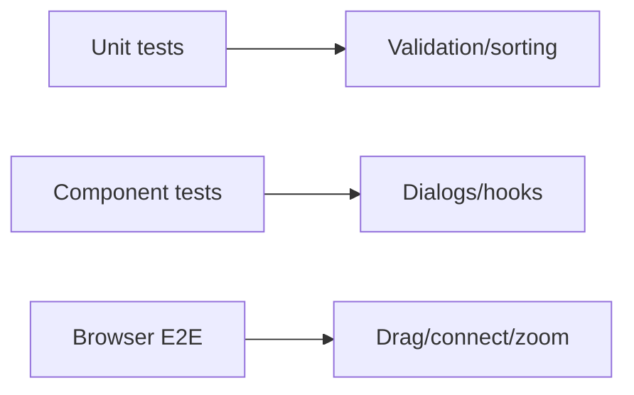
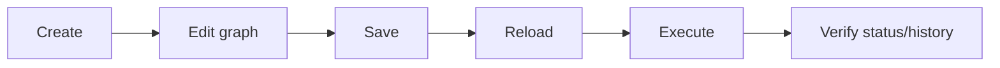
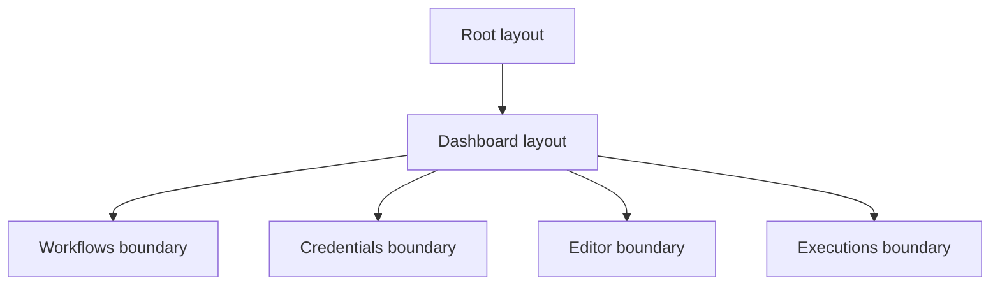
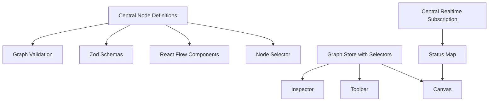

# Frontend Interview Questions 151-170

## 151. How would you build autocomplete for template variables in prompts?

I would combine graph analysis with editor UI. First compute variables
available to the current node based on topological order. Then expose those
variables in the prompt textarea when the user types `{{`.

```ts
type TemplateSuggestion = {
  label: string;
  insertText: string;
  description: string;
};

function getTemplateSuggestions(variables: VariableInfo[]): TemplateSuggestion[] {
  return variables.flatMap((variable) => [
    {
      label: variable.name,
      insertText: `{{${variable.name}}}`,
      description: "Insert value",
    },
    {
      label: `json ${variable.name}`,
      insertText: `{{json ${variable.name}}}`,
      description: "Insert JSON stringified value",
    },
  ]);
}
```



For a polished implementation I would use a code-editor-style input for prompt
fields, because template syntax quickly becomes more complex than a basic
textarea.

## 152. How would you prevent a node from referencing variables produced after it?

I would compare template references against variables available before the
current node in topological order.

```ts
function validateTemplateRefs(
  nodeId: string,
  template: string,
  availableByNodeId: Map<string, VariableInfo[]>,
) {
  const available = new Set(
    (availableByNodeId.get(nodeId) ?? []).map((item) => item.name),
  );

  return extractTemplateRefs(template).filter((ref) => {
    const rootName = ref.path.split(".")[0];
    return !available.has(rootName);
  });
}
```



The UI should show a field-level error before save, and the backend should
repeat the same rule before execution.

## 153. How would you show schema-aware outputs from AI and HTTP nodes?

Each node can declare an output schema. The frontend can use that schema for
autocomplete, previews, and validation.

```ts
type NodeOutputSchema = {
  variableName: string;
  fields: Array<{
    path: string;
    type: "string" | "number" | "boolean" | "object" | "array" | "unknown";
  }>;
};
```

Example:

```ts
const httpOutputSchema = {
  variableName: "httpResponse",
  fields: [
    { path: "status", type: "number" },
    { path: "data", type: "unknown" },
    { path: "headers", type: "object" },
  ],
};
```

For AI nodes, the schema may be user-defined through structured output config.
For unstructured text, the schema can expose `text`.

## 154. How would you implement a dry-run preview mode?

A dry run lets users test a workflow without committing external side effects,
or with mock side effects.

Frontend:

```tsx
<Button onClick={() => dryRun.mutate({ id: workflowId, input: mockInput })}>
  Dry run
</Button>
```

UI should show:

- Input values.
- Execution order.
- Per-node mock or real output.
- Validation warnings.
- Side effects that would have occurred.



The backend must support a dry-run flag so frontend state cannot accidentally
fake execution correctness.

## 155. How would you design a diff view between saved and current workflow graph?

I would compare the saved snapshot and current graph by node and edge IDs.

```ts
type GraphDiff = {
  addedNodes: Node[];
  removedNodes: Node[];
  changedNodes: Array<{ before: Node; after: Node }>;
  addedEdges: Edge[];
  removedEdges: Edge[];
};
```



UI ideas:

- Added nodes highlighted green.
- Removed nodes listed in a side panel.
- Changed config fields shown as before/after.
- Edge changes listed by source and target labels.

This is useful before publishing workflow versions.

## 156. How would you test the editor component?

I would use a layered strategy:

- Unit-test graph utilities such as validation and sorting.
- Component-test editor behavior with mocked tRPC data.
- E2E-test real canvas flows in a browser.

For component testing, React Flow may need layout mocks because it depends on
DOM measurements.

```ts
vi.mock("@/features/workflows/hooks/use-workflows", () => ({
  useSuspenseWorkflow: () => ({
    data: {
      id: "workflow-1",
      name: "Test workflow",
      nodes: [],
      edges: [],
    },
  }),
}));
```

The most valuable tests are not "React Flow renders"; they are "Nodeflowz
passes the right graph state through React Flow and mutations."

## 157. How would you test node selector behavior?

I would test:

- The sheet opens when the add button is clicked.
- Trigger and execution nodes are rendered.
- Selecting a node calls `setNodes`.
- Selecting a manual trigger twice shows an error.
- Initial placeholder replacement works.

Because `NodeSelector` uses `useReactFlow`, I would render it inside
`ReactFlowProvider` and a minimal `ReactFlow`.

```tsx
render(
  <ReactFlowProvider>
    <ReactFlow nodes={[]} edges={[]}>
      <NodeSelector open onOpenChange={vi.fn()}>
        <button>Add</button>
      </NodeSelector>
    </ReactFlow>
  </ReactFlowProvider>,
);
```

For drag/canvas realism, E2E tests are better than pure unit tests.

## 158. How would you test React Flow interactions that depend on browser layout?

Use Playwright or another browser E2E tool. React Flow interactions depend on
real pointer events, element bounds, zoom, and transforms.

Test scenario:

```ts
test("user can add and connect nodes", async ({ page }) => {
  await page.goto("/workflows/test-id");
  await page.getByLabel("Add workflow node").click();
  await page.getByText("HTTP Request").click();

  await expect(page.getByText("HTTP Request")).toBeVisible();
});
```

For connection dragging, use mouse coordinates from element bounding boxes.



## 159. How would you mock tRPC hooks in component tests?

For feature component tests, mock the feature hooks rather than tRPC internals.

```ts
vi.mock("@/features/workflows/hooks/use-workflows", () => ({
  useExecuteWorkflow: () => ({
    mutate: vi.fn(),
    isPending: false,
  }),
}));
```

For integration-style tests, provide a real QueryClient and mock network
responses at the tRPC route boundary.

Interview answer:

> I prefer mocking at the feature hook boundary for focused component tests
> because it keeps tests stable. Then I use E2E tests to prove the actual tRPC
> integration works.

## 160. How would you test form validation for node dialogs?

Test the Zod schema directly and test the rendered form behavior.

Schema test:

```ts
expect(formSchema.safeParse({
  variableName: "1bad",
  credentialId: "",
  userPrompt: "",
}).success).toBe(false);
```

Component test:

```ts
await user.click(screen.getByRole("button", { name: /save/i }));
expect(await screen.findByText(/Variable name is required/i)).toBeVisible();
```

Also test that opening with different `defaultValues` resets the form, because
that is a common source of stale node configuration bugs.

## 161. How would you test realtime node status updates?

I would separate message processing from subscription transport.

Pure function:

```ts
function getLatestStatusForNode(messages: Message[], nodeId: string) {
  return messages
    .filter((msg) => msg.kind === "data" && msg.data.nodeId === nodeId)
    .sort((a, b) => b.createdAt.localeCompare(a.createdAt))[0]?.data.status;
}
```

Test the pure function with multiple nodes and out-of-order timestamps. Then
mock `useInngestSubscription` for hook/component tests.

E2E can verify that a real execution updates visible node status in a running
development environment.

## 162. What end-to-end tests are most important for Nodeflowz?

Highest-value E2E tests:

- Sign in and reach dashboard.
- Create workflow.
- Open editor.
- Add manual trigger and action node.
- Configure node.
- Connect nodes.
- Save workflow.
- Reload and verify graph persists.
- Execute workflow.
- See execution status or execution history.
- Create credential and use it in a node.



These cover the product's core value path.

## 163. How would you measure canvas performance with hundreds of nodes?

I would measure:

- Initial editor load time.
- Time to interactive.
- Drag FPS.
- Rerender count per drag.
- Memory usage.
- Time to validate graph.
- Time to save graph.
- React commit duration.

Tools:

- React Profiler.
- Browser Performance panel.
- Custom metrics around validation and save.
- Synthetic large workflow fixtures.

```ts
performance.mark("validate-start");
const issues = validateWorkflow(nodes, edges);
performance.mark("validate-end");
performance.measure("validate", "validate-start", "validate-end");
```

Performance should be measured with realistic graph sizes, not guessed.

## 164. How would you profile rerenders during node dragging?

I would use React DevTools Profiler and add targeted render logging in
development.

Checklist:

- Confirm only affected node components rerender heavily.
- Check whether panels rerender during drag.
- Verify `nodeComponents` is stable.
- Verify callbacks are stable.
- Inspect expensive derived values.
- Disable heavy validation during drag.

Example diagnostic:

```ts
if (process.env.NODE_ENV === "development") {
  console.count(`Render OpenAiNode ${props.id}`);
}
```

Then remove the logging after finding the cause.

## 165. How would you prevent memory leaks from realtime subscriptions?

I would:

- Keep subscriptions at the workflow/editor level where possible.
- Ensure hooks unsubscribe on unmount.
- Disable subscriptions when the route is not active.
- Avoid creating new token functions every render.
- Clear status state when workflow ID changes.
- Do not keep unbounded message arrays in memory.

```ts
useEffect(() => {
  return () => {
    resetStatusesForWorkflow(workflowId);
  };
}, [workflowId]);
```

The subscription library should handle transport cleanup, but the app still
owns state cleanup and avoiding duplicate subscriptions.

## 166. How would you handle React 19 Suspense behavior with QueryClient creation?

The repo already follows an important pattern: do not create the browser
QueryClient with `useState` if there is no Suspense boundary below it that can
protect initial suspension.

Current code:

```ts
let browserQueryClient: QueryClient;

function getQueryClient() {
  if (typeof window === "undefined") {
    return makeQueryClient();
  }

  if (!browserQueryClient) browserQueryClient = makeQueryClient();
  return browserQueryClient;
}
```

Interview answer:

> The browser QueryClient is stored outside the component so React does not
> throw it away during initial Suspense. On the server, a new QueryClient is
> created per request to avoid cross-request cache leakage.

## 167. How would you secure secrets so credentials never leak into frontend bundles?

Rules:

- Never import credential encryption/decryption into Client Components.
- Never expose provider API keys through `NEXT_PUBLIC_` env vars.
- Fetch credential metadata only, not secret values.
- Decrypt secrets only in server-side executors.
- Use tRPC protected procedures for credential CRUD.
- Audit bundles for accidental server imports.

Bad:

```tsx
"use client";
const apiKey = process.env.OPENAI_API_KEY;
```

Good:

```tsx
// Client receives only id, name, and type.
type CredentialListItem = {
  id: string;
  name: string;
  type: CredentialType;
};
```

The frontend should never need raw secret values.

## 168. How would you design frontend error boundaries for failed workflows, failed credentials, and failed executions?

Use scoped error boundaries so one failing feature does not take down the
entire dashboard.



Each fallback should be specific:

- Workflow not found: return to workflow list.
- Credential load failed: retry and add credential link.
- Execution load failed: retry and show execution ID.
- Editor failed: preserve navigation and offer reload.

Generic "Something went wrong" is less useful in a workflow tool.

## 169. What frontend architectural risks exist in the current implementation?

Key risks:

- Node `data` is loosely typed in several places.
- Save operation replaces the whole graph rather than diffing changes.
- Realtime status processing may duplicate work per node.
- Global editor instance can become stale if not cleared.
- Some validation appears split between frontend and backend.
- Adding nodes requires touching many files manually.
- Heavy editor code may grow the bundle as integrations increase.
- Large graphs may need better selector-based state management.

Interview answer:

> The architecture is good for a product-stage workflow builder, but the next
> scaling step is centralizing node definitions, strengthening typed node data,
> improving graph validation, and optimizing large-canvas performance.

## 170. What would you refactor first if Nodeflowz had to support thousands of workflows and very large canvases?

I would refactor in this order:

1. Centralize node definitions.
2. Strongly type and validate node data.
3. Move graph-derived state into memoized selectors or a store.
4. Centralize realtime status processing.
5. Add graph diff saving instead of full delete/recreate.
6. Lazy-load provider dialogs and heavy node code.
7. Add large-workflow performance tests.

Target architecture:



Interview answer:

> My first refactor would be a typed node-definition registry. It reduces
> drift across selector options, node components, dialogs, schemas, and
> executors. After that I would address graph state and realtime status so
> large canvases do not cause unnecessary rerenders or repeated message
> processing.

