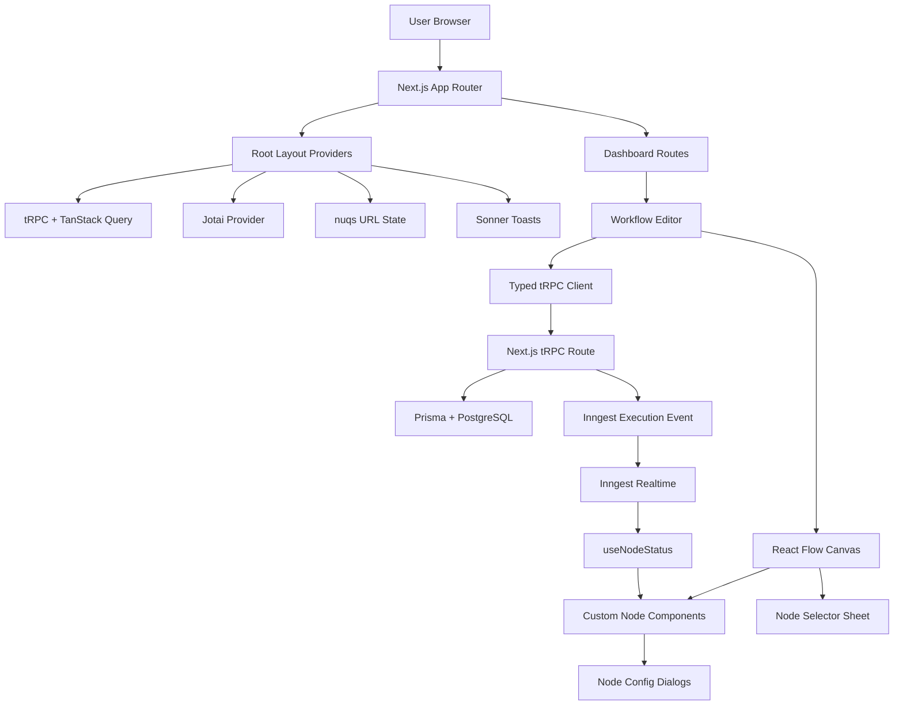

# Nodeflowz Frontend Interview Questions

This folder answers the frontend-specific interview question bank for
Nodeflowz. The answers are written as if speaking to an interviewer: first the
direct answer, then the current implementation, trade-offs, and production
improvements where relevant.

## Batches

| File | Questions | Main Topics |
|---|---:|---|
| [01-questions-001-050.md](./01-questions-001-050.md) | 001-050 | Product basics, React, React Flow, rendering, graph state |
| [02-questions-051-100.md](./02-questions-051-100.md) | 051-100 | Advanced React Flow, TypeScript, forms, state, tRPC, React Query |
| [03-questions-101-150.md](./03-questions-101-150.md) | 101-150 | Execution UI, realtime status, Next.js, UI architecture, graph validation |
| [04-questions-151-170.md](./04-questions-151-170.md) | 151-170 | Testing, performance, security, scaling, refactoring risks |

## Frontend Architecture Snapshot

## Core Files To Know

- `src/app/layout.tsx`
- `src/trpc/client.tsx`
- `src/features/editor/components/editor.tsx`
- `src/components/node-selector.tsx`
- `src/config/node-components.ts`
- `src/features/workflows/hooks/use-workflows.ts`
- `src/features/workflows/server/routers.ts`
- `src/features/executions/hooks/use-node-status.ts`
- `src/components/react-flow/base-node.tsx`

