# HR Round Answers 756-800

## 756. Tell me about yourself.

I am Deepa Patel, a Computer Science Engineering student specializing in AI and
ML at Pranveer Singh Institute of Technology, Kanpur. My current CGPA/percentage
is 87.68%, and I have built a strong foundation in frontend development, data
structures, and full-stack web fundamentals.

My strongest project is Nodeflowz, a workflow automation platform where I worked
on the frontend using Next.js, React, TypeScript, Tailwind CSS, Prisma, tRPC,
and PostgreSQL. In that project, I focused on building a responsive and modular
interface, reusable UI components, authentication screens, layout consistency,
and a clean workflow-builder experience.

Apart from Nodeflowz, I have built AcadAI, an AI-powered study assistant using
Streamlit and RAG concepts, and CommentPulse, a YouTube comment sentiment
dashboard where I worked on clean visualization of large analysis results. I
have also solved 500+ algorithmic problems and served as Vice President of Algo
Club, where I organized hackathons and web development workshops.

What I bring is a mix of frontend attention to detail, problem-solving
discipline, and ownership. I am looking for a role where I can work on real
products, learn from strong engineers, and contribute to user-facing features
that are reliable, scalable, and cleanly built.

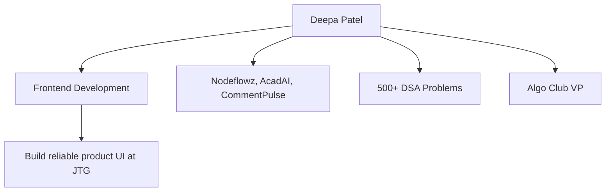

## 757. Walk me through your resume.

My resume starts with my education. I am pursuing B.Tech in Computer Science
Engineering with specialization in AI and ML from PSIT, Kanpur, with 87.68%. I
also scored 92.33% in intermediate and 96.71% in high school, so academically I
have been consistent.

In technical skills, my main frontend skills are HTML5, CSS3, Flexbox, Grid,
responsive design, React.js, and Next.js. I also work with JavaScript,
TypeScript, Java, Python, C++, SQL, Node.js, Express.js, PostgreSQL, MongoDB,
Redis, Git, Docker, AWS, and Vercel. My core CS foundation includes OOP, DSA,
and DBMS.

My main project is Nodeflowz, a workflow automation platform. I built a
responsive frontend interface using Next.js, React, TypeScript, and Tailwind
CSS. I focused on modular UI components, consistent styling, adaptive layouts,
authentication screens, and reusable frontend design patterns.

My second project is AcadAI, an AI-powered study assistant where I built an
interactive Streamlit interface for document ingestion, querying, and
multi-agent academic workflows. My third project is CommentPulse, where I built
dashboard interfaces for sentiment analysis and ensured the UI remained usable
even during backend stress testing.

I also completed an Infosys Springboard internship, where I worked with data
presentation, structured reporting, and output reliability. Finally, my
achievements include 500+ DSA problems, Algo Club leadership, Hacktoberfest
Level 3 contribution, Build With India semi-finalist status, and Google GenAI
Exchange Program selection.

## 758. Why do you want to work at Josh Technology Group?

I want to work at Josh Technology Group because JTG seems strongly aligned with
the kind of engineering I want to grow into. From my understanding, JTG works on
creating and transforming software products, not just maintaining small pieces
of code. Their official website highlights product engineering across modern
web frameworks, cloud and DevOps, AI/ML, SaaS, mobile applications, quality
engineering, and industries like healthcare, transport, e-commerce, software
engineering, and CRM.

That matches my interests because my projects are also product-oriented. In
Nodeflowz, I was not only writing UI screens; I was thinking about how a user
would create a workflow, configure nodes, save changes, and execute automation.
In CommentPulse, I focused on presenting high-volume sentiment data clearly. In
AcadAI, I worked on making AI interactions usable through a clean interface.

JTG also seems to value strong engineering culture, product thinking, and
collaboration. As a fresher, I want a place where I can learn from experienced
engineers, work on real client-facing problems, and improve both technical
depth and professional discipline. That is why JTG is attractive to me.

## 759. What do you know about Josh Technology Group as a company?

Josh Technology Group is a technology company focused on building and
transforming software products. From their official website, I understood that
they have worked on many product solutions and support companies through modern
development practices. Their services include modern web frameworks, big data
and analytics, cloud and DevOps, AI/ML, SaaS, mobile apps, technical
assessment, and quality engineering.

They also mention industries such as healthcare, transport and travel,
automotive, e-commerce, software engineering, video-audio solutions, digital
marketing, and CRM. This tells me that the company works across domains, so
engineers get exposure to different product problems and not just one narrow
business area.

What I liked is that JTG presents itself as a company that understands product
creation, speed to market, scale, and modern engineering practices. For someone
like me, who has worked on Nodeflowz as a product-style project, that
environment feels like a strong fit.

## 760. Why did you choose front-end development as your career path?

I chose frontend development because it combines logic, design sensitivity, and
direct user impact. I enjoy the fact that frontend is not only about making a
screen look good; it is about making complex workflows understandable and
usable.

Nodeflowz confirmed this interest for me. A workflow automation platform can be
technically powerful, but if the canvas, node selector, forms, authentication
screens, and layouts are not clear, the user will still struggle. I liked
working on responsive layouts, reusable components, visual consistency, and
interaction flow.

I also enjoy the engineering side of frontend: React state, component design,
TypeScript types, API integration, performance, accessibility, and debugging UI
behavior. So frontend gives me the right balance between problem solving and
user experience.

## 761. What are your strengths and weaknesses?

My strengths are ownership, consistency, and attention to UI detail.

In Nodeflowz, I focused heavily on spacing, alignment, reusable components, and
responsive behavior. I do not like leaving a screen in a "just working" state;
I try to make it clean, understandable, and maintainable. My DSA practice has
also made my problem-solving process more structured, and my Algo Club role
helped me become better at communication and coordination.

One weakness I am actively improving is that sometimes I spend extra time
polishing details before stepping back to check the larger priority. For
frontend, detail matters, but I have learned that in a team environment I must
balance polish with delivery. Now I try to first complete the core behavior,
then improve UI refinement in a planned way.

## 762. Where do you see yourself in 3-5 years?

In 3-5 years, I see myself as a strong frontend or full-stack leaning frontend
engineer who can independently own product features from requirement
understanding to implementation, testing, and production support.

In the short term, I want to deepen my React, Next.js, TypeScript, browser
performance, accessibility, and system design understanding. In the longer
term, I want to become the kind of engineer who can design frontend
architecture for large applications, mentor juniors, and collaborate well with
backend, QA, design, and product teams.

At a company like JTG, where engineers work on real product engineering
problems across domains, I believe I can grow through exposure to different
clients, codebases, and architectural decisions.

## 763. What are your short-term and long-term career goals?

My short-term goal is to become industry-ready as a frontend engineer. I want
to strengthen React, Next.js, TypeScript, frontend testing, accessibility, and
performance while working on production-quality code. I also want to learn how
professional teams review code, estimate tasks, communicate blockers, and
deliver reliably.

My long-term goal is to become a product-minded frontend engineer who can own
large features and make good architectural decisions. I want to move beyond
only implementing screens and become someone who understands user experience,
API contracts, scalability, maintainability, and business context.

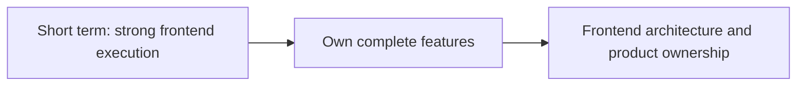

## 764. Why should we hire you over other candidates?

You should hire me because I bring a combination of frontend focus, strong
fundamentals, and ownership mindset.

I have built multiple projects where UI was not an afterthought. In Nodeflowz,
I worked on a workflow automation platform with modern frontend tools like
Next.js, React, TypeScript, Tailwind CSS, and tRPC. I focused on modular UI,
responsive behavior, authentication screens, and reusable frontend patterns.
This shows that I can work on a real product-style frontend, not only small
static pages.

I also have strong problem-solving practice through 500+ DSA problems, which
helps me debug and reason systematically. My Algo Club leadership experience
shows that I can communicate, coordinate, and take responsibility beyond my
assigned work.

I may be a fresher, but I learn quickly, accept feedback well, and care about
writing code that is understandable for the next person.

## 765. What makes you a good fit for this role?

This role is frontend-focused, and my resume is strongly aligned with that. I
have hands-on experience with HTML, CSS, JavaScript, React.js, Next.js,
responsive design, and Tailwind CSS. My main project, Nodeflowz, is directly
relevant because it required frontend structure, reusable components, clean
layout design, and product-level thinking.

I am also comfortable with backend concepts like REST APIs, Node.js, Express,
PostgreSQL, Prisma, and tRPC, which helps me collaborate better with backend
engineers. I do not see frontend as isolated; I understand that a good frontend
depends on clear API contracts, data loading, error states, and performance.

For JTG specifically, I think my interest in product engineering and modern web
interfaces fits well with the kind of work the company does.

## 766. Describe a challenging project you worked on and how you handled it.

The most challenging project I worked on was Nodeflowz, because it was not a
simple CRUD application. It was a workflow automation platform where the user
needed to create and manage workflows visually.

The challenge was to keep the UI modular, responsive, and understandable while
supporting different areas like workflow creation, authentication screens,
reusable design patterns, and consistent layouts. Since the project used
Next.js, React, TypeScript, Tailwind CSS, PostgreSQL, Prisma, and tRPC, I also
had to understand how frontend UI connects with typed backend APIs.

I handled it by breaking the work into smaller parts:

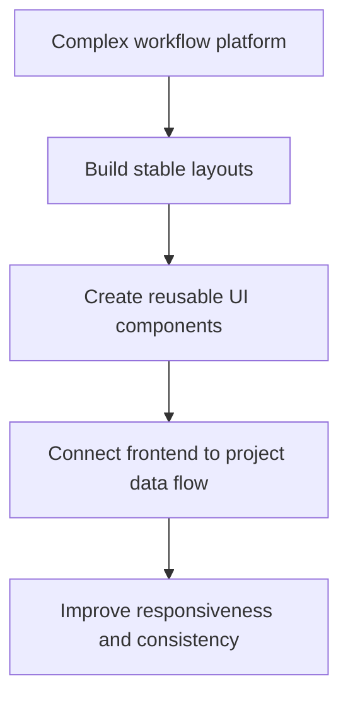

The result was a cleaner, more maintainable frontend where screens followed a
consistent structure. The project taught me that frontend complexity should be
handled with component boundaries, clear state flow, and repeated UI patterns.

## 767. Tell me about a time you had a disagreement with a teammate. How did you resolve it?

During group technical work, disagreements usually happened around approach:
whether to finish quickly with a simple solution or spend more time making the
code cleaner. My approach is to first understand the other person's reasoning
instead of immediately defending my own idea.

For example, while working on UI-heavy projects, I sometimes preferred a more
structured reusable component approach, while others preferred implementing the
screen directly to save time. I explained that reusable components would reduce
duplication and make future changes easier. At the same time, I accepted that
deadlines matter, so we agreed to implement the core screen first and extract
reusable parts where duplication was obvious.

That experience taught me that disagreement is not a problem if the discussion
stays focused on the product and deadline. I try to use examples, trade-offs,
and small compromises rather than making it personal.

## 768. Describe a situation where you had to learn a new technology quickly.

In Nodeflowz, I had to work with Next.js, TypeScript, Tailwind CSS, Prisma, and
tRPC together. I already had frontend fundamentals, but using these tools in a
full product-style project required learning quickly.

My learning process was:

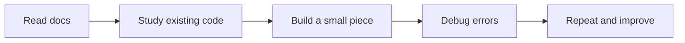

I first understood the existing project structure, then focused on one feature
at a time. For example, when working with typed API hooks, I studied how tRPC
queries and mutations were already used, then followed the same pattern for
workflow actions. This helped me learn without introducing inconsistent code.

## 769. Tell me about a time you failed at something. What did you learn?

One failure I remember is from earlier frontend work where I focused too much
on making a section visually polished before validating whether the structure
would work responsively across screen sizes. When I later tested it on smaller
screens, parts of the layout needed rework.

The lesson was that frontend quality is not only about desktop appearance. It
also includes responsiveness, content behavior, accessibility, and edge cases.
After that, I changed my process. Now I test layouts earlier across different
screen widths and keep reusable spacing and grid patterns in mind from the
beginning.

This helped me in Nodeflowz, where responsiveness and layout consistency were
important across dashboard screens and workflow-related UI.

## 770. Describe a time you had to work under pressure or tight deadlines.

During hackathons and club activities, I have worked under tight timelines where
we had to build, test, and present quickly. As Vice President of Algo Club, I
also helped organize hackathons and workshops, where coordination and deadlines
were important.

Under pressure, I try to avoid panic by breaking the work into must-have and
nice-to-have parts.

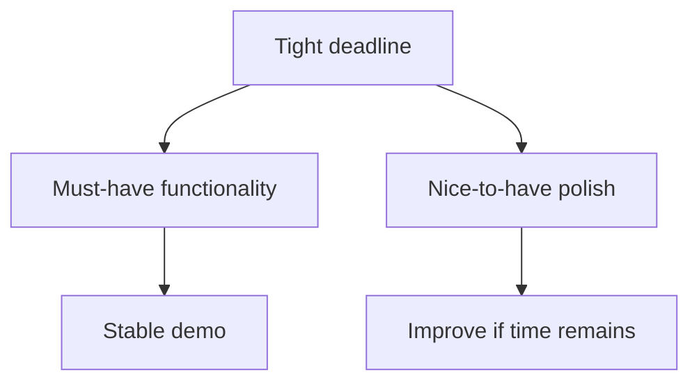

For frontend, this means I first ensure the main user flow works, then improve
styling, empty states, and polish. This approach helps me deliver something
stable without ignoring quality.

## 771. How do you handle criticism or feedback on your code?

I see code feedback as part of becoming better. If someone comments on my code,
I first try to understand whether the issue is about correctness,
maintainability, performance, readability, or team convention.

My response is:

1. Read the feedback fully.
2. Ask clarification if I do not understand.
3. Make the change if it improves the code.
4. Remember the pattern so I do not repeat the same mistake.

In frontend, feedback can be about small details like alignment, naming, or
component structure, but those details matter because they affect maintainable
UI. I try not to take review comments personally.

## 772. How do you prioritize tasks when working on multiple things at once?

I prioritize based on impact, dependency, deadline, and risk.

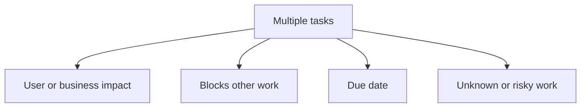

For example, in a frontend feature, I would first complete the main user flow,
then handle validation and error states, then polish responsiveness and
micro-interactions. If another teammate is blocked by an API contract or UI
component, I would prioritize that earlier.

I also communicate if priorities conflict instead of silently trying to do
everything.

## 773. Tell me about your final year project / most significant personal project.

My most significant project is Nodeflowz, a workflow automation platform. The
idea is to let users build automation workflows through a frontend interface
instead of manually writing scripts.

The technology stack includes Next.js, React.js, TypeScript, Tailwind CSS,
PostgreSQL, Prisma, and tRPC. My frontend work focused on responsive interface
development, modular UI components, reusable design patterns, authentication
screens, layout consistency, and user-friendly structure.

The interesting part of Nodeflowz is that it is a product-style project. A user
needs to understand how to create a workflow, configure it, and interact with
the platform. That made frontend quality very important.

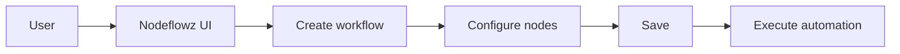

This project helped me understand how frontend work connects with backend data,
typed APIs, database models, and product usability.

## 774. What was the most difficult bug you've had to debug? How did you approach it?

One difficult category of bug I faced was responsive UI behavior, where a
layout looked correct on one screen but broke on another. These bugs can be
tricky because the code may technically work, but the user experience becomes
poor.

My debugging approach was:

1. Reproduce the issue on the exact screen size.
2. Inspect the element using browser dev tools.
3. Check parent width, flex/grid rules, overflow, and spacing.
4. Simplify the layout temporarily.
5. Apply a fix using responsive constraints.
6. Test again on multiple viewport sizes.

In Nodeflowz-style UI, this matters because dashboard pages, forms, and editor
panels must stay usable across devices. I learned to debug CSS systematically
instead of randomly changing classes.

## 775. Explain a project from your resume in depth. What was your specific contribution?

I will explain Nodeflowz because it is my strongest frontend project.

Nodeflowz is a workflow automation platform. The user can create workflows and
interact with a structured frontend interface. The stack includes Next.js,
React, TypeScript, Tailwind CSS, PostgreSQL, Prisma, and tRPC.

My specific contribution was on the frontend side:

- Building responsive UI screens.
- Creating clean and modular UI components.
- Maintaining spacing, alignment, and visual consistency.
- Developing secure authentication screens.
- Working with reusable frontend design patterns.
- Making the UI adaptive across different screen sizes.
- Understanding how frontend components connect to typed project APIs.

Example of the type of component thinking used in Nodeflowz:

```tsx
type ActionButtonProps = {
  loading?: boolean;
  children: React.ReactNode;
  onClick: () => void;
};

export function ActionButton({
  loading = false,
  children,
  onClick,
}: ActionButtonProps) {
  return (
    <button
      type="button"
      disabled={loading}
      onClick={onClick}
      className="inline-flex items-center justify-center rounded-md px-4 py-2"
    >
      {loading ? "Please wait..." : children}
    </button>
  );
}
```

The main lesson was that frontend code should be reusable, predictable, and
aligned with real user flows.

## 776. What technologies did you use in your project and why did you choose them?

For Nodeflowz, the main technologies were:

| Technology | Why it was used |
|---|---|
| Next.js | Full-stack React framework with routing and server integration |
| React.js | Component-based interactive UI |
| TypeScript | Type safety and maintainability |
| Tailwind CSS | Fast, consistent responsive styling |
| PostgreSQL | Relational data storage for workflows |
| Prisma | Type-safe database access |
| tRPC | End-to-end type-safe frontend-backend communication |

I chose or worked with this stack because Nodeflowz is not just a static
frontend. It needs structured UI, API communication, database-backed workflow
data, and maintainable code. TypeScript and tRPC especially help reduce
contract mismatch between frontend and backend.

## 777. If you could redo your project, what would you do differently?

If I redid Nodeflowz, I would improve three areas.

First, I would define stronger typed schemas for every node configuration. That
would make the workflow data safer and reduce runtime mistakes.

Second, I would add more frontend tests for important user flows, such as
creating a workflow, configuring a node, saving, and handling errors.

Third, I would improve accessibility and keyboard support, especially because a
workflow builder can become difficult to use if it depends only on mouse
interaction.

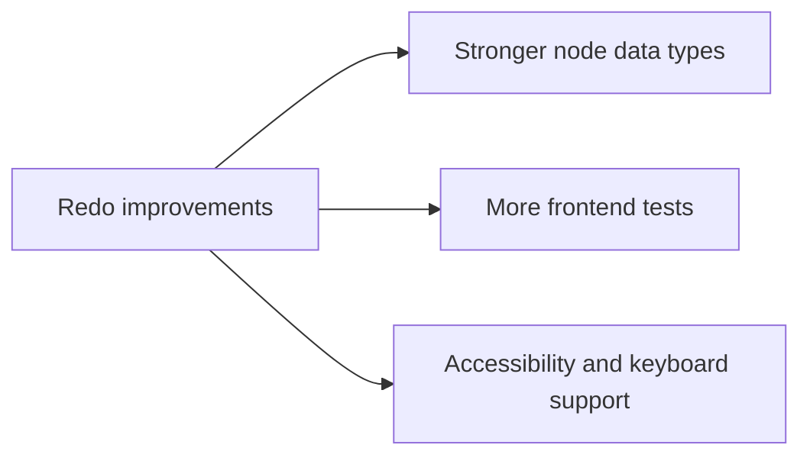

I would keep the same product direction, but make the implementation more
production-ready.

## 778. What is your process for learning a new frontend concept or library?

My process is practical and structured:

1. Understand what problem the library solves.
2. Read the official docs or examples.
3. Look at how it is used in the existing project.
4. Build a small working example.
5. Integrate it into the real codebase.
6. Debug and document what I learned.

For example, when learning a project tool like tRPC or React Flow, I would not
start by memorizing the whole API. I would first understand the basic data flow
and then implement a small feature using the project's existing patterns.

## 779. Are you comfortable working in a fast-paced startup-like environment?

Yes, I am comfortable with that. I have worked on hackathons, project
deadlines, and club responsibilities where requirements can change quickly and
time is limited.

In a fast-paced environment, I think the key is not just speed. It is clear
communication, prioritization, and avoiding hidden blockers. I try to first
deliver the core user flow correctly, then improve polish and edge cases based
on priority.

At the same time, I understand that fast-paced does not mean careless. I would
still care about readable code, basic testing, and maintainable structure.

## 780. How do you handle working with legacy code you didn't write?

I start by understanding before changing. My steps are:

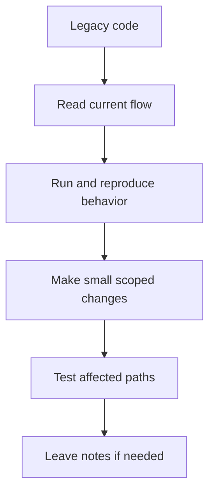

I avoid rewriting code just because it is not in my preferred style. If a
change is required, I keep it small and aligned with existing patterns. Once I
understand the code better, I may suggest refactoring, but only when it reduces
real complexity or risk.

## 781. What are your salary expectations?

As a fresher, my main priority is the role, learning opportunity, engineering
culture, and the quality of work. I am open to a fair compensation package that
matches the company standards for this role and my skill level.

If you need a number, I would prefer to understand the complete role,
responsibilities, location expectations, and benefits first, and then discuss a
range that is fair for both sides.

Note for interview preparation: replace this with a realistic range if the HR
explicitly asks for one and you know the current market/company bracket.

## 782. Are you willing to relocate to Gurugram / work from the office?

Yes, I am willing to relocate to Gurugram and work from the office if the role
requires it. I understand that for a fresher, working from the office can be
very helpful because I can learn faster from seniors, participate in team
discussions, and understand professional engineering practices more closely.

I am currently based in Kanpur, so I would plan the relocation responsibly if I
am selected.

## 783. Do you have any other offers currently? If yes, why should we be your top choice?

If I do not have another offer:

At the moment, I am actively interviewing and exploring good frontend
engineering opportunities. JTG is a strong preference for me because the work
seems product-focused, engineering-driven, and aligned with my interest in
modern web development.

If I have another offer:

Yes, I currently have another opportunity, but JTG is still a top choice for me
because I am looking beyond only the offer. I care about learning, quality of
engineering, mentorship, and the kind of products I will work on. JTG's focus
on product engineering and modern technology makes it very attractive for my
long-term growth.

## 784. What is your notice period / when can you join?

Since I am a student/fresher, I do not have a professional notice period. My
joining date would depend on the company's timeline and my academic
commitments. I can coordinate and join as early as possible after completing
the required formalities.

Before the interview, update this answer with the exact availability date.

## 785. Are you open to working long or flexible hours if a deadline demands it?

Yes, I am open to flexible hours when a deadline genuinely demands it. I
understand that in product work, releases, demos, or client commitments can
sometimes require extra effort.

At the same time, I believe long hours should be used responsibly. The better
approach is planning, clear communication, and early risk identification. But
when the team needs support during a critical deadline, I am willing to
contribute.

## 786. Do you have any questions for us?

Yes, I have a few questions:

1. What kind of projects or client domains would a frontend fresher typically
   start with at JTG?
2. How is mentorship structured for new engineers?
3. What does success look like for someone in this role during the first 3-6
   months?
4. How does the frontend team approach code reviews, testing, and UI quality?
5. Are freshers encouraged to work across frontend and backend boundaries if
   they show interest?

These questions show genuine interest in growth, expectations, and engineering
culture.

## 787. How do you keep yourself updated with the latest frontend trends and technologies?

I stay updated through a mix of official documentation, project practice,
YouTube tutorials, technical blogs, GitHub repositories, and community learning.

For frontend, I try not to chase every trend immediately. I first ask:

- What problem does this tool solve?
- Is it stable enough?
- Does it improve developer experience or user experience?
- Is it relevant to my current projects?

For example, I learned Next.js and TypeScript because they were useful for
building more maintainable frontend projects like Nodeflowz, not just because
they were popular.

## 788. What blogs, YouTube channels, or resources do you follow for learning?

I use:

- Official documentation for React, Next.js, TypeScript, Tailwind CSS, and MDN.
- YouTube channels for practical frontend project explanations.
- GitHub repositories to understand real project structure.
- LeetCode, GeeksforGeeks, and HackerRank for DSA practice.
- Community posts and articles when debugging specific frontend issues.

I prefer official documentation for correctness and videos or blogs for
practical examples.

## 789. Have you contributed to any open-source projects?

Yes. I have been an active open-source contributor and reached Level 3 in
Hacktoberfest 2025 with multiple merged layout updates.

Those contributions helped me learn how to read someone else's codebase,
understand contribution guidelines, make focused changes, and respond to review
comments. Even small open-source contributions are valuable because they teach
discipline around code quality and collaboration.

## 790. What do you do outside of academics/work - hobbies or interests?

Outside academics and coding, I enjoy participating in technical communities,
club activities, hackathons, and workshops. As Vice President of Algo Club, I
helped organize hackathons and web development workshops for 100+ participants.

These activities are not separate from my growth. They improved my
communication, planning, and leadership skills. I also enjoy learning new tools
and building small projects because practical building keeps me motivated.

## 791. How do you handle a situation where a teammate isn't pulling their weight?

I would first try to understand the reason. Maybe the teammate is blocked,
unclear about the task, or facing some personal issue. I would talk to them
directly and respectfully before escalating.

My approach:

1. Clarify the task and expected output.
2. Ask if they are stuck or need help.
3. Rebalance work if needed.
4. Keep the team lead informed if the issue continues.

I do not believe in blaming first. But if the team's deadline is at risk, I
would communicate early so the team can solve it professionally.

## 792. Describe your ideal work environment.

My ideal work environment is one where people care about learning, quality,
clear communication, and ownership. I like a team where juniors can ask
questions, seniors give constructive feedback, and code reviews are treated as
learning opportunities.

I also value a culture where people are serious about delivery but still think
about maintainability. For frontend work, this matters because quick UI patches
can become hard to maintain if the team never improves structure.

## 793. How do you approach writing clean, maintainable code?

I focus on clarity, consistency, and small responsibilities.

For frontend code, that means:

- Meaningful component names.
- Reusable UI primitives.
- Clear prop types.
- Avoiding unnecessary duplication.
- Keeping styling consistent.
- Handling loading, empty, and error states.
- Following existing project patterns.

Example:

```tsx
type EmptyStateProps = {
  title: string;
  description: string;
  action?: React.ReactNode;
};

export function EmptyState({ title, description, action }: EmptyStateProps) {
  return (
    <section className="flex flex-col items-center gap-3 p-8 text-center">
      <h2 className="text-lg font-semibold">{title}</h2>
      <p className="max-w-md text-sm text-muted-foreground">{description}</p>
      {action}
    </section>
  );
}
```

Clean code is code that another developer can understand and safely modify.

## 794. What does 'code review' mean to you, and how do you respond to review comments?

Code review is a quality and learning process. It helps catch bugs, improve
readability, enforce team standards, and share knowledge.

When I receive review comments, I:

- Read them carefully.
- Ask questions if the suggestion is unclear.
- Make changes where I agree.
- Discuss respectfully if there is a trade-off.
- Remember repeated feedback for future tasks.

I do not see review comments as criticism of me personally. They are part of
building better software as a team.

## 795. Tell me about a time you had to explain a technical concept to a non-technical person.

As part of club activities and workshops, I have explained web development
concepts to students who were new to frontend. Instead of starting with code, I
used simple analogies.

For example, I explain HTML, CSS, and JavaScript like this:

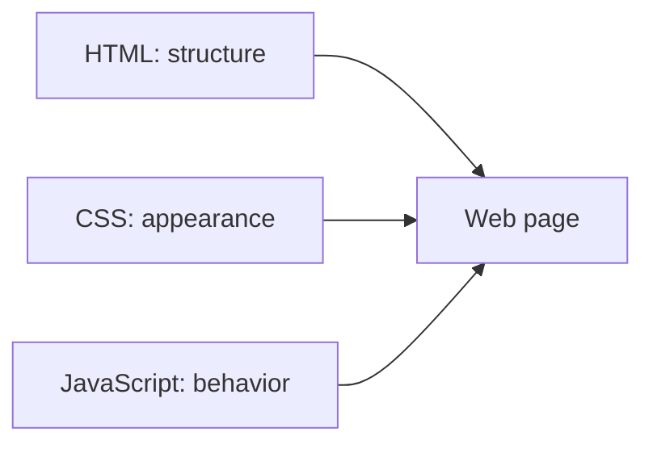

I learned that the goal is not to show how much I know. The goal is to make the
other person understand. That skill also helps when talking to product managers,
designers, or clients.

## 796. How do you test your code before considering a feature 'done'?

For frontend work, I check:

- Does the main user flow work?
- Are edge cases handled?
- Are loading, empty, and error states present?
- Does the layout work on different screen sizes?
- Are forms validated?
- Are console errors absent?
- Is the code readable and aligned with project patterns?

For a Nodeflowz-style feature, I would test something like:

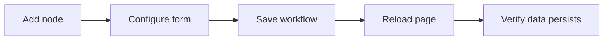

Only after that would I consider the feature ready for review.

## 797. What's the difference between being a good individual contributor and being a good team player?

A good individual contributor writes reliable code and completes assigned work.
A good team player does that plus communicates, helps others, gives updates,
accepts feedback, and thinks about the team's outcome.

In real projects, being technically good is not enough if others cannot
understand your code or rely on your communication. I try to be both: focused
when coding, but also open in communication and review.

## 798. How would you handle being assigned a task in a technology you've never used before?

I would not panic. I would first clarify the expected outcome and deadline,
then learn just enough to start responsibly.

My process:

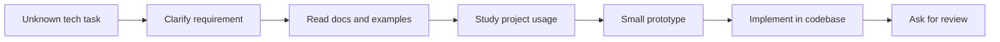

I used a similar approach while learning tools around Nodeflowz. I believe
learning quickly is part of being an engineer.

## 799. Describe a time you took initiative beyond your assigned responsibilities.

As Vice President of Algo Club, I took initiative in organizing hackathons and
web development workshops for 100+ participants. That was beyond normal
academic work and required planning, coordination, communication, and technical
preparation.

In projects, I also take initiative by improving UI consistency or reusable
patterns when I notice repeated code. For example, in Nodeflowz, my focus on
structured and reusable frontend patterns came from thinking beyond one screen
and considering future maintainability.

## 800. What motivates you to do your best work?

I am motivated by visible improvement and real user impact. In frontend, I can
see how a rough screen becomes clean, usable, and consistent. That gives me a
lot of satisfaction.

I am also motivated by learning. When I build something like Nodeflowz, I am
not only learning React or Next.js; I am learning how product UI, backend APIs,
database models, and user workflows connect.

Finally, I am motivated by responsibility. If a team depends on my part of the
work, I want to deliver it properly.

