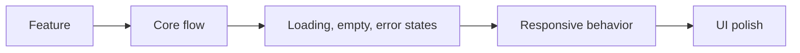
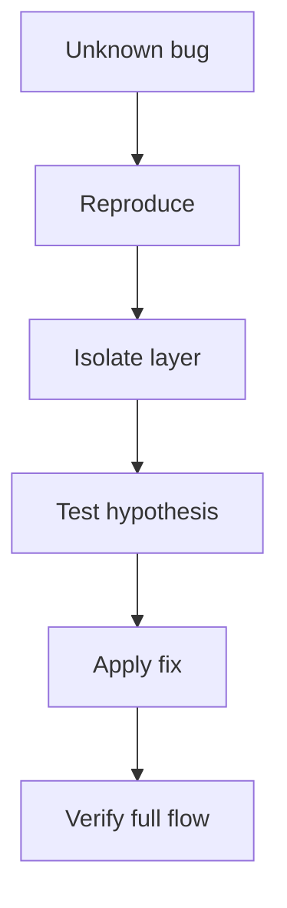
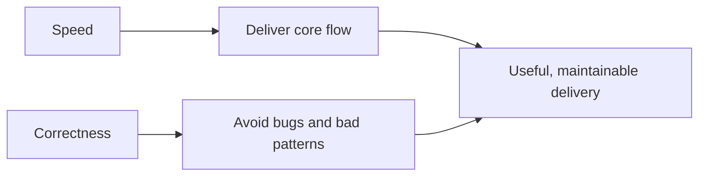
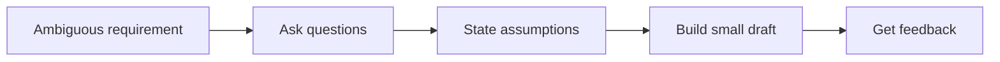
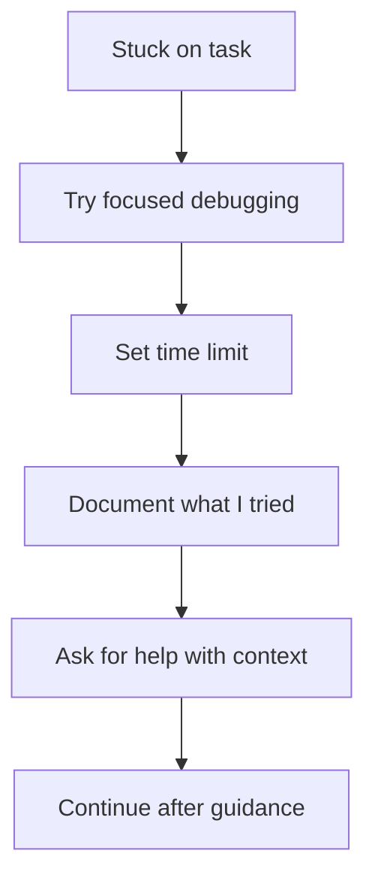
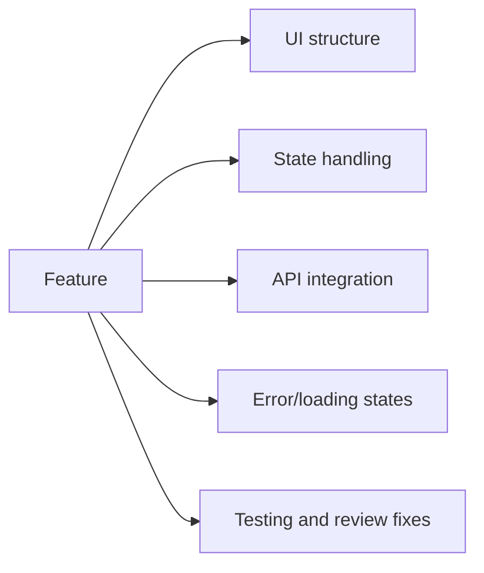
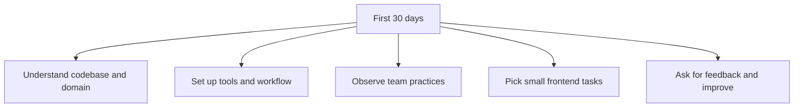
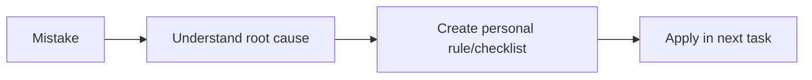

# HR Round Answers 801-843

## 801. How do you handle stress or burnout during heavy workloads?

I handle stress by making the work visible and structured. When the workload is
heavy, I break it into smaller tasks, identify what is urgent, and focus on one
thing at a time instead of mentally carrying everything together.

For example, in a frontend project I divide work into:



I also communicate early if something is blocked or unclear. Personally, short
breaks, proper sleep, and avoiding last-minute panic help me stay consistent.
I believe stress is manageable when planning and communication are honest.

## 802. What is your biggest achievement so far, academic or technical?

My biggest achievement is building a consistent technical profile across
projects, problem solving, and leadership.

Technically, Nodeflowz is my strongest achievement because it is a real
product-style frontend project using Next.js, React, TypeScript, Tailwind CSS,
Prisma, tRPC, and PostgreSQL. I worked on responsive UI, modular components,
authentication screens, reusable design patterns, and visual consistency.

Alongside that, I solved 500+ algorithmic problems, became Vice President of
Algo Club, contributed to open source in Hacktoberfest 2025, and was selected
for the Google GenAI Exchange Program. These achievements together show both
technical consistency and initiative.

## 803. How do you approach debugging when you don't know where the issue is?

I try to make the unknown smaller. I do not start by randomly changing code.

My debugging process is:

1. Reproduce the issue reliably.
2. Read the error message or observe the broken behavior.
3. Identify the last known working point.
4. Divide the system into smaller parts.
5. Add logs or use dev tools.
6. Test one hypothesis at a time.
7. Write down the root cause once found.

For frontend, I use browser dev tools heavily: console, network tab, elements
panel, responsive mode, and React DevTools if needed.



## 804. What would you do if you strongly disagreed with a design/technical decision made by a senior?

I would first understand the senior's reasoning. There may be context I do not
know, such as deadlines, system constraints, client expectations, or previous
production issues.

If I still disagree, I would present my concern respectfully with trade-offs,
not ego. For example, I might say: "I understand this approach is faster. My
concern is that this component may become hard to reuse. Can we consider this
small abstraction, or should we keep it simple for now and refactor after
release?"

If the final decision remains with the senior or team lead, I would support it
professionally. Disagreement should improve decisions, not slow the team down.

## 805. How do you balance writing code fast versus writing code correctly?

I balance it by separating the core requirement from polish and future
improvements.

For a deadline, I first make the main flow correct and safe. Then I add
validation, error states, responsiveness, and refactoring based on priority.
Writing fast should not mean ignoring correctness, but writing correctly also
does not mean overengineering everything.



In Nodeflowz, this means the workflow UI should first work reliably, but the
components should still be structured enough to maintain later.

## 806. Tell me about a time you had to give constructive feedback to a peer.

In club and project work, I have given feedback mostly around code structure or
UI consistency. I try to give feedback in a way that focuses on the work, not
the person.

For example, if a peer writes repeated UI code, I might say: "This works, but
we are repeating the same button style in multiple places. Can we extract a
small reusable component so future changes are easier?"

I also try to mention what is already good before suggesting improvements. Good
feedback should make the other person feel guided, not attacked.

## 807. What does 'ownership' mean to you in a work context?

Ownership means taking responsibility for the outcome, not just completing the
assigned line item.

For frontend work, ownership means:

- Understanding the user flow.
- Clarifying requirements.
- Handling loading, error, and empty states.
- Testing the feature before review.
- Communicating blockers early.
- Fixing issues without blaming others.
- Thinking about maintainability.

If I own a Nodeflowz feature like a workflow configuration screen, I should not
only build the form. I should ensure it is usable, validated, responsive, and
connected properly to the save flow.

## 808. How comfortable are you with ambiguity in requirements?

I am comfortable with ambiguity as long as there is room to clarify and iterate.
In real projects, requirements are not always perfectly defined at the start.

My approach is:

1. Ask clarifying questions.
2. Identify assumptions.
3. Create a small version or UI draft.
4. Get feedback early.
5. Iterate.



I would rather clarify early than build a polished but wrong feature.

## 809. Describe a time you had to make a decision without complete information.

In project work, this often happens when deciding how to structure a component
before all future requirements are known. My approach is to choose the simplest
solution that satisfies the current requirement but does not block future
changes.

For example, in a UI project, if I am unsure whether a component will be reused
later, I may keep it clean and well-named but avoid building a large abstraction
too early. If duplication appears later, then I extract a reusable component.

This helped me avoid both extremes: messy code and premature overengineering.

## 810. What kind of team culture helps you perform your best?

I perform best in a team culture that values learning, clarity, ownership, and
respectful feedback.

I like environments where:

- Questions are welcomed.
- Code reviews are constructive.
- Seniors explain reasoning, not just instructions.
- Juniors take responsibility.
- People communicate blockers early.
- Quality matters, but delivery also matters.

This kind of culture helps me grow quickly because I can learn from feedback
and also contribute confidently.

## 811. How would your friends or professors describe you in three words?

They would probably describe me as consistent, responsible, and curious.

Consistent because I have maintained strong academics and solved 500+ DSA
problems over time. Responsible because I handled Algo Club leadership and
project work seriously. Curious because I like learning new technologies and
building projects like Nodeflowz, AcadAI, and CommentPulse.

## 812. Tell me something about yourself that isn't on your resume.

One thing not fully visible on my resume is that I enjoy explaining technical
concepts to others. Through Algo Club workshops and peer discussions, I learned
that teaching forces me to understand concepts more clearly.

This also helps in team environments. If I can explain my code, design
decision, or bug clearly, collaboration becomes much easier.

## 813. What is one thing you'd like to improve about yourself professionally?

I want to improve my ability to estimate tasks more accurately. As a student,
I can estimate smaller tasks well, but in professional projects there are
hidden factors like code review, testing, edge cases, integration issues, and
requirement changes.

To improve, I am practicing breaking work into smaller parts and thinking about
risks before giving an estimate. I also want to learn from senior engineers how
they estimate production work.

## 814. How do you handle a situation where you're stuck and a deadline is approaching?

I first try to debug independently, but I also set a time limit. If I am stuck
for too long, I communicate early instead of hiding the problem.

My process:



When asking for help, I include what I expected, what happened, what I tried,
and where I think the issue might be. That makes it easier for a senior or
teammate to help quickly.

## 815. Describe your communication style when working with cross-functional teams.

My communication style is clear, respectful, and context-based. With technical
teammates, I can discuss implementation details. With non-technical people, I
try to explain impact and behavior instead of internal code.

For example, instead of saying "the tRPC mutation is failing", I might say to a
non-technical stakeholder: "The save action is not completing because the
server is rejecting one field. I am checking the validation and will update the
form message so users know what to fix."

Good communication means adjusting the explanation to the audience.

## 816. Are you comfortable presenting your work / demoing features to stakeholders?

Yes. My club and project experience has made me comfortable explaining work to
others. While demoing, I try to focus on the user flow first and technical
details second.

For example, for Nodeflowz I would demo:

1. Create or open a workflow.
2. Explain the purpose of the workflow.
3. Show the UI flow.
4. Mention the tech stack.
5. Explain key implementation decisions.
6. Discuss improvements or limitations honestly.

This makes the demo understandable for both technical and non-technical people.

## 817. What do you do when you don't understand a requirement given by your manager?

I ask clarifying questions before starting implementation. I try to clarify:

- What is the user goal?
- What is the expected behavior?
- Are there edge cases?
- What is the priority?
- Are there design references?
- What should happen on error?

If needed, I repeat my understanding back to confirm:

> "So the requirement is that the user should be able to save the workflow only
> after required node fields are complete. If validation fails, we show field
> errors and keep the user on the same dialog. Is that correct?"

This avoids wasted effort.

## 818. How do you approach estimating how long a task will take?

I break the task into smaller parts and estimate each part separately.

For a frontend task:



I also add time for unknowns. If I have not used a library or code area before,
I mention that the estimate has risk. I prefer giving a realistic estimate over
an optimistic one that creates pressure later.

## 819. Tell me about a time you received negative feedback and how you responded.

Earlier, I received feedback that a UI implementation was visually fine but not
structured cleanly enough for reuse. At first, I felt I had completed the task
because the screen looked correct. But after thinking about it, I understood
that maintainability is also part of quality.

I responded by refactoring repeated sections into smaller reusable components
and paying more attention to naming and structure. That feedback helped me in
Nodeflowz, where reusable frontend design patterns became one of my focus
areas.

## 820. Why did you apply to this specific role and not another, such as backend or full-stack?

I applied to the frontend role because frontend is where my strongest interest
and project experience currently are. I enjoy building interfaces, improving
usability, handling responsive layouts, and connecting UI with application
logic.

That said, I am not limited to only visual work. I understand backend concepts
like REST APIs, Node.js, Express, PostgreSQL, Prisma, and tRPC, which helps me
work better as a frontend engineer. My goal is to become a frontend specialist
with strong full-stack awareness.

## 821. What do you understand about the day-to-day responsibilities of this role?

For a frontend role, I expect responsibilities like:

- Building and improving UI components.
- Implementing screens from requirements or designs.
- Integrating APIs.
- Handling loading, error, and empty states.
- Writing responsive and accessible layouts.
- Fixing UI bugs.
- Participating in code reviews.
- Collaborating with backend, QA, design, and product teams.
- Testing changes before delivery.

At JTG, because the company works on product engineering and client projects, I
also expect communication, adaptability, and ownership to be important.

## 822. How do you handle a situation where you're asked to work on something outside your comfort zone with no prior notice?

I would first understand the expected outcome and urgency. Then I would learn
the minimum required concepts quickly and ask for guidance where needed.

I am comfortable stepping outside my comfort zone because I have already worked
with different technologies across projects: Next.js and tRPC in Nodeflowz,
Streamlit and RAG concepts in AcadAI, and Flask/Redis/Docker in CommentPulse.

The key is to stay calm, learn systematically, and communicate progress.

## 823. Tell me about a time you had to say no to a request and how you handled it.

In team or club work, sometimes people request extra changes close to a
deadline. I do not like saying a direct no without explanation. I explain the
trade-off.

For example:

> "We can add this feature, but it may risk the main demo flow. Can we keep it
> as a post-demo improvement and focus now on making the current flow stable?"

This way, I am not rejecting the idea. I am protecting the priority and
timeline.

## 824. How would you describe your problem-solving approach when you're completely stuck on a bug for hours?

When stuck for hours, I reset the problem instead of repeating the same attempt.

I ask:

- Can I reproduce it in a smaller example?
- Which layer is failing: UI, state, API, data, or styling?
- What changed recently?
- What assumptions am I making?
- Can someone else review my debugging notes?

I also take a short break if needed, because after hours of debugging, it is
easy to miss obvious things. Then I return with a cleaner hypothesis.

## 825. What does 'quality over speed' mean to you, and when might you have to compromise on one?

Quality over speed means not delivering code that is fragile, confusing, or
likely to break important user flows just to finish quickly.

However, in real projects, there are times when we compromise on polish to meet
a deadline. For example, we might deliver the core workflow and basic error
handling first, then improve animations, advanced empty states, or refactoring
later.

I would not compromise on correctness, security, or major user experience. But
I can compromise on non-critical polish when the deadline requires it.

## 826. How do you make sure the code you write today will still make sense to you or others 6 months from now?

I focus on:

- Clear names.
- Small components.
- Consistent folder structure.
- Typed props.
- Avoiding unnecessary cleverness.
- Comments only where logic is not obvious.
- Following existing project patterns.

Example:

```tsx
type WorkflowCardProps = {
  name: string;
  updatedAt: Date;
  onOpen: () => void;
};
```

This is easier to understand than unclear names or large components with many
responsibilities.

## 827. Tell me about a group project where you had to coordinate with people who had different working styles.

In hackathons and club projects, I worked with people who had different styles:
some liked to move quickly, some focused on details, and some needed more
clarity before starting.

I handled this by dividing work clearly and setting checkpoints. For frontend,
one person might work on layout, another on API integration, and another on
presentation or testing. I also tried to keep communication practical:
what is done, what is blocked, and what is next.

That experience taught me that coordination is not about making everyone work
the same way. It is about aligning everyone toward the same outcome.

## 828. What's a piece of feedback you disagreed with at first but later came to appreciate?

I once disagreed with feedback that I should spend more time on component
structure when the UI already looked correct. Initially, I thought visual
correctness was enough.

Later, I understood that maintainable frontend code matters just as much as
appearance. If code is duplicated or poorly structured, every future change
becomes harder. That feedback influenced how I approached Nodeflowz, where I
paid more attention to modular UI components and reusable design patterns.

## 829. How would you rate your JavaScript skills on a scale of 1-10 and why?

I would rate myself around 7 out of 10 in JavaScript.

I am comfortable with fundamentals like variables, functions, arrays, objects,
DOM concepts, ES6 features, async/await, promises, modules, and using
JavaScript in React projects. My DSA practice also helps with logic building.

I am not rating myself higher because I still want to deepen my understanding
of advanced JavaScript internals, performance patterns, browser APIs, and
large-scale production debugging. I am confident in my foundation and actively
improving.

## 830. How would you rate your CSS skills on a scale of 1-10 and why?

I would rate myself around 7.5 out of 10 in CSS.

I am comfortable with HTML5, CSS3, Flexbox, Grid, responsive design, spacing,
alignment, and Tailwind CSS. My resume projects show that I care about clean UI
rendering, layout consistency, and adaptive behavior across screen sizes.

I still want to improve deeper areas like advanced animations, accessibility
patterns, CSS architecture at very large scale, and browser-specific rendering
issues.

## 831. What's a recent frontend trend or tool you're excited about, and why?

I am excited about the direction of type-safe full-stack frontend development,
especially tools like Next.js, TypeScript, tRPC, and schema validation with
Zod.

The reason is that many frontend bugs come from mismatches between UI
expectations and backend data. In a project like Nodeflowz, using TypeScript
and tRPC makes the frontend-backend contract clearer. That improves
maintainability and developer confidence.

I am also interested in better frontend testing and accessibility tooling
because modern UI should be reliable, not just visually attractive.

## 832. What is your understanding of the product/service Josh Technology Group builds for clients?

My understanding is that JTG helps clients create, modernize, and scale
software products. Their official website mentions modern web frameworks,
cloud and DevOps, AI/ML, SaaS, mobile applications, technical assessment, and
quality engineering. They also work across industries like healthcare,
transport, automotive, e-commerce, software engineering, video-audio solutions,
digital marketing, and CRM.

So I see JTG as a product engineering company where engineers solve client
business problems using modern technology. That is why frontend quality matters
there: the UI is often the part of the product users directly experience.

## 833. Are you comfortable working directly with international clients?

Yes, I am comfortable with that. I understand that working with international
clients requires clear communication, professionalism, time-zone awareness, and
the ability to explain progress or blockers simply.

As a fresher, I may need initial guidance on client communication standards,
but I am confident that I can learn quickly. My experience with presentations,
workshops, and explaining technical concepts will help me communicate clearly.

## 834. How do you handle repetitive or 'boring' tasks in a project?

I handle repetitive tasks by understanding why they matter. Sometimes repetitive
work, like fixing layout consistency or updating similar components, improves
overall product quality.

If I notice true repetition, I look for safe automation or abstraction. For
example, if multiple screens use the same empty state or button pattern, I
would suggest creating a reusable component.

But I also understand that not every task will be exciting. Professionalism
means doing necessary work carefully.

## 835. What would you do in your first 30 days if you got this job?

In my first 30 days, I would focus on learning, contribution, and trust.



Specifically, I would understand the project architecture, coding standards,
review process, frontend component patterns, and testing expectations. Then I
would start with smaller tasks or bug fixes, deliver them carefully, and build
confidence with the team.

## 836. Do you prefer working independently or in a team? Why?

I am comfortable with both, but I prefer a balance.

Independent work helps me focus deeply and take ownership. Teamwork helps me
learn faster, get feedback, and build better solutions. In real product
engineering, both are needed.

For example, I can independently implement a frontend component, but I still
need to align with designers, backend engineers, QA, and reviewers to make sure
the feature works correctly in the full product.

## 837. How do you make sure you don't repeat the same mistakes?

I try to convert mistakes into rules or checklists.

For example, if I once miss responsive testing, I add viewport checks to my
frontend completion checklist. If I receive review feedback about naming, I pay
attention to names before raising the next PR.

My process:



The goal is not to never make mistakes. The goal is to not repeat the same
mistake carelessly.

## 838. What's the difference between a good developer and a great developer, in your opinion?

A good developer writes working code. A great developer writes code that works,
is maintainable, solves the right problem, and helps the team move faster.

A great developer also communicates well, thinks about edge cases, understands
business context, accepts feedback, and mentors others. They do not only ask
"does this code run?" They ask "is this the right solution, and can the team
maintain it?"

That is the kind of developer I want to become.

## 839. Tell me about a time your code broke something in production or a live demo/project.

I have not worked in a full production company environment yet, but in project
and demo settings I have faced situations where a UI looked correct in one
environment and then had layout or behavior issues during testing.

When that happens, I do not hide it. I reproduce the issue, identify the root
cause, fix it, and test the affected flow again. The lesson I learned is to
test important flows before demos, including responsiveness and edge cases.

In a professional environment, I would also communicate the issue, assess
impact, and follow the team's incident or hotfix process.

## 840. How do you approach writing documentation for your code?

I prefer documentation that helps the next developer understand why something
exists and how to use it.

For frontend, useful documentation includes:

- Component purpose.
- Props and expected usage.
- Important assumptions.
- Setup steps.
- Known limitations.
- Examples for reusable patterns.

I avoid writing comments for obvious code. But if a workflow validation rule or
state interaction is non-obvious, I would document it clearly.

## 841. What do you do when two priorities conflict and you can't do both on time?

I communicate early and ask for priority alignment. I would explain the
trade-off clearly:

> "I can complete A by today or B by today, but doing both properly may affect
> quality. Which one should be prioritized first?"

If possible, I also suggest a compromise, such as delivering the core part of
one task and moving polish to the next day.

The wrong approach is silently trying to do both and surprising the team at the
deadline.

## 842. Describe a time you mentored or helped a peer with a technical problem.

Through Algo Club workshops and peer learning, I have helped students with web
development and programming concepts. I usually start by asking what they
already understand and where they are stuck.

For example, if someone is confused about layout, I explain Flexbox or Grid
visually and then show a small example. I try not to simply give the answer,
because that does not help them learn. I guide them to reason through the
problem.

This also helps me strengthen my own understanding.

## 843. What questions do you have about the interview process or company culture?

I would ask:

1. What are the next steps in the interview process?
2. What qualities do successful freshers at JTG usually demonstrate?
3. How does JTG support learning during the first few months?
4. How are frontend engineers involved in product and design discussions?
5. What is the team's approach to code review and technical mentorship?
6. What kind of projects would someone in this frontend role likely work on?

These questions help me understand expectations and also show that I am
serious about growing in the role.

