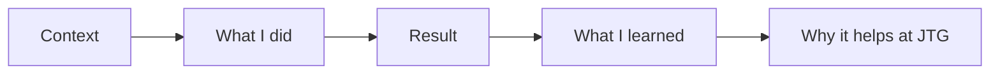

# Frontend Project HR Round Answers

This folder contains HR and behavioral interview answers tailored to:

- Candidate: Deepa Patel
- Resume focus: frontend development, responsive UI, React.js, Next.js,
  JavaScript, TypeScript, Tailwind CSS, data structures, and full-stack
  awareness
- Main project: Nodeflowz, a workflow automation platform built with Next.js,
  React, TypeScript, Tailwind CSS, PostgreSQL, Prisma, and tRPC
- Target company context: Josh Technology Group, which describes itself as a
  technology company focused on creating and transforming products, with
  services across modern web frameworks, cloud and DevOps, AI/ML, SaaS, mobile,
  quality engineering, and multiple industries.

Source used for company context:

- https://www.joshtechnologygroup.com/

## Files

| File | Questions |
|---|---:|
| [01-hr-questions-756-800.md](./01-hr-questions-756-800.md) | 756-800 |
| [02-hr-questions-801-843.md](./02-hr-questions-801-843.md) | 801-843 |

## Answering Strategy

Use this structure for most HR answers:

For project questions, emphasize:

- Nodeflowz as the strongest frontend project.
- Specific contributions: responsive layouts, modular UI components,
  authentication screens, reusable design patterns, clean spacing and
  alignment, React Flow canvas understanding, and frontend integration with
  tRPC.
- Growth mindset: current implementation plus improvements you would make.

For logistics questions, keep answers honest and adaptable. Replace placeholders
such as salary expectation, joining date, and offer status with the current
truth before the interview.

